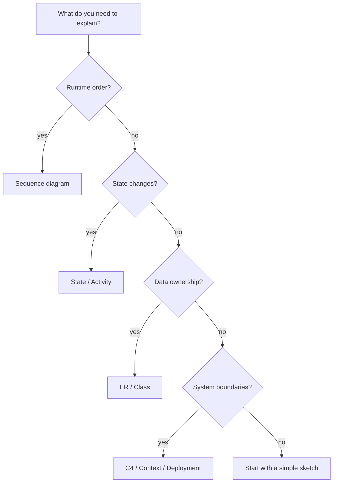
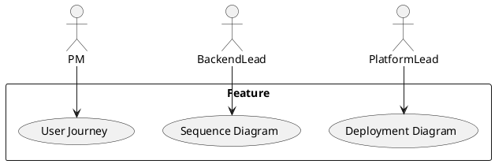
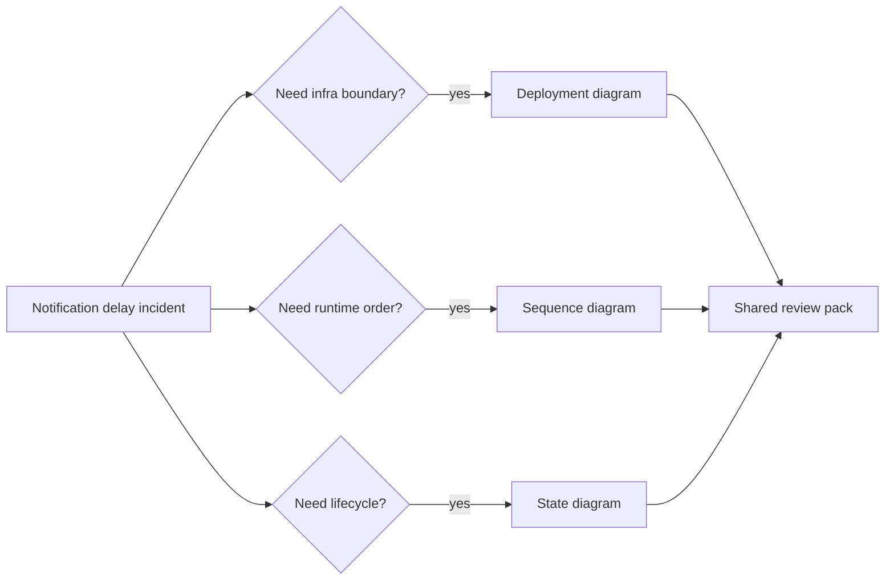

<!-- tags: diagram, reference -->
# 🧭 Choosing The Right Diagram

> Choosing the wrong diagram often causes the entire team to review the wrong thing.

📅 Created: 2026-03-31 · 🔄 Updated: 2026-04-20 · ⏱️ 14 min read

| Aspect | Detail |
| ------ | ------ |
| **Focus** | Decision guide |
| **When to use** | When you have a problem but are unsure which diagram to draw |
| **Related** | Architecture review, PR, Design docs |

---

## 1. DEFINE

Picture having only 10 minutes in a review and needing to choose a diagram type short enough for everyone to understand yet accurate enough to prevent the team from chasing the wrong discussion branch. That is when "which diagram should I choose?" becomes a real decision, not a presentation preference.

| Variant | When to use | Scope |
| ------- | ----------- | ----- |
| Audience-first | Choose by who will read it | PM, backend, infra, designer |
| Question-first | Choose by the question to solve | who calls whom, what depends on what, what changes when |
| Zoom-first | Choose by viewing altitude | system, module, request, state |

**Core insight**:
- Audience determines abstraction level: the same flow needs different diagrams for PM and infra.
- A good diagram always has a clear zoom level. Without one, people argue at different layers.
- If unsure, start from the question you need to answer — not from the tool.

Those failure modes sound easy to avoid. But there is a trap: choosing diagrams by personal preference means using sequence for everything. That trap appears in PITFALLS.

## 2. VISUAL

### Decision Flowchart

The image below shows the complete decision tree: start with the question you need to answer, branch into five categories, and land on a specific diagram type recommendation. This is the diagram you print and tape to the whiteboard during design reviews.


*Image: Five questions map to five families. If you cannot classify your problem into one of these five, the problem itself is not well defined enough for a diagram yet — go back to DEFINE.*

### Preview UI

Seeing the output first locks the diagram shape before you touch any practice work.



*Figure: A decision tree that routes by question type, not by tool familiarity. Follow the branches to land on the right diagram family.*

```text
Audience -> PM => user journey / wireframe
Audience -> Backend => sequence / component / ER
Audience -> Infra => C4 / deployment / network
Audience -> On-call => sequence + state + data flow
```

## 3. CODE

The visual gave the right intuition. Now let us bring it down to artifacts the team can review, write, or reuse in real docs.

### Mermaid Practice Block

````md

````

### Example 1: Basic — Decision tree for choosing a diagram

> **Goal**: Create a guide short enough to use during a live review.
> **Approach**: Start from question type, then choose the corresponding diagram family.
> **Example**: `I need to understand why checkout times out after payment.`


> **Conclusion**: This decision tree fits well as a review template or PR checklist. It prevents choosing diagrams by personal habit.

Decision framework covered. But audience filtering needs adaptation — let us customize.

### Example 2: Intermediate — One feature, three different diagrams

> **Goal**: Show that diagrams do not compete — they complement each other.
> **Approach**: Use a notification feature to illustrate three different audiences.
> **Example**: `PM needs user journey, backend needs sequence, platform needs deployment diagram.`



> **Conclusion**: Forcing every audience to read the same diagram leaves each person with too much or too little information.

Audience filter covered. But multi-diagram packs need coherence — let us synthesize.

### Example 3: Advanced — Choosing a diagram bundle for incident review

> **Goal**: Show that in a production incident, a single diagram is rarely enough to answer questions from multiple roles.
> **Approach**: Choose a minimal bundle in the order context → runtime → state so triage stays focused.
> **Example**: `Notification delivery slow after deploy: need topology, request path, and retry state.`



> **Conclusion**: Choosing the right diagram at the advanced level means choosing the minimal bundle to make a decision, not forcing one picture to carry the entire story.

You have walked through decision, audience, and pack. Now comes the dangerous part: preference bias — the trap set up at the beginning.

## 4. PITFALLS

Knowing a diagram type is one thing. Keeping it from drifting into redundancy or wrong scope is another.

| # | Mistake | Consequence | Fix |
|---|---------|-------------|-----|
| 1 | Choosing by personal preference | Someone only likes sequence, so they use it for everything | Choose by question and audience |
| 2 | Missing scope annotation | Reader cannot tell whether the diagram is logical or physical | Add a subtitle with the zoom level |
| 3 | Using diagrams to replace all prose | Diagrams cannot explain invariants or trade-offs fully | Combine diagrams with short text; do not over-rely |

## 5. REF

| Resource | Link |
| -------- | ---- |
| C4 model review checklist | https://c4model.com/ |
| Mermaid syntax | https://mermaid.js.org/intro/ |
| PlantUML | https://plantuml.com/ |

## 6. RECOMMEND

Once you see where this guide is strong and where it breaks, the next step is to open the right adjacent lane.

| Next step | When | Reason |
| --------- | ---- | ------ |
| Structural diagrams | When the question leans toward data shape or module boundary | Dive into ER, class, component |
| Behavioral diagrams | When the question leans toward runtime order or state | Flowchart, sequence, activity are core |
| Patterns | When you need diagram templates for auth, microservices, CI/CD | Apply directly to real designs |

---

## 7. QUICK REF

| Core question | Diagram to open first |
| --- | --- |
| Who calls whom, in what order? | `Sequence diagram` |
| How does an entity change state? | `State diagram` or `Activity diagram` |
| Who owns the data, what is the cardinality? | `ER diagram` or `Class diagram` |
| Where are the system boundaries? | `C4`, `System context`, `Deployment` |
| Process with multiple decision branches? | `Flowchart` |
| Timeline and overlapping dependencies? | `Gantt` or `Git Graph` |

---

**Links**: [← Previous](./02-diagram-taxonomy.md) · → Next
