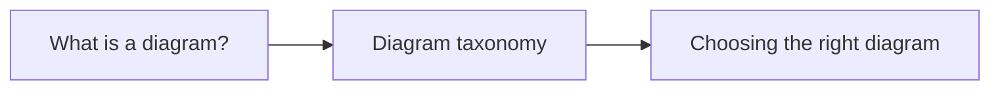

<!-- tags: overview -->
# Diagram Fundamentals

> Foundation lane to understand that diagrams are decision-making tools, not just illustrations.

| Aspect | Detail |
| --- | --- |
| **Concept** | Navigation hub for `Diagram Fundamentals` |
| **Audience** | Engineer, architect, technical writer |
| **Primary style** | Concept-First router |
| **Entry point** | Open when you are unsure what question a good diagram must answer. |

📅 Updated: 2026-04-20 · ⏱️ 6 min read

---

## 1. DEFINE

Picture yourself finishing a clean-looking diagram, yet ten minutes into the review nobody can agree on what the system actually does. That is the familiar sign of a diagram that exists without a locked question behind it.

This hub does not replace individual articles. It exists to route you to the correct lane before you wander into tools, syntax, or a specific diagram type. Read in order, and you will stop feeling like you "know lots of keywords but still cannot map them to a real problem."

### Signals & Boundaries

- Open this hub when you know the problem lives inside `Diagram Fundamentals` but are unsure which article to read first.
- Use the coverage map to route by pain point instead of file order.
- Return to this hub after each article to choose the next step with intention.

### Coverage Map

| Entry | Role |
| --- | --- |
| [What Is A Diagram?](01-what-is-diagram.md) | Entry point for lane `What Is A Diagram?` |
| [Diagram Taxonomy](02-diagram-taxonomy.md) | Entry point for lane `Diagram Taxonomy` |
| [Choosing The Right Diagram](03-choosing-diagram.md) | Entry point for lane `Choosing The Right Diagram` |

---

## 2. VISUAL

### Learning Path

Three articles build on each other in strict order. The image below shows the progression: you must know what a diagram is before you can classify types, and you must know the taxonomy before you can choose correctly.


*Image: The three articles are not interchangeable — each one unlocks a prerequisite for the next. Skipping Step 1 means Step 3 becomes guesswork.*

### Preview UI

The Mermaid render below preserves the same path in copyable form.



*Figure: Minimal Mermaid render so you see the learning path before diving into individual articles.*

The definition locked the hub's scope. The visual below routes by lane rather than a dry list of links.

### Level 1

```text
start from your current pain point
  -> What Is A Diagram?
  -> Diagram Taxonomy
  -> Choosing The Right Diagram
```

*Figure: This hub works as a router, not a catalog to scroll through.*

### Level 2

```text
read the right lane  -> terminology connects, progress compounds
read the wrong lane  -> more keywords, less understanding
```

*Figure: The real value of a README router is keeping the reader on the right path from the start.*

---

## 3. CODE

The flowchart above identified the routing rhythm. The artifact below turns this hub into a short worksheet so your team can choose the right entry point.

### Mermaid Practice Block

The block below holds the same shape as the preview, in raw Mermaid so you can copy it into the Mermaid Live Editor or your docs and customize.

````md

````

### Problem 1: Basic — Route the lane before reading deep

> **Goal**: Prevent study or review from drifting into "open whichever article looks interesting."
> **Approach**: Choose a lane by pain point, not by name familiarity.
> **Example**: Selecting the right cluster to read inside `Diagram Fundamentals`.
> **Complexity**: Basic

```yaml
router:
  module: Diagram Fundamentals
  rule: "choose by pain point, not by familiar name"
  suggested_path:
  - 01-what-is-diagram.md
  - 02-diagram-taxonomy.md
  - 03-choosing-diagram.md
```

This artifact does not solve the problem for the reader. It trims the wrong lanes before time is burned on articles that do not serve the current goal.

---

## 4. PITFALLS

When a hub router is misused, each article still reads fine individually, but the overall learning drifts into fragmented understanding.

| # | Severity | Mistake | Consequence | Fix |
| --- | --- | --- | --- | --- |
| 1 | 🔴 Fatal | Reading by file order instead of routing by pain point | Accumulates terminology without solving the real problem | Use the coverage map before opening a detail article |
| 2 | 🟡 Common | Treating the README as a pure link catalog | Loses the hub's routing purpose | Always ask "which lane matches my current pain?" |
| 3 | 🔵 Minor | Finishing an article without returning to the hub | Jumps to an adjacent article by instinct | Return to the README to pick the next step deliberately |

---

## 5. REF

| Resource | Type | Link | Notes |
| --- | --- | --- | --- |
| Mermaid syntax reference | Official docs | https://mermaid.js.org/intro/syntax-reference.html | Syntax map for learning diagram-as-code |
| PlantUML docs | Official docs | https://plantuml.com/ | Compare with heavier UML notation |
| C4 Model | Official guidance | https://c4model.com/ | Clear example of zoom levels and scope |

## 6. RECOMMEND

Once you know which lane you are standing in, the next step is to open that lane's first article rather than wandering into another topic.

| Next step | When | Reason | File/Link |
| --- | --- | --- | --- |
| What Is A Diagram? | When your pain point matches this lane | Continue into the right cluster instead of reading loosely | [What Is A Diagram?](01-what-is-diagram.md) |
| Diagram Taxonomy | When your pain point matches this lane | Continue into the right cluster instead of reading loosely | [Diagram Taxonomy](02-diagram-taxonomy.md) |
| Choosing The Right Diagram | When your pain point matches this lane | Continue into the right cluster instead of reading loosely | [Choosing The Right Diagram](03-choosing-diagram.md) |
