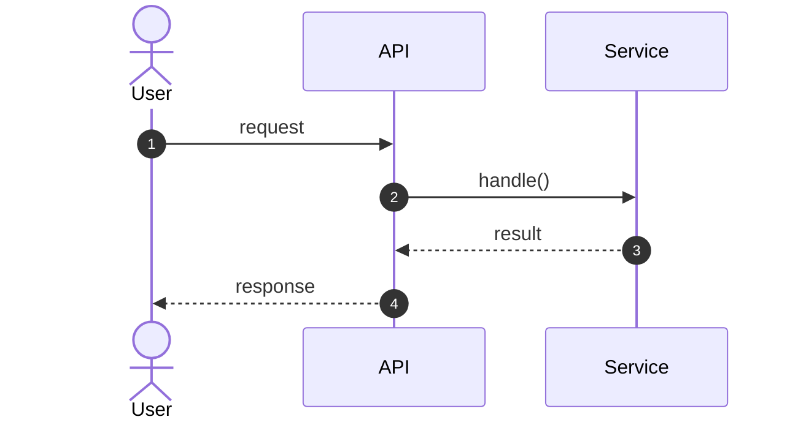

<!-- tags: diagram, reference, bridge -->
# Sequence Diagram

> Bridge doc that keeps old links alive while routing readers to the canonical article in the new `diagram/` taxonomy.

| Aspect | Detail |
| --- | --- |
| **Concept** | Legacy bridge for `Sequence Diagram` |
| **Audience** | Readers arriving from old links, bookmarks, or cross-references |
| **Primary style** | Bridge router |
| **Entry point** | Open when you land on an old file and need the canonical version. |

📅 Updated: 2026-04-20 · ⏱️ 3 min read

---

## 1. DEFINE

You are debugging a request that crosses multiple services, retries, and callbacks, but logs only give you scattered fragments along a timeline. This is when a sequence diagram pulls the entire conversation between actors onto one shared timeline.

This file still exists to prevent broken links, but canonical content has moved to the new taxonomy. Its only job now is to route you to the article that is actively maintained.

### Canonical destination

| New file | Role |
| --- | --- |
| [Sequence Diagram](03-behavioral/02-sequence-diagram.md) | Current canonical article for this topic |

---

## 2. VISUAL

### Preview UI

Seeing the output first locks the diagram shape before you touch any practice work.



*Figure: Minimal Mermaid render so you see the target shape before moving to the practice section.*

The path here is simple: from the old link to the new canonical article, where narrative, visuals, and examples are kept in sync.

### Level 1

```text
legacy bookmark / old link
  -> open this bridge
  -> navigate to canonical article
  -> read the new taxonomy version
```

*Figure: A bridge doc is a transfer point, not a long-term content home.*

---

## 3. CODE

The artifact below is a short checklist for keeping old links alive without sending readers astray.

### Mermaid Practice Block

The block below holds the same shape as the preview, in raw Mermaid so you can copy it into the Mermaid Live Editor or your docs and customize.

````md

````

### Problem 1: Basic — Redirect via doc bridge

> **Goal**: Keep old bookmarks working while the new taxonomy stabilizes.
> **Approach**: State clearly that this is a bridge doc and point straight to the canonical file.
> **Example**: `Sequence Diagram` has been regrouped into the appropriate subfolder.
> **Complexity**: Basic

```yaml
bridge_doc:
  old_path: 02-sequence-diagram.md
  canonical_path: 03-behavioral/02-sequence-diagram.md
  rule: "read new content at the canonical article; do not maintain two sources in parallel"
```

---

## 4. PITFALLS

The hardest part of diagramming is not syntax — it is choosing the wrong diagram type for the wrong question. The pitfalls below cover where that mismatch usually happens.

| # | Severity | Mistake | Consequence | Fix |
| --- | --- | --- | --- | --- |
| 1 | 🟡 Common | Treating the bridge doc as the canonical article | Reads an abridged version and misses new content | Always navigate to the canonical article |
| 2 | 🟡 Common | Maintaining both the old file and the new file in parallel | Narrative drift and structural drift | Keep the bridge as a redirect only |
| 3 | 🔵 Minor | Changing taxonomy without creating a bridge | Old links break, old bookmarks lose value | Keep the bridge short but clear about its role |

---

## 5. REF

| Resource | Type | Link | Notes |
| --- | --- | --- | --- |
| Mermaid sequence diagram | Official docs | https://mermaid.js.org/syntax/sequenceDiagram.html | Canonical sequence syntax |
| PlantUML sequence diagram | Official docs | https://plantuml.com/sequence-diagram | UML-oriented sequence notation |

## 6. RECOMMEND

After this article, what to learn next is not "draw more" but opening the right adjacent article for the problem at hand.

| Next step | When | Reason | File/Link |
| --- | --- | --- | --- |
| Sequence Diagram | When you need canonical content, examples, and real pitfalls | The canonical article is maintained under the new workflow | [Sequence Diagram](03-behavioral/02-sequence-diagram.md) |
