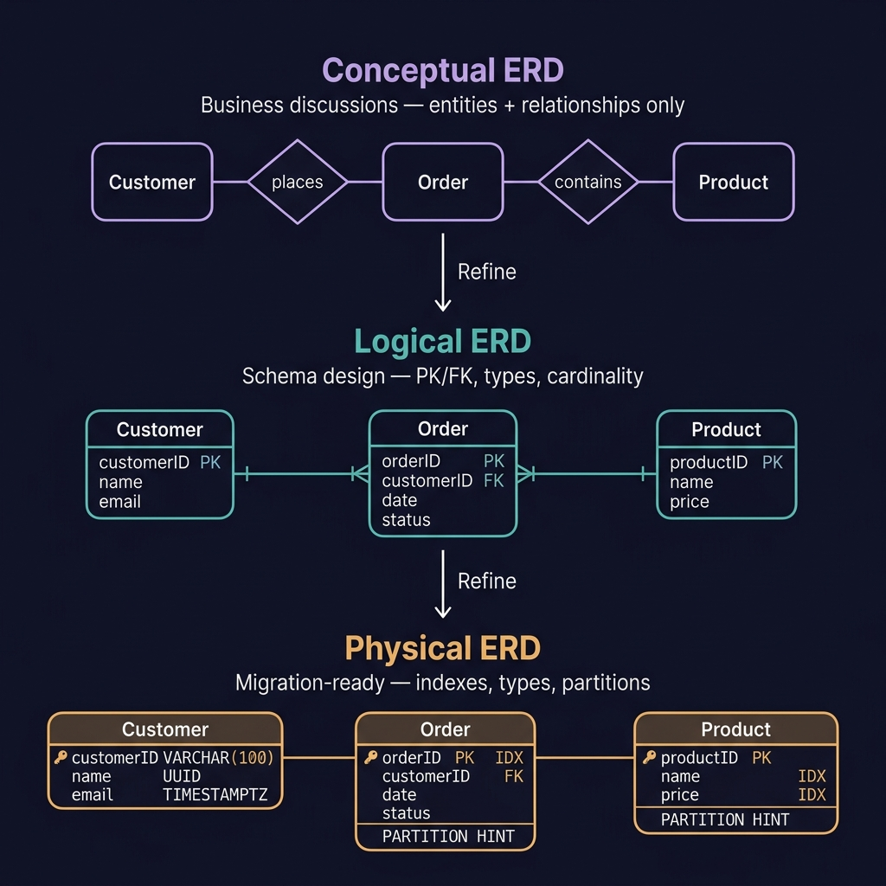
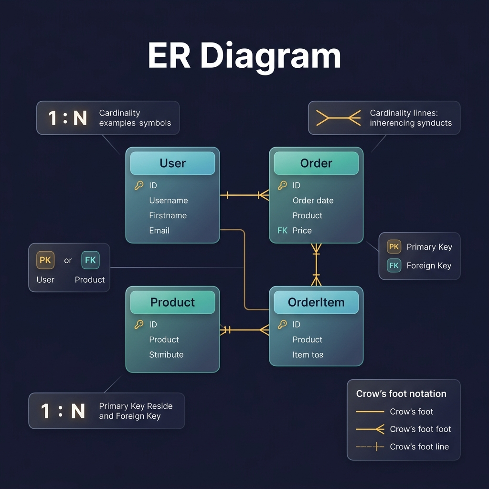
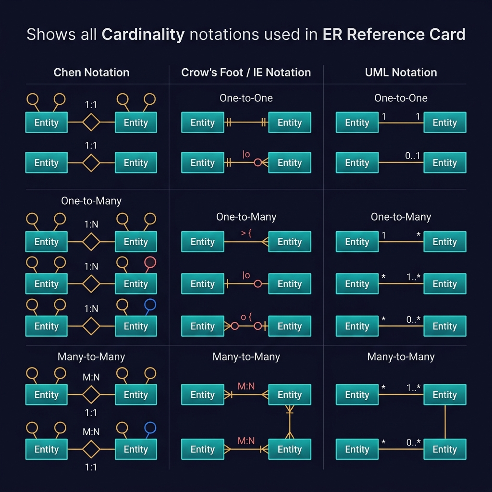
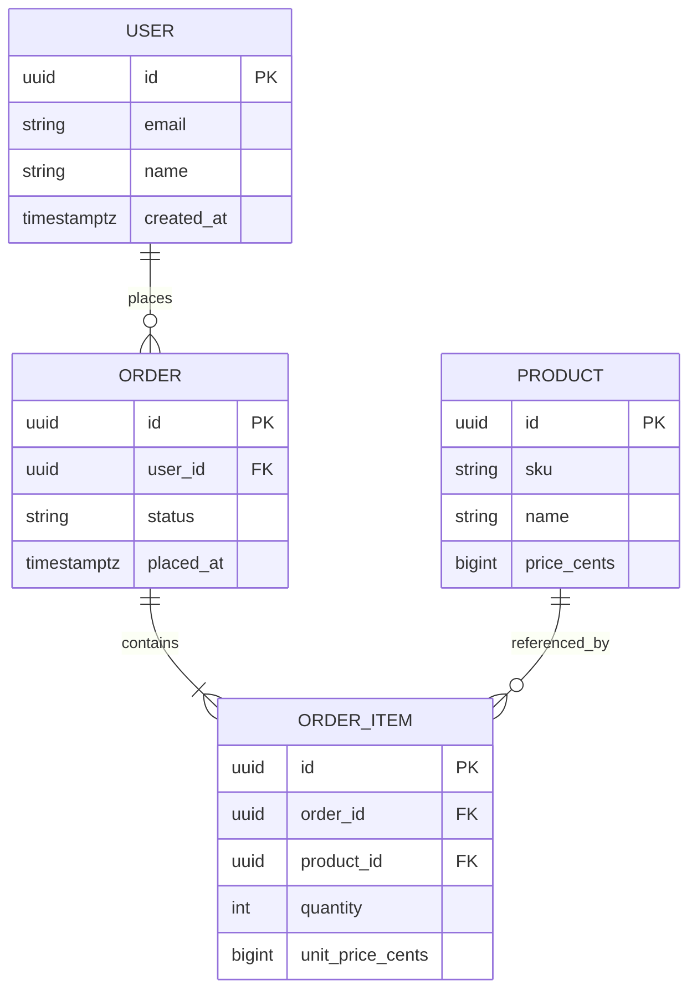
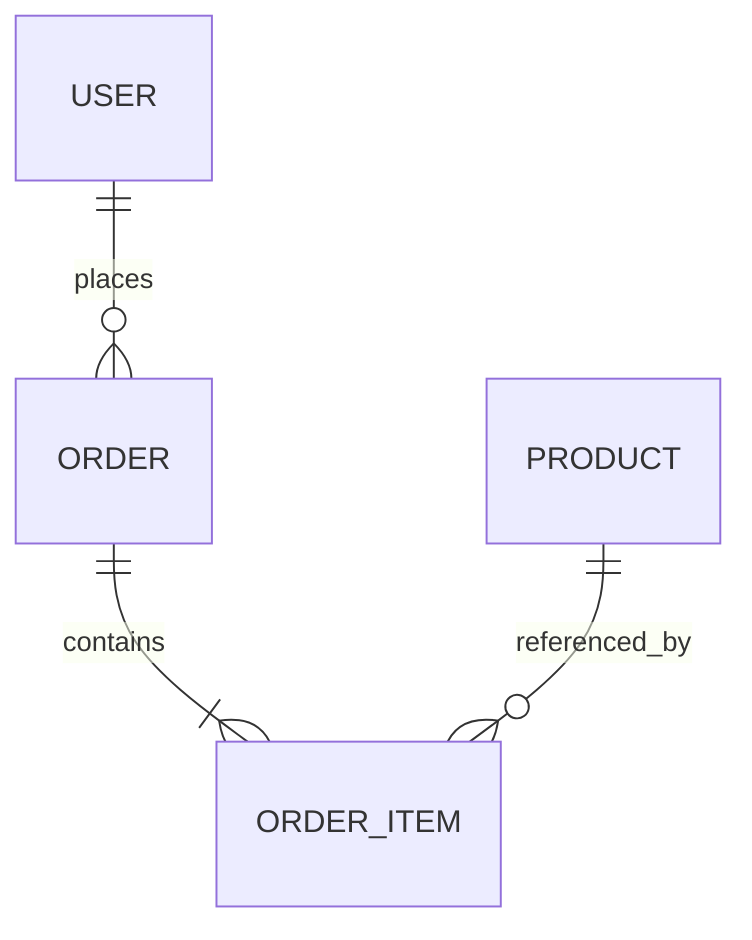
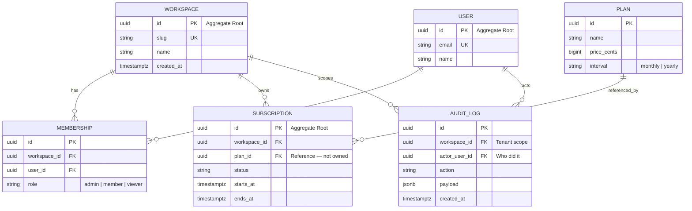
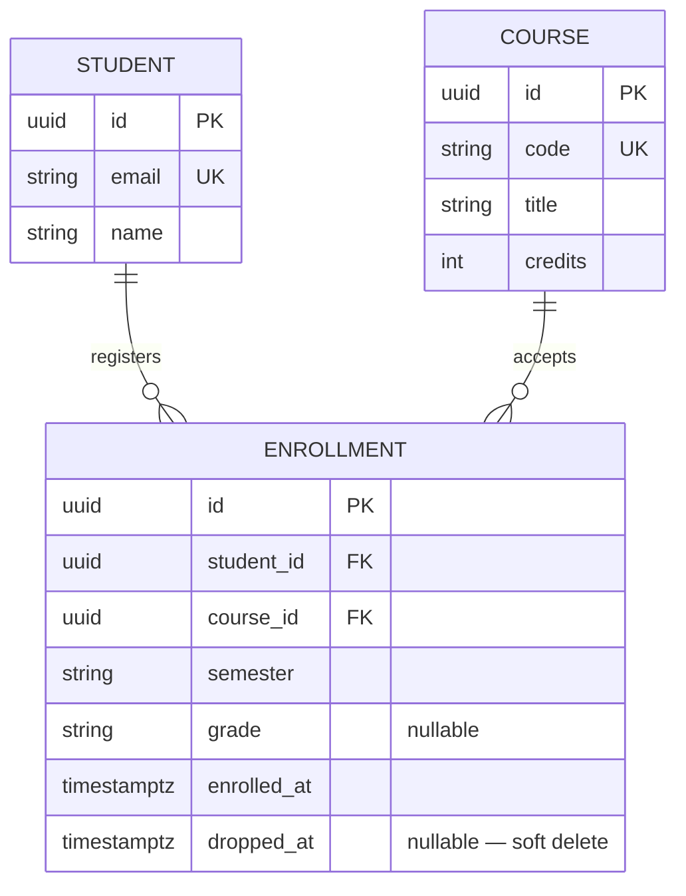

<!-- tags: diagram, er-diagram, database, ddd, reference -->

# 🗃️ ER Diagram — From Basics to Expert

> The single most underrated diagram in software engineering. An ER diagram catches missing foreign keys, wrong multiplicity, and vague aggregate boundaries **before** you write the migration.

📅 Created: 2026-03-31 · 🔄 Updated: 2026-05-02 · ⏱️ 35 min read

| Aspect | Detail |
|--------|--------|
| **Focus** | Data relationships, ownership, cardinality |
| **Use case** | Schema review, domain modeling, migration planning |
| **Go stdlib** | `database/sql`, `gorm.io/gorm`, `entgo.io/ent` |

---

## 1. DEFINE

Picture this: you are in a schema review. Five engineers are staring at the same tables — `users`, `orders`, `payments`, `products` — but nobody can agree whether the relationship between `orders` and `products` is one-to-many or many-to-many. The migration PR has 400 lines. One engineer says "just add a junction table," another says "embed it." The review stalls for three days.

That moment — when the data structure must reveal itself before queries and migrations start drifting — is exactly where an **Entity-Relationship Diagram** earns its keep.

An ER diagram is a visual specification of:
- **Entities** — the nouns in your domain (User, Order, Product)
- **Attributes** — properties each entity owns (email, status, price)
- **Relationships** — how entities connect (places, contains, references)
- **Cardinality** — how many of each side participate (1:1, 1:N, M:N)

### 1.1 Three Levels of ER Diagrams



| Level | Audience | Shows | Hides |
|-------|----------|-------|-------|
| **Conceptual** | Business, PM, domain experts | Entities + relationships | Attributes, keys, types |
| **Logical** | Developers, architects | PK/FK, cardinality, constraints | Indexes, partitions, engine |
| **Physical** | DBAs, migration authors | Data types, indexes, partitions | Nothing — full detail |

### 1.2 Invariants & Failure Modes

- **Every relationship must have explicit cardinality** — a line without cardinality is decoration, not specification
- **Foreign key always lives on the "many" side** — if User 1:N Order, then `orders.user_id` exists, not `users.order_id`
- **M:N requires a junction table** — there is no shortcut in relational databases
- **Aggregate boundaries are invisible in flat ERDs** — you must annotate or split diagrams by bounded context

Those failure modes sound basic. But there is a trap: stuffing the entire system into one ERD makes bounded contexts invisible. That trap appears in PITFALLS.

---

## 2. VISUAL

### Hero: ER Diagram Anatomy



*An ER diagram without cardinality notation is not an ER diagram — it is a box collection.*

### Cardinality Notation Reference



*Three notation families for the same concept — Crow's Foot is the industry standard for database work.*

### Crow's Foot Notation Cheat Sheet

```text
Symbol    Meaning              Example
──────────────────────────────────────────────
  ||      Exactly one          User ||──o{ Order
  o|      Zero or one          User o|──|| Profile
  |{      One or many          Order |{──|| OrderItem
  o{      Zero or many         Product o{──|| Review

Reading direction: LEFT side describes LEFT entity's participation
                   RIGHT side describes RIGHT entity's participation

  User  ||──o{  Order
  "One User"  "Zero or many Orders"
  → A user places zero or many orders
  → Each order belongs to exactly one user
```

### Mermaid Quick Reference



*Figure: The order domain ERD — who owns whom, how many of each, and where foreign keys live.*

```text
User 1 --- N Order
Order 1 --- N OrderItem
Product 1 --- N OrderItem

Question answered:
- which table owns the lifecycle of which?
- is a relationship 1-1, 1-N, or N-N?
- where does the foreign key live?
```

Concepts are clear on paper. The part that is easiest to get wrong is how they translate into real, executable code.

---

## 3. CODE

### Mermaid Practice Block

````md

````

### Example 1: Basic — SQL DDL from an ER Diagram

> **Goal**: Turn a 4-entity ER diagram into executable PostgreSQL DDL.
> **Approach**: Start from the entity with no foreign keys (User, Product), then build dependent tables.
> **Example**: `CREATE TABLE users → products → orders → order_items`

```sql
-- ============================================================
-- Example 1: Basic — SQL DDL from ER Diagram
-- PostgreSQL 16+ compatible
-- Copy/paste into psql or any PostgreSQL client to execute
-- ============================================================

-- ✅ Start with entities that have NO foreign keys
CREATE TABLE IF NOT EXISTS users (
    id          UUID PRIMARY KEY DEFAULT gen_random_uuid(),
    email       VARCHAR(255) NOT NULL UNIQUE,
    name        VARCHAR(100) NOT NULL,
    created_at  TIMESTAMPTZ  NOT NULL DEFAULT now()
);

CREATE TABLE IF NOT EXISTS products (
    id          UUID PRIMARY KEY DEFAULT gen_random_uuid(),
    sku         VARCHAR(50)  NOT NULL UNIQUE,
    name        VARCHAR(200) NOT NULL,
    price_cents BIGINT       NOT NULL CHECK (price_cents >= 0),
    created_at  TIMESTAMPTZ  NOT NULL DEFAULT now()
);

-- ✅ Then entities that reference the above
-- User 1:N Order — FK lives on the "many" side
CREATE TABLE IF NOT EXISTS orders (
    id         UUID PRIMARY KEY DEFAULT gen_random_uuid(),
    user_id    UUID         NOT NULL REFERENCES users(id) ON DELETE CASCADE,
    status     VARCHAR(20)  NOT NULL DEFAULT 'draft'
                            CHECK (status IN ('draft','placed','shipped','delivered','cancelled')),
    placed_at  TIMESTAMPTZ,
    created_at TIMESTAMPTZ  NOT NULL DEFAULT now()
);

-- ⚠️ Junction-like table for Order 1:N OrderItem, Product 1:N OrderItem
CREATE TABLE IF NOT EXISTS order_items (
    id             UUID PRIMARY KEY DEFAULT gen_random_uuid(),
    order_id       UUID   NOT NULL REFERENCES orders(id) ON DELETE CASCADE,
    product_id     UUID   NOT NULL REFERENCES products(id) ON DELETE RESTRICT,
    quantity       INT    NOT NULL CHECK (quantity > 0),
    unit_price_cents BIGINT NOT NULL CHECK (unit_price_cents >= 0),
    -- ✅ Prevent duplicate product in same order
    UNIQUE (order_id, product_id)
);

-- Indexes for FK columns (PostgreSQL does NOT auto-index FKs)
CREATE INDEX idx_orders_user_id ON orders(user_id);
CREATE INDEX idx_order_items_order_id ON order_items(order_id);
CREATE INDEX idx_order_items_product_id ON order_items(product_id);

-- ============================================================
-- Verify: Quick smoke test
-- ============================================================
INSERT INTO users (email, name) VALUES ('alice@example.com', 'Alice');
INSERT INTO products (sku, name, price_cents) VALUES ('SKU-001', 'Widget', 1999);

DO $$
DECLARE
    v_user_id UUID;
    v_product_id UUID;
    v_order_id UUID;
BEGIN
    SELECT id INTO v_user_id FROM users WHERE email = 'alice@example.com';
    SELECT id INTO v_product_id FROM products WHERE sku = 'SKU-001';

    INSERT INTO orders (user_id, status) VALUES (v_user_id, 'draft')
        RETURNING id INTO v_order_id;

    INSERT INTO order_items (order_id, product_id, quantity, unit_price_cents)
        VALUES (v_order_id, v_product_id, 2, 1999);

    RAISE NOTICE 'Created order % with 1 item', v_order_id;
END $$;
```

> **Why?** PostgreSQL does not automatically index foreign key columns. Without `idx_orders_user_id`, a `DELETE FROM users WHERE id = X` must sequential-scan the entire `orders` table to check FK constraints — O(N) instead of O(log N).

> **Conclusion**: Four entities, four tables, three foreign keys, three indexes. The ER diagram told us exactly where every FK goes and which indexes to create. But this is a single bounded context — what happens when the same diagram needs to become Go code?

Basic DDL covered. The next question is: how do these tables become Go structs that a team can work with?

### Example 2: Intermediate — Go Structs Matching an ERD

> **Goal**: Map the ERD directly to Go structs with GORM tags, showing how the diagram becomes code.
> **Approach**: Each entity → struct. Each relationship → FK field + GORM association tag.
> **Example**: `User has many Orders; Order has many OrderItems; Product is referenced by OrderItems`

```go
// ============================================================
// Example 2: Intermediate — Go structs from ER Diagram
// Go 1.26+ · GORM v2
// Save as main.go, run: go run main.go
// ============================================================
package main

import (
	"context"
	"fmt"
	"log"
	"time"

	"gorm.io/driver/sqlite" // ✅ SQLite for easy local testing
	"gorm.io/gorm"
)

// ── Entity: User ────────────────────────────────────────────
// ERD: User has uuid id PK, string email, string name
type User struct {
	ID        string    `gorm:"type:text;primaryKey"  json:"id"`
	Email     string    `gorm:"uniqueIndex;not null"  json:"email"`
	Name      string    `gorm:"not null"              json:"name"`
	CreatedAt time.Time `gorm:"autoCreateTime"        json:"created_at"`

	// ✅ User 1:N Order — GORM "has many" via user_id FK
	Orders []Order `gorm:"foreignKey:UserID" json:"orders,omitempty"`
}

// ── Entity: Product ─────────────────────────────────────────
type Product struct {
	ID         string    `gorm:"type:text;primaryKey"  json:"id"`
	SKU        string    `gorm:"uniqueIndex;not null"  json:"sku"`
	Name       string    `gorm:"not null"              json:"name"`
	PriceCents int64     `gorm:"not null;check:price_cents >= 0" json:"price_cents"`
	CreatedAt  time.Time `gorm:"autoCreateTime"        json:"created_at"`
}

// ── Entity: Order ───────────────────────────────────────────
// ERD: Order has uuid id PK, uuid user_id FK, string status
type Order struct {
	ID        string     `gorm:"type:text;primaryKey"  json:"id"`
	UserID    string     `gorm:"not null;index"        json:"user_id"`   // ⚠️ FK to users
	Status    string     `gorm:"not null;default:draft" json:"status"`
	PlacedAt  *time.Time `json:"placed_at,omitempty"`
	CreatedAt time.Time  `gorm:"autoCreateTime"        json:"created_at"`

	// ✅ Order 1:N OrderItem
	Items []OrderItem `gorm:"foreignKey:OrderID" json:"items,omitempty"`
}

// ── Entity: OrderItem ───────────────────────────────────────
// ERD: OrderItem has uuid id PK, uuid order_id FK, uuid product_id FK
type OrderItem struct {
	ID             string `gorm:"type:text;primaryKey"  json:"id"`
	OrderID        string `gorm:"not null;index"        json:"order_id"`   // FK to orders
	ProductID      string `gorm:"not null;index"        json:"product_id"` // FK to products
	Quantity       int    `gorm:"not null;check:quantity > 0" json:"quantity"`
	UnitPriceCents int64  `gorm:"not null"              json:"unit_price_cents"`

	// ✅ Belongs-to associations for eager loading
	Product Product `gorm:"foreignKey:ProductID" json:"product,omitempty"`
}

func main() {
	// ── Setup: SQLite in-memory for demo ────────────────────
	db, err := gorm.Open(sqlite.Open(":memory:"), &gorm.Config{})
	if err != nil {
		log.Fatal("failed to connect:", err)
	}

	// ✅ AutoMigrate creates tables matching our ER diagram
	if err := db.AutoMigrate(&User{}, &Product{}, &Order{}, &OrderItem{}); err != nil {
		log.Fatal("migration failed:", err)
	}
	fmt.Println("✅ Tables created from ER diagram structs")

	ctx := context.Background()
	_ = ctx // available for context-aware queries

	// ── Seed data ───────────────────────────────────────────
	user := User{ID: "u-1", Email: "alice@example.com", Name: "Alice"}
	db.Create(&user)

	product := Product{ID: "p-1", SKU: "WIDGET-001", Name: "Widget", PriceCents: 1999}
	db.Create(&product)

	order := Order{ID: "o-1", UserID: user.ID, Status: "draft"}
	db.Create(&order)

	item := OrderItem{
		ID: "oi-1", OrderID: order.ID, ProductID: product.ID,
		Quantity: 3, UnitPriceCents: product.PriceCents,
	}
	db.Create(&item)

	// ── Query: Eager-load the full order graph ──────────────
	var loaded User
	db.Preload("Orders.Items.Product").First(&loaded, "id = ?", "u-1")

	fmt.Printf("User: %s\n", loaded.Name)
	for _, o := range loaded.Orders {
		fmt.Printf("  Order: %s (status: %s)\n", o.ID, o.Status)
		for _, it := range o.Items {
			fmt.Printf("    Item: %dx %s @ $%.2f\n",
				it.Quantity, it.Product.Name,
				float64(it.UnitPriceCents)/100)
		}
	}
}
```

**To run:**

```bash
mkdir er-demo && cd er-demo
go mod init er-demo
# paste the code above into main.go
go get gorm.io/gorm gorm.io/driver/sqlite
go run main.go
```

> **Why?** GORM tags like `foreignKey:UserID` directly encode the ER diagram's relationship lines. When `AutoMigrate` runs, it creates the exact same schema the ERD specified — including FK constraints and indexes on FK columns marked with `index`.

> **Conclusion**: The Go structs are a 1:1 mirror of the ER diagram. If the diagram changes, the structs change. If the structs drift from the diagram, you have a design bug. But what about complex multi-domain schemas?

### Example 3: Advanced — Multi-Tenant ERD with DDD Boundaries

> **Goal**: Model a multi-tenant SaaS schema where bounded contexts are visible in the ERD.
> **Approach**: Split by domain boundary. Mark aggregate roots. Annotate ownership vs reference.
> **Example**: `Workspace owns Subscription; AuditLog references but does not own User`



*Figure: Multi-tenant ERD split by bounded context — IAM, Billing, Audit.*

```go
// ============================================================
// Example 3: Advanced — Multi-tenant domain entities
// Go 1.26+ · DDD-style aggregate roots
// ============================================================
package domain

import "time"

// ── IAM Context ─────────────────────────────────────────────

// Workspace is the aggregate root for tenant isolation.
type Workspace struct {
	ID        string    `gorm:"type:text;primaryKey"`
	Slug      string    `gorm:"uniqueIndex;not null"`
	Name      string    `gorm:"not null"`
	CreatedAt time.Time `gorm:"autoCreateTime"`

	Memberships   []Membership   `gorm:"foreignKey:WorkspaceID"`
	Subscriptions []Subscription `gorm:"foreignKey:WorkspaceID"`
}

// Membership is an owned entity — lifecycle bound to Workspace.
type Membership struct {
	ID          string `gorm:"type:text;primaryKey"`
	WorkspaceID string `gorm:"not null;index"`
	UserID      string `gorm:"not null;index"`
	Role        string `gorm:"not null;default:member"`
}

// ── Billing Context ─────────────────────────────────────────

// Subscription references Plan but does NOT own Plan.
type Subscription struct {
	ID          string     `gorm:"type:text;primaryKey"`
	WorkspaceID string     `gorm:"not null;index"`
	PlanID      string     `gorm:"not null;index"` // ⚠️ Reference, not ownership
	Status      string     `gorm:"not null;default:active"`
	StartsAt    time.Time  `gorm:"not null"`
	EndsAt      *time.Time // nullable — ongoing subscription
}

// ── Audit Context ───────────────────────────────────────────

// AuditLog only references User and Workspace — never mutates them.
type AuditLog struct {
	ID          string    `gorm:"type:text;primaryKey"`
	WorkspaceID string    `gorm:"not null;index"`
	ActorUserID string    `gorm:"not null;index"`
	Action      string    `gorm:"not null"`
	Payload     string    `gorm:"type:jsonb"`
	CreatedAt   time.Time `gorm:"autoCreateTime"`
}
```

> **Why?** Splitting the ERD by bounded context prevents the "god diagram" anti-pattern. Each context has clear aggregate roots and explicit ownership vs reference relationships. `Subscription.PlanID` is a reference — deleting a Plan should NOT cascade-delete subscriptions.

> **Conclusion**: At this level, an ERD is a **domain modeling tool**. The boundaries visible in the diagram directly map to Go package boundaries. But knowing how to draw correctly is only half the story.

### Example 4: Expert — M:N with Junction Table + Temporal Data

> **Goal**: Model a many-to-many relationship with temporal validity and soft delete.
> **Approach**: Junction table with its own attributes, validity window, and audit columns.
> **Example**: `Student M:N Course through Enrollment (with grade, enrolled_at, dropped_at)`

```sql
-- ============================================================
-- Example 4: Expert — M:N with temporal junction table
-- PostgreSQL 16+
-- ============================================================

CREATE TABLE students (
    id         UUID PRIMARY KEY DEFAULT gen_random_uuid(),
    email      VARCHAR(255) NOT NULL UNIQUE,
    name       VARCHAR(100) NOT NULL,
    created_at TIMESTAMPTZ  NOT NULL DEFAULT now()
);

CREATE TABLE courses (
    id         UUID PRIMARY KEY DEFAULT gen_random_uuid(),
    code       VARCHAR(20)  NOT NULL UNIQUE,
    title      VARCHAR(200) NOT NULL,
    credits    INT          NOT NULL CHECK (credits BETWEEN 1 AND 6),
    created_at TIMESTAMPTZ  NOT NULL DEFAULT now()
);

-- ⚠️ Junction table with its own identity and temporal attributes
CREATE TABLE enrollments (
    id          UUID PRIMARY KEY DEFAULT gen_random_uuid(),
    student_id  UUID         NOT NULL REFERENCES students(id),
    course_id   UUID         NOT NULL REFERENCES courses(id),
    semester    VARCHAR(10)  NOT NULL,
    grade       VARCHAR(2),
    enrolled_at TIMESTAMPTZ  NOT NULL DEFAULT now(),
    dropped_at  TIMESTAMPTZ,

    UNIQUE (student_id, course_id, semester),
    CHECK (dropped_at IS NULL OR dropped_at > enrolled_at)
);

CREATE INDEX idx_enrollments_student ON enrollments(student_id);
CREATE INDEX idx_enrollments_course  ON enrollments(course_id);
-- ✅ Partial index for active enrollments only
CREATE INDEX idx_enrollments_active  ON enrollments(student_id)
    WHERE dropped_at IS NULL;

-- Active enrollments for a student
SELECT c.code, c.title, e.semester
FROM enrollments e
JOIN courses c ON c.id = e.course_id
WHERE e.student_id = :student_id
  AND e.dropped_at IS NULL
ORDER BY e.semester DESC;
```



> **Why?** A naive M:N junction table with only two FK columns cannot express temporal data, grades, or soft-delete. The moment a junction table needs its own attributes, it becomes a **first-class entity** in the ERD. The partial index ensures queries for active enrollments are O(log N) on just the active subset.

> **Conclusion**: Expert-level ERDs treat junction tables as entities with full lifecycle semantics.

---

## 4. PITFALLS

Knowing how to draw correctly is half the story. The other half is knowing where experienced engineers still get it wrong.

### 🔴 Fatal: The God ERD

A team of 12 engineers produces a single ERD with 47 entities, 200+ columns, and relationship lines crossing like spaghetti. Nobody can find the aggregate boundaries. The migration takes 3 sprints to untangle.

**Fix**: Split by bounded context. One ERD per domain. Cross-context references use ID only — no FK constraints across bounded contexts.

| # | Severity | Mistake | Consequence | Fix |
|---|----------|---------|-------------|-----|
| 1 | 🔴 Fatal | Cramming entire system into one ERD | Aggregate boundaries invisible | Split by bounded context |
| 2 | 🔴 Fatal | Missing cardinality notation | Team debates 1:N vs M:N for weeks | Always use crow's foot |
| 3 | 🟡 Common | FK on wrong side | `users.order_id` instead of `orders.user_id` | FK lives on "many" side |
| 4 | 🟡 Common | No indexes on FK columns | `DELETE` parent triggers full table scan | Explicit index on every FK |
| 5 | 🟡 Common | Mixing logical and physical ERD | Diagram overloaded | Logical first, then physical |
| 6 | 🟡 Common | Naive M:N junction table | Cannot express temporal data | Give junction table own PK |
| 7 | 🔵 Minor | No PK/FK labels | Reader guesses which is the key | Mark PK and FK explicitly |

---

## 5. REF

| Resource | Type | Link |
|----------|------|------|
| Mermaid ER Diagram syntax | Official docs | https://mermaid.js.org/syntax/entityRelationshipDiagram.html |
| PlantUML IE diagrams | Official docs | https://plantuml.com/ie-diagram |
| PostgreSQL constraints | Official docs | https://www.postgresql.org/docs/current/ddl-constraints.html |
| Chen's original ER paper | Academic | Peter Chen, "The Entity-Relationship Model" (1976) |
| GORM Associations | Go ORM docs | https://gorm.io/docs/has_many.html |
| Ent schema edges | Go ORM docs | https://entgo.io/docs/schema-edges |

---

## 6. RECOMMEND

You now understand ER diagrams from basic 4-entity schemas to expert-level temporal junction tables with DDD boundaries. The natural next step is to connect this knowledge to adjacent diagram types that answer different questions about the same system.

| Next Step | When | Reason | File |
|-----------|------|--------|------|
| Class Diagram | Application-side object model | Compare DB shape vs code shape | [→ Class Diagram](./02-class-diagram.md) |
| Component Diagram | Module boundary zoom-out | See how bounded contexts connect | [→ Component Diagram](./03-component-diagram.md) |
| Sequence Diagram | Request tracing | Understand read/write paths | [→ Sequence Diagram](../02-sequence-diagram.md) |
| State Diagram | Entity lifecycle matters | Model valid state transitions | [→ State Diagram](../05-state-diagram.md) |

---

## 7. QUICK REF

### Mermaid ER Syntax Cheat Sheet

```text
Relationship Syntax:
  ||--||  exactly one to exactly one
  ||--o{  exactly one to zero or many
  ||--|{  exactly one to one or many
  o|--o{  zero or one to zero or many

Entity Syntax:
  ENTITY_NAME {
      type attribute_name PK "comment"
      type attribute_name FK
      type attribute_name UK  "unique"
  }

Full example:
  erDiagram
      PARENT ||--o{ CHILD : has
      PARENT { uuid id PK }
      CHILD  { uuid id PK  uuid parent_id FK }
```

### ERD Design Checklist

```text
□ Every entity has a PK (preferably UUID for distributed systems)
□ Every relationship has cardinality notation
□ FK lives on the "many" side
□ FK columns have explicit indexes
□ M:N uses a junction table (not arrays/JSON)
□ Junction tables with attributes have their own PK
□ Diagram is split by bounded context (≤ 10 entities per diagram)
□ Aggregate root is marked or annotated
□ CHECK constraints for business rules are noted
□ Temporal columns (created_at, deleted_at) are visible
```

---

**Links**: ← Previous · [→ Class Diagram](./02-class-diagram.md)
