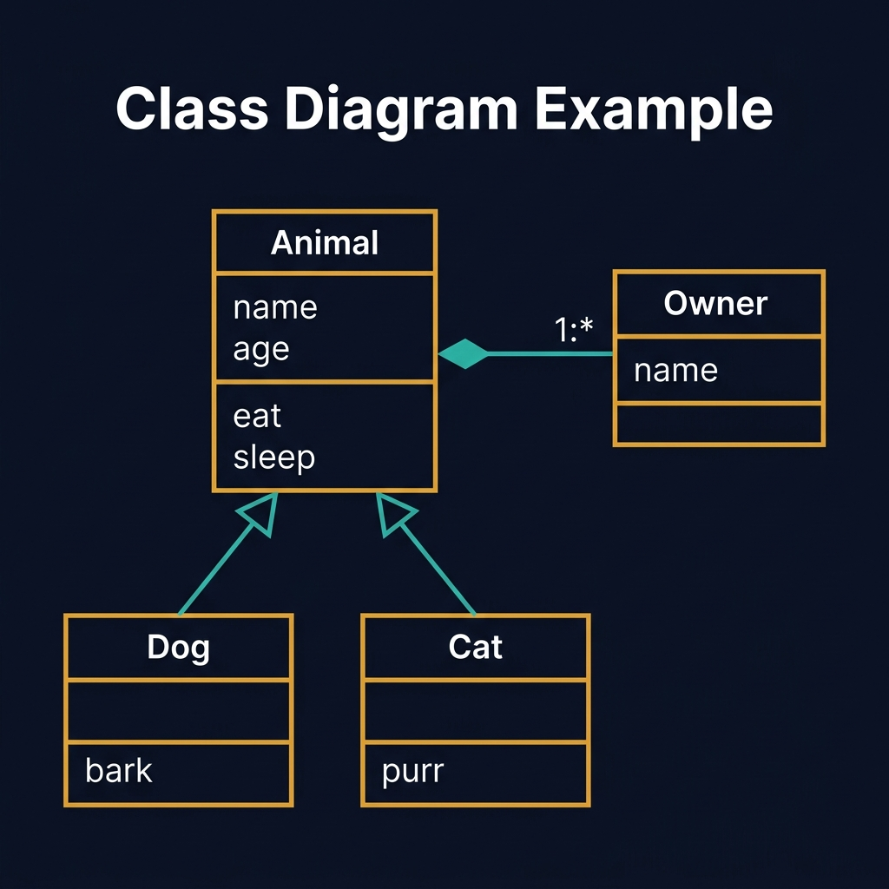
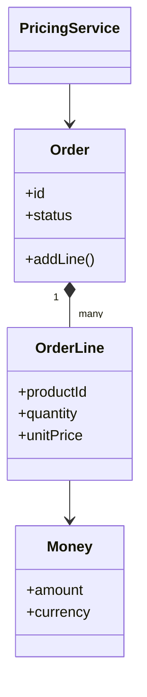
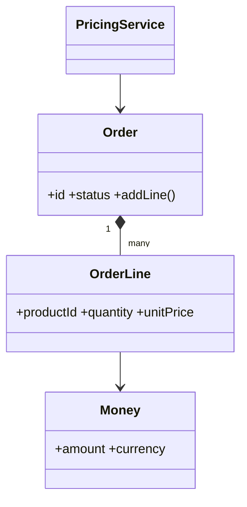
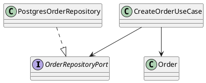
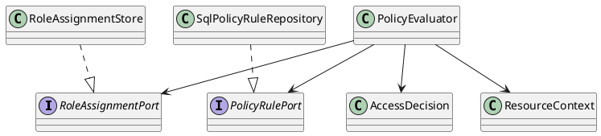

<!-- tags: diagram, reference -->
# 🏛️ Class Diagram

> Class diagrams are most useful when you need to explain static responsibility and dependency between object types.

📅 Created: 2026-03-31 · 🔄 Updated: 2026-04-20 · ⏱️ 14 min read

| Aspect | Detail |
| ------ | ------ |
| **Focus** | Object relationships |
| **When to use** | When you need to describe classes, interfaces, dependencies |
| **Related** | OOD, DDD, UML |

---

## 1. DEFINE

You are modeling a domain with many objects and interfaces, but every time you add a new class the dependency boundary blurs a little more. Class diagrams are useful when the team needs to see static responsibilities and relationships before the code slides into spaghetti OOP.

| Variant | When to use | Scope |
| ------- | ----------- | ----- |
| Domain model view | Focusing on entity, value object, service | Business concepts |
| Application structure view | Seeing class/interface/dependency | Ports, adapters, services |
| Review anti-coupling view | Finding bad dependency direction | Inheritance, god objects |

**Core insight**:
- Not every codebase needs a detailed class diagram. It is most valuable in OOD, DDD, or frameworks with many abstractions.
- A good class diagram clarifies interface boundaries, not screenshots of the IDE.
- Class diagrams beat prose when the team is debating responsibility and dependency direction.

Those failure modes sound familiar. But there is a trap: turning a class diagram into a picture of the entire codebase produces too many boxes. That trap appears in PITFALLS.

## 2. VISUAL

### Class Diagram Example

The image below shows a UML class diagram with inheritance and composition. Animal is the abstract parent class; Dog and Cat extend it. Owner has a composition relationship (1:*) with Animal. Each class box follows the standard three-section layout: name, attributes, methods.



*Image: A class diagram without relationship arrows is just a list of classes. The inheritance triangle and composition diamond are what make the diagram reveal design decisions: is it inheritance or composition? That choice drives the entire codebase.*

### Preview UI



*Figure: A domain-level class diagram showing entity relationships and service dependency — who owns whom, who calls whom.*

```text
Entity <> ValueObject
UseCase --> RepositoryPort
RepositoryAdapter ..|> RepositoryPort

Question answered:
- who depends on whom?
- where does polymorphism live?
- which layer knows which layer?
```

## 3. CODE

The visual gave the right intuition. Now let us bring it down to artifacts the team can review, write, or reuse in real docs.

### Mermaid Practice Block

````md

````

### Example 1: Basic — Hexagonal application class view

> **Goal**: Show that the application layer depends on a port, not a concrete adapter.
> **Approach**: Represent interface and implementation clearly separated.
> **Example**: `CreateOrderUseCase depends on OrderRepositoryPort, not PostgresOrderRepository.`



> **Conclusion**: For OOD reviews, this diagram is far better than pasting code because the dependency direction is visible at a glance.

Class relationships covered. But design pattern visualization needs focus — let us separate.

### Example 2: Intermediate — Domain-level class diagram

> **Goal**: Clarify entity, value object, and aggregate boundary.
> **Approach**: Include only the types that serve a decision, not the entire codebase.
> **Example**: `Money is a value object; Order contains OrderLine; PricingService is a domain service.`


> **Conclusion**: When the reader needs to understand business invariants, a domain-level class diagram is more valuable than one that chases every DTO.

Pattern visualization covered. But Go interface diagrams need adaptation — let us adjust.

### Example 3: Advanced — Access control policy engine view

> **Goal**: Use a class diagram to review responsibility and dependency direction in a policy system with RBAC/ABAC.
> **Approach**: Separate `PolicyEvaluator`, `RoleAssignmentStore`, `ResourceContext`, and `RuleSet` to reveal which domain parts must not depend on infrastructure.
> **Example**: `Evaluator reads role assignment via port, receives resource context, then computes decision.`



> **Conclusion**: At the advanced level, class diagrams are very effective for catching reversed dependencies in subsystems with many interfaces like auth, policy, or workflow engines.

You have walked through relationships, patterns, and Go adaptation. Now comes the dangerous part: the codebase dump — the trap set up at the beginning.

## 4. PITFALLS

| # | Mistake | Consequence | Fix |
|---|---------|-------------|-----|
| 1 | Turning a class diagram into a picture of the entire codebase | Too many boxes; nobody can review it | Keep only classes relevant to the decision |
| 2 | Over-using inheritance in diagrams | Hides real composition and interface boundaries | Prefer composition and port/interface when appropriate |
| 3 | Not distinguishing domain from infrastructure | Reader thinks the adapter is a business model | Attach package/layer or stereotype labels clearly |

## 5. REF

| Resource | Link |
| -------- | ---- |
| UML class diagram | https://www.uml-diagrams.org/class-diagrams-overview.html |
| Mermaid class diagram | https://mermaid.js.org/syntax/classDiagram.html |
| PlantUML class diagrams | https://plantuml.com/class-diagram |

## 6. RECOMMEND

| Next step | When | Reason |
| --------- | ---- | ------ |
| Component diagram | When you want to zoom out from class to module | See module boundaries more clearly |
| OOD interview | When you need to practice responsibility and collaboration thinking | Class diagrams are a natural bridge |
| Hexagonal architecture glossary | When you need to understand ports and adapters | Explains dependency direction |

---

**Links**: [← Previous](./01-er-diagram.md) · [→ Next](./03-component-diagram.md)
