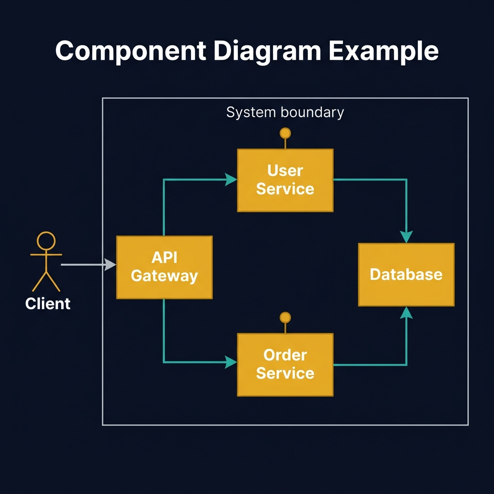
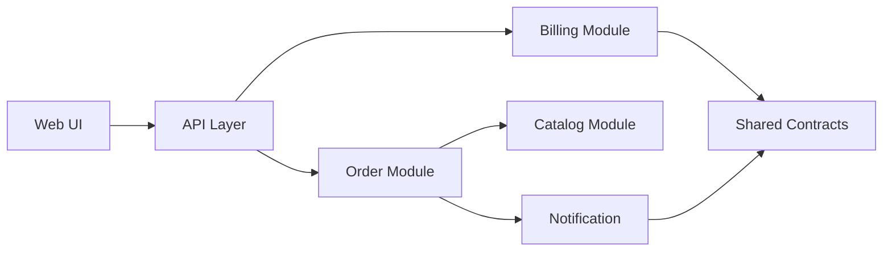
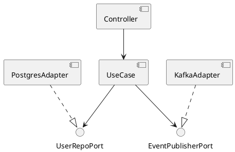
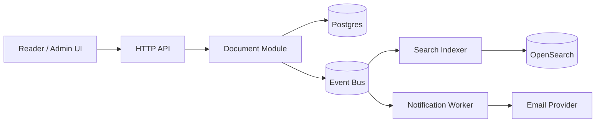

<!-- tags: diagram, reference -->
# 🧩 Component Diagram

> Component diagrams are powerful when the team is debating boundary, ownership, or circular dependency.

📅 Created: 2026-03-31 · 🔄 Updated: 2026-04-20 · ⏱️ 14 min read

| Aspect | Detail |
| ------ | ------ |
| **Focus** | Module boundary |
| **When to use** | When you need to see dependency between modules or services |
| **Related** | Architecture, Monolith, Microservices |

---

## 1. DEFINE

Picture a system whose modules sound clean on paper, but during review nobody is sure which component owns which logic and which is just an adapter. Component diagrams exist to lock down that boundary.

| Variant | When to use | Scope |
| ------- | ----------- | ----- |
| Module map | In a monolith or modular monolith | Package/module dependency |
| Service boundary view | In a distributed system | Service-to-service dependency |
| Adapter/port view | In clean architecture | Inbound/outbound interfaces |

**Core insight**:
- Component diagrams sit between class diagrams and system context: specific enough to show modules, high enough to skip method-level detail.
- During refactor reviews, they help spot overgrown shared modules or dependencies pointing the wrong way.
- If dependency direction is the main question, component diagrams are usually the first diagram to choose.

Those failure modes sound clear. But there is a trap: drawing a component diagram that drops to class level loses the middle zoom. That trap appears in PITFALLS.

## 2. VISUAL

### Component Diagram Example

The image below shows a component diagram with four components inside a system boundary: API Gateway routes to User Service and Order Service, both of which depend on Database. The Client actor sits outside the boundary. Interface lollipops on the services indicate provided interfaces.



*Image: A component diagram without a system boundary is just a dependency graph. The boundary is what makes it actionable: anything outside is external, anything inside is owned. The arrow direction reveals coupling direction — flip an arrow and the ownership story changes.*

### Preview UI



*Figure: A component map showing module dependency — where arrows point reveals who depends on whom and which shared module may be over-coupled.*

```text
UI -> API Gateway -> Application -> Domain -> Persistence
Notification -> Messaging -> Email/SMS

Question answered:
- which module calls which module?
- is the shared package being abused?
- is the dependency direction clean?
```

## 3. CODE

The diagram showed the scope. Code and snippets below reveal how this diagram is applied in a real review or design doc.

### Mermaid Practice Block

````md

````

### Example 1: Basic — Modular monolith dependency map

> **Goal**: Review dependency direction before splitting modules or extracting services.
> **Approach**: Draw the main modules and the interfaces exchanged between them.
> **Example**: `Billing should not import Notification internals; both depend on shared contracts.`


> **Conclusion**: If the diagram shows many modules depending on a single bloated shared package, that is usually a sign of leaking boundaries.

Module boundaries covered. But interface contracts need notation — let us declare.

### Example 2: Intermediate — Port-adapter view of a use case

> **Goal**: Show that component diagrams work well for clean architecture, not just microservices.
> **Approach**: Separate inbound component, domain core, outbound adapters.
> **Example**: `HTTP controller, use case, repository adapter, queue publisher.`



> **Conclusion**: This view is especially useful when onboarding newcomers into a codebase with many adapters and interfaces.

Contracts covered. But microservice topology needs a deployment view — let us upgrade.

### Example 3: Advanced — Event-driven boundary for a knowledge platform

> **Goal**: Review component boundaries in a system with API, worker, search indexing, and notification without dropping to class level.
> **Approach**: Separate sync path and async path in the same component map to reveal real coupling.
> **Example**: `Document service writes DB sync, publishes events so search index and notification process async.`



> **Conclusion**: An advanced component diagram helps the team see where sync coupling must stay tight and which async edges can scale or be replaced independently.

You have walked through modules, contracts, and topology. Now comes the dangerous part: wrong zoom level — the trap set up at the beginning.

## 4. PITFALLS

| # | Mistake | Consequence | Fix |
|---|---------|-------------|-----|
| 1 | Drawing a component diagram but dropping to class level | Loses the advantage of the middle zoom | Stay at module/component boundary |
| 2 | Not showing dependency direction | Reader cannot tell which module is allowed to import which | Use consistent arrows and note the rule |
| 3 | Shared module too generic | Looks clean but is actually a dumping ground | Split contracts, utilities, and domain shared clearly |

## 5. REF

| Resource | Link |
| -------- | ---- |
| UML component diagram | https://www.uml-diagrams.org/component-diagrams.html |
| C4 container diagram | https://c4model.com/ |
| Mermaid flowchart | https://mermaid.js.org/syntax/flowchart.html |

## 6. RECOMMEND

| Next step | When | Reason |
| --------- | ---- | ------ |
| Deployment diagram | When you need to move from component to runtime topology | Know where code actually runs |
| C4 model | When you need a structured zoom-level framework | Context, container, component, code |
| Microservices patterns | When you need templates for service decomposition | Apply directly to system design |

---

**Links**: [← Previous](./02-class-diagram.md) · [→ Next](./04-deployment-diagram.md)
