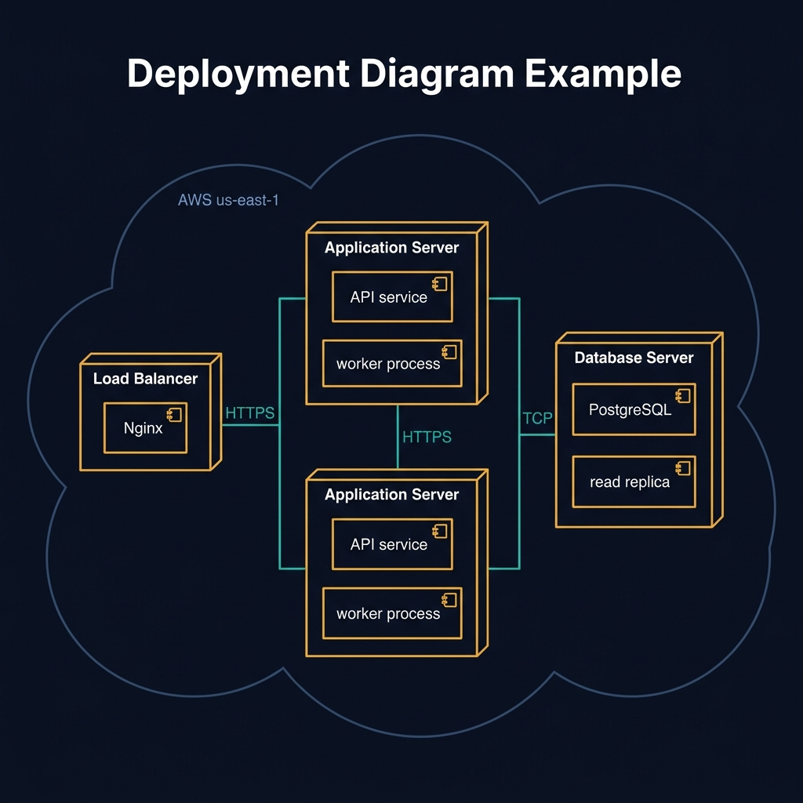
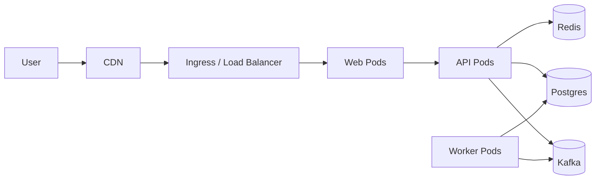
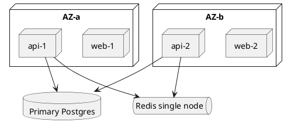
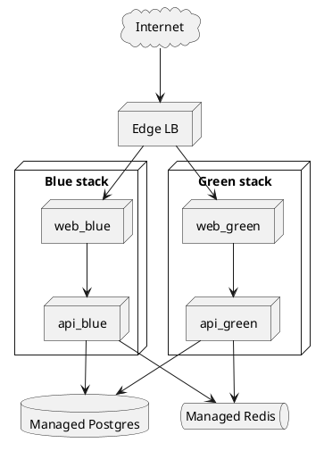

<!-- tags: diagram, reference -->
# 🚚 Deployment Diagram

> Deployment diagrams answer where the code runs, not which module calls which module.

📅 Created: 2026-03-31 · 🔄 Updated: 2026-04-20 · ⏱️ 14 min read

| Aspect | Detail |
| ------ | ------ |
| **Focus** | Runtime topology |
| **When to use** | When you need to describe nodes, networks, runtime placement |
| **Related** | DevOps, K8s, Cloud |

---

## 1. DEFINE

You are preparing to deploy or reviewing production topology, and words like app, db, cache, queue are no longer enough. Deployment diagrams appear when the team needs to see what runs where, connected by which path, and depending on which node.

| Variant | When to use | Scope |
| ------- | ----------- | ----- |
| Logical deployment | Sketching main nodes and connections | Service, DB, cache, queue |
| Physical deployment | Mapping specific subnet, LB, node pool | Real infrastructure |
| Environment comparison | Comparing staging, prod, dev differences | Rollout and risk review |

**Core insight**:
- Deployment diagrams are especially useful for reviewing security boundaries, network paths, or single points of failure.
- For cloud-native systems, the diagram should clearly show ingress, stateful dependencies, and scaling boundaries.
- If code runs across multiple zones, nodes, or managed services, a deployment diagram is where that view consolidates.

Those failure modes sound easy to avoid. But there is a trap: drawing topology without network boundaries hides the attack surface. That trap appears in PITFALLS.

## 2. VISUAL

### Deployment Diagram Example

The image below shows a deployment topology inside an AWS cloud boundary: a Load Balancer node with Nginx, two Application Server nodes with API service and worker process, and a Database Server node with PostgreSQL and read replica. Network connections show protocol labels (HTTPS, TCP).



*Image: A deployment diagram without protocol labels and node counts is a topology sketch, not a deployment diagram. The labels (HTTPS, TCP) and the counts (x2 app servers) are what make infrastructure review possible from a single picture.*

### Preview UI



*Figure: A K8s deployment overview — from user through CDN to pods, then to stateful dependencies. Reveals ingress path, data stores, and async workers at a glance.*

```text
Internet -> CDN -> Load Balancer -> App Pods
App Pods -> Redis / Postgres / Kafka
Ops VPN -> Bastion -> Private subnet
```

## 3. CODE

The visual gave the right intuition. Now let us bring it down to artifacts the team can review, write, or reuse in real docs.

### Mermaid Practice Block

````md

````

### Example 1: Basic — K8s deployment overview

> **Goal**: Illustrate the path from user to app and stateful dependencies.
> **Approach**: Keep topology at a level sufficient for reviewing availability and network flow.
> **Example**: `Ingress enters web pods; workers consume from queue; DB sits in private subnet.`


> **Conclusion**: With just this diagram, a reviewer can already ask about ingress auth, DB exposure, queue durability, and worker autoscaling.

Infrastructure mapping covered. But network boundaries need a subnet view — let us split.

### Example 2: Intermediate — Availability boundary review

> **Goal**: Turn a deployment diagram into a tool for detecting single points of failure.
> **Approach**: Mark zones, replicas, and critical stateful dependencies.
> **Example**: `App is multi-AZ, but a single-node Redis is still a kill point.`



> **Conclusion**: A good deployment diagram does not just look good. It reveals risks like a single-node cache, a shared NAT, or a cron running on only one machine.

Subnet covered. But scaling topology needs replica notation — let us annotate.

### Example 3: Advanced — Blue/green rollout with private data plane

> **Goal**: Use a deployment diagram to review rollout strategy, blast radius, and secret boundary during a critical release.
> **Approach**: Show two live environments in parallel, a shared data plane, and the rollback path.
> **Example**: `Green receives 10% traffic via weighted LB, while Blue holds 90% for fast rollback.`



> **Conclusion**: An advanced deployment diagram answers not just "where does it run" but also helps review rollout safety, rollback path, and shared-state risk very quickly.

You have walked through mapping, subnets, and scaling. Now comes the dangerous part: hidden network boundary — the trap set up at the beginning.

## 4. PITFALLS

| # | Mistake | Consequence | Fix |
|---|---------|-------------|-----|
| 1 | Drawing topology without network boundaries | Cannot review attack surface or real paths | Add internet, private subnet, VPN, LB clearly |
| 2 | Mixing deployment with code-level dependency | Reader confuses module with runtime node | Separate component diagram from deployment diagram |
| 3 | Not marking stateful dependencies | HA review misses DB, cache, queue | Mark all external and stateful systems |

## 5. REF

| Resource | Link |
| -------- | ---- |
| UML deployment diagram | https://www.uml-diagrams.org/deployment-diagrams.html |
| C4 model | https://c4model.com/ |
| Kubernetes architecture | https://kubernetes.io/docs/concepts/architecture/ |

## 6. RECOMMEND

| Next step | When | Reason |
| --------- | ---- | ------ |
| Architecture diagrams | When you want to zoom out or in within the same narrative | Connect context, container, deployment |
| CI/CD pipeline | When you need to tie topology to rollout path | Understand where deploy goes |
| Network diagram | When you need security-focused infrastructure | Deep dive into firewall, subnet, routing |

---

**Links**: [← Previous](./03-component-diagram.md) · → Next
