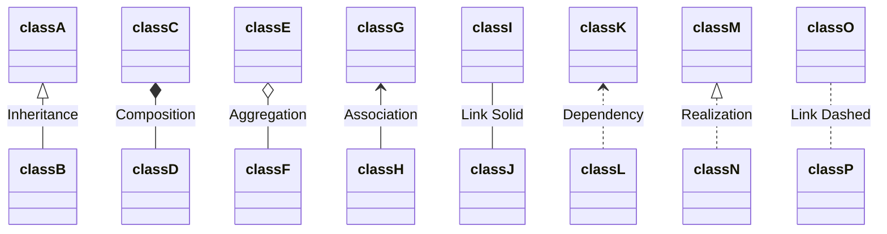
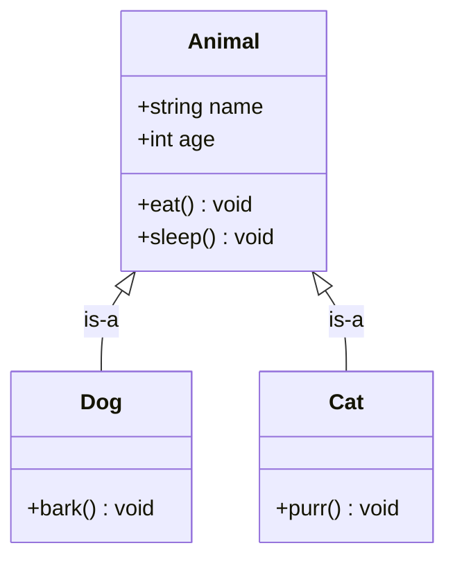
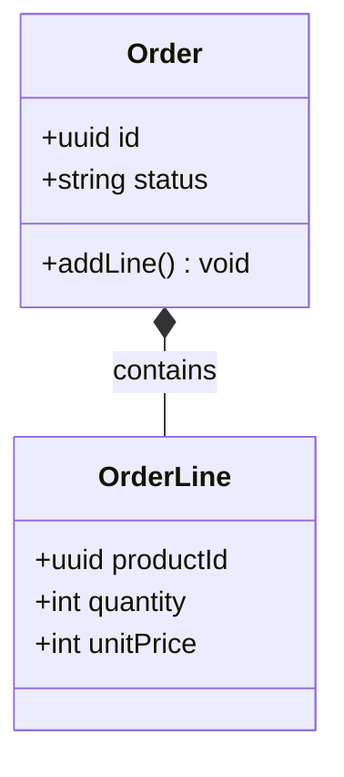
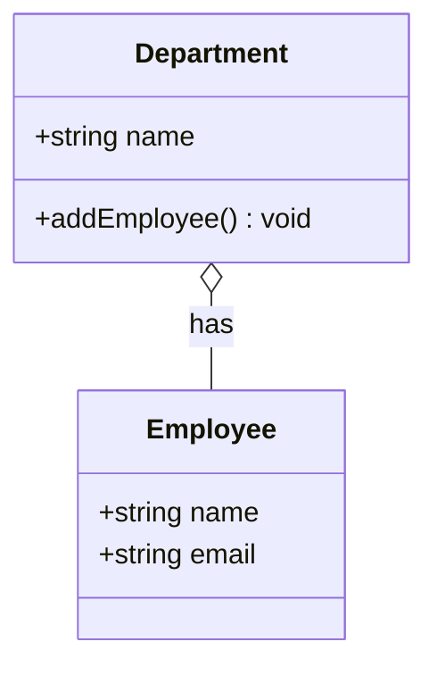
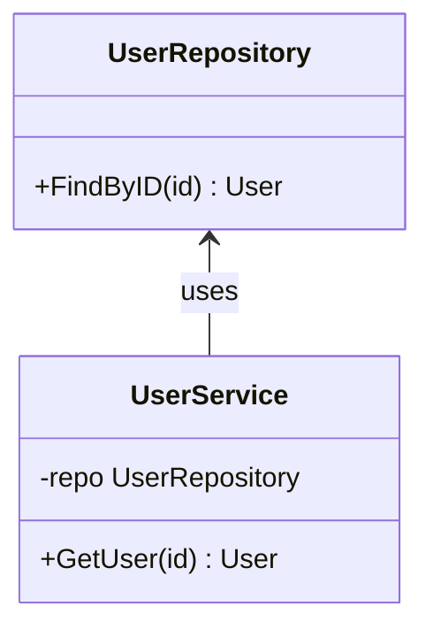
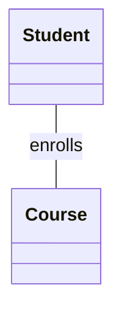
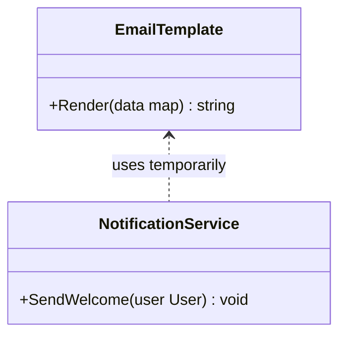
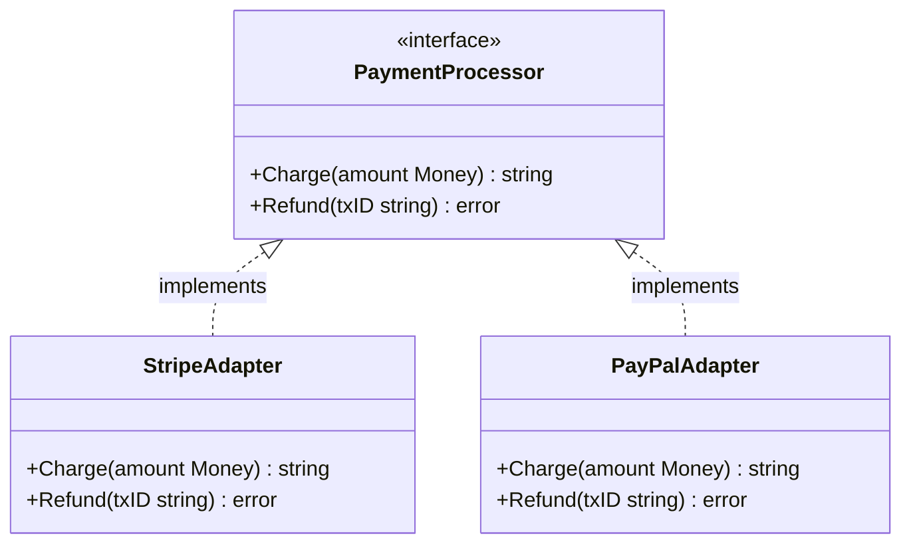
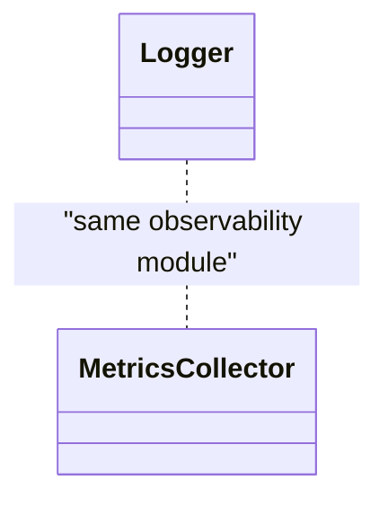
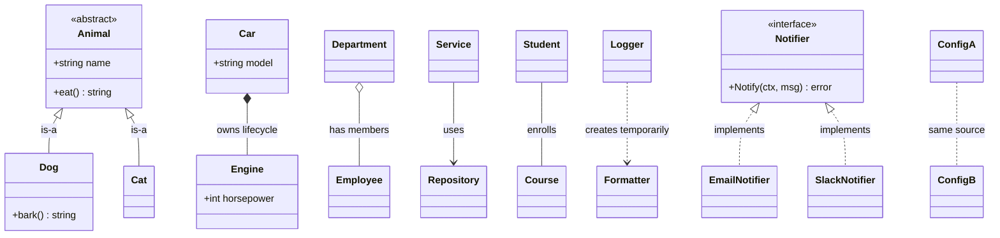

<!-- tags: diagram, class-diagram, uml, relationships -->

# 🔗 8 UML Class Diagram Relationships — Giải thích đầy đủ

> Mỗi mũi tên trong class diagram kể một câu chuyện khác nhau về quyền sở hữu, vòng đời, và sự phụ thuộc giữa các class.

📅 Created: 2026-05-03 · ⏱️ 20 min read

---

## 1. Tổng quan — 8 loại quan hệ



| # | Ký hiệu | Tên | Nét | Đầu mũi tên | Ý nghĩa ngắn |
|---|----------|-----|-----|-------------|---------------|
| 1 | `<\|--` | **Inheritance** | Solid | ▷ tam giác rỗng | B **là một** A (is-a) |
| 2 | `*--` | **Composition** | Solid | ◆ kim cương đặc | D **nằm trong** C, chết theo C |
| 3 | `o--` | **Aggregation** | Solid | ◇ kim cương rỗng | F **thuộc về** E, nhưng sống độc lập |
| 4 | `-->` | **Association** | Solid | → mũi tên thường | H **biết** G, dùng G |
| 5 | `--` | **Link (Solid)** | Solid | không có | I và J **liên quan** nhau (chưa rõ hướng) |
| 6 | `..>` | **Dependency** | Dashed | → mũi tên thường | L **tạm dùng** K (tham số, biến cục bộ) |
| 7 | `..\|>` | **Realization** | Dashed | ▷ tam giác rỗng | N **implement** interface M |
| 8 | `..` | **Link (Dashed)** | Dashed | không có | O và P có **liên hệ yếu** |

> **Quy tắc nhớ nhanh**: Nét liền (solid `--`) = quan hệ cấu trúc bền vững. Nét đứt (dashed `..`) = quan hệ tạm thời hoặc trừu tượng.

---

## 2. Chi tiết từng loại — Giải thích + Code

### 2.1 Inheritance (Kế thừa) — `<|--`

```text
  classA
    ▲
    │  (is-a)
  classB
```

**Ý nghĩa**: B **kế thừa** A. B là một loại đặc biệt của A — nhận toàn bộ thuộc tính và phương thức của A, có thể override.

**Khi nào dùng**: Khi B thực sự **"là một"** A — không phải chỉ "có vẻ giống."



```go
// Go không có inheritance — dùng struct embedding thay thế
// Đây là composition, KHÔNG phải inheritance thực sự

type Animal struct {
    Name string
    Age  int
}

func (a *Animal) Eat()   { fmt.Println(a.Name, "is eating") }
func (a *Animal) Sleep() { fmt.Println(a.Name, "is sleeping") }

// Dog "kế thừa" Animal qua embedding
type Dog struct {
    Animal // ✅ embedded — Dog "có" Animal, promoted methods
}

func (d *Dog) Bark() { fmt.Println(d.Name, "barks!") }

// Cat "kế thừa" Animal qua embedding
type Cat struct {
    Animal
}

func (c *Cat) Purr() { fmt.Println(c.Name, "purrs~") }

func main() {
    dog := Dog{Animal: Animal{Name: "Rex", Age: 3}}
    dog.Eat()   // ✅ promoted from Animal
    dog.Bark()  // ✅ Dog's own method
    // dog.Eat() works because Go promotes Animal.Eat() to Dog
}
```

> ⚠️ **Go trap**: Go embedding là **composition**, không phải inheritance. `Dog` không phải subtype của `Animal` — bạn không thể dùng `Dog` ở chỗ nhận `Animal` (trừ khi qua interface).

---

### 2.2 Composition (Hợp thành) — `*--`

```text
  classC ◆── classD
         "D chết khi C chết"
```

**Ý nghĩa**: D **nằm bên trong** C. Khi C bị xóa, D **bị xóa theo** — không tồn tại độc lập.

**Khi nào dùng**: Khi child không có ý nghĩa nếu thiếu parent. Order bị xóa → OrderLine phải xóa theo.



```go
// Composition: OrderLine chỉ tồn tại trong Order
type Order struct {
    ID     string
    Status string
    Lines  []OrderLine // ✅ Composition — Lines chết khi Order chết
}

type OrderLine struct {
    // ⚠️ Không có ID độc lập khỏi Order
    ProductID string
    Quantity  int
    UnitPrice int
}

func (o *Order) AddLine(productID string, qty, price int) {
    o.Lines = append(o.Lines, OrderLine{
        ProductID: productID,
        Quantity:  qty,
        UnitPrice: price,
    })
}

// Khi Order bị GC thu hồi → Lines cũng bị thu hồi
// Trong DB: orders DELETE CASCADE → order_lines
```

> **Database mapping**: `ON DELETE CASCADE` — đây chính là composition ở tầng SQL.

---

### 2.3 Aggregation (Tập hợp) — `o--`

```text
  classE ◇── classF
         "F sống độc lập khỏi E"
```

**Ý nghĩa**: F **thuộc về** E nhưng **tồn tại độc lập**. Xóa E không nhất thiết xóa F.

**Khi nào dùng**: Khi child có vòng đời riêng. Department bị giải tán → Employee vẫn tồn tại.



```go
// Aggregation: Employee tồn tại độc lập khỏi Department
type Department struct {
    Name      string
    Employees []*Employee // ✅ Pointer — Employee sống ở nơi khác
}

type Employee struct {
    ID    string
    Name  string
    Email string
}

func main() {
    alice := &Employee{ID: "e-1", Name: "Alice", Email: "alice@co.com"}
    bob   := &Employee{ID: "e-2", Name: "Bob", Email: "bob@co.com"}

    engineering := &Department{
        Name:      "Engineering",
        Employees: []*Employee{alice, bob},
    }

    // ⚠️ Xóa Department không xóa Employee
    engineering = nil
    // alice và bob vẫn sống — đây là aggregation
    fmt.Println(alice.Name) // ✅ vẫn "Alice"
}
```

> **So sánh với Composition**: Composition dùng `[]OrderLine` (value, chết theo). Aggregation dùng `[]*Employee` (pointer, sống độc lập).

---

### 2.4 Association (Liên kết có hướng) — `-->`

```text
  classG ←── classH
  "H biết G, H dùng G"
```

**Ý nghĩa**: H **biết** G và **sử dụng** G. Đây là quan hệ "dùng" (uses) ở mức field/property.

**Khi nào dùng**: Khi một class giữ reference tới class khác lâu dài, nhưng không sở hữu vòng đời.



```go
// Association: UserService giữ reference tới UserRepository
type UserRepository struct{}

func (r *UserRepository) FindByID(id string) (*User, error) {
    // query DB...
    return &User{ID: id, Name: "Alice"}, nil
}

type UserService struct {
    repo *UserRepository // ✅ Association — giữ reference lâu dài
}

func (s *UserService) GetUser(id string) (*User, error) {
    return s.repo.FindByID(id) // dùng repo
}
```

---

### 2.5 Link Solid (Liên kết không hướng) — `--`

```text
  classI ─── classJ
  "I và J liên quan nhau"
```

**Ý nghĩa**: I và J có **quan hệ** nhưng chưa xác định rõ hướng hay loại. Đây là dạng chung nhất.

**Khi nào dùng**: Giai đoạn brainstorm, khi biết hai class liên quan nhưng chưa rõ ai dùng ai.



```go
// Link: chưa rõ ai "sở hữu" ai
// Thường là M:N — cần junction table / slice ở cả hai phía

type Student struct {
    ID      string
    Name    string
    Courses []*Course // hoặc []CourseID
}

type Course struct {
    ID       string
    Title    string
    Students []*Student // hoặc []StudentID
}
```

> **Tip**: Link solid thường được refine thành Association, Aggregation, hoặc Composition khi thiết kế chi tiết hơn.

---

### 2.6 Dependency (Phụ thuộc tạm) — `..>`

```text
  classK ◁╌╌ classL
  "L tạm dùng K (parameter, local var)"
```

**Ý nghĩa**: L **tạm thời sử dụng** K — qua tham số hàm, biến cục bộ, hoặc return type. Không giữ reference lâu dài.

**Khi nào dùng**: Khi class chỉ "chạm" class khác thoáng qua — không lưu trong field.



```go
// Dependency: NotificationService tạm dùng EmailTemplate
// KHÔNG giữ EmailTemplate trong field

type EmailTemplate struct{}

func (t *EmailTemplate) Render(data map[string]string) string {
    return fmt.Sprintf("Hello %s!", data["name"])
}

type NotificationService struct {
    // ⚠️ Không có field EmailTemplate — đây là dependency, không phải association
}

func (s *NotificationService) SendWelcome(user User) {
    // ✅ Tạo tạm, dùng xong bỏ — dependency
    tmpl := &EmailTemplate{}
    body := tmpl.Render(map[string]string{"name": user.Name})
    fmt.Println("Sending:", body)
}
```

> **So sánh**: Association = giữ trong field (lâu dài). Dependency = dùng trong method (tạm thời).

---

### 2.7 Realization (Hiện thực hóa interface) — `..|>`

```text
  classM
    ▲
    ┆  (implements)
  classN
```

**Ý nghĩa**: N **implement interface** M. N cam kết thực hiện tất cả method mà M khai báo.

**Khi nào dùng**: Khi muốn thể hiện rằng một concrete class thực hiện một interface/contract.



```go
// Realization: Go interfaces are IMPLICITLY satisfied
// Không cần "implements" keyword

// ✅ Interface (PaymentProcessor) — defined by CONSUMER
type PaymentProcessor interface {
    Charge(ctx context.Context, amount Money) (string, error)
    Refund(ctx context.Context, txID string) error
}

// ✅ Concrete: StripeAdapter implements PaymentProcessor
type StripeAdapter struct {
    apiKey string
}

func (s *StripeAdapter) Charge(ctx context.Context, amount Money) (string, error) {
    // call Stripe API...
    return "txn_stripe_123", nil
}

func (s *StripeAdapter) Refund(ctx context.Context, txID string) error {
    // call Stripe refund API...
    return nil
}

// ✅ Concrete: PayPalAdapter implements PaymentProcessor
type PayPalAdapter struct {
    clientID string
}

func (p *PayPalAdapter) Charge(ctx context.Context, amount Money) (string, error) {
    return "txn_paypal_456", nil
}

func (p *PayPalAdapter) Refund(ctx context.Context, txID string) error {
    return nil
}

// ✅ Compile-time check: đảm bảo implement đúng
var _ PaymentProcessor = (*StripeAdapter)(nil)
var _ PaymentProcessor = (*PayPalAdapter)(nil)
```

> ⚠️ **Go idiom**: Interface được định nghĩa bởi **consumer** (package sử dụng), không phải producer. Đây là điểm khác biệt lớn nhất so với Java/C#.

---

### 2.8 Link Dashed (Liên kết yếu) — `..`

```text
  classO ╌╌╌ classP
  "quan hệ yếu, tạm thời"
```

**Ý nghĩa**: O và P có liên hệ **yếu**, thường là annotation, constraint, hoặc note. Không có hướng rõ ràng.

**Khi nào dùng**: Khi muốn ghi chú rằng hai class có liên quan nhưng không qua code trực tiếp — ví dụ: cùng dùng chung config, cùng thuộc một module.



---

## 3. Bảng so sánh tổng hợp

| Quan hệ | Nét | Vòng đời | Coupling | Go pattern |
|---------|-----|----------|---------|------------|
| **Inheritance** `<\|--` | Solid ▷ | Gắn chặt | Cao nhất | Struct embedding |
| **Composition** `*--` | Solid ◆ | Child chết theo parent | Cao | Value field `[]Child` |
| **Aggregation** `o--` | Solid ◇ | Độc lập | Trung bình | Pointer field `[]*Child` |
| **Association** `-->` | Solid → | Độc lập | Trung bình | Field reference |
| **Link (Solid)** `--` | Solid | Chưa xác định | Thấp | Chưa model |
| **Dependency** `..>` | Dashed → | Tạm thời | Thấp | Parameter / local var |
| **Realization** `..\|>` | Dashed ▷ | Độc lập | Thấp nhất | Interface satisfaction |
| **Link (Dashed)** `..` | Dashed | Yếu | Rất thấp | Annotation / note |

### Spectrum — từ coupling cao → thấp

```text
  Inheritance ▶ Composition ▶ Aggregation ▶ Association ▶ Dependency ▶ Realization
  ━━━━━━━━━━━━━━━━━━━━━━━━━━━━━━━━━━━━━━━━━━━━━━━━━━━━━━━━━━━━━━━━━━━━━━━━━━━━
  TIGHT COUPLING ◄────────────────────────────────────────────► LOOSE COUPLING
  (avoid)                                                       (prefer)
```

> **Go philosophy**: Ưu tiên phía bên phải. Composition over Inheritance. Interface (Realization) over concrete dependency.

---

## 4. Full Executable Example — Tất cả 8 quan hệ trong 1 chương trình

```go
// ============================================================
// Full Example: 8 UML relationships in Go
// Go 1.26+ · Save as main.go · Run: go run main.go
// ============================================================
package main

import (
	"context"
	"fmt"
)

// ─── 1. Inheritance (Embedding) ─────────────────────────────
type Animal struct {
	Name string
}

func (a *Animal) Eat() string { return a.Name + " eats" }

type Dog struct {
	Animal // "inherits" via embedding
}

func (d *Dog) Bark() string { return d.Name + " barks!" }

// ─── 2. Composition (value, dies with parent) ───────────────
type Engine struct {
	Horsepower int
}

type Car struct {
	Model  string
	Engine Engine // ◆ Composition: Engine dies when Car dies
}

// ─── 3. Aggregation (pointer, lives independently) ──────────
type Employee struct {
	Name string
}

type Department struct {
	Name      string
	Employees []*Employee // ◇ Aggregation: employees survive dept deletion
}

// ─── 4. Association (long-lived reference) ──────────────────
type Repository struct{}

func (r *Repository) Find(id string) string {
	return "User:" + id
}

type Service struct {
	repo *Repository // → Association: holds reference
}

func (s *Service) Get(id string) string {
	return s.repo.Find(id)
}

// ─── 5. Link Solid (undirected relationship) ────────────────
type Student struct{ Name string }
type Course struct{ Title string }

// Both know each other — direction unclear at design time

// ─── 6. Dependency (temporary use) ──────────────────────────
type Formatter struct{}

func (f *Formatter) Format(s string) string {
	return "[LOG] " + s
}

type Logger struct{}

// Logger TEMPORARILY uses Formatter — dependency, not association
func (l *Logger) Log(msg string) {
	f := &Formatter{} // ✅ created locally, not stored as field
	fmt.Println(f.Format(msg))
}

// ─── 7. Realization (interface implementation) ──────────────
type Notifier interface {
	Notify(ctx context.Context, msg string) error
}

type EmailNotifier struct{ From string }

func (e *EmailNotifier) Notify(_ context.Context, msg string) error {
	fmt.Printf("📧 Email from %s: %s\n", e.From, msg)
	return nil
}

type SlackNotifier struct{ Channel string }

func (s *SlackNotifier) Notify(_ context.Context, msg string) error {
	fmt.Printf("💬 Slack #%s: %s\n", s.Channel, msg)
	return nil
}

// Compile-time interface check
var _ Notifier = (*EmailNotifier)(nil)
var _ Notifier = (*SlackNotifier)(nil)

// ─── 8. Link Dashed (weak/annotation relationship) ──────────
// ConfigA and ConfigB share a YAML source but no code link
type ConfigA struct{ Port int }
type ConfigB struct{ Debug bool }

// No direct code relationship — just conceptual grouping

// ─── main: demonstrate all 8 ────────────────────────────────
func main() {
	fmt.Println("=== 1. Inheritance (Embedding) ===")
	dog := Dog{Animal: Animal{Name: "Rex"}}
	fmt.Println(dog.Eat())  // promoted
	fmt.Println(dog.Bark()) // own method

	fmt.Println("\n=== 2. Composition ===")
	car := Car{Model: "Tesla", Engine: Engine{Horsepower: 450}}
	fmt.Printf("%s has %d HP engine\n", car.Model, car.Engine.Horsepower)
	// car = nil → engine gone too

	fmt.Println("\n=== 3. Aggregation ===")
	alice := &Employee{Name: "Alice"}
	dept := &Department{Name: "Eng", Employees: []*Employee{alice}}
	fmt.Printf("Dept %s has %d employees\n", dept.Name, len(dept.Employees))
	dept = nil // alice still alive
	fmt.Println("After dept deleted, alice:", alice.Name)

	fmt.Println("\n=== 4. Association ===")
	svc := &Service{repo: &Repository{}}
	fmt.Println(svc.Get("42"))

	fmt.Println("\n=== 5. Link (Solid) ===")
	s := Student{Name: "Bob"}
	c := Course{Title: "CS301"}
	fmt.Printf("%s enrolls in %s\n", s.Name, c.Title)

	fmt.Println("\n=== 6. Dependency ===")
	logger := &Logger{}
	logger.Log("server started")

	fmt.Println("\n=== 7. Realization ===")
	notifiers := []Notifier{
		&EmailNotifier{From: "noreply@app.com"},
		&SlackNotifier{Channel: "alerts"},
	}
	for _, n := range notifiers {
		n.Notify(context.Background(), "deploy complete")
	}

	fmt.Println("\n=== 8. Link (Dashed) ===")
	a := ConfigA{Port: 8080}
	b := ConfigB{Debug: true}
	fmt.Printf("ConfigA.Port=%d, ConfigB.Debug=%v (same YAML source)\n", a.Port, b.Debug)
}
```

**Output:**

```text
=== 1. Inheritance (Embedding) ===
Rex eats
Rex barks!

=== 2. Composition ===
Tesla has 450 HP engine

=== 3. Aggregation ===
Dept Eng has 1 employees
After dept deleted, alice: Alice

=== 4. Association ===
User:42

=== 5. Link (Solid) ===
Bob enrolls in CS301

=== 6. Dependency ===
[LOG] server started

=== 7. Realization ===
📧 Email from noreply@app.com: deploy complete
💬 Slack #alerts: deploy complete

=== 8. Link (Dashed) ===
ConfigA.Port=8080, ConfigB.Debug=true (same YAML source)
```

---

## 5. Mermaid Full Diagram — Tất cả 8 quan hệ


