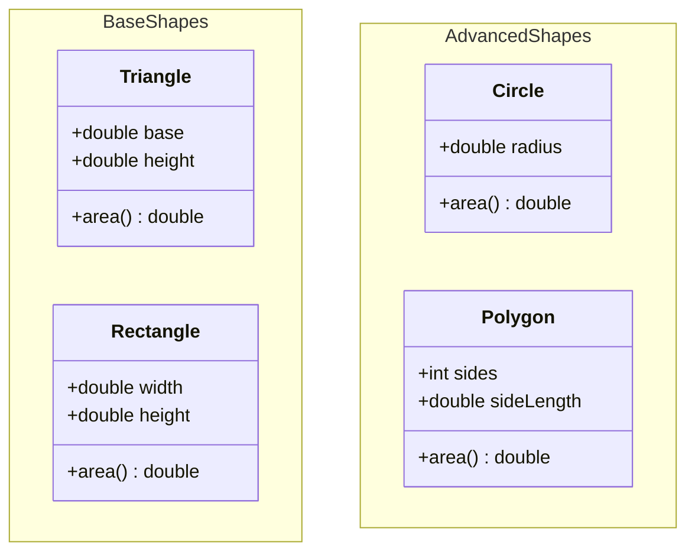
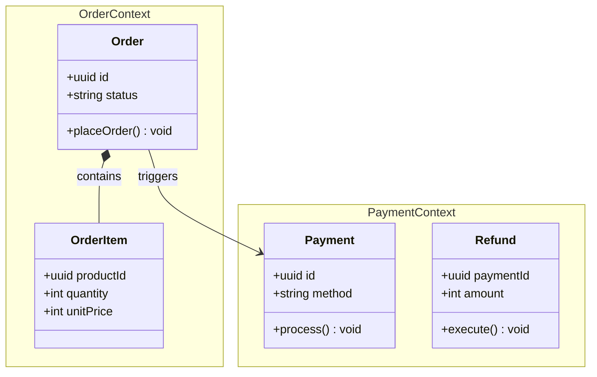
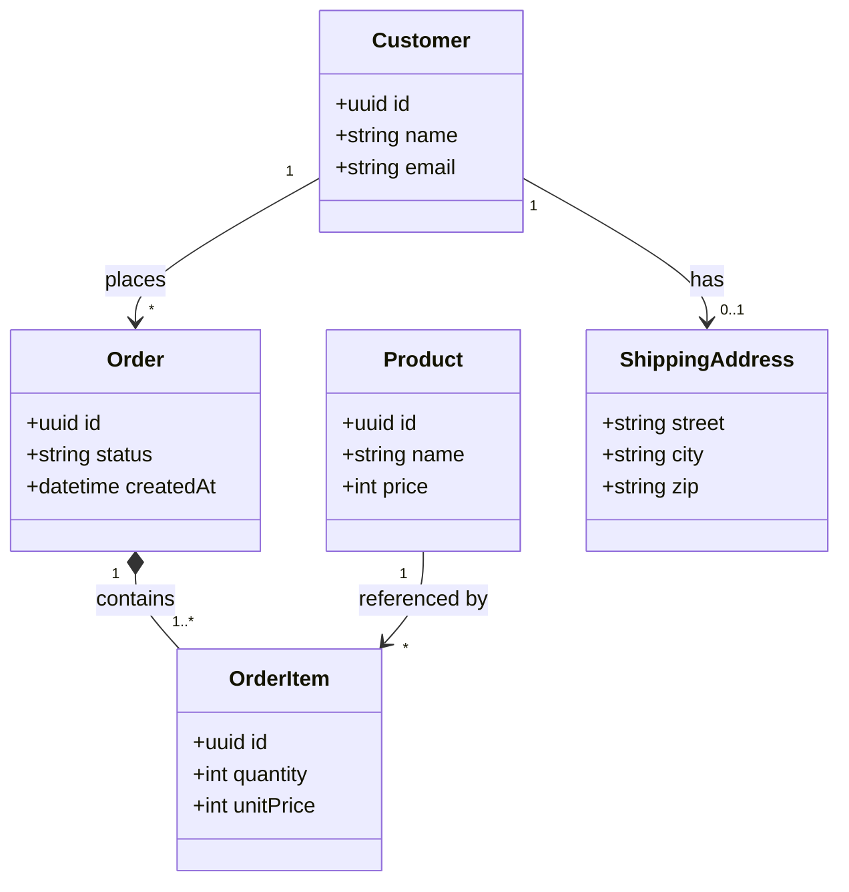
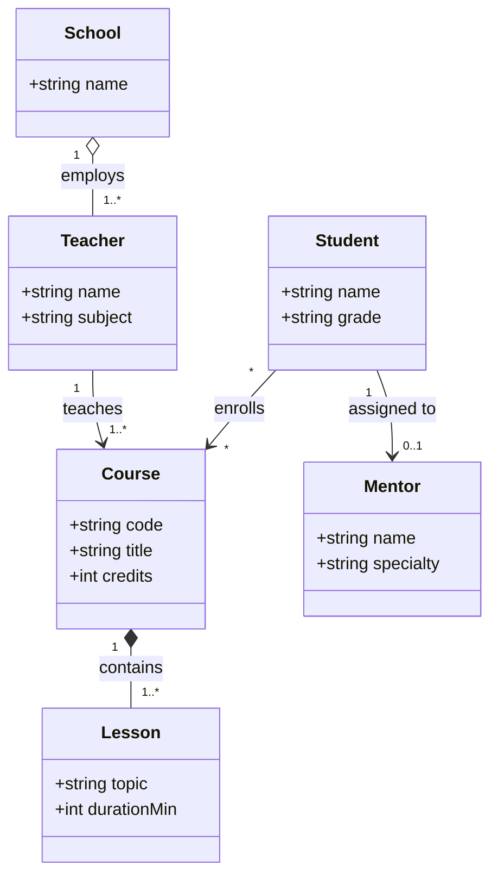
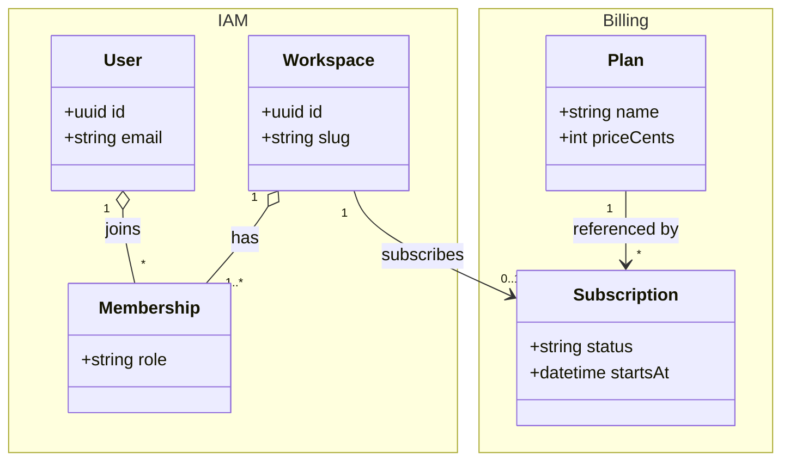
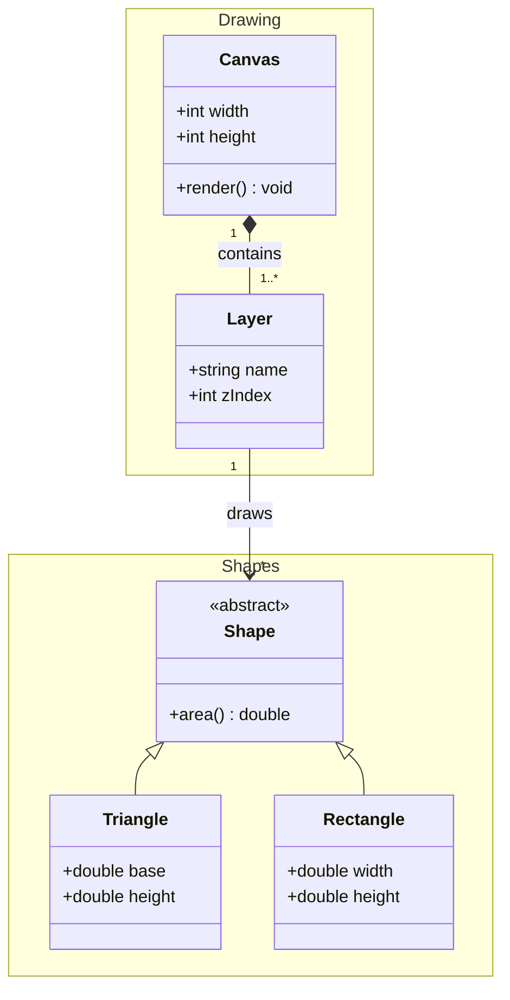

<!-- tags: diagram, class-diagram, uml, namespace, cardinality -->

# 📦 Namespace & Cardinality trong UML Class Diagram

> Namespace gom class theo nhóm logic. Cardinality nói rõ "bao nhiêu" — con số mà mũi tên một mình không thể diễn đạt.

📅 Created: 2026-05-03 · ⏱️ 15 min read

---

## 1. Namespace — Nhóm class theo ngữ cảnh

### 1.1 Namespace là gì?

Hình dung bạn có 20 class trong một diagram. Không nhóm → người đọc phải tự đoán class nào thuộc module nào. **Namespace** là cách vẽ một đường viền bao quanh các class liên quan, đặt tên cho nhóm đó.

Trong Mermaid, namespace tạo ra một **visual group** — giống package trong Go hoặc module trong Java.

### 1.2 Cú pháp

```text
namespace <TênNhóm> {
    class ClassA
    class ClassB {
        type field1
        type field2
    }
}
```

### 1.3 Ví dụ: Nhóm hình học



*Figure: Hai namespace — BaseShapes chứa hình cơ bản, AdvancedShapes chứa hình nâng cao.*

### 1.4 Ví dụ thực tế: E-commerce domain



*Figure: Namespace tách rõ bounded context — OrderContext vs PaymentContext. Quan hệ cross-namespace cho thấy integration point.*

### 1.5 Mapping sang Go

```go
// Namespace trong Go = Package

// ── package order ──────────────────
package order

type Order struct {
    ID     string
    Status string
    Items  []OrderItem  // ◆ Composition — trong cùng namespace
}

type OrderItem struct {
    ProductID string
    Quantity  int
    UnitPrice int
}

// ── package payment ────────────────
package payment

type Payment struct {
    ID     string
    Method string  // "card" | "bank" | "wallet"
}

type Refund struct {
    PaymentID string
    Amount    int
}
```

> **Insight**: Mỗi namespace trong diagram nên map 1:1 với một Go package. Nếu hai namespace share quá nhiều class → có thể chúng thực ra là cùng một bounded context.

---

## 2. Cardinality / Multiplicity — "Bao nhiêu?"

### 2.1 Vấn đề

Bạn vẽ `Company --> Employee`. Nhưng diagram này không trả lời được:
- Một Company có **bao nhiêu** Employee? 1? 100? 0?
- Một Employee thuộc về **bao nhiêu** Company? Đúng 1? Hay có thể 0?

**Cardinality** là con số đặt ở hai đầu mũi tên, trả lời chính xác câu hỏi "bao nhiêu."

### 2.2 Bảng 7 ký hiệu

| Ký hiệu | Ý nghĩa | Ví dụ thực tế |
|----------|----------|---------------|
| `1` | Đúng 1, bắt buộc | Mỗi Order có đúng 1 Customer |
| `0..1` | Không hoặc 1 (optional) | User có thể có hoặc không có Profile |
| `1..*` | 1 hoặc nhiều (ít nhất 1) | Order phải có ít nhất 1 OrderItem |
| `*` | Nhiều (0 hoặc nhiều) | Product có thể có 0 hoặc nhiều Review |
| `n` | Đúng n (n > 1) | Xe có đúng 4 Wheel |
| `0..n` | 0 đến n | Team có tối đa 10 Member |
| `1..n` | 1 đến n | Course cần 1-30 Student |

### 2.3 Cú pháp Mermaid

```text
[ClassA] "cardinality1" [Arrow] "cardinality2" [ClassB] : LabelText

Đọc: "Mỗi ClassA liên kết với cardinality2 ClassB"
      "Mỗi ClassB liên kết với cardinality1 ClassA"
```

> ⚠️ **Cardinality đặt trong dấu ngoặc kép `""`** — đặt trước hoặc sau mũi tên.

### 2.4 Ví dụ 1: E-commerce cơ bản



**Đọc diagram này:**

| Quan hệ | Đọc là |
|---------|--------|
| `Customer "1" --> "*" Order` | 1 Customer đặt 0 hoặc nhiều Order. Mỗi Order thuộc về đúng 1 Customer |
| `Order "1" *-- "1..*" OrderItem` | 1 Order chứa ít nhất 1 OrderItem (composition). Mỗi OrderItem thuộc về đúng 1 Order |
| `Product "1" --> "*" OrderItem` | 1 Product được tham chiếu bởi 0 hoặc nhiều OrderItem |
| `Customer "1" --> "0..1" ShippingAddress` | 1 Customer có thể có hoặc không có ShippingAddress |

### 2.5 Ví dụ 2: School Management



**Đọc:**
- School **1 : 1..*** Teacher → Trường có ít nhất 1 giáo viên (aggregation — giáo viên sống độc lập)
- Student **\* : \*** Course → Nhiều-nhiều — cần junction table `enrollments`
- Student **1 : 0..1** Mentor → Sinh viên có thể chưa được assign mentor

### 2.6 Ví dụ 3: SaaS multi-tenant



*Figure: Namespace + Cardinality cùng lúc — IAM và Billing tách rõ, cardinality trả lời mọi câu hỏi về multiplicity.*

---

## 3. Go Code — Cardinality thể hiện trong struct

```go
// ============================================================
// Full Example: Cardinality in Go structs
// Go 1.26+ · Save as main.go · Run: go run main.go
// ============================================================
package main

import "fmt"

// ── "1" — Exactly one (bắt buộc, value type) ───────────────
// Mỗi Order có đúng 1 Customer
type Customer struct {
	ID    string
	Name  string
	Email string
}

// ── "0..1" — Zero or one (optional, pointer) ───────────────
// Customer có thể có hoặc không có ShippingAddress
type ShippingAddress struct {
	Street string
	City   string
	Zip    string
}

// ── "1..*" — One or more (slice, validate len >= 1) ────────
// Order phải có ít nhất 1 item
type OrderItem struct {
	ProductID string
	Quantity  int
	UnitPrice int
}

// ── "*" — Zero or many (slice, có thể rỗng) ────────────────
type Review struct {
	Rating  int
	Comment string
}

type Product struct {
	ID      string
	Name    string
	Price   int
	Reviews []Review // ✅ "*" — có thể 0 review
}

type Order struct {
	ID         string
	CustomerID string          // ✅ "1" — bắt buộc, không nil
	Status     string
	Items      []OrderItem     // ✅ "1..*" — ít nhất 1
	Address    *ShippingAddress // ✅ "0..1" — pointer = optional
}

// ── Validate cardinality at construction ────────────────────
func NewOrder(customerID string, items []OrderItem, addr *ShippingAddress) (*Order, error) {
	if customerID == "" {
		return nil, fmt.Errorf("customerID is required (cardinality: 1)")
	}
	if len(items) == 0 {
		return nil, fmt.Errorf("at least 1 item required (cardinality: 1..*)")
	}
	// addr có thể nil — cardinality 0..1 ✅
	return &Order{
		ID:         "ord-1",
		CustomerID: customerID,
		Status:     "draft",
		Items:      items,
		Address:    addr,
	}, nil
}

func main() {
	// ✅ Valid: 1 customer, 2 items, no address (0..1)
	order, err := NewOrder("cust-1", []OrderItem{
		{ProductID: "p-1", Quantity: 2, UnitPrice: 1999},
		{ProductID: "p-2", Quantity: 1, UnitPrice: 4999},
	}, nil)
	if err != nil {
		fmt.Println("Error:", err)
		return
	}
	fmt.Printf("Order %s: %d items, address: %v\n",
		order.ID, len(order.Items), order.Address)

	// ❌ Invalid: 0 items — violates "1..*"
	_, err = NewOrder("cust-1", []OrderItem{}, nil)
	fmt.Println("Validation:", err)

	// ❌ Invalid: no customer — violates "1"
	_, err = NewOrder("", []OrderItem{{ProductID: "p-1", Quantity: 1, UnitPrice: 999}}, nil)
	fmt.Println("Validation:", err)
}
```

**Output:**

```text
Order ord-1: 2 items, address: <nil>
Validation: at least 1 item required (cardinality: 1.*)
Validation: customerID is required (cardinality: 1)
```

### Cardinality → Go Type Mapping

| Cardinality | Go Type | Validation |
|-------------|---------|------------|
| `1` | `string`, `int`, value type | `!= ""` / `!= 0` — bắt buộc |
| `0..1` | `*Type` (pointer) | Cho phép `nil` |
| `1..*` | `[]Type` | `len() >= 1` |
| `*` | `[]Type` | Cho phép `len() == 0` |
| `n` | `[n]Type` (array) | Compile-time fixed |
| `0..n` | `[]Type` | `len() <= n` |
| `1..n` | `[]Type` | `1 <= len() <= n` |

---

## 4. Namespace + Cardinality kết hợp — Full diagram



*Figure: Namespace chia domain thành Shapes và Drawing. Cardinality cho biết: Canvas phải có ít nhất 1 Layer, mỗi Layer vẽ 0 hoặc nhiều Shape.*

---

## 5. Pitfalls

| # | Sai lầm | Hậu quả | Fix |
|---|---------|---------|-----|
| 1 | Không ghi cardinality | Team tranh cãi 1:N vs M:N | Luôn ghi số ở cả hai đầu |
| 2 | Quên `"dấu ngoặc kép"` trong Mermaid | Syntax error, diagram không render | `"1" --> "*"` — nhớ quote |
| 3 | Namespace quá lớn (> 10 class) | Mất tác dụng nhóm | Tách thành nhiều namespace nhỏ |
| 4 | Nhầm `1..*` với `*` | Cho phép 0 item trong Order | `1..*` = bắt buộc ít nhất 1 |
