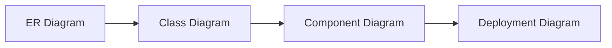

<!-- tags: overview -->
# Structural Diagrams

> Lane for diagrams that describe static structure: data, classes, components, deployment.

| Aspect | Detail |
| --- | --- |
| **Concept** | Navigation hub for `Structural Diagrams` |
| **Audience** | Backend engineer, architect, reviewer |
| **Primary style** | Concept-First router |
| **Entry point** | Open when the pain point is about boundary, dependency, or data shape. |

📅 Updated: 2026-04-20 · ⏱️ 6 min read

---

## 1. DEFINE

Picture reviewing a system where the code runs fine, but nobody is sure which module truly depends on which, or which tables the data flows through. Structural diagrams exist to lock down the static picture before runtime makes everything more confusing.

This hub does not replace individual articles. It exists to route you to the correct lane before you wander into tools, syntax, or a specific diagram type.

### Signals & Boundaries

- Open this hub when you know the problem lives inside `Structural Diagrams` but are unsure which article to read first.
- Use the coverage map to route by pain point instead of file order.
- Return to this hub after each article to choose the next step with intention.

### Coverage Map

| Entry | Role |
| --- | --- |
| [ER Diagram](01-er-diagram.md) | Entry point for lane `ER Diagram` |
| [Class Diagram](02-class-diagram.md) | Entry point for lane `Class Diagram` |
| [Component Diagram](03-component-diagram.md) | Entry point for lane `Component Diagram` |
| [Deployment Diagram](04-deployment-diagram.md) | Entry point for lane `Deployment Diagram` |

---

## 2. VISUAL

### Static Structure Progression

Four diagram types form a natural zoom progression: from data shape (ER) through object model (Class) and module boundary (Component) to runtime topology (Deployment). The image below shows each type with a simplified visual signature so you can identify which one matches your current problem.


*Image: The progression moves from data to deployment. If you are confused about which to draw first, start at ER and zoom outward — each subsequent diagram adds a layer of physical reality.*

### Preview UI



*Figure: Structural diagrams progress from data shape (ER) through object model (Class) and module boundary (Component) to runtime topology (Deployment).*

### Level 1

```text
start from your current pain point
  -> ER Diagram         (data ownership, cardinality)
  -> Class Diagram      (object relationships, interfaces)
  -> Component Diagram  (module boundary, dependency direction)
  -> Deployment Diagram (runtime topology, network path)
```

*Figure: This hub works as a router, not a catalog to scroll through.*

### Level 2

```text
read the right lane  -> terminology connects, progress compounds
read the wrong lane  -> more keywords, less understanding
```

*Figure: The real value of a README router is keeping the reader on the right path from the start.*

---

## 3. CODE

The flowchart above identified the routing rhythm. The artifact below turns this hub into a short worksheet for choosing the right entry point.

### Mermaid Practice Block

````md

````

### Problem 1: Basic — Route the lane before reading deep

> **Goal**: Prevent study or review from drifting into "open whichever article looks interesting."
> **Approach**: Choose a lane by pain point.
> **Example**: Selecting the right cluster inside `Structural Diagrams`.
> **Complexity**: Basic

```yaml
router:
  module: Structural Diagrams
  rule: "choose by pain point, not by familiar name"
  suggested_path:
  - 01-er-diagram.md
  - 02-class-diagram.md
  - 03-component-diagram.md
  - 04-deployment-diagram.md
```

This artifact does not solve the problem for the reader. It trims the wrong lanes before time is burned on articles that do not serve the current goal.

---

## 4. PITFALLS

| # | Severity | Mistake | Consequence | Fix |
| --- | --- | --- | --- | --- |
| 1 | 🔴 Fatal | Reading by file order instead of routing by pain point | Accumulates terminology without solving the real problem | Use the coverage map before opening a detail article |
| 2 | 🟡 Common | Treating the README as a pure link catalog | Loses the hub's routing purpose | Always ask "which lane matches my current pain?" |
| 3 | 🔵 Minor | Finishing an article without returning to the hub | Jumps to an adjacent article by instinct | Return to the README to pick the next step deliberately |

---

## 5. REF

| Resource | Type | Link | Notes |
| --- | --- | --- | --- |
| Mermaid ER diagram | Official docs | https://mermaid.js.org/syntax/entityRelationshipDiagram.html | ERD in docs repos |
| Mermaid class diagram | Official docs | https://mermaid.js.org/syntax/classDiagram.html | Object model and relationships |
| PlantUML component/class docs | Official docs | https://plantuml.com/guide | Deeper structural notation when needed |

## 6. RECOMMEND

| Next step | When | Reason | File/Link |
| --- | --- | --- | --- |
| ER Diagram | When your pain point matches this lane | Continue into the right cluster | [ER Diagram](01-er-diagram.md) |
| Class Diagram | When your pain point matches this lane | Continue into the right cluster | [Class Diagram](02-class-diagram.md) |
| Component Diagram | When your pain point matches this lane | Continue into the right cluster | [Component Diagram](03-component-diagram.md) |
