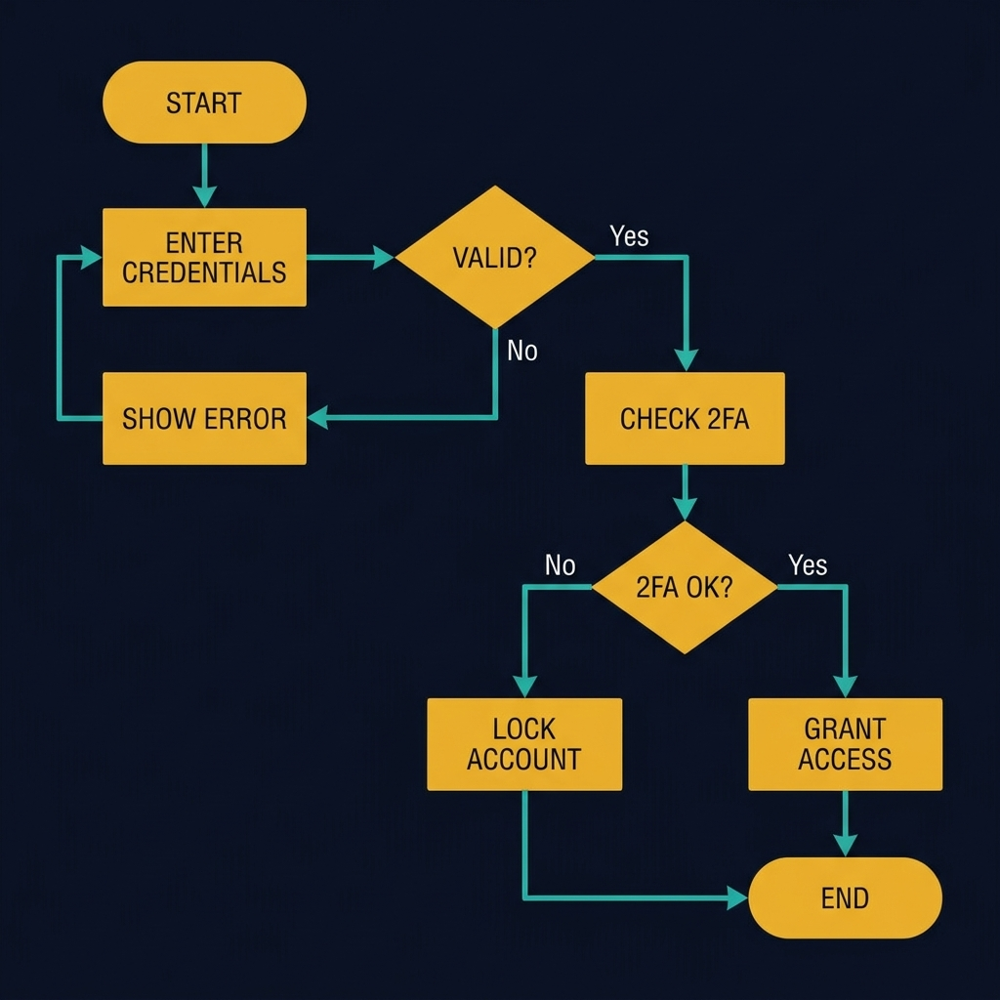
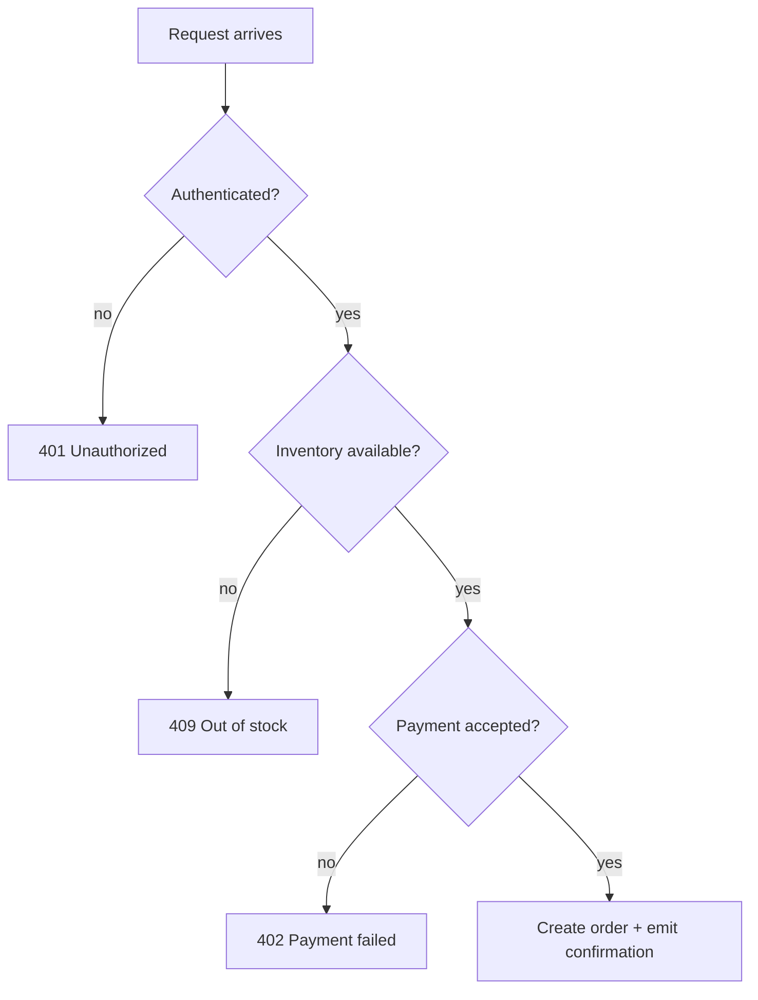
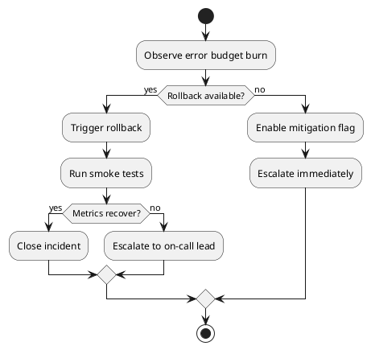
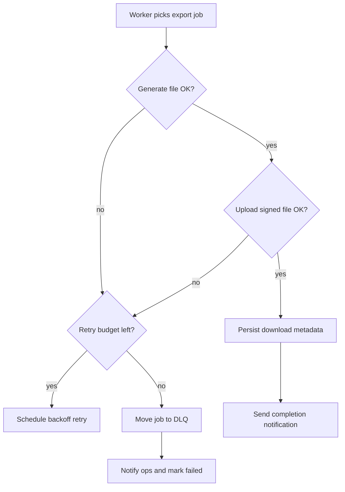

<!-- tags: diagram, reference -->
# 🪜 Flowchart

> Flowcharts fit best when the question is "what happens next?" or "if condition X, which branch?"

📅 Created: 2026-03-31 · 🔄 Updated: 2026-04-20 · ⏱️ 13 min read

| Aspect | Detail |
| ------ | ------ |
| **Focus** | Step-by-step decision flow |
| **When to use** | When you need to describe control flow or a business process |
| **Related** | API workflow, product flow, runbook |

---

## 1. DEFINE

You are describing a flow with many decision branches, but the more you explain in words, the easier it is to miss a condition or an exit step. Flowcharts are built for exactly this "if-then-branch" logic.

| Variant | When to use | Scope |
| ------- | ----------- | ----- |
| Happy-path flow | Simple process with few branches | Linear process |
| Decision-heavy flow | Many branches and conditions | Validation, approval, retry |
| Operational runbook flow | Incident response or manual process | Escalation, rollback, fallback |

**Core insight**:
- Flowcharts are stronger than sequence diagrams when the focus is a decision tree rather than actor interaction.
- They work well for business and engineering to review the same artifact because branch logic is highly visual.
- When a flow has too many branches, split happy path and error path instead of cramming everything into one diagram.

Those failure modes sound familiar. But there is a trap: too many decision nodes in one diagram causes the reader to lose the main branch. That trap appears in PITFALLS.

## 2. VISUAL

### Flowchart Example

The image below shows a login flow rendered as a proper flowchart. Two decision diamonds drive three possible outcomes: grant access, show error (loop), or lock account.



*Image: A flowchart without a decision diamond is just a sequence list. The diamond forces you to name the branch condition, which is where the real complexity lives.*

### Preview UI



*Figure: A checkout validation flow — each decision node gates the next step. The reader sees every exit path at a glance.*

```text
Start -> Validate -> Decision? -> Success / Retry / Fail

Best when you need to see branch logic rather than lifelines over time.
```

## 3. CODE

### Mermaid Practice Block

````md

````

### Example 1: Basic — Request validation flow

> **Goal**: Describe the branch logic of an API endpoint.
> **Approach**: Use decision nodes for validation, auth, rate limiting.
> **Example**: `POST /checkout must pass auth, inventory, payment, confirmation.`


> **Conclusion**: Flowcharts are ideal for reviewing branch logic with PM or QA because the diagram reads close to a business narrative.

### Example 2: Intermediate — Runbook rollback flow

> **Goal**: Turn incident response into an artifact easy to follow under pressure.
> **Approach**: Use a flowchart for rollback, health check, escalation.
> **Example**: `New deploy causes p95 spike after 5 minutes.`



> **Conclusion**: Using a flowchart for runbooks beats long prose because during an incident, the reader needs direction fast.

### Example 3: Advanced — Export pipeline with retry, DLQ, and escalation

> **Goal**: Elevate a flowchart from basic branch logic to an operational workflow with clear retry policy.
> **Approach**: Use decision nodes for retry budget, dead letter, and human escalation instead of cramming everything into a sequence diagram.
> **Example**: `Background export job fails when uploading to object storage.`



> **Conclusion**: When the problem centers on branch logic, retry, and escalation, a flowchart is lightweight yet highly effective for review with both engineering and operations.

## 4. PITFALLS

| # | Mistake | Consequence | Fix |
|---|---------|-------------|-----|
| 1 | Too many decision nodes in one diagram | Reader loses the main branch | Split happy path and exception path |
| 2 | Vague condition labels | Cannot tell what yes/no is based on | Write specific, measurable conditions |
| 3 | Using flowchart for multi-actor interaction | Missing lifelines over time | Switch to sequence if the focus is who calls whom |

## 5. REF

| Resource | Link |
| -------- | ---- |
| Mermaid flowchart | https://mermaid.js.org/syntax/flowchart.html |
| PlantUML activity/flow | https://plantuml.com/activity-diagram-beta |

## 6. RECOMMEND

| Next step | When | Reason |
| --------- | ---- | ------ |
| Sequence diagram | When branches are not enough and you need actor interaction over time | Solves the runtime order question |
| Activity diagram | When you want to represent parallel workflow more clearly | Stronger than flowchart at concurrency |
| Planning diagrams | When this flow is for a delivery process | Connect to Gantt or git graph |

---

**Links**: ← Previous · [→ Next](./02-sequence-diagram.md)
