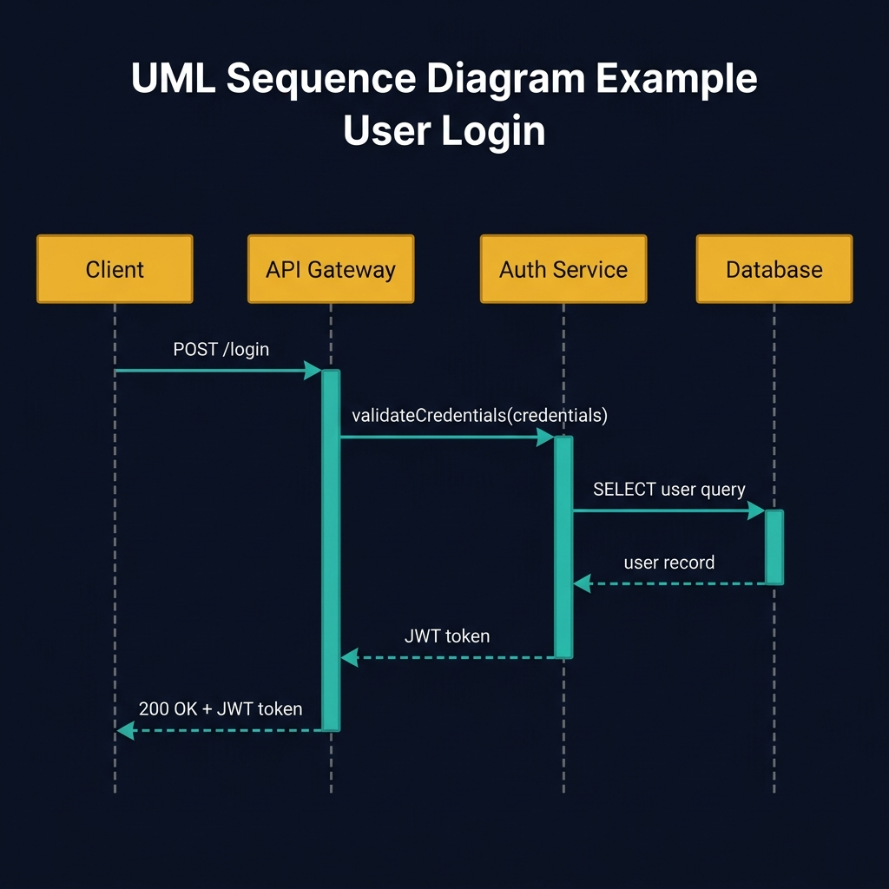
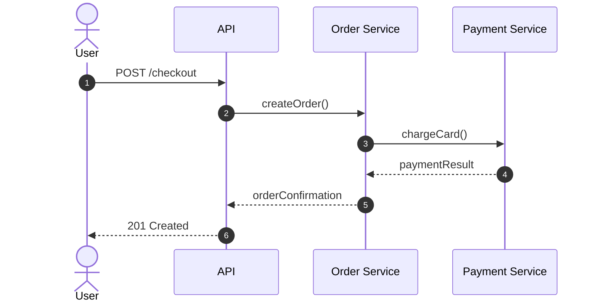
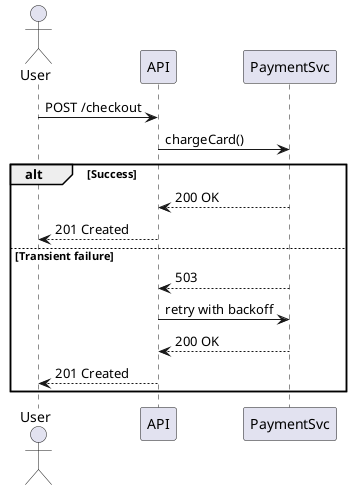
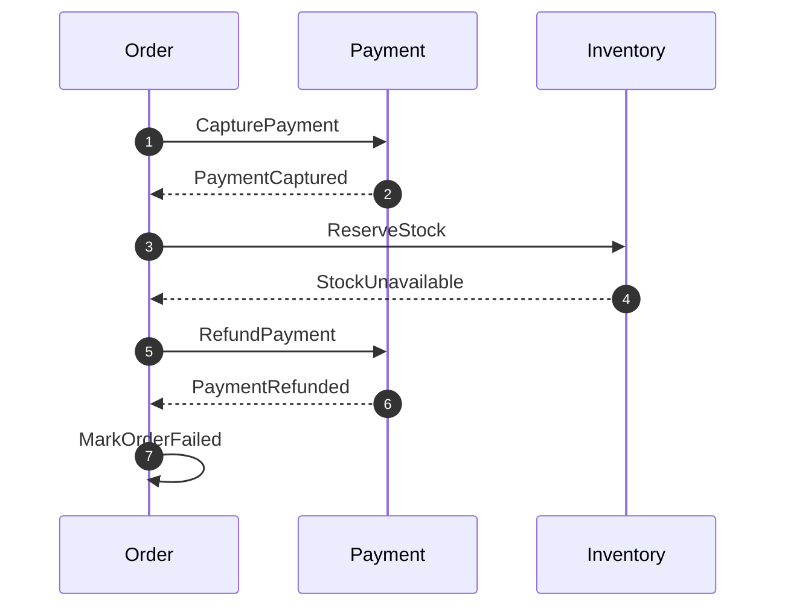

<!-- tags: diagram, reference -->
# 📨 Sequence Diagram

> Sequence diagrams work best when you need to trace who calls whom, in what order, and what comes back.

📅 Created: 2026-03-31 · 🔄 Updated: 2026-04-20 · ⏱️ 14 min read

| Aspect | Detail |
| ------ | ------ |
| **Focus** | Runtime message flow |
| **When to use** | When you need to describe call chains, retries, and callbacks between actors |
| **Related** | API debugging, distributed systems, microservices |

---

## 1. DEFINE

You are debugging a request that crosses three services and two retries, but logs only give scattered fragments. A sequence diagram pulls the entire conversation onto one timeline so you see the full picture.

| Variant | When to use | Scope |
| ------- | ----------- | ----- |
| Happy-path sequence | Single request/response | Basic API call |
| Error-handling sequence | Retries, timeouts, fallback | Failure behavior |
| Multi-service orchestration | Saga, callback, async | Distributed workflow |

**Core insight**:
- Sequence diagrams complement flowcharts: flowcharts show decision branches, sequences show actor interaction over time.
- If a flow involves multiple services with retries and callbacks, sequence is the right choice.
- Keep one sequence diagram per use case. Cramming multiple flows into one diagram makes lifelines unreadable.

Those failure modes sound familiar. But there is a trap: drawing every internal function call as a message turns the diagram into a code trace. That trap appears in PITFALLS.

## 2. VISUAL

### Sequence Diagram Example

The image below shows a login sequence with four participants: Client, API Gateway, Auth Service, and Database. The vertical lifelines track who is active at each moment, and the horizontal arrows show the exact order of calls.



*Image: A sequence diagram without activation boxes hides who is blocking whom. The colored bars on the lifelines reveal which service is waiting, which is the key to finding latency bottlenecks.*

### Preview UI



*Figure: A checkout sequence showing the exact call chain — who initiates, who processes, and what returns. Each arrow is one message on the timeline.*

```text
User -> API -> Order Service -> Payment Service
         <-- paymentResult <-- orderConfirmation <-- 201
```

## 3. CODE

### Mermaid Practice Block

````md

````

### Example 1: Basic — Simple API call chain

> **Goal**: Trace the happy path of a single API request across services.
> **Approach**: Show each service as a lifeline and each call as a labeled arrow.
> **Example**: `POST /checkout triggers order creation and payment capture.`


> **Conclusion**: Even this simple sequence immediately reveals that the API is synchronous end-to-end — a design choice the team should review.

### Example 2: Intermediate — Retry and timeout handling

> **Goal**: Show how the system handles transient failures.
> **Approach**: Add alt/opt blocks for error paths.
> **Example**: `Payment service returns 503; API retries with backoff.`



> **Conclusion**: Adding error branches makes the sequence diagram the single artifact that both engineering and QA can review for failure behavior.

### Example 3: Advanced — Async saga with compensation

> **Goal**: Show an event-driven saga where failure triggers compensation across services.
> **Approach**: Use async messages and compensation arrows.
> **Example**: `Order placed -> payment captured -> inventory reserved. If inventory fails, compensate payment.`



> **Conclusion**: An advanced sequence diagram reveals the exact compensation chain — without it, the team would debate failure handling in abstract terms.

## 4. PITFALLS

| # | Mistake | Consequence | Fix |
|---|---------|-------------|-----|
| 1 | Drawing every internal function call as a message | Diagram becomes a code trace, not a design artifact | Keep messages at service/module boundary |
| 2 | Mixing sync and async without notation | Reader cannot tell what blocks and what fires-and-forgets | Use solid arrows for sync, dashed for async |
| 3 | Cramming multiple use cases into one diagram | Lifelines become unreadable | One diagram per use case |

## 5. REF

| Resource | Link |
| -------- | ---- |
| Mermaid sequence diagram | https://mermaid.js.org/syntax/sequenceDiagram.html |
| PlantUML sequence diagram | https://plantuml.com/sequence-diagram |

## 6. RECOMMEND

| Next step | When | Reason |
| --------- | ---- | ------ |
| State diagram | When you need to see entity lifecycle alongside runtime order | Connect call chain with state transitions |
| Component diagram | When you want to zoom out from calls to module boundaries | See dependency direction |
| Auth flow patterns | When the sequence involves authentication or authorization | Apply directly to security review |

---

**Links**: [← Previous](./01-flowchart.md) · [→ Next](./03-state-diagram.md)
