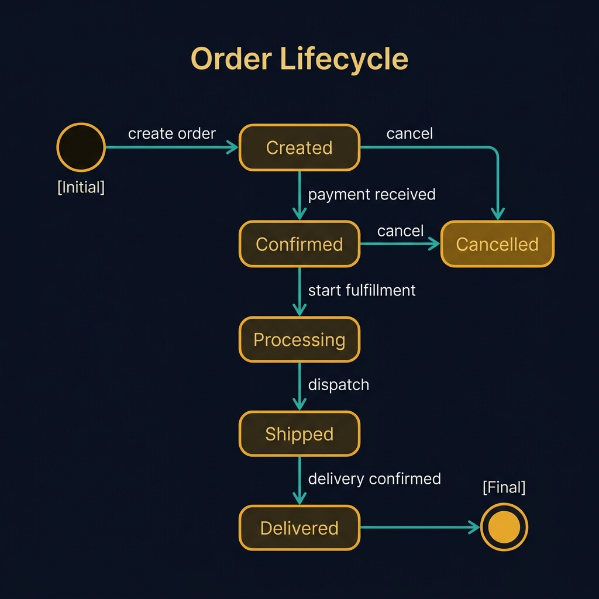
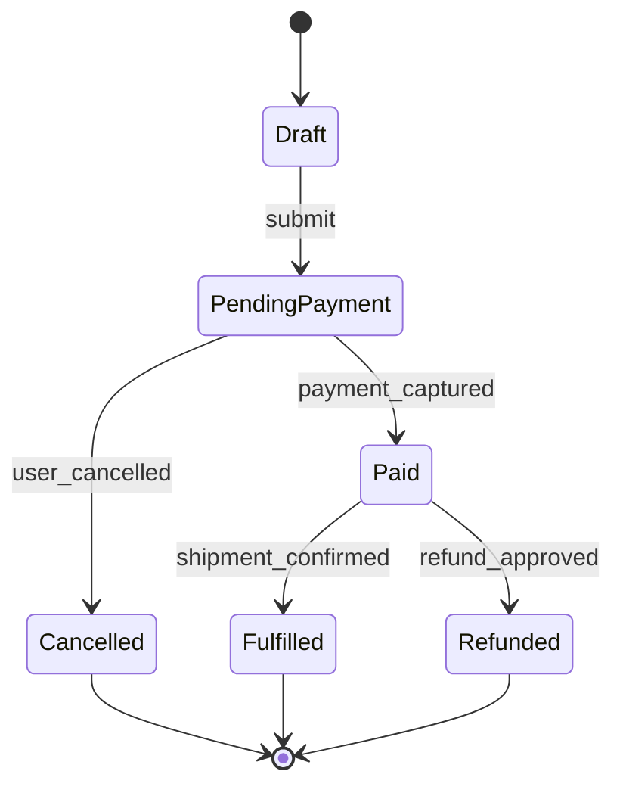
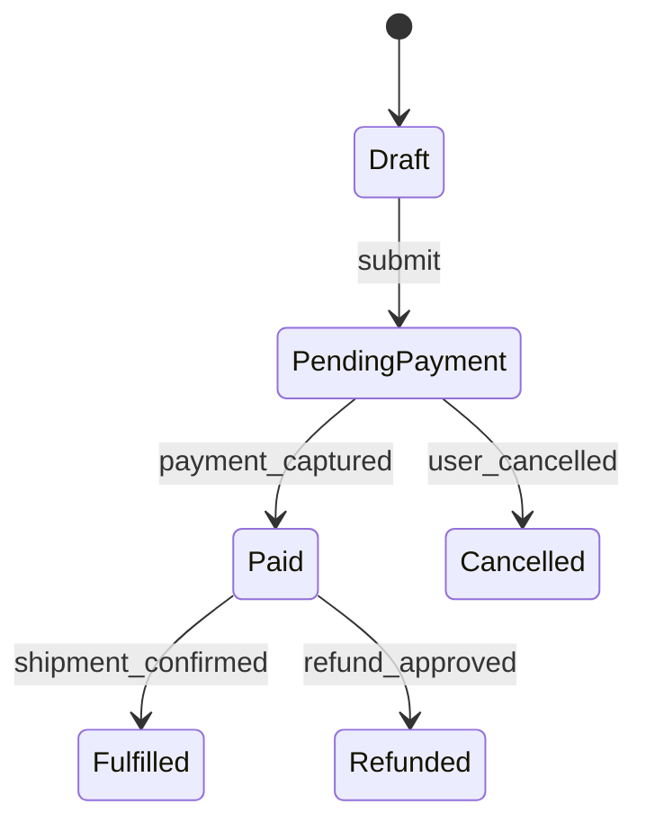
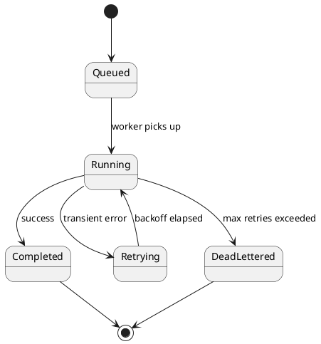
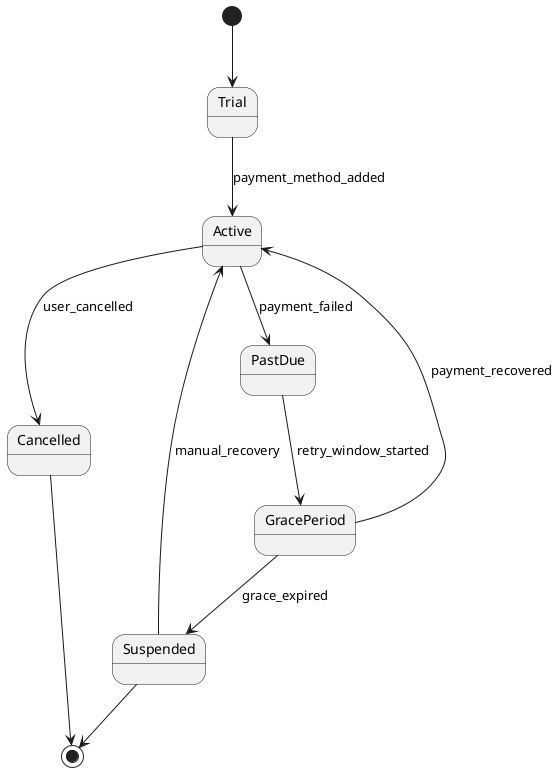

<!-- tags: diagram, reference -->
# 🔄 State Diagram

> State diagrams are powerful when the question is "what states can this entity be in, and how does it transition between them?"

📅 Created: 2026-03-31 · 🔄 Updated: 2026-04-20 · ⏱️ 14 min read

| Aspect | Detail |
| ------ | ------ |
| **Focus** | Lifecycle and transitions |
| **When to use** | When you need to describe states and transition rules |
| **Related** | Order status, job lifecycle, auth session |

---

## 1. DEFINE

A workflow with states like draft, approved, paid, shipped, and cancelled only becomes clear when you view it as a state machine. Without that, transition rules scatter across if/else blocks and become hard to control when new cases arrive.

| Variant | When to use | Scope |
| ------- | ----------- | ----- |
| Entity lifecycle | Order, payment, ticket | State changes driven by business action |
| Workflow engine state | Job, saga, pipeline | Retry, failed, compensated |
| UI state | Loading, empty, success, error | Frontend screen behavior |

**Core insight**:
- State diagrams complement sequence diagrams: sequences show call order, states show entity lifecycle.
- If a transition has a guard or important side effect, document it explicitly.
- Only use state diagrams when the entity has a finite set of states and clear transition rules.

Those failure modes sound easy to avoid. But there is a trap: using a state diagram for something without a clear lifecycle produces a forced, meaningless diagram. That trap appears in PITFALLS.

## 2. VISUAL

### State Diagram Example

The image below shows an order lifecycle as a state diagram: from Initial through Created, Confirmed, Processing, Shipped, to Delivered. The cancel transition from Created and Confirmed to Cancelled shows that not every path leads to the happy ending.



*Image: A state diagram without transition labels is just a box layout. The event labels on each arrow ("payment received", "dispatch") are what make the diagram testable — every label should map to a code event.*

### Preview UI



*Figure: An order lifecycle — each arrow is a domain event that triggers the transition. Invalid transitions are absent, making invariants visible by omission.*

```text
Draft -> PendingPayment -> Paid -> Fulfilled
                |                    |
                v                    v
             Cancelled            Refunded
```

## 3. CODE

### Mermaid Practice Block

````md

````

### Example 1: Basic — Order lifecycle

> **Goal**: Clarify valid transitions for an order entity.
> **Approach**: Extract the entity lifecycle independently from implementation.
> **Example**: `Order cannot go directly from Draft to Fulfilled.`


> **Conclusion**: When the team sees lifecycle as a state diagram, invariants like "only Paid orders can be fulfilled" become much clearer.

### Example 2: Intermediate — Background job retry state

> **Goal**: Describe the lifecycle of a worker job with retry and DLQ.
> **Approach**: Show how transient failure differs from permanent failure.
> **Example**: `Job goes queued -> running -> retrying -> dead-lettered or completed.`



> **Conclusion**: State diagrams for job systems are especially valuable because they distinguish operational states that log text often blurs.

### Example 3: Advanced — Subscription lifecycle with grace period and suspension

> **Goal**: Use a state diagram to review complex policy beyond a simple status column, especially in billing or access control.
> **Approach**: Add transient states like `PastDue`, `GracePeriod`, `Suspended` so the team locks rules before writing code.
> **Example**: `Subscription payment fails but still allows read access for 3 days.`



> **Conclusion**: Advanced state diagrams are highly valuable when business policy has many transient states. They prevent each service from interpreting the lifecycle differently.

## 4. PITFALLS

| # | Mistake | Consequence | Fix |
|---|---------|-------------|-----|
| 1 | Using a state diagram for something without a clear lifecycle | Diagram feels forced and meaningless | Only use when the entity has finite states |
| 2 | Not labeling triggers or events | Cannot tell why the state changes | Label transitions with domain events or actions |
| 3 | Mixing states of multiple entities into one diagram | Reader unclear whose state it is | One diagram = one primary lifecycle |

## 5. REF

| Resource | Link |
| -------- | ---- |
| Mermaid state diagram | https://mermaid.js.org/syntax/stateDiagram.html |
| PlantUML state diagrams | https://plantuml.com/state-diagram |

## 6. RECOMMEND

| Next step | When | Reason |
| --------- | ---- | ------ |
| Sequence diagram | When you need to know which call triggers the transition | Connect runtime order with lifecycle |
| Activity diagram | When the workflow has concurrency or heavy branching | Activity handles control flow better |
| Database patterns | When mapping state to schema or status column | Tie to persistence design |

---

**Links**: [← Previous](./02-sequence-diagram.md) · [→ Next](./04-activity-diagram.md)
