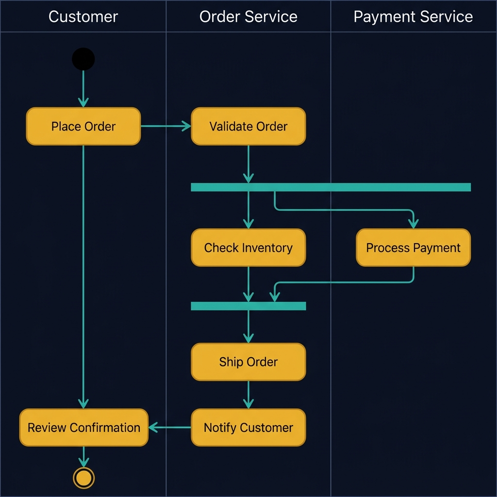
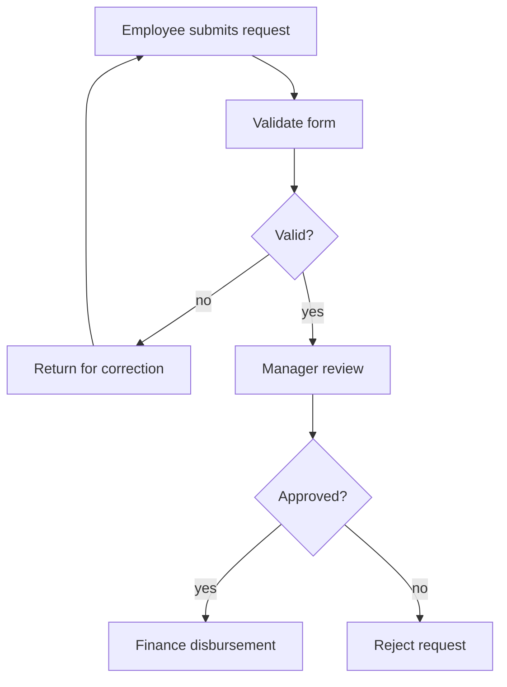
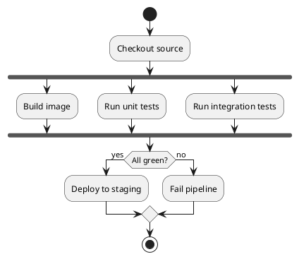
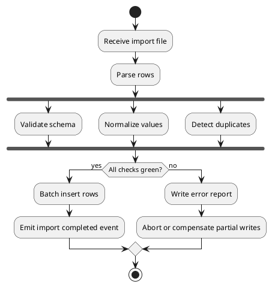

<!-- tags: diagram, reference -->
# 🏃 Activity Diagram

> Activity diagrams are like flowcharts but stronger when you need to represent fork, join, or detailed workflow.

📅 Created: 2026-03-31 · 🔄 Updated: 2026-04-20 · ⏱️ 13 min read

| Aspect | Detail |
| ------ | ------ |
| **Focus** | Workflow with branching and parallelism |
| **When to use** | When you need to describe workflow with decisions and concurrency |
| **Related** | Business process, CI/CD, orchestration |

---

## 1. DEFINE

Picture a process with many steps, parallel branches, and wait conditions — where a flowchart starts being too coarse but a sequence is too detailed about actors. Activity diagrams sit right between those two needs.

| Variant | When to use | Scope |
| ------- | ----------- | ----- |
| Linear activity | Happy path with few branches | Basic workflows |
| Branched activity | Many conditions | Approval, validation, recovery |
| Parallel activity | Has fork and join | Build/test/deploy, batch processing |

**Core insight**:
- Activity diagrams are ideal for use case orchestration, CI/CD, and business processes with many internal steps.
- If a workflow has both many actors and many branches, sequence and activity should often be used together.
- They are useful when you need to see control flow, not just business goals or actor lists.

Those failure modes sound basic. But there is a trap: stuffing actor detail like a sequence into an activity diagram produces a tangled diagram with mixed semantics. That trap appears in PITFALLS.

## 2. VISUAL

### Activity Diagram Example

The image below shows an order processing workflow with three swim lanes: Customer, Order Service, and Payment Service. The fork/join bars reveal parallel execution — Check Inventory and Process Payment happen simultaneously.



*Image: An activity diagram without swim lanes is just a flowchart. The lanes force you to name who owns each step, which is the difference between a design diagram and a debugging diagram.*

### Preview UI



*Figure: An approval workflow — validation loop, manager gate, and two outcomes. Activity diagrams make the rework loop visible.*

```text
Start -> Validate -> Fork(build,test) -> Join -> Deploy -> End
```

## 3. CODE

### Mermaid Practice Block

````md

````

### Example 1: Basic — CI pipeline activity

> **Goal**: Show that a pipeline has parallel steps and gating.
> **Approach**: Use fork and join to represent build and test running concurrently.
> **Example**: `Build image, run unit test, run integration test, then deploy.`



> **Conclusion**: A flowchart can express this pipeline, but an activity diagram conveys fork and join much more clearly.

### Example 2: Intermediate — Approval workflow

> **Goal**: Describe a process with human approval and rework loop.
> **Approach**: Keep the workflow at process level, not at individual API calls.
> **Example**: `Expense request needs manager approval or gets sent back for correction.`


> **Conclusion**: When business stakeholders are the primary audience, activity diagrams strike a good balance between technical depth and readability.

### Example 3: Advanced — Import pipeline with validation, transform, and compensation

> **Goal**: Use an activity diagram for a technical workflow with branching, batch processing, and local rollback.
> **Approach**: Show parallel steps clearly and a final gate that decides commit or compensate.
> **Example**: `Large CSV import: parse -> validate -> persist -> emit report.`



> **Conclusion**: Advanced activity diagrams are ideal for data pipelines and orchestrated workflows, where flowcharts are not powerful enough for fork/join and compensation.

## 4. PITFALLS

| # | Mistake | Consequence | Fix |
|---|---------|-------------|-----|
| 1 | Stuffing actor detail like a sequence diagram | Diagram tangles and mixes semantics | If you need clear lifelines, use sequence |
| 2 | Not marking fork and join for parallel paths | Reader misunderstands the critical path | Use parallel notation clearly |
| 3 | Repeating every trivial step | Workflow is long but produces no decisions | Keep only steps that affect outcome or SLA |

## 5. REF

| Resource | Link |
| -------- | ---- |
| PlantUML activity beta | https://plantuml.com/activity-diagram-beta |
| Mermaid flowchart | https://mermaid.js.org/syntax/flowchart.html |

## 6. RECOMMEND

| Next step | When | Reason |
| --------- | ---- | ------ |
| Flowchart | When the workflow is simpler and does not need fork or join | Reads faster |
| Gantt chart | When you need to move from workflow to project timeline | Go from process to planning |
| CI/CD patterns | When the activity diagram reflects a real pipeline | See more specific templates |

---

**Links**: [← Previous](./03-state-diagram.md) · [→ Next](./05-use-case-diagram.md)
