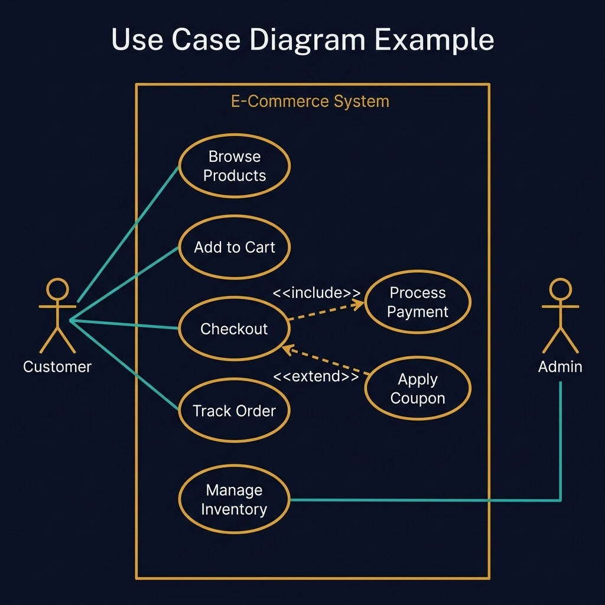
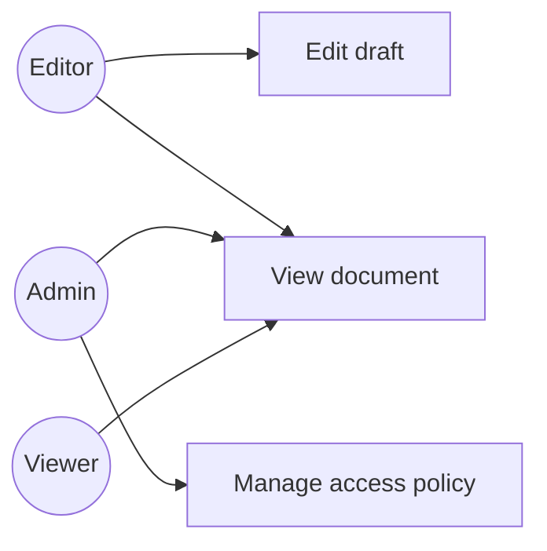
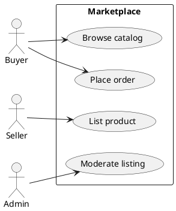
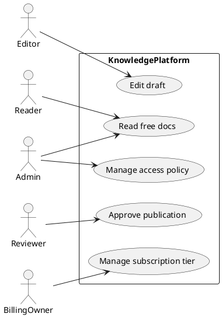

<!-- tags: diagram, reference -->
# 🎭 Use Case Diagram

> Use case diagrams do not describe runtime detail. They describe what actors want from the system.

📅 Created: 2026-03-31 · 🔄 Updated: 2026-04-20 · ⏱️ 12 min read

| Aspect | Detail |
| ------ | ------ |
| **Focus** | Actors and responsibilities |
| **When to use** | When you need to say who uses the system to do what |
| **Related** | Requirements, discovery, scoping |

---

## 1. DEFINE

You need to lock down which actors the system serves and what they are actually allowed to do, before diving into classes or APIs. Use case diagrams are most valuable when requirements still have many gray areas.

| Variant | When to use | Scope |
| ------- | ----------- | ----- |
| Scope discovery | Early stage | Who interacts with the system |
| Capability map | Clarifying main use cases | Features at user-goal level |
| Boundary review | Identifying system boundary | Which actors are inside or outside |

**Core insight**:
- Most useful when requirements are vague or multiple stakeholders name features differently.
- Keep diagrams at the goal level — do not drop into individual clicks or API endpoints.
- A great stepping stone before user journey or RBAC/ABAC policy design.

Those failure modes sound familiar. But there is a trap: stuffing detailed flow into a use case diagram loses the scope-level view. That trap appears in PITFALLS.

## 2. VISUAL

### Use Case Diagram Example

The image below shows an e-commerce system boundary with five use cases: Browse Products, Add to Cart, Checkout, Track Order, and Manage Inventory. Two actors (Customer, Admin) connect to different subsets, and include/extend relationships between Checkout and Process Payment/Apply Coupon.



*Image: A use case diagram without a system boundary is just a feature list. The boundary rectangle is what separates in-scope from out-of-scope — draw that line wrong and the team builds features nobody asked for.*

### Preview UI



*Figure: A knowledge base capability map — each actor connects to their goals. Shared capabilities (View) are visible immediately.*

```text
Customer -> Place Order
Customer -> Track Shipment
Admin -> Manage Catalog
Support -> Refund Order
```

## 3. CODE

### Mermaid Practice Block

````md

````

### Example 1: Basic — Marketplace capability map

> **Goal**: Sketch system boundary and actor goals quickly.
> **Approach**: Draw main actors first, then connect to use cases.
> **Example**: `Buyer, Seller, Admin, Support.`



> **Conclusion**: This use case diagram is good enough for discovery but does not replace user journey or sequence when diving into specific flows.

### Example 2: Intermediate — Access control scoping

> **Goal**: Use a use case diagram to detect missing roles or vague policies.
> **Approach**: Map roles to high-level capabilities before writing RBAC or ABAC.
> **Example**: `Viewer, Editor, Admin on a knowledge base.`


> **Conclusion**: Before writing detailed policies, a use case diagram helps lock down permission scope at a level easy to review with non-technical stakeholders.

### Example 3: Advanced — Capability map for a multi-actor knowledge platform

> **Goal**: Use a use case diagram to lock capability scope before translating to RBAC/ABAC, billing tiers, and detailed workflows.
> **Approach**: Separate actors by real goal: reader, editor, reviewer, admin, billing owner.
> **Example**: `Knowledge platform has read docs, manage drafts, approve publication, manage access, and manage subscription.`



> **Conclusion**: Advanced use case diagrams help the team lock capability boundaries very early, reducing arguments when translating to RBAC, ABAC, or pricing tiers.

## 4. PITFALLS

| # | Mistake | Consequence | Fix |
|---|---------|-------------|-----|
| 1 | Stuffing detailed flow into use case diagram | Loses the scope-level view that is the diagram's strength | Keep at user-goal level |
| 2 | Confusing actors and roles | Unclear whether it is a user persona or a system actor | Name actors consistently by domain |
| 3 | Use case names not goal-oriented | Nodes become disconnected technical tasks | Name by user objective like "Place order" |

## 5. REF

| Resource | Link |
| -------- | ---- |
| UML use case overview | https://www.uml-diagrams.org/use-case-diagrams.html |
| PlantUML use case | https://plantuml.com/use-case-diagram |

## 6. RECOMMEND

| Next step | When | Reason |
| --------- | ---- | ------ |
| User journey | When you need to go deeper into each actor's step-by-step experience | Connect requirements with flow |
| Sequence diagram | When use cases are clear and you need runtime order | Move from what to how |
| RBAC and ABAC docs | When translating use cases into access policy | Move from capability to enforcement |

---

**Links**: [← Previous](./04-activity-diagram.md) · → Next
