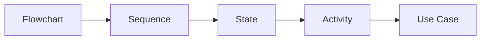

<!-- tags: overview -->
# Behavioral Diagrams

> Lane for diagrams that describe sequence, state, and decision flow over time.

| Aspect | Detail |
| --- | --- |
| **Concept** | Navigation hub for `Behavioral Diagrams` |
| **Audience** | Backend engineer, PM, architect, incident reviewer |
| **Primary style** | Concept-First router |
| **Entry point** | Open when the core question is "what happens before, after, and at which branch?" |

📅 Updated: 2026-04-20 · ⏱️ 6 min read

---

## 1. DEFINE

A flow that seems simple only reveals its bugs when you lay it on a timeline or a state axis. Behavioral diagrams exist to pull what is happening dynamically inside a system into a story that can be read.

This hub does not replace individual articles. It routes you to the correct lane before you wander into tools, syntax, or a specific diagram type.

### Signals & Boundaries

- Open this hub when you know the problem lives inside `Behavioral Diagrams` but are unsure which article to read first.
- Use the coverage map to route by pain point instead of file order.
- Return to this hub after each article to choose the next step with intention.

### Coverage Map

| Entry | Role |
| --- | --- |
| [Flowchart](01-flowchart.md) | Entry point for lane `Flowchart` |
| [Sequence Diagram](02-sequence-diagram.md) | Entry point for lane `Sequence Diagram` |
| [State Diagram](03-state-diagram.md) | Entry point for lane `State Diagram` |
| [Activity Diagram](04-activity-diagram.md) | Entry point for lane `Activity Diagram` |
| [Use Case Diagram](05-use-case-diagram.md) | Entry point for lane `Use Case Diagram` |

---

## 2. VISUAL

### Runtime Behavior Family

Five diagram types cover five different lenses on runtime behavior. The image below shows each type with its visual signature so you can identify which one fits your current debugging, design, or review session.


*Image: Five diagram types are not five interchangeable views — each one answers a fundamentally different runtime question. Picking the wrong lens means redrawing the diagram when the review session shifts focus.*

### Preview UI



*Figure: Behavioral diagrams progress from decision flow (Flowchart) through actor interaction (Sequence), lifecycle (State), parallel workflow (Activity), to goal-level scoping (Use Case).*

### Level 1

```text
start from your current pain point
  -> Flowchart         (branch logic, decision tree)
  -> Sequence Diagram  (who calls whom, in what order)
  -> State Diagram     (entity lifecycle, transitions)
  -> Activity Diagram  (workflow with fork/join)
  -> Use Case Diagram  (actor goals, system boundary)
```

*Figure: This hub works as a router, not a catalog to scroll through.*

---

## 3. CODE

### Mermaid Practice Block

````md

````

### Problem 1: Basic — Route the lane before reading deep

> **Goal**: Prevent study or review from drifting into "open whichever article looks interesting."
> **Approach**: Choose a lane by pain point.
> **Example**: Selecting the right cluster inside `Behavioral Diagrams`.
> **Complexity**: Basic

```yaml
router:
  module: Behavioral Diagrams
  rule: "choose by pain point, not by familiar name"
  suggested_path:
  - 01-flowchart.md
  - 02-sequence-diagram.md
  - 03-state-diagram.md
  - 04-activity-diagram.md
  - 05-use-case-diagram.md
```

---

## 4. PITFALLS

| # | Severity | Mistake | Consequence | Fix |
| --- | --- | --- | --- | --- |
| 1 | 🔴 Fatal | Reading by file order instead of routing by pain point | Accumulates terminology without solving the real problem | Use the coverage map first |
| 2 | 🟡 Common | Treating the README as a pure link catalog | Loses the hub's routing purpose | Always ask "which lane matches my current pain?" |
| 3 | 🔵 Minor | Finishing an article without returning to the hub | Jumps to an adjacent article by instinct | Return to the README to pick the next step |

---

## 5. REF

| Resource | Type | Link | Notes |
| --- | --- | --- | --- |
| Mermaid flowchart | Official docs | https://mermaid.js.org/syntax/flowchart.html | Decision flow and process branch |
| Mermaid sequence diagram | Official docs | https://mermaid.js.org/syntax/sequenceDiagram.html | Runtime order between actors |
| Mermaid state diagram | Official docs | https://mermaid.js.org/syntax/stateDiagram.html | Lifecycle and transitions |

## 6. RECOMMEND

| Next step | When | Reason | File/Link |
| --- | --- | --- | --- |
| Flowchart | When your pain point matches this lane | Continue into the right cluster | [Flowchart](01-flowchart.md) |
| Sequence Diagram | When your pain point matches this lane | Continue into the right cluster | [Sequence Diagram](02-sequence-diagram.md) |
| State Diagram | When your pain point matches this lane | Continue into the right cluster | [State Diagram](03-state-diagram.md) |
