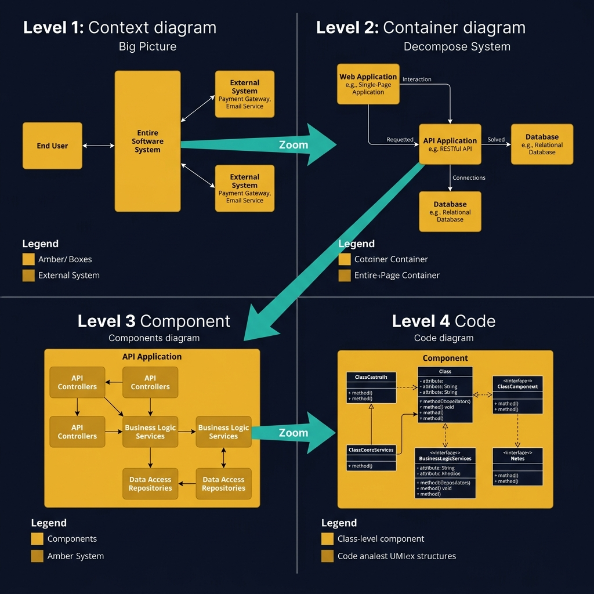
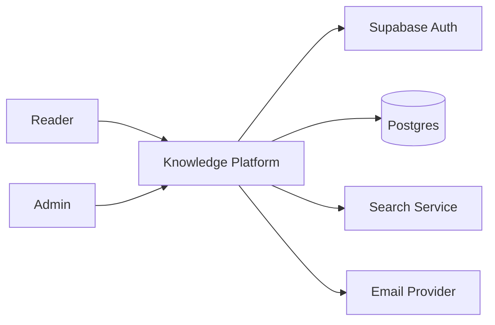
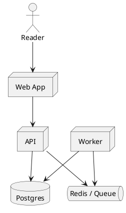
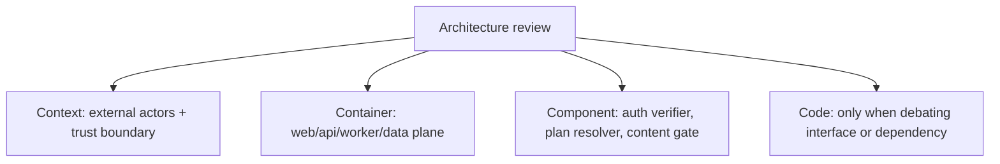

<!-- tags: diagram, architecture -->
# 🧱 C4 Model

> C4 helps the team talk about architecture at consistent zoom levels: Context → Container → Component → Code.

📅 Created: 2026-04-01 · 🔄 Updated: 2026-04-20 · ⏱️ 15 min read

| Aspect | Detail |
| ------ | ------ |
| **Focus** | Architecture zoom levels |
| **When to use** | When you need to communicate architecture to different audiences |
| **Related** | System Context, Component Diagram, Deployment Diagram |

---

## 1. DEFINE

Picture a team discussing "architecture" where each person imagines a different zoom level. The diagrams in this lane exist to force the system to reveal its boundaries at each level: context, container, data flow, or network.

| Level | Question answered | Primary audience |
| ----- | ----------------- | ---------------- |
| Context | Where does this system live in the ecosystem? | PM, architect, stakeholder |
| Container | What are the main containers/services? | Backend, platform |
| Component | What modules exist inside a container? | Senior dev, reviewer |
| Code | How do the main types/classes collaborate? | Dev implementing features |

**Core insight**:
- C4 does not replace UML. It solves the **zoom level** problem before solving notation.
- A diagram at the wrong level usually causes more review drift than a badly drawn diagram.
- Context and Container are usually enough for design docs. Component/Code should only appear when a deep review is truly needed.

Those failure modes sound clear. But there is a trap: stuffing multiple C4 levels into one diagram means the reader cannot tell which zoom they are at. That trap appears in PITFALLS.

## 2. VISUAL

### C4 Model — 4 Zoom Levels

The image below shows the four C4 zoom levels side by side: Level 1 Context (big picture), Level 2 Container (system decomposed), Level 3 Component (inside a container), Level 4 Code (class-level detail). Each level zooms deeper into the previous one.



*Image: C4 is not four diagrams you draw in sequence. It is four zoom levels you pick from based on your audience. Showing Level 4 to a PM wastes their time; showing Level 1 to a developer wastes yours.*

### Preview UI



*Figure: A C4 Context diagram — actors on the left, system in the center, external dependencies on the right. One glance reveals the full boundary.*

```text
Context   -> system boundary + external actors
Container -> web, api, worker, database, broker
Component -> module boundary inside a container
Code      -> class / port / adapter / object interaction
```

## 3. CODE

### Mermaid Practice Block

````md

````

### Example 1: Basic — Context level for a knowledge platform

> **Goal**: Describe the big picture of the system and external actors before diving into internal topology.
> **Approach**: Keep only actors, external systems, and one central system boundary.
> **Example**: `Reader, Admin, Supabase, Email provider, Search service.`


> **Conclusion**: Context level works best for aligning system scope, identifying actors, and spotting boundary dependencies.

### Example 2: Intermediate — Container level for web app + workers

> **Goal**: Zoom in one more level to see which runtime building blocks the system is divided into.
> **Approach**: Separate web shell, API, background workers, and stateful systems without dropping to class level.
> **Example**: `Public web app serves docs, API handles auth/content tiers, workers handle notifications.`



> **Conclusion**: Container level is the best place to review scaling boundaries, sync/async splits, and ownership of each runtime unit.

### Example 3: Advanced — Mapping 4 levels in one review pack

> **Goal**: Use C4 as a review workflow rather than just four separate pictures.
> **Approach**: Map each level to a different review question to avoid over-drawing.
> **Example**: `Auth gating feature needs context for stakeholders, container for platform, component for implementer.`



> **Conclusion**: At the advanced level, C4 is powerful because it turns "drawing architecture" into an intentional review sequence, not a one-screen poster.

## 4. PITFALLS

| # | Mistake | Consequence | Fix |
|---|---------|-------------|-----|
| 1 | Stuffing multiple levels into one diagram | Reader cannot tell which zoom level is being reviewed | Keep one C4 level per diagram |
| 2 | Using component level too early | Diagram heavy with detail, stakeholders lose direction | Start from context/container, then zoom in |
| 3 | Fixing tool notation rigidly over intent | Team debates notation instead of architecture | Lock the review question before choosing the diagram |

## 5. REF

| Resource | Link |
| -------- | ---- |
| C4 Model | https://c4model.com/ |
| Structurizr notation | https://docs.structurizr.com/ |
| Mermaid flowchart | https://mermaid.js.org/syntax/flowchart.html |

## 6. RECOMMEND

| Next step | When | Reason |
| --------- | ---- | ------ |
| System Context | When you need to go deep into the first level | C4 context is the natural starting point |
| Component Diagram | When container level is not detailed enough | Zoom into module boundary inside the container |
| Deployment Diagram | When you need to move from logical view to physical runtime | Connect architecture with real infrastructure |

---

**Links**: ← Previous · [→ Next](./02-system-context.md)
