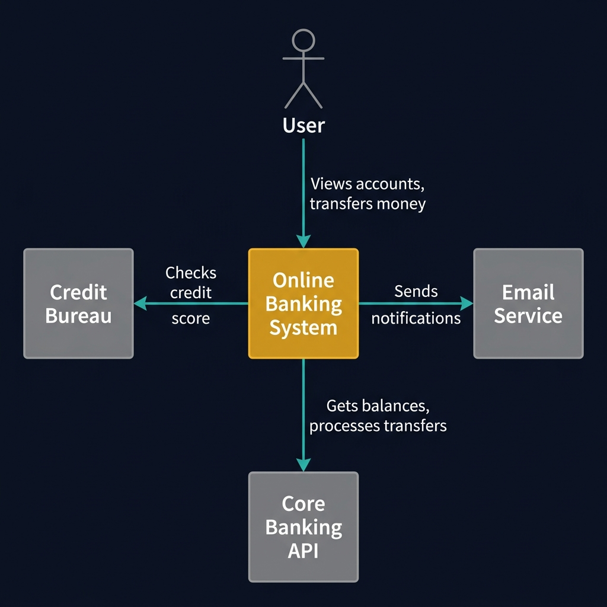
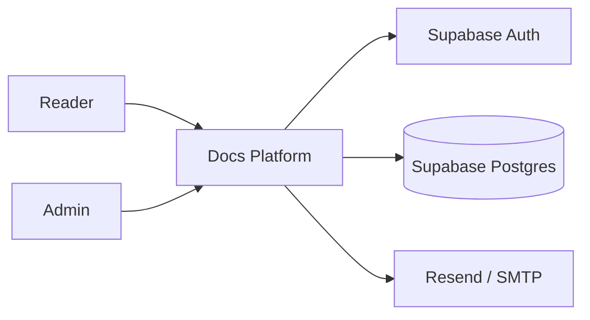
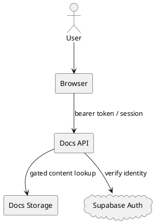
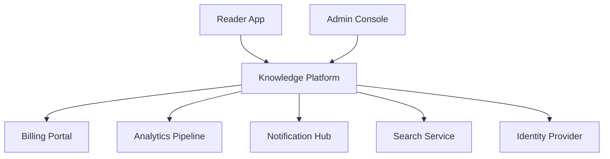

<!-- tags: diagram, architecture -->
# 🌍 System Context Diagram

> System context diagrams answer where this system stands in the outside world and who it exchanges data with.

📅 Created: 2026-04-01 · 🔄 Updated: 2026-04-20 · ⏱️ 14 min read

| Aspect | Detail |
| ------ | ------ |
| **Focus** | System boundary + external actors |
| **When to use** | When you need the big-picture view before discussing containers or code |
| **Related** | C4 Model, Network Diagram, User Journey |

---

## 1. DEFINE

Picture a team discussing "architecture" where each person imagines a different zoom level. The diagrams in this lane exist to force the system to reveal its boundary at each level: context, container, data flow, or network.

| Element | Role |
| ------- | ---- |
| Actors | People or systems calling into the platform |
| Core system | The system being designed or reviewed |
| External dependencies | Auth provider, payment, search, email, queue |
| Trust boundary | Where auth, network, and ownership need attention |

**Core insight**:
- System context does not describe runtime order. It describes **scope of responsibility**.
- This is the best place to catch assumptions like "is this internal or external?"
- If stakeholders still disagree about the boundary, every deeper diagram loses value.

Those failure modes sound easy to avoid. But there is a trap: drawing internal modules inside the context loses the big picture. That trap appears in PITFALLS.

## 2. VISUAL

### System Context Example

The image below shows an Online Banking System at the center with four external entities around it: User, Email Service, Core Banking API, and Credit Bureau. Each arrow carries a verb phrase describing the integration purpose.



*Image: A context diagram without verb labels on the arrows is useless. The verbs ("sends notifications", "checks credit score") are what reviewers need to validate scope and integration contracts.*

### Preview UI



*Figure: A docs platform context — actors on the left, system in the center, external dependencies on the right. Boundary is immediately visible.*

```text
Actors / Systems outside boundary --> Core System --> External dependencies
```

## 3. CODE

### Mermaid Practice Block

````md

````

### Example 1: Basic — Context for a docs platform

> **Goal**: Clarify who uses the platform and which external systems it depends on.
> **Approach**: Keep the big picture. Do not go into sequencing or internal modules.
> **Example**: `Reader views docs, Admin manages content, platform uses Supabase and email provider.`


> **Conclusion**: Basic context is enough to lock actor, boundary dependency, and initial ownership of the system.

### Example 2: Intermediate — Trust boundary for premium content

> **Goal**: Use a context diagram to review the trust boundary around auth and premium access.
> **Approach**: Mark where tokens appear, where entitlement is resolved, and where the external identity provider sits.
> **Example**: `User logs in via Supabase, entitlement is resolved at API before returning content.`



> **Conclusion**: Adding a trust boundary to the context turns the diagram into a security review tool, not just an onboarding picture.

### Example 3: Advanced — Context for a multi-product ecosystem

> **Goal**: Show that a mature system context can express the entire platform ecosystem while keeping scope clean.
> **Approach**: Separate product actors, internal neighboring systems, and third-party services.
> **Example**: `Knowledge platform lives alongside billing portal, analytics pipeline, and notification hub.`



> **Conclusion**: Advanced context diagrams help leadership and architects see ecosystem coupling before deciding to split services or change ownership.

## 4. PITFALLS

| # | Mistake | Consequence | Fix |
|---|---------|-------------|-----|
| 1 | Drawing internal modules inside context | Loses the big picture, mixes levels | Context should only keep system boundary and external dependencies |
| 2 | Not distinguishing external from neighboring internal systems | Ownership and SLA are misunderstood | Label external vendor vs internal platform clearly |
| 3 | Omitting trust boundary | Security review lacks foundation | Mark where identity, secrets, and network boundaries cross |

## 5. REF

| Resource | Link |
| -------- | ---- |
| C4 context diagram | https://c4model.com/diagrams/system-context |
| Structurizr examples | https://structurizr.com/help/examples |

## 6. RECOMMEND

| Next step | When | Reason |
| --------- | ---- | ------ |
| C4 Model | When you need to see all zoom levels together | System context is the entry point of C4 |
| Network Diagram | When you need to review subnet, ingress, firewall | Move from logical boundary to physical boundary |
| Auth Flow | When the trust boundary needs runtime detail | Connect context with specific sequence |

---

**Links**: [← Previous](./01-c4-model.md) · [→ Next](./03-data-flow-diagram.md)
