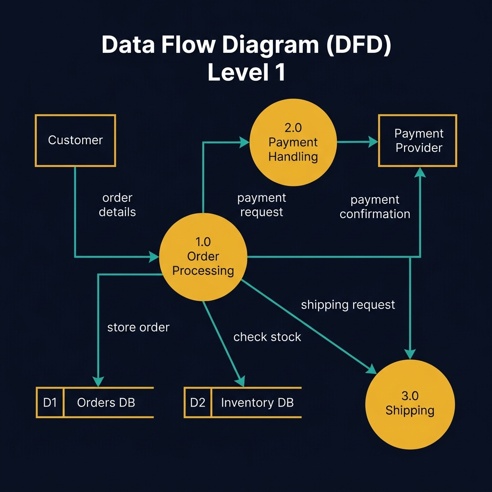
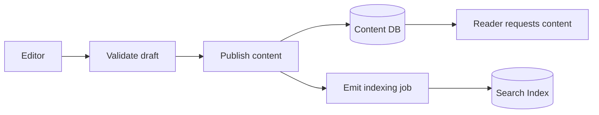
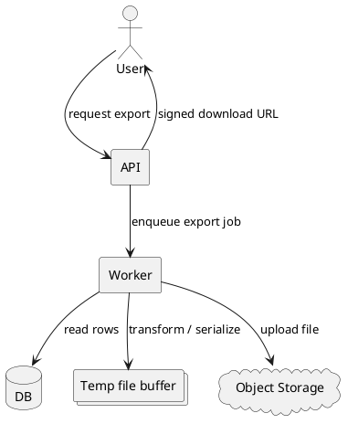
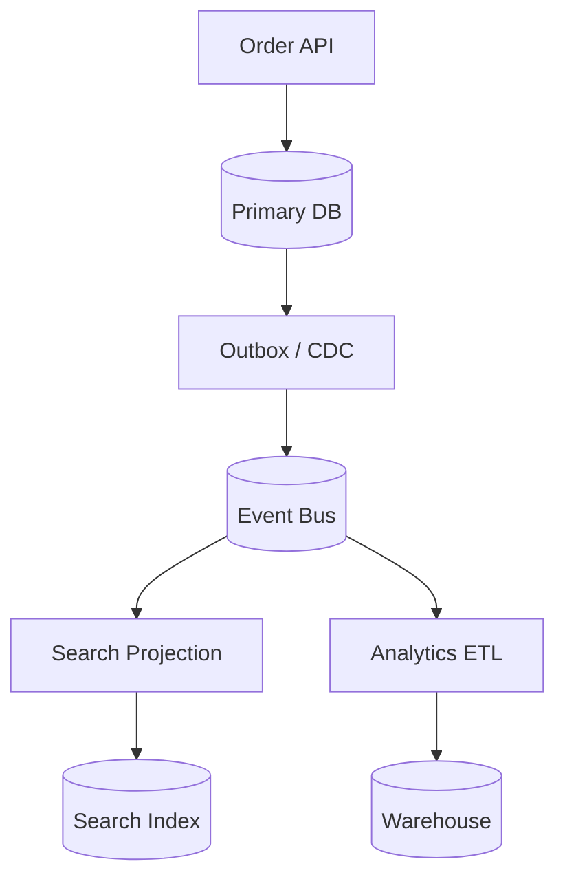

<!-- tags: diagram, architecture -->
# 🌊 Data Flow Diagram

> Data Flow Diagrams focus on where data travels, where it transforms, and where it persists.

📅 Created: 2026-04-01 · 🔄 Updated: 2026-04-20 · ⏱️ 15 min read

| Aspect | Detail |
| ------ | ------ |
| **Focus** | Data movement and transformation |
| **When to use** | When reviewing data ingress, persistence, analytics, privacy, lineage |
| **Related** | ER Diagram, Sequence Diagram, Event Storming |

---

## 1. DEFINE

When data passes through many transform, enrich, and persist steps, debating components alone is not enough to answer the most important question: how does data actually flow? Data flow diagrams are built for exactly that pressure.

| Element | Meaning |
| ------- | ------- |
| External entity | Source that emits or destination that receives data |
| Process | Where data is checked, transformed, enriched |
| Data store | DB, cache, file store, data lake |
| Flow | Direction data moves |

**Core insight**:
- DFD does not ask "who calls whom." It asks "where does data go and where does it change shape?"
- An excellent tool for privacy review, analytics review, and import/export design.
- A good DFD exposes dual-write, redundant storage, or sensitive data traveling the wrong path.

Those failure modes sound basic. But there is a trap: using DFD instead of sequence diagrams hides the data transformation focus. That trap appears in PITFALLS.

## 2. VISUAL

### Data Flow Diagram Example

The image below shows a Level 1 DFD with three processes (Order Processing, Payment Handling, Shipping), two external entities (Customer, Payment Provider), and two data stores (Orders DB, Inventory DB). Every arrow carries a labeled data flow.



*Image: A DFD without data stores is just a flowchart in disguise. The open-ended rectangles (data stores) are what distinguish a DFD from other diagram types — they show where data rests between transformations.*

### Preview UI



*Figure: A publishing data flow — editor input travels through validation to persistence and search index. Two destinations from one write make the read-write split visible.*

```text
External input -> Validation -> Core processing -> Data store -> Downstream consumers
```

## 3. CODE

### Mermaid Practice Block

````md

````

### Example 1: Basic — Content publishing data flow

> **Goal**: Trace data from editor to published content and search index.
> **Approach**: Separate write path, persistent store, and downstream read side.
> **Example**: `Editor publishes article, system writes DB then syncs search index.`


> **Conclusion**: A basic DFD reveals the path of a publish action clearly without being distracted by detailed runtime call order.

### Example 2: Intermediate — Export pipeline data flow

> **Goal**: Review a large data export pipeline and where sensitive data passes through.
> **Approach**: Show query, transform, file store, and signed URL delivery as independent stages.
> **Example**: `User requests export, worker queries DB, transforms rows, uploads to object storage, returns signed URL.`



> **Conclusion**: Intermediate DFD is ideal for catching questions like where PII lives, how long temp data survives, and which layer issues signed URLs.

### Example 3: Advanced — CDC and analytics split

> **Goal**: Show that DFD is especially powerful when reviewing data lineage and downstream consumers in an event-driven architecture.
> **Approach**: Draw write model, CDC/outbox, analytics warehouse, and operational read model as separate data branches.
> **Example**: `Order write path emits events that feed both search and warehouse.`



> **Conclusion**: At the advanced level, DFD is a powerful tool for reviewing lineage, consistency lag, and unintended data duplication.

## 4. PITFALLS

| # | Mistake | Consequence | Fix |
|---|---------|-------------|-----|
| 1 | Using DFD instead of sequence diagram | Loses the data transformation focus | Only use DFD when the question is about data, not call order |
| 2 | Not distinguishing process from store | Reader cannot tell compute from persistence | Use clear shapes/labels for process and datastore |
| 3 | Omitting downstream analytics/read models | Data duplication is hidden | Draw both operational and analytical branches if they exist |

## 5. REF

| Resource | Link |
| -------- | ---- |
| DFD overview | https://www.visual-paradigm.com/guide/data-flow-diagram/what-is-data-flow-diagram/ |
| Mermaid flowchart | https://mermaid.js.org/syntax/flowchart.html |

## 6. RECOMMEND

| Next step | When | Reason |
| --------- | ---- | ------ |
| Event Storming | When you need to connect data flow with domain events | Move from data to domain behavior |
| ER Diagram | When you need to zoom into data store shape | Add ownership and cardinality |
| Database Patterns | When data flow touches replication/CQRS | Go deeper into persistence consequences |

---

**Links**: [← Previous](./02-system-context.md) · [→ Next](./04-network-diagram.md)
