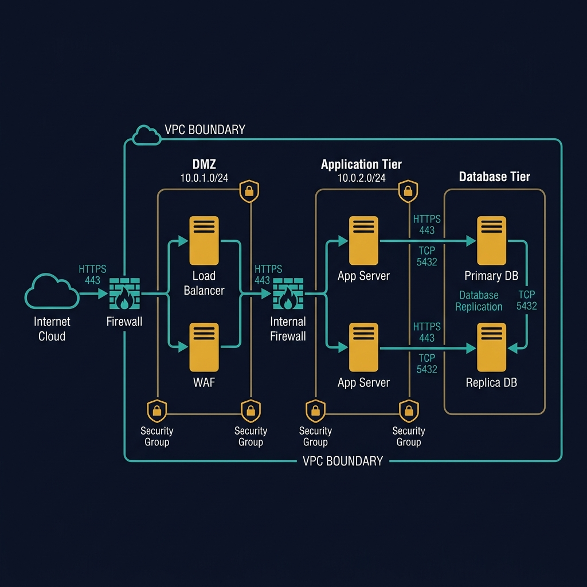
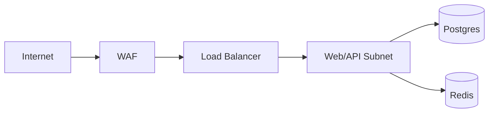
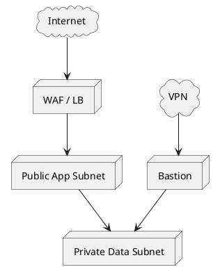
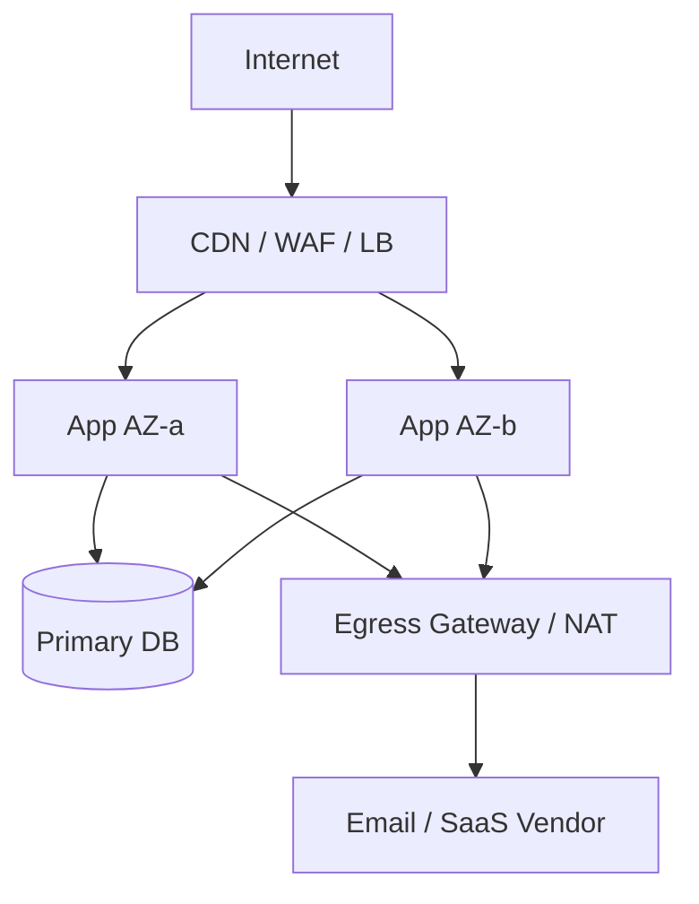

<!-- tags: diagram, architecture -->
# 🛰️ Network Diagram

> Network diagrams are where the team reviews subnet, ingress, egress, firewall, and the real blast radius of the system.

📅 Created: 2026-04-01 · 🔄 Updated: 2026-04-20 · ⏱️ 15 min read

| Aspect | Detail |
| ------ | ------ |
| **Focus** | Network topology and security boundaries |
| **When to use** | When discussing private/public subnet, VPN, load balancer, service exposure |
| **Related** | Deployment Diagram, System Context, Auth Flow |

---

## 1. DEFINE

A network topology can seem simple until you have to explain ingress, private subnet, gateway, firewall, and packet path to someone else. Network diagrams are where infrastructure is forced to speak in pictures instead of slogans.

| Element | Purpose |
| ------- | ------- |
| Edge layer | CDN, WAF, load balancer, public ingress |
| App subnet | Where web/api/worker runs |
| Data subnet | DB, cache, broker, object storage gateway |
| Management path | VPN, bastion, admin access |

**Core insight**:
- Deployment diagrams describe where code runs. Network diagrams describe where traffic flows and where it gets blocked.
- This is the right diagram for reviewing attack surface and east-west/north-south traffic.
- A good network diagram immediately exposes issues like a public DB, shared NAT, or unseparated admin path.

Those failure modes sound familiar. But there is a trap: using deployment diagrams instead of network diagrams hides the attack surface. That trap appears in PITFALLS.

## 2. VISUAL

### Network Diagram Example

The image below shows a 3-tier network topology inside a VPC boundary: DMZ (Load Balancer, WAF), Application Tier (2x App Servers), and Database Tier (Primary DB + Replica with replication). Security groups and protocol labels (HTTPS 443, TCP 5432) are included.



*Image: A network diagram without port numbers and subnet CIDRs is a marketing slide, not an engineering diagram. The numbers are what make infrastructure review possible from a single picture.*

### Preview UI



*Figure: A minimal network topology — internet hits WAF then LB, then enters app subnet. Data plane stays private.*

```text
Internet -> WAF -> Load Balancer -> Public App -> Private Data Plane
```

## 3. CODE

### Mermaid Practice Block

````md

````

### Example 1: Basic — Public web + private DB topology

> **Goal**: Describe the minimal topology for a web app with a separate data plane.
> **Approach**: Clearly separate edge, app subnet, and data subnet.
> **Example**: `Internet only reaches LB; Postgres and Redis are only open in private subnet.`


> **Conclusion**: A basic network diagram is enough to review the most important question: what is public and what is private.

### Example 2: Intermediate — Bastion and ops access path

> **Goal**: Add the admin path to prevent the assumption that all traffic flows through the same route.
> **Approach**: Separate user traffic and ops traffic into two distinct network paths.
> **Example**: `Ops access bastion only via VPN; bastion then reaches private nodes.`



> **Conclusion**: Adding the ops path makes the network diagram far more useful for security review and incident access review.

### Example 3: Advanced — Multi-AZ network boundary with private egress control

> **Goal**: Review high-availability topology and outbound path to third-party services in production.
> **Approach**: Show AZ split, internal traffic, and where outbound traffic is controlled.
> **Example**: `App runs multi-AZ, calls email provider via NAT/egress gateway, DB primary stays private.`



> **Conclusion**: Advanced network diagrams help the team see both HA topology and outbound dependency path, enabling better blast radius and compliance assessment.

## 4. PITFALLS

| # | Mistake | Consequence | Fix |
|---|---------|-------------|-----|
| 1 | Using deployment diagram instead of network diagram | Attack surface is hidden | Draw subnet, ingress, egress, and management path clearly |
| 2 | Not separating user traffic from ops traffic | Admin access is reviewed incorrectly | Give bastion/VPN path its own lane |
| 3 | Omitting outbound vendor path | Data egress risk is invisible | Draw the outbound path to important third parties |

## 5. REF

| Resource | Link |
| -------- | ---- |
| AWS VPC concepts | https://docs.aws.amazon.com/vpc/ |
| Azure network security groups | https://learn.microsoft.com/azure/virtual-network/network-security-groups-overview |

## 6. RECOMMEND

| Next step | When | Reason |
| --------- | ---- | ------ |
| Deployment Diagram | When you need to overlay runtime nodes onto network boundary | These two views directly complement each other |
| Auth Flow | When you need to see mTLS/OIDC across network path | Connect security flow with traffic path |
| CI/CD Pipeline | When you want to add the rollout path to topology | Overlay operations with the real network |

---

**Links**: [← Previous](./03-data-flow-diagram.md) · → Next
