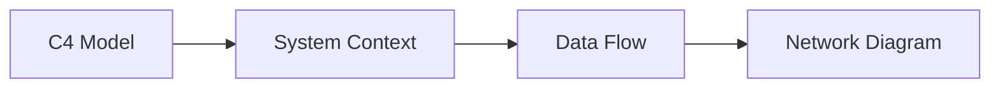

<!-- tags: overview -->
# Architecture Diagrams

> Lane for C4, context, data flow, and network views at the system level.

| Aspect | Detail |
| --- | --- |
| **Concept** | Navigation hub for `Architecture Diagrams` |
| **Audience** | Architect, tech lead, platform engineer |
| **Primary style** | Concept-First router |
| **Entry point** | Open when you need to see system boundaries, integration points, or infrastructure topology. |

📅 Updated: 2026-04-20 · ⏱️ 6 min read

---

## 1. DEFINE

Picture the entire team discussing "architecture" where one person thinks about service boundaries, another about network, and a third about data flow. Architecture diagrams exist to separate those zoom levels instead of cramming everything into one picture.

This hub does not replace individual articles. It routes you to the correct lane before you wander into tools, syntax, or a specific diagram type.

### Signals & Boundaries

- Open this hub when you know the problem lives inside `Architecture Diagrams` but are unsure which article to read first.
- Use the coverage map to route by pain point instead of file order.
- Return to this hub after each article to choose the next step with intention.

### Coverage Map

| Entry | Role |
| --- | --- |
| [C4 Model](01-c4-model.md) | Entry point for lane `C4 Model` |
| [System Context Diagram](02-system-context.md) | Entry point for lane `System Context Diagram` |
| [Data Flow Diagram](03-data-flow-diagram.md) | Entry point for lane `Data Flow Diagram` |
| [Network Diagram](04-network-diagram.md) | Entry point for lane `Network Diagram` |

---

## 2. VISUAL

### System Zoom Levels

Four diagram types represent four different zoom levels on the same system. The image below shows each type with its visual signature, from the most abstract (C4 context) down to physical infrastructure (network topology).


*Image: Architecture diagrams fail when the team argues at different zoom levels. The C4 model provides the framework; the other three types are specific instantiations of its zoom layers.*

### Preview UI



*Figure: Architecture diagrams progress from zoom-level framework (C4) through boundary view (Context), data movement (DFD), to network topology (Network).*

### Level 1

```text
start from your current pain point
  -> C4 Model              (zoom level framework)
  -> System Context Diagram (big picture boundary)
  -> Data Flow Diagram      (where data moves and transforms)
  -> Network Diagram        (subnet, ingress, security zones)
```

*Figure: This hub works as a router, not a catalog to scroll through.*

---

## 3. CODE

### Mermaid Practice Block

````md

````

### Problem 1: Basic — Route the lane before reading deep

> **Goal**: Prevent study or review from drifting into "open whichever article looks interesting."
> **Approach**: Choose a lane by pain point.
> **Example**: Selecting the right cluster inside `Architecture Diagrams`.
> **Complexity**: Basic

```yaml
router:
  module: Architecture Diagrams
  rule: "choose by pain point, not by familiar name"
  suggested_path:
  - 01-c4-model.md
  - 02-system-context.md
  - 03-data-flow-diagram.md
  - 04-network-diagram.md
```

---

## 4. PITFALLS

| # | Severity | Mistake | Consequence | Fix |
| --- | --- | --- | --- | --- |
| 1 | 🔴 Fatal | Reading by file order instead of routing by pain point | Accumulates terminology without solving the real problem | Use the coverage map first |
| 2 | 🟡 Common | Treating the README as a pure link catalog | Loses the hub's routing purpose | Always ask "which lane matches my current pain?" |
| 3 | 🔵 Minor | Finishing an article without returning to the hub | Jumps to an adjacent article by instinct | Return to the README to pick the next step |

---

## 5. REF

| Resource | Type | Link | Notes |
| --- | --- | --- | --- |
| C4 Model | Official guidance | https://c4model.com/ | Context, container, component thinking |
| PlantUML deployment guide | Official docs | https://plantuml.com/deployment-diagram | Physical topology and infra view |
| Mermaid flowchart | Official docs | https://mermaid.js.org/syntax/flowchart.html | Lightweight architecture sketches in docs |

## 6. RECOMMEND

| Next step | When | Reason | File/Link |
| --- | --- | --- | --- |
| C4 Model | When your pain point matches this lane | Continue into the right cluster | [C4 Model](01-c4-model.md) |
| System Context Diagram | When your pain point matches this lane | Continue into the right cluster | [System Context Diagram](02-system-context.md) |
| Data Flow Diagram | When your pain point matches this lane | Continue into the right cluster | [Data Flow Diagram](03-data-flow-diagram.md) |
