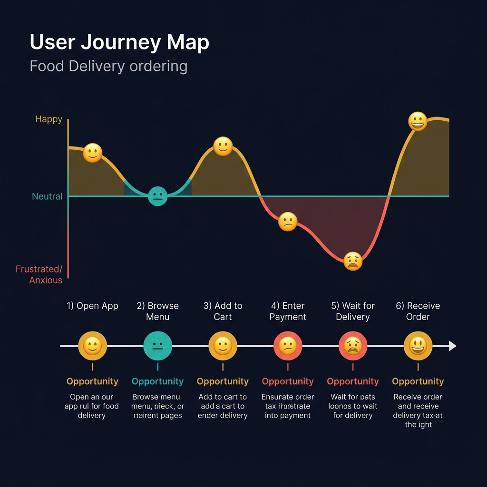
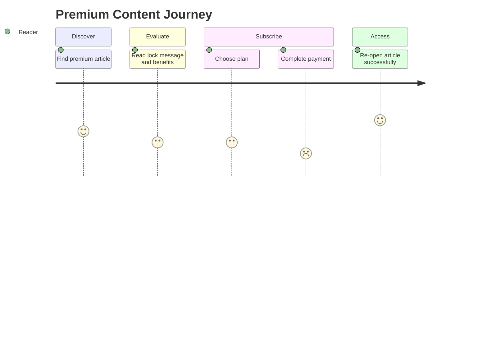
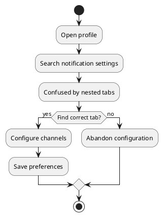
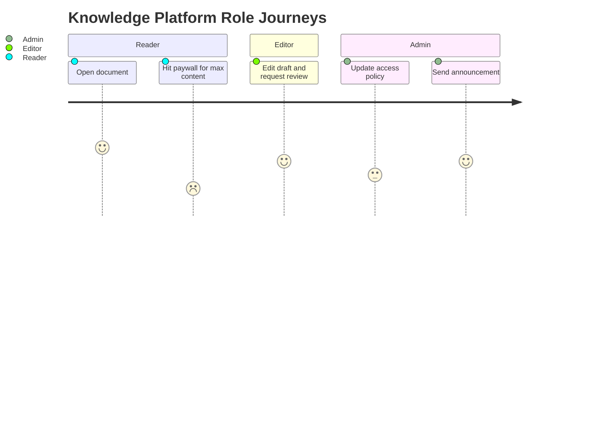

<!-- tags: diagram, product-ux -->
# 🧭 User Journey

> User journey diagrams help the team see the product from the perspective of user steps and sentiment, not just APIs or screens.

📅 Created: 2026-04-01 · 🔄 Updated: 2026-04-20 · ⏱️ 14 min read

| Aspect | Detail |
| ------ | ------ |
| **Focus** | User goals, steps, friction, sentiment |
| **When to use** | When you need alignment between PM, design, and engineering on user flow |
| **Related** | Use Case Diagram, Wireframe Diagram, Event Storming |

---

## 1. DEFINE

Picture a schema review where the team discusses the same tables but nobody is sure about the real cardinality between them. ER diagrams are when data structure must reveal itself before queries and migrations start drifting.

| Element | Role |
| ------- | ---- |
| Persona | Who is walking through the journey |
| Stage | Each phase in the flow |
| Touchpoint | Where the user interacts with the system |
| Pain point | Where friction occurs |

**Core insight**:
- User journey does not describe APIs or classes. It describes **experience**.
- An excellent artifact for finding where product and engineering are optimizing the wrong thing.
- A good journey should expose pain points, not just list the happy path.

Those failure modes sound familiar. But there is a trap: drawing screen flow instead of journey loses the user-goal perspective. That trap appears in PITFALLS.

## 2. VISUAL

### User Journey Map Example

The image below shows a food delivery journey map with six touchpoints plotted on an emotion curve. The dips at "Enter Payment" and "Wait for Delivery" are the pain points — these are where UX investment delivers the highest ROI.



*Image: A journey map without an emotion curve is just a feature list. The curve is what separates UX thinking from functional specification — it shows where the user feels pain, which is where you invest.*

### Preview UI



*Figure: A premium content journey — each stage shows sentiment score. The payment step (score 2) reveals the highest friction.*

```text
Discover -> Evaluate -> Act -> Wait -> Resolve
```

## 3. CODE

### Mermaid Practice Block

````md

````

### Example 1: Basic — Checkout journey

> **Goal**: Clarify the steps the user walks through from browse to complete order.
> **Approach**: Divide by stage instead of internal screens.
> **Example**: `User finds premium doc, subscribes, and pays.`


> **Conclusion**: A basic journey helps the team see the real-world user flow before optimizing individual screens or APIs.

### Example 2: Intermediate — Journey with friction points

> **Goal**: Not just draw the path but also reveal where users are most likely to drop off.
> **Approach**: Attach sentiment or pain scores to high-friction steps.
> **Example**: `Notification settings are hard to find and cause users to abandon configuration.`



> **Conclusion**: At the intermediate level, journey diagrams become a tool for finding friction to prioritize UX debt or onboarding fixes.

### Example 3: Advanced — Multi-persona journey for access control

> **Goal**: Compare journeys of Reader, Editor, and Admin around the same capability to spot where the product boundary is unclear.
> **Approach**: Place multiple personas on the same narrative but keep only decision-affecting steps.
> **Example**: `Reader views article, Editor edits draft, Admin manages policy.`



> **Conclusion**: Advanced journey maps are useful when reviewing pricing, permissions, and publishing workflow from multiple personas simultaneously.

## 4. PITFALLS

| # | Mistake | Consequence | Fix |
|---|---------|-------------|-----|
| 1 | Drawing screen flow instead of journey | Loses the user-goal perspective | Organize by user stage, not internal route |
| 2 | Not marking pain points | Diagram becomes just a pretty happy path | Always mark friction or sentiment |
| 3 | Cramming too many unrelated personas | Reader cannot tell who the main character is | One diagram should serve one primary product question |

## 5. REF

| Resource | Link |
| -------- | ---- |
| Mermaid journey | https://mermaid.js.org/syntax/userJourney.html |
| NNGroup journey mapping | https://www.nngroup.com/articles/customer-journey-mapping/ |

## 6. RECOMMEND

| Next step | When | Reason |
| --------- | ---- | ------ |
| Wireframe Diagram | When you want to bring the journey map down to rough layout | Move from experience to IA |
| Use Case Diagram | When you need to convert user goals into system capabilities | Connect product with system scope |
| Event Storming | When the journey touches complex domain rules | Translate experience into domain events |

---

**Links**: ← Previous · [→ Next](./02-wireframe-diagram.md)
