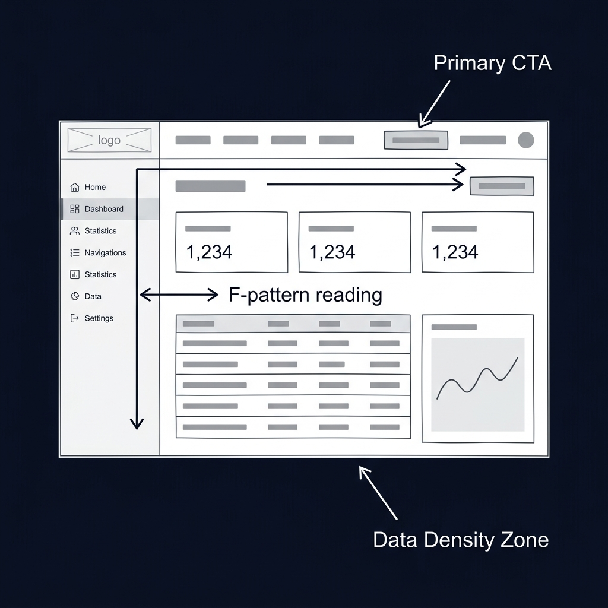
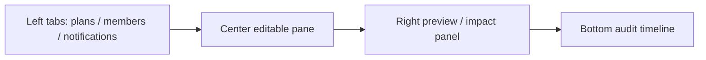
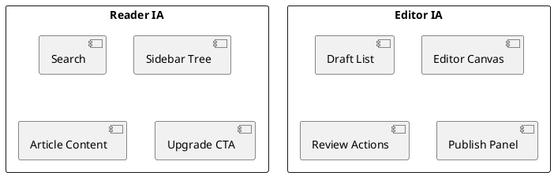

<!-- tags: diagram, product-ux -->
# 🧩 Wireframe Diagram

> Wireframe diagrams help lock information architecture and primary actions before the team drifts into colors or animation.

📅 Created: 2026-04-01 · 🔄 Updated: 2026-04-20 · ⏱️ 14 min read

| Aspect | Detail |
| ------ | ------ |
| **Focus** | Layout, information hierarchy, user action path |
| **When to use** | When you need to align screen flow quickly with PM, design, frontend |
| **Related** | User Journey, Use Case Diagram, Flowchart |

---

## 1. DEFINE

Before discussing colors or pixel-perfect UI, the team usually needs to agree on screen flow and information hierarchy. Wireframes are most useful when people still need to discuss layout and content priority.

| Element | Meaning |
| ------- | ------- |
| Regions | Content areas on the screen |
| Primary action | Most important CTA |
| Secondary action | Supporting CTA that must not overpower the primary |
| Navigation | How users move between main areas |

**Core insight**:
- Wireframes do not need to be beautiful. They need correct information priority.
- The fastest way to reveal a missing CTA, excess panels, or wrong hierarchy.
- A good wireframe helps engineering understand layout intent before coding real UI.

Those failure modes sound clear. But there is a trap: polishing too early means debating colors instead of IA. That trap appears in PITFALLS.

## 2. VISUAL

### Wireframe Example

The image below shows a low-fidelity dashboard wireframe with annotation arrows pointing to key UX patterns: Primary CTA placement, F-pattern reading flow, and Data Density Zone. Wireframes communicate layout intent without visual design distraction.



*Image: A wireframe with colors and fonts is a mockup pretending to be a wireframe. True wireframes use gray boxes precisely because they force the conversation to be about layout and information hierarchy, not visual polish.*

### Preview UI



*Figure: An admin wireframe — navigation on the left, editable pane in center, preview on right, audit at bottom. Layout intent is visible without any styling.*

```text
Header -> Sidebar -> Main content -> CTA / Secondary actions
```

## 3. CODE

### Mermaid Practice Block

````md

````

### Example 1: Basic — Document reader page wireframe

> **Goal**: Arrange navigation area and reading area for a docs screen.
> **Approach**: Keep the wireframe at content hierarchy level, not visual polish.
> **Example**: `Left sidebar, center content, actions at top-right.`

```text
+------------------------------------------------------+
| Logo | Search | User Menu                            |
+----------------------+-------------------------------+
| Sidebar tree         | Article title                 |
| - Section            | Meta / tags                   |
| - Topic              | ---------------------------   |
| - Current file       | Main content                  |
|                      |                               |
|                      | Upgrade CTA / Related links   |
+----------------------+-------------------------------+
```

> **Conclusion**: A basic wireframe is enough to lock reading hierarchy without discussing style.

### Example 2: Intermediate — Admin access control screen

> **Goal**: Wireframe a multi-tab admin screen while maintaining task focus.
> **Approach**: Clearly separate navigation, editable pane, and audit/reference pane.
> **Example**: `Admin needs to adjust plan/tier, see preview, and view audit on one screen.`


> **Conclusion**: At the intermediate level, wireframes start helping review information density and task focus instead of just rough layout.

### Example 3: Advanced — Compare reader vs editor IA

> **Goal**: Compare two wireframes for two personas to detect which screen is trying to carry too many tasks.
> **Approach**: Place reader IA and editor IA side by side instead of merging into one "multi-purpose" screen.
> **Example**: `Reader page prioritizes reading flow, editor page prioritizes draft workflow.`



> **Conclusion**: Advanced wireframe review helps the team avoid the anti-pattern of "one screen does everything," which is a major source of cognitive load.

## 4. PITFALLS

| # | Mistake | Consequence | Fix |
|---|---------|-------------|-----|
| 1 | Polishing too early | Debates colors instead of IA | Keep fidelity low in the early stage |
| 2 | Not clarifying primary CTA | User path is blurred | Each screen should have exactly one prominent primary action |
| 3 | Merging many personas into one layout | Screen becomes heavy and hard to use | Separate wireframes by role or task |

## 5. REF

| Resource | Link |
| -------- | ---- |
| NNGroup wireframes | https://www.nngroup.com/articles/wireframes-and-prototypes/ |
| Excalidraw | https://excalidraw.com/ |

## 6. RECOMMEND

| Next step | When | Reason |
| --------- | ---- | ------ |
| User Journey | When you need to understand why this layout exists | Connect screen with user flow |
| Flowchart | When you want to express branch logic after wireframe | Move from layout to behavior |
| Quadrant Chart | When you need to prioritize redesign | Pick the right screen to invest in |

---

**Links**: [← Previous](./01-user-journey.md) · [→ Next](./03-event-storming.md)
