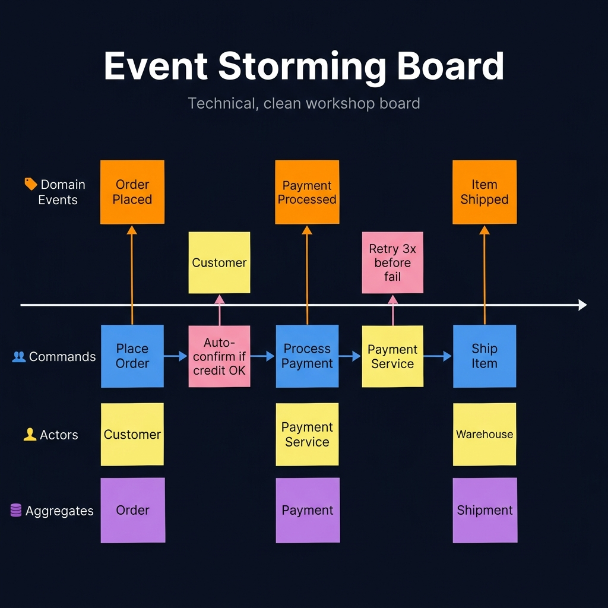
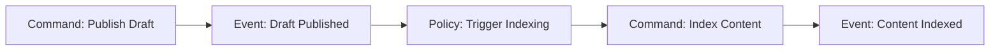
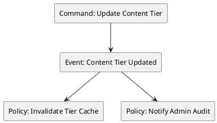
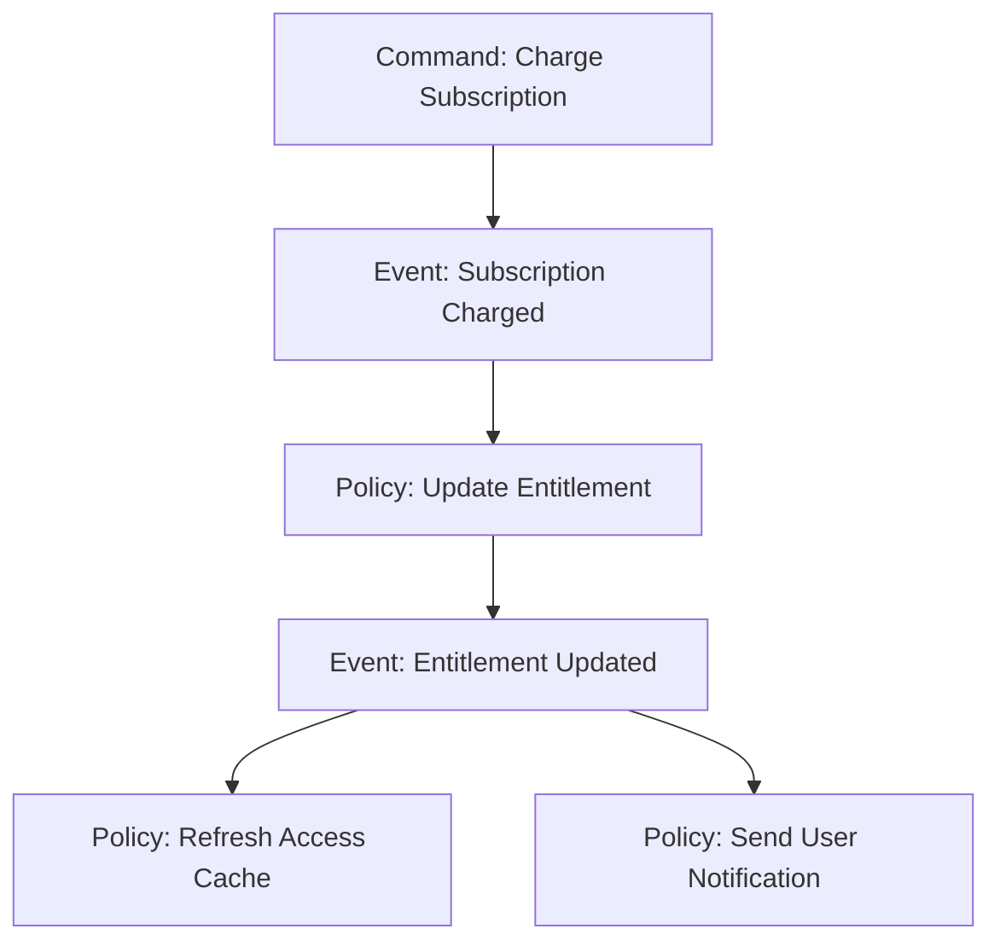

<!-- tags: diagram, product-ux -->
# ⚡ Event Storming

> Event Storming is a powerful DDD technique that helps the team see the domain through events, commands, policies, and aggregates instead of debating at the vague CRUD level.

📅 Created: 2026-04-01 · 🔄 Updated: 2026-04-20 · ⏱️ 15 min read

| Aspect | Detail |
| ------ | ------ |
| **Focus** | Domain events and business flow |
| **When to use** | When requirements are complex with many rules and bounded contexts |
| **Related** | User Journey, Data Flow Diagram, Microservices Patterns |

---

## 1. DEFINE

Picture a workshop where business and engineering both talk about the same domain but speak two different languages. Event storming appears to pull events, commands, and aggregates onto the same shared surface.

| Element | Role |
| ------- | ---- |
| Command | Intent to cause a change |
| Event | Something that already happened in the domain |
| Policy | Rule that reacts to an event |
| Aggregate / actor | Who owns or initiates the change |

**Core insight**:
- Event storming helps the team speak in domain language instead of jumping to tables or APIs too early.
- Especially useful when the process has many side effects and async reactions.
- When event storming is clean, extracting aggregates, service boundaries, and outbox/saga becomes much easier.

Those failure modes sound easy to avoid. But there is a trap: using table/API names instead of domain language strips the workshop of its value. That trap appears in PITFALLS.

## 2. VISUAL

### Event Storming Board

The image below shows an Event Storming board with color-coded sticky notes: orange for Domain Events, blue for Commands, yellow for Actors, pink for Policies, and purple for Aggregates. The horizontal timeline reveals the complete business flow.



*Image: An Event Storming board where all stickies are the same color has lost its diagnostic power. The colors are a visual type system — they force the team to classify each element, which surfaces hidden domain concepts.*

### Preview UI



*Figure: A command-event-policy chain — one business action triggers a sequence of domain reactions. Each node is either intent or fact.*

```text
Command -> Domain Event -> Policy -> Next Command -> Read Model
```

## 3. CODE

### Mermaid Practice Block

````md

````

### Example 1: Basic — Publish content domain flow

> **Goal**: Describe the command-event-policy chain of a simple use case.
> **Approach**: Start from the business action, not from database tables.
> **Example**: `Editor presses publish on a draft.`


> **Conclusion**: Basic event storming is enough for the team to see the business reaction chain without touching implementation.

### Example 2: Intermediate — Access control policy flow

> **Goal**: Attach access control changes to domain events to show impact beyond the admin UI.
> **Approach**: Map policy updates as events, then connect to notification and cache invalidation.
> **Example**: `Admin changes the tier of a premium content path.`



> **Conclusion**: When policy changes are expressed as domain events, the team sees clearly which side effects need synchronization instead of thinking it is just a simple row update.

### Example 3: Advanced — Subscription and entitlement domain map

> **Goal**: Use event storming to reveal domain boundaries between billing, entitlement, and content access.
> **Approach**: Separate billing events from access resolution events to avoid mixing bounded contexts.
> **Example**: `Successful payment does not mean the entitlement cache has finished updating.`



> **Conclusion**: Advanced event storming is ideal for locking bounded contexts and async boundaries before the team discusses saga or outbox patterns.

## 4. PITFALLS

| # | Mistake | Consequence | Fix |
|---|---------|-------------|-----|
| 1 | Using table/API names instead of domain language | Workshop loses its domain value | Force the team to use ubiquitous language |
| 2 | Mixing commands with events | Cannot distinguish intent from fact | Command = intent, Event = something that happened |
| 3 | Not separating bounded contexts | All events stick together | Group events by capability or aggregate |

## 5. REF

| Resource | Link |
| -------- | ---- |
| Event Storming by Alberto Brandolini | https://www.eventstorming.com/ |
| DDD community resources | https://dddcommunity.org/ |

## 6. RECOMMEND

| Next step | When | Reason |
| --------- | ---- | ------ |
| Microservices Patterns | When the event chain starts splitting into services | Connect to saga/outbox/CQRS |
| Data Flow Diagram | When you need to track data movement after domain events | Add data perspective |
| Auth Flow | When identity/payment/event interact | Clarify the security path |

---

**Links**: [← Previous](./02-wireframe-diagram.md) · → Next
