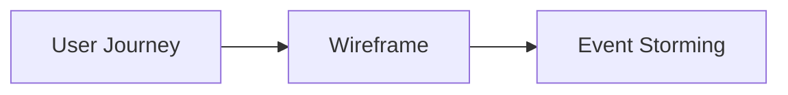

<!-- tags: overview -->
# Product & UX Diagrams

> Lane for journey, wireframe, and event storming from the user and product perspective.

| Aspect | Detail |
| --- | --- |
| **Concept** | Navigation hub for `Product & UX Diagrams` |
| **Audience** | PM, designer, backend engineer, facilitator |
| **Primary style** | Concept-First router |
| **Entry point** | Open when the system needs to be told from the user journey or workshop discovery side. |

📅 Updated: 2026-04-20 · ⏱️ 6 min read

---

## 1. DEFINE

Sometimes the problem is not about which service calls which service. It is about which journey the user walks through and how far the team understands the product. Diagrams in this lane pull product thinking onto the same table as technical thinking.

This hub does not replace individual articles. It routes you to the correct lane before you wander into tools, syntax, or a specific diagram type.

### Signals & Boundaries

- Open this hub when you know the problem lives inside `Product & UX Diagrams` but are unsure which article to read first.
- Use the coverage map to route by pain point instead of file order.
- Return to this hub after each article to choose the next step with intention.

### Coverage Map

| Entry | Role |
| --- | --- |
| [User Journey](01-user-journey.md) | Entry point for lane `User Journey` |
| [Wireframe Diagram](02-wireframe-diagram.md) | Entry point for lane `Wireframe Diagram` |
| [Event Storming](03-event-storming.md) | Entry point for lane `Event Storming` |

---

## 2. VISUAL

### User-Centered Diagram Family

Three diagram types bridge the gap between product thinking and technical implementation. The image below shows each type with its visual signature: journey maps track user emotion across touchpoints, wireframes lock layout before coding, and event storming discovers domain events before service design.


*Image: These three diagram types serve three different audiences at three different stages. User Journey precedes Wireframe, and both precede Event Storming — reversing the order means designing screens for journeys nobody mapped.*

### Preview UI



*Figure: Product diagrams progress from user experience (Journey) through layout structure (Wireframe) to domain discovery (Event Storming).*

### Level 1

```text
start from your current pain point
  -> User Journey      (user goals, friction, sentiment)
  -> Wireframe Diagram (layout, hierarchy, CTA)
  -> Event Storming    (domain events, commands, policies)
```

*Figure: This hub works as a router, not a catalog to scroll through.*

---

## 3. CODE

### Mermaid Practice Block

````md

````

### Problem 1: Basic — Route the lane before reading deep

> **Goal**: Prevent study or review from drifting into "open whichever article looks interesting."
> **Approach**: Choose a lane by pain point.
> **Example**: Selecting the right cluster inside `Product & UX Diagrams`.
> **Complexity**: Basic

```yaml
router:
  module: Product & UX Diagrams
  rule: "choose by pain point, not by familiar name"
  suggested_path:
  - 01-user-journey.md
  - 02-wireframe-diagram.md
  - 03-event-storming.md
```

---

## 4. PITFALLS

| # | Severity | Mistake | Consequence | Fix |
| --- | --- | --- | --- | --- |
| 1 | 🔴 Fatal | Reading by file order instead of routing by pain point | Accumulates terminology without solving the real problem | Use the coverage map first |
| 2 | 🟡 Common | Treating the README as a pure link catalog | Loses the hub's routing purpose | Always ask "which lane matches my current pain?" |
| 3 | 🔵 Minor | Finishing an article without returning to the hub | Jumps to an adjacent article by instinct | Return to the README to pick the next step |

---

## 5. REF

| Resource | Type | Link | Notes |
| --- | --- | --- | --- |
| Mermaid journey | Official docs | https://mermaid.js.org/syntax/userJourney.html | Journey-style visualization in markdown |
| EventStorming | Official site | https://www.eventstorming.com/ | Discovery workshop and domain exploration |
| Balsamiq wireframing guide | Official guide | https://balsamiq.com/learn/articles/what-are-wireframes/ | Wireframe framing and level of fidelity |

## 6. RECOMMEND

| Next step | When | Reason | File/Link |
| --- | --- | --- | --- |
| User Journey | When your pain point matches this lane | Continue into the right cluster | [User Journey](01-user-journey.md) |
| Wireframe Diagram | When your pain point matches this lane | Continue into the right cluster | [Wireframe Diagram](02-wireframe-diagram.md) |
| Event Storming | When your pain point matches this lane | Continue into the right cluster | [Event Storming](03-event-storming.md) |
