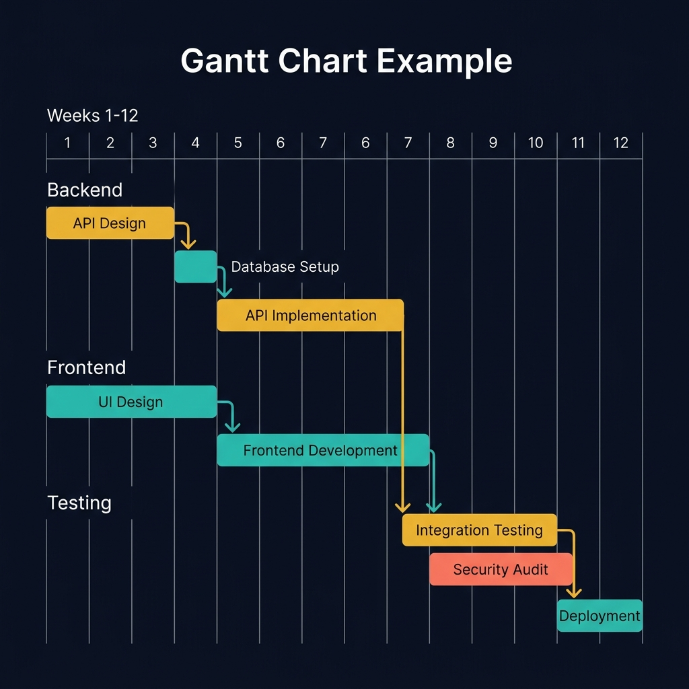
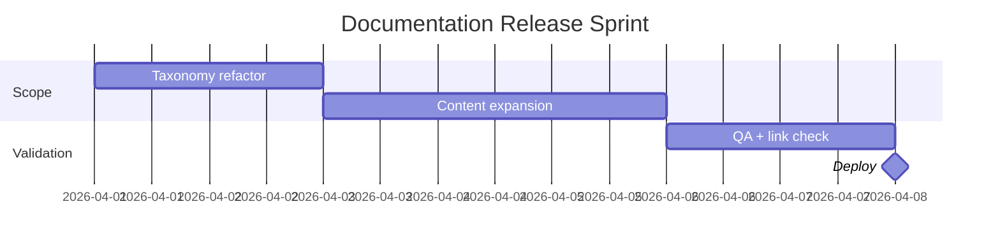
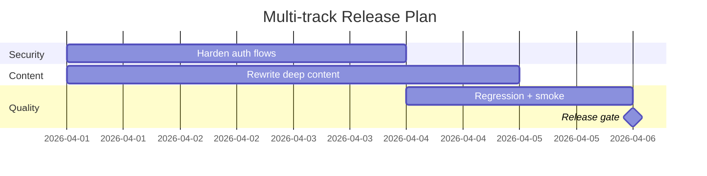

<!-- tags: diagram, planning -->
# 📆 Gantt Chart

> Gantt charts fit when the team needs to see timeline, dependency, and milestones on a time axis instead of just a task list.

📅 Created: 2026-04-01 · 🔄 Updated: 2026-04-20 · ⏱️ 14 min read

| Aspect | Detail |
| ------ | ------ |
| **Focus** | Timeline, dependency, critical path |
| **When to use** | When planning release, migration, rollout, sprint milestone |
| **Related** | Mindmap, Quadrant Chart, CI/CD Pipeline |

---

## 1. DEFINE

A plan with many dependencies often looks fine as a bullet list until deadlines start overlapping. Gantt charts force the time axis and dependencies to show their shape instead of being silently assumed.

| Element | Purpose |
| ------- | ------- |
| Task | Work item with duration |
| Milestone | Key checkpoint |
| Dependency | Before/after relationship between tasks |
| Timeline | Day / week / month axis |

**Core insight**:
- Gantt does not replace a backlog. It adds **time and dependency** on top of one.
- Ideal for spotting critical path and which task is blocking which.
- If every task is "urgent," Gantt stops helping with decisions.

Those failure modes sound basic. But there is a trap: using Gantt for extremely small tasks creates a noisy timeline. That trap appears in PITFALLS.

## 2. VISUAL

### Gantt Chart Example

The image below shows a project Gantt chart with three work streams (Backend, Frontend, Testing) and dependency arrows between tasks. The critical path — the longest chain of dependent tasks — is highlighted in amber.



*Image: A Gantt chart without dependency arrows is a wish list with dates. The arrows expose which delays cascade — remove them and the PM cannot tell the difference between a 1-day slip and a project-blocking delay.*

### Preview UI



*Figure: A docs sprint Gantt — tasks flow left to right on a time axis. The milestone marks the release gate.*

```text
Task A ---> Task B ---> Milestone
         \-> Task C --/
```

## 3. CODE

### Mermaid Practice Block

````md

````

### Example 1: Basic — Release docs sprint plan

> **Goal**: Build a simple timeline for a docs sprint.
> **Approach**: Keep only main tasks and the release milestone.
> **Example**: `Taxonomy, content batch, QA, deploy.`


> **Conclusion**: A basic Gantt is enough for the team to see sequence and milestone without a heavyweight project plan.

### Example 2: Intermediate — Migration rollout with dependencies

> **Goal**: Use Gantt to see dependencies between migration, app release, and smoke test.
> **Approach**: Attach clear dependencies to tasks that cannot run in parallel.
> **Example**: `DB migration must finish before app shell rollout.`

```plantuml
@startgantt
Project starts 2026-04-01
[Schema migration] lasts 2 days
[Backend rollout] starts at [Schema migration]'s end and lasts 2 days
[Frontend rollout] starts at [Backend rollout]'s end and lasts 1 days
[Smoke test] starts at [Frontend rollout]'s end and lasts 1 days
@endgantt
```



> **Conclusion**: Intermediate Gantt reveals which tasks truly block the rollout path instead of letting the team guess by instinct.

### Example 3: Advanced — Multi-track delivery plan

> **Goal**: Review a roadmap with multiple parallel tracks sharing a release milestone.
> **Approach**: Separate workstreams by lane, then converge at a shared milestone.
> **Example**: `Security hardening, content migration, QA automation all converge at release.`



> **Conclusion**: At the advanced level, Gantt is very useful for revealing which track is the milestone bottleneck, not just displaying a pretty schedule.

## 4. PITFALLS

| # | Mistake | Consequence | Fix |
|---|---------|-------------|-----|
| 1 | Using Gantt for extremely small tasks | Timeline becomes noisier than the value it provides | Keep only milestones and tasks that truly affect the plan |
| 2 | Not showing dependencies | Team assumes all tasks are independent | Attach before/after relationships clearly |
| 3 | Not updating the plan after scope changes | Diagram quickly becomes fiction | Only use Gantt for plans that are still maintained |

## 5. REF

| Resource | Link |
| -------- | ---- |
| Mermaid Gantt | https://mermaid.js.org/syntax/gantt.html |
| PlantUML Gantt | https://plantuml.com/gantt-diagram |

## 6. RECOMMEND

| Next step | When | Reason |
| --------- | ---- | ------ |
| Quadrant Chart | When you need to decide priority before putting items into Gantt | Lock priority before locking timeline |
| Git Graph | When rollout depends on branch/release flow | Tie timeline to Git strategy |
| CI/CD Pipeline | When the release plan is tightly coupled with pipeline stages | Connect planning with automation |

---

**Links**: ← Previous · [→ Next](./02-mindmap.md)
