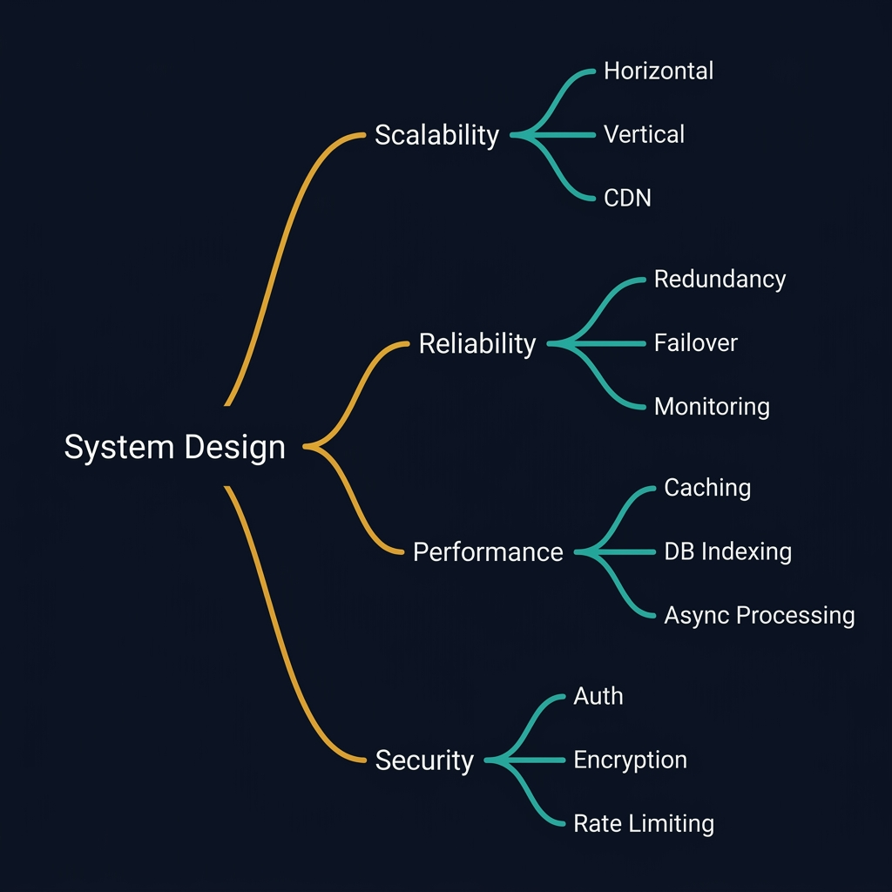
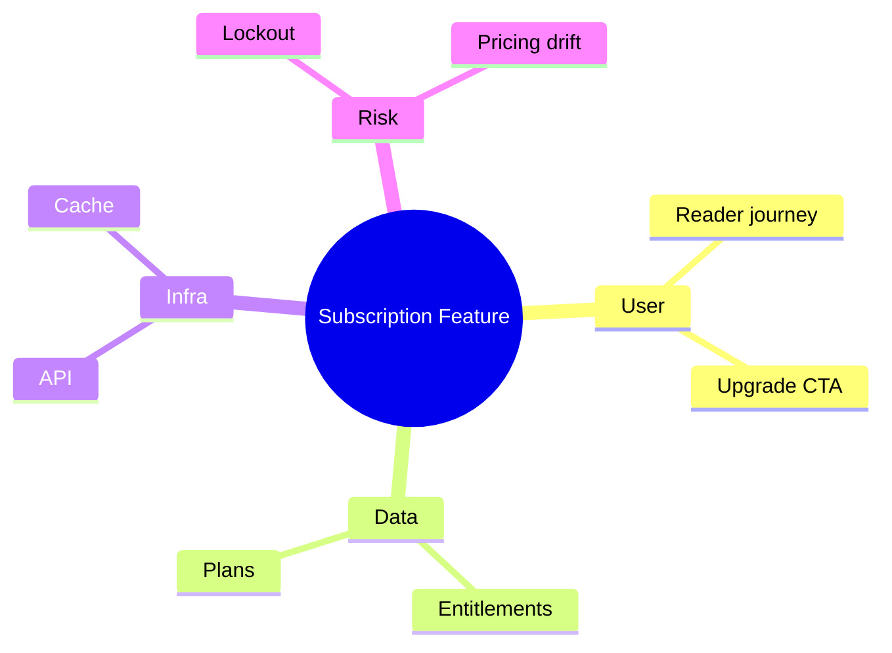
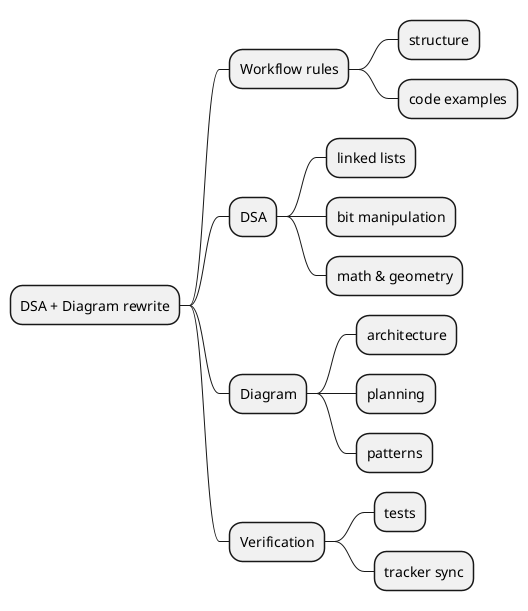
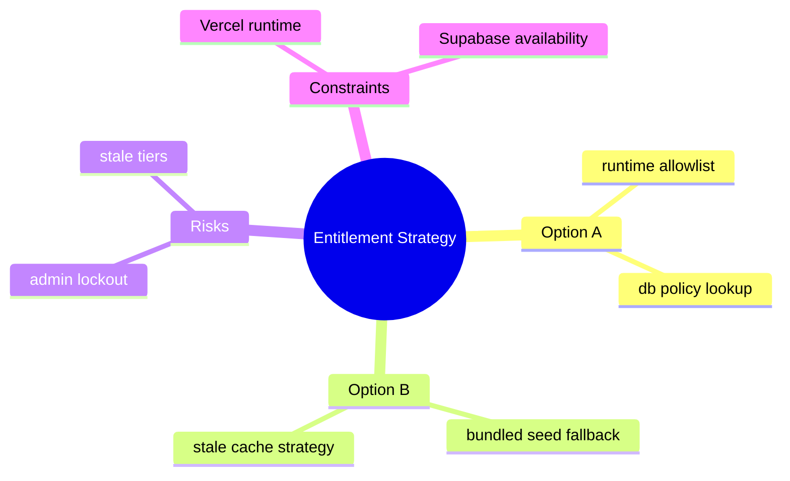

<!-- tags: diagram, planning -->
# 🧠 Mindmap

> Mindmaps are lightweight but powerful for brainstorming, decomposition, and structuring ideas before moving to formal docs.

📅 Created: 2026-04-01 · 🔄 Updated: 2026-04-20 · ⏱️ 13 min read

| Aspect | Detail |
| ------ | ------ |
| **Focus** | Exploration and decomposition |
| **When to use** | When the problem is still vague and you need to expand the idea space |
| **Related** | Gantt Chart, Quadrant Chart, Event Storming |

---

## 1. DEFINE

When ideas are still branching and have not entered linear structure, a mindmap is the fastest way to see the entire thinking space before choosing which branch becomes a real plan.

| Element | Role |
| ------- | ---- |
| Root topic | Central subject |
| Branch | Major thinking direction |
| Leaf | Detail, task, or small concern |
| Cluster | Group of related ideas |

**Core insight**:
- Mindmaps excel at the idea expansion phase, not at the detail-locking phase.
- They help the team brainstorm without being forced to choose a final structure too early.
- If a branch goes too deep or has too many leaves, that signals the need to split the workshop or change artifacts.

Those failure modes sound familiar. But there is a trap: a mindmap that goes too deep loses the overview, and unbalanced branches create misleading emphasis. That trap appears in PITFALLS.

## 2. VISUAL

### Mindmap Example

The image below shows a System Design mindmap with four main branches: Scalability, Reliability, Performance, and Security. Each branch fans into three specific sub-topics. Mindmaps work best for brainstorming and exploration, not for execution planning.



*Image: A mindmap with more than three levels of depth has outgrown the format. If you need that much structure, switch to an outline or a component diagram — mindmaps are for divergent thinking, not convergent design.*

### Preview UI



*Figure: A feature decomposition mindmap — four branches (User, Data, Infra, Risk) radiate from the root. Each branch reveals a different concern cluster.*

```text
Root -> branch -> leaf
```

## 3. CODE

### Mermaid Practice Block

````md

````

### Example 1: Basic — Product discovery mindmap

> **Goal**: Break a large feature into concern groups easy to discuss.
> **Approach**: Place the feature at root, then branch by user, data, infra, risk.
> **Example**: `Subscription & access control feature.`


> **Conclusion**: A basic mindmap expands the problem space very quickly without needing to commit to a design solution.

### Example 2: Intermediate — Technical decomposition for docs expansion

> **Goal**: Split a large batch of work into independently assignable streams.
> **Approach**: Group by taxonomy, content depth, verification, and rollout.
> **Example**: `Rewrite DSA + Diagram following the create-doc workflow.`



> **Conclusion**: Intermediate mindmaps are useful for turning a large request into workstreams that can be assigned or reviewed independently.

### Example 3: Advanced — Architecture exploration before ADR

> **Goal**: Use a mindmap to explore trade-offs before packaging into an ADR or design doc.
> **Approach**: Place the decision at root; branches are options, risks, constraints, and unknowns.
> **Example**: `Choose strategy for entitlement resolution.`



> **Conclusion**: Advanced mindmaps are ideal for keeping trade-offs visible before the team commits to a specific architecture decision.

## 4. PITFALLS

| # | Mistake | Consequence | Fix |
|---|---------|-------------|-----|
| 1 | Using mindmap as the final document | Ideas remain scattered, no decision is locked | Mindmaps are for exploration, not final artifacts |
| 2 | Root too vague | Branches expand endlessly | Set root as a specific feature or question |
| 3 | Not grouping branches by theme | Diagram is hard to read | Group by major concern before going down to leaves |

## 5. REF

| Resource | Link |
| -------- | ---- |
| Mermaid mindmap | https://mermaid.js.org/syntax/mindmap.html |
| XMind inspiration | https://xmind.app/ |

## 6. RECOMMEND

| Next step | When | Reason |
| --------- | ---- | ------ |
| Gantt Chart | When exploration is done and you need to move to timeline | From idea to execution |
| Event Storming | When branches start leaning toward domain behavior | From brainstorm to domain model |
| ADR / plan docs | When an option is chosen | Package the conclusion formally |

---

**Links**: [← Previous](./01-gantt-chart.md) · [→ Next](./03-quadrant-chart.md)
