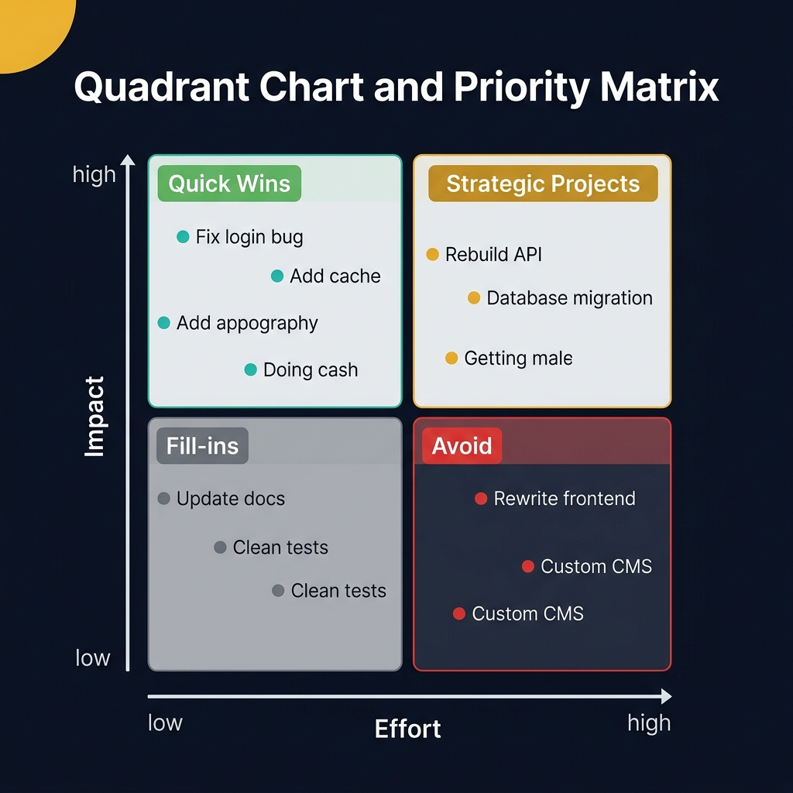
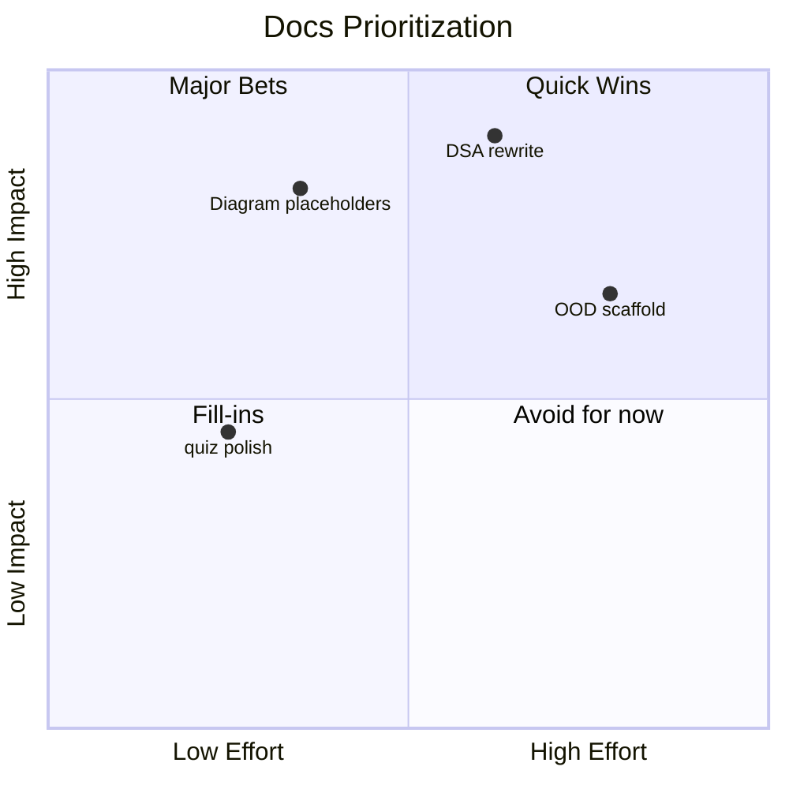
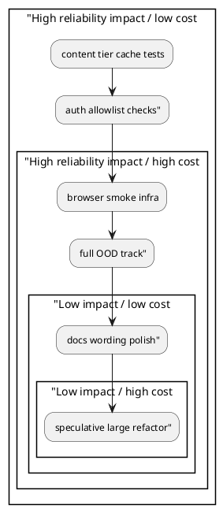

<!-- tags: diagram, planning -->
# 🧮 Quadrant Chart

> Quadrant charts help teams prioritize quickly across two axes like impact/effort, risk/value, or urgency/importance.

📅 Created: 2026-04-01 · 🔄 Updated: 2026-04-20 · ⏱️ 13 min read

| Aspect | Detail |
| ------ | ------ |
| **Focus** | Prioritization by two dimensions |
| **When to use** | When the backlog exceeds execution capacity |
| **Related** | Gantt Chart, Mindmap, Diagram Antipatterns |

---

## 1. DEFINE

You need to prioritize among many tasks that all seem important, but cannot discuss effectively without a shared frame for value and cost. Quadrant charts force the choice onto a clear axis system.

| Axis | Examples |
| ---- | -------- |
| X-axis | Effort, complexity, cost |
| Y-axis | Impact, value, urgency |
| Quadrants | Quick wins, major bets, low-value work, avoid |

**Core insight**:
- Quadrant charts do not give timeline. They give **priority order**.
- Most effective when the team is debating "what to do first," not "how to do it."
- Both axes must measure the same type of thinking. Otherwise the chart is just decorated intuition.

Those failure modes sound clear. But there is a trap: axes without clear metrics make item placement arbitrary. That trap appears in PITFALLS.

## 2. VISUAL

### Quadrant Chart Example

The image below shows a 2x2 priority matrix with Impact on the Y-axis and Effort on the X-axis. The four quadrants — Quick Wins, Strategic Projects, Fill-ins, Avoid — provide an instant prioritization framework for backlog grooming.



*Image: A quadrant chart where every item lands in "Quick Wins" is a red flag — it means the team has not calibrated effort honestly. The power of the quadrant is forcing trade-offs to the surface.*

### Preview UI



*Figure: A docs prioritization chart — items plotted by effort and impact. "Diagram placeholders" sits in Quick Wins; "DSA rewrite" is a Major Bet.*

```text
Low effort / high impact -> quick wins
High effort / low impact -> avoid or defer
```

## 3. CODE

### Mermaid Practice Block

````md

````

### Example 1: Basic — Docs backlog prioritization

> **Goal**: Quickly sort docs items by effort and impact.
> **Approach**: Only take 4-6 items that are genuinely competing for resources.
> **Example**: `DSA rewrite`, `Diagram placeholders`, `OOD scaffold`, `quiz polish`.


> **Conclusion**: A basic quadrant chart is ideal for pulling the team out of gut-feeling arguments like "everything is important."

### Example 2: Intermediate — Risk vs value for infrastructure work

> **Goal**: Choose the right infra work to do early before release.
> **Approach**: Use risk reduction instead of impact if the question is release safety.
> **Example**: `JWT hardening`, `browser smoke setup`, `network diagram cleanup`.

```text
High value / low effort  : JWT env validation
High value / high effort : browser E2E infrastructure
Low value / low effort   : UI polish not tied to release
Low value / high effort  : large refactor without user benefit
```

> **Conclusion**: Intermediate quadrant charts allow swapping axes by context, as long as the team agrees on what is being optimized.

### Example 3: Advanced — Prioritize technical debt without bikeshedding

> **Goal**: Use a quadrant chart to cut bikeshedding about technical debt by placing it on the same frame as feature work.
> **Approach**: Score by impact on reliability and execution cost, not by the proposer's emotions.
> **Example**: `Service worker drift`, `content tier cache risk`, `diagram taxonomy cleanup`.



> **Conclusion**: At the advanced level, quadrant charts are a small but powerful governance tool for reducing bikeshedding in engineering decisions.

## 4. PITFALLS

| # | Mistake | Consequence | Fix |
|---|---------|-------------|-----|
| 1 | Putting too many items in the chart | Chart becomes an unreadable blob of text | Limit to 5-10 genuinely competing items |
| 2 | Axes not clearly defined | Everyone scores by their own standard | Write axis definitions directly on the chart |
| 3 | Using chart as absolute decision | Ignores strategic context | Use chart to support, not replace judgment |

## 5. REF

| Resource | Link |
| -------- | ---- |
| Mermaid quadrantChart | https://mermaid.js.org/syntax/quadrantChart.html |
| Eisenhower matrix background | https://www.eisenhower.me/eisenhower-matrix/ |

## 6. RECOMMEND

| Next step | When | Reason |
| --------- | ---- | ------ |
| Gantt Chart | When priority is locked and you need to schedule | Turn priority into timeline |
| Mindmap | When chart reveals items that are too vague | Need decomposition first |
| Diagram Antipatterns | When the team keeps using charts for decoration instead of decisions | Prevent misuse |

---

**Links**: [← Previous](./02-mindmap.md) · [→ Next](./04-git-graph.md)
