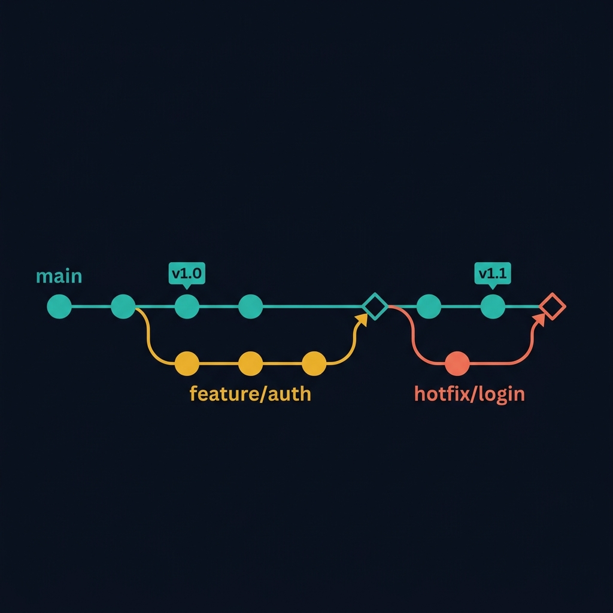
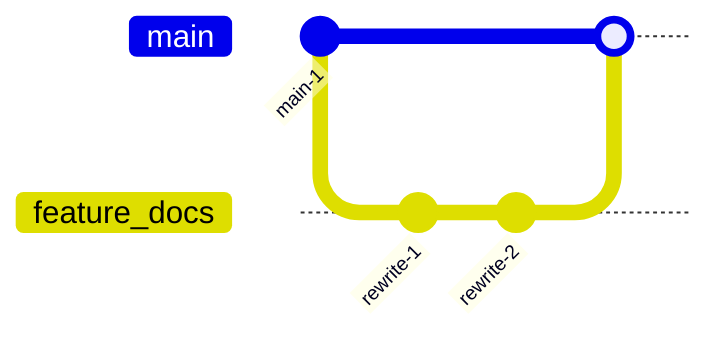
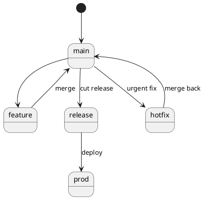

<!-- tags: diagram, planning -->
# 🌿 Git Graph

> Git graphs help the team see branch/release strategy as a visual path instead of explaining through long prose or scattered commit logs.

📅 Created: 2026-04-01 · 🔄 Updated: 2026-04-20 · ⏱️ 13 min read

| Aspect | Detail |
| ------ | ------ |
| **Focus** | Branch strategy and release flow |
| **When to use** | When you need to explain feature branch, hotfix, release cut, rollback |
| **Related** | Gantt Chart, CI/CD Pipeline, Network Diagram |

---

## 1. DEFINE

A complex git history is rarely understood well through a plain-text commit list. Git graphs are valuable when the team needs to see branch, merge, and release flow as a real path.

| Element | Role |
| ------- | ---- |
| Mainline | Main branch, usually `main` or `develop` |
| Feature branch | Branch for an independent feature |
| Release branch | Branch for locking a release |
| Hotfix branch | Branch for urgent production fix |

**Core insight**:
- Git graphs do not replace workflow policy. They make policy easier to understand.
- Ideal for onboarding new team members or locking release process before a go-live.
- A good graph prevents confusion between trunk-based, GitFlow, and release branch workflows.

Those failure modes sound easy to avoid. But there is a trap: too many branches in one graph creates visual noise. That trap appears in PITFALLS.

## 2. VISUAL

### Git Graph Example

The image below shows a git branch graph with three branches: main (teal), feature/auth (amber, 3 commits), and hotfix/login (coral, 1 commit). Merge points are marked with diamonds. Tags v1.0 and v1.1 anchor the release timeline.



*Image: A git graph without merge direction markers is ambiguous. The diamond merge points show where branches converge — the shape of the graph reveals the team branching strategy at a glance.*

### Preview UI



*Figure: A simple feature branch flow — branch, commit, merge back. The graph shows the exact moment code returns to mainline.*

```text
main -> feature -> merge -> release -> hotfix
```

## 3. CODE

### Mermaid Practice Block

````md

````

### Example 1: Basic — Feature branch flow

> **Goal**: Illustrate the most common workflow: branch a feature then merge back to mainline.
> **Approach**: Keep only branch, commit, and basic merge.
> **Example**: `Docs rewrite done on a separate branch then merged into main.`


> **Conclusion**: A basic git graph is sufficient to explain feature branch workflow for most small app/docs teams.

### Example 2: Intermediate — Release and hotfix flow

> **Goal**: Clarify when to cut a release branch and where hotfixes merge back.
> **Approach**: Clearly separate release branch from hotfix branch to prevent patching the wrong branch.
> **Example**: `Release cut at stable commit, hotfix merged back to mainline.`



> **Conclusion**: Intermediate git graphs are especially useful when the team starts having release cadence and separate production bugfixes.

### Example 3: Advanced — Compare trunk-based vs release branching

> **Goal**: Compare two branch strategies to choose the right workflow for the team's current automation level.
> **Approach**: Place two graphs side by side by integration frequency and release risk.
> **Example**: `Trunk-based for teams with strong CI; release branching for teams needing stabilization windows.`

```text
Trunk-based:
main -> short-lived branch -> merge fast -> deploy multiple times/day

Release branching:
develop -> feature merges -> release branch -> stabilization -> prod
```

> **Conclusion**: At the advanced level, git graphs are not just branch diagrams but tools for discussing trade-offs between integration speed and release control.

## 4. PITFALLS

| # | Mistake | Consequence | Fix |
|---|---------|-------------|-----|
| 1 | Graph does not reflect actual policy | Team reads the diagram then works differently | Only draw workflows that are or will be enforced |
| 2 | Not showing merge-back path | Hotfix and release patches get lost | Draw clearly which branch receives the final patch |
| 3 | Too many unnecessary branch types | Workflow becomes heavy and hard to learn | Keep branch taxonomy minimal for the team |

## 5. REF

| Resource | Link |
| -------- | ---- |
| Mermaid gitGraph | https://mermaid.js.org/syntax/gitgraph.html |
| Trunk-based development | https://trunkbaseddevelopment.com/ |

## 6. RECOMMEND

| Next step | When | Reason |
| --------- | ---- | ------ |
| CI/CD Pipeline | When branch flow is tightly coupled with deploy flow | Connect Git strategy with automation |
| Gantt Chart | When the release branch needs a clear timeline | Tie versioning with release schedule |
| Mindmap | When the team is still exploring workflow options | Brainstorm before locking policy |

---

**Links**: [← Previous](./03-quadrant-chart.md) · → Next
