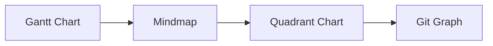

<!-- tags: overview -->
# Planning Diagrams

> Lane for gantt, mindmap, quadrant, and git graph when the problem is about planning or timeline.

| Aspect | Detail |
| --- | --- |
| **Concept** | Navigation hub for `Planning Diagrams` |
| **Audience** | Tech lead, PM, EM, engineer preparing execution |
| **Primary style** | Concept-First router |
| **Entry point** | Open when you need to express plan, priority, or progress instead of system structure. |

📅 Updated: 2026-04-20 · ⏱️ 6 min read

---

## 1. DEFINE

A plan viewed as a bullet list often hides the most important things: dependencies, time, and priority decisions. Planning diagrams exist to force those elements to show their shape.

This hub does not replace individual articles. It routes you to the correct lane before you wander into tools, syntax, or a specific diagram type.

### Signals & Boundaries

- Open this hub when you know the problem lives inside `Planning Diagrams` but are unsure which article to read first.
- Use the coverage map to route by pain point instead of file order.
- Return to this hub after each article to choose the next step with intention.

### Coverage Map

| Entry | Role |
| --- | --- |
| [Gantt Chart](01-gantt-chart.md) | Entry point for lane `Gantt Chart` |
| [Mindmap](02-mindmap.md) | Entry point for lane `Mindmap` |
| [Quadrant Chart](03-quadrant-chart.md) | Entry point for lane `Quadrant Chart` |
| [Git Graph](04-git-graph.md) | Entry point for lane `Git Graph` |

---

## 2. VISUAL

### Timeline, Priority, and Release

Four diagram types address four distinct planning questions. The image below shows each type with its visual signature: Gantt for timeline dependencies, Mindmap for idea exploration, Quadrant for priority decisions, and Git Graph for branch/release flow.


*Image: A bullet-point plan hides dependencies, priority conflicts, and branch strategy. Each planning diagram type forces one of those hidden dimensions to become visible.*

### Preview UI



*Figure: Planning diagrams progress from timeline (Gantt) through exploration (Mindmap), prioritization (Quadrant), to release flow (Git Graph).*

---

## 3. CODE

### Mermaid Practice Block

````md

````

### Problem 1: Basic — Route the lane before reading deep

> **Goal**: Prevent study or review from drifting into "open whichever article looks interesting."
> **Approach**: Choose a lane by pain point.
> **Complexity**: Basic

```yaml
router:
  module: Planning Diagrams
  rule: "choose by pain point, not by familiar name"
  suggested_path:
  - 01-gantt-chart.md
  - 02-mindmap.md
  - 03-quadrant-chart.md
  - 04-git-graph.md
```

---

## 4. PITFALLS

| # | Severity | Mistake | Consequence | Fix |
| --- | --- | --- | --- | --- |
| 1 | 🔴 Fatal | Reading by file order instead of routing by pain point | Accumulates terminology without solving the real problem | Use the coverage map first |
| 2 | 🟡 Common | Treating the README as a pure link catalog | Loses the hub's routing purpose | Always ask "which lane matches my current pain?" |
| 3 | 🔵 Minor | Finishing an article without returning to the hub | Jumps to an adjacent article by instinct | Return to the README to pick the next step |

---

## 5. REF

| Resource | Type | Link | Notes |
| --- | --- | --- | --- |
| Mermaid Gantt | Official docs | https://mermaid.js.org/syntax/gantt.html | Timeline and dependency |
| Mermaid mindmap | Official docs | https://mermaid.js.org/syntax/mindmap.html | Hierarchy and exploration |
| Mermaid gitGraph | Official docs | https://mermaid.js.org/syntax/gitgraph.html | Release and branch flow |

## 6. RECOMMEND

| Next step | When | Reason | File/Link |
| --- | --- | --- | --- |
| Gantt Chart | When your pain point matches this lane | Continue into the right cluster | [Gantt Chart](01-gantt-chart.md) |
| Mindmap | When your pain point matches this lane | Continue into the right cluster | [Mindmap](02-mindmap.md) |
| Quadrant Chart | When your pain point matches this lane | Continue into the right cluster | [Quadrant Chart](03-quadrant-chart.md) |
