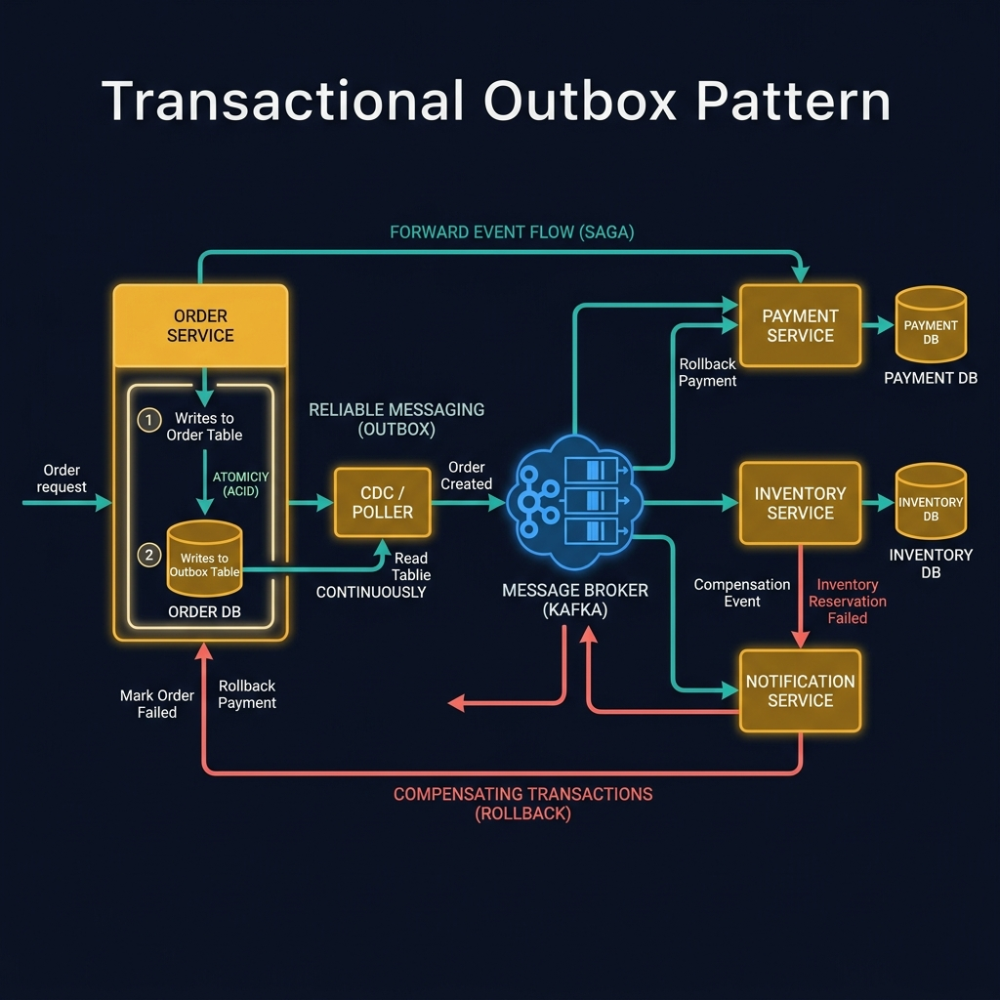
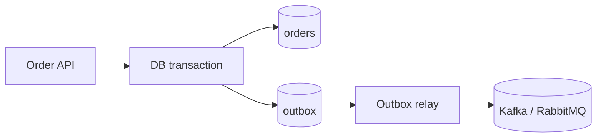
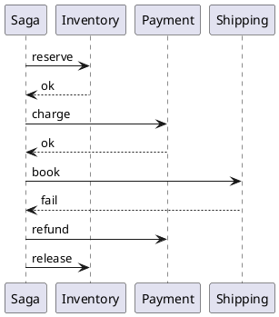
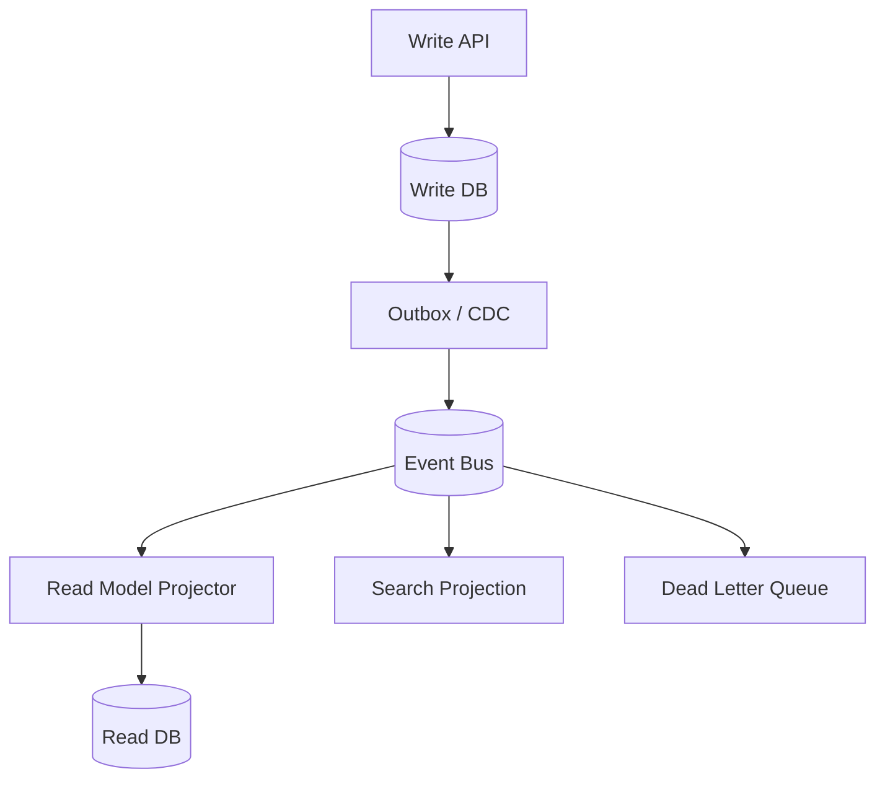

<!-- tags: diagram, patterns -->
# 🧵 Microservices Patterns Diagram

> Microservices patterns become much easier to understand when expressed through sequence, flow, and boundary diagrams instead of pure text description.

📅 Created: 2026-04-01 · 🔄 Updated: 2026-04-20 · ⏱️ 15 min read

| Aspect | Detail |
| ------ | ------ |
| **Focus** | Saga, CQRS, Outbox, async boundaries |
| **When to use** | When you need to explain distributed consistency or message flow |
| **Related** | Sequence Diagram, Event Storming, Data Flow Diagram |

---

## 1. DEFINE

Some architectures repeat often enough that reinventing the story from scratch each time is wasteful. Pattern diagrams exist to reuse a familiar narrative frame while remaining specific enough for the current context.

| Pattern | Core question |
| ------- | ------------- |
| Saga | When multiple local transactions need coordination |
| Outbox | How to avoid dual-write between DB and broker |
| CQRS | How read model and write model separate |
| Retry / DLQ | Where the failure path goes |

**Core insight**:
- Microservices patterns often fail because the team is not looking at the same flow.
- Diagrams help lock sync path, async path, compensation, and ownership much faster.
- A good pattern diagram must reveal both success path and failure path.

Those failure modes sound basic. But there is a trap: drawing bidirectional arrows between every service hides dependency direction. That trap appears in PITFALLS.

## 2. VISUAL

### Saga + Outbox Pattern

The image below shows the Transactional Outbox pattern combined with a Choreography Saga. The Order Service writes to both the Order Table and the Outbox Table in a single ACID transaction, then a CDC/Poller publishes events to Kafka, which fans out to Payment, Inventory, and Notification services.



*Image: The Outbox pattern exists because you cannot reliably commit to a database and publish to a message broker in the same transaction. The outbox table is the workaround — it turns a distributed transaction into a local one.*

### Preview UI



*Figure: An outbox pattern flow — API writes order and outbox in one transaction. Relay publishes to broker separately, avoiding dual-write.*

```text
Command -> local transaction -> outbox -> broker -> downstream projection / reply
```

## 3. CODE

### Mermaid Practice Block

````md

````

### Example 1: Basic — Outbox publish flow

> **Goal**: Show how dual-write is solved by the outbox pattern.
> **Approach**: Keep DB write and event publish as two steps connected by a relay process.
> **Example**: `Order service writes order and outbox in the same transaction.`


> **Conclusion**: A basic outbox diagram is enough to explain why writing DB and publishing event should not happen in two separate transactions.

### Example 2: Intermediate — Saga orchestration with compensation

> **Goal**: Clarify the step sequence and compensation of a saga.
> **Approach**: Separate orchestrator from participants to show who decides rollback logic.
> **Example**: `Reserve inventory, charge payment, fail shipping -> compensate.`



> **Conclusion**: Intermediate saga diagrams are ideal for locking who is responsible for compensation and where the failure path stops.

### Example 3: Advanced — CQRS + read model + retry path

> **Goal**: Combine multiple patterns in one system view while keeping decision scope clear.
> **Approach**: Separate write model, broker, projection workers, and DLQ into distinct lanes.
> **Example**: `Write API updates aggregate, projections feed search/read model, failures go to DLQ.`



> **Conclusion**: At the advanced level, pattern diagrams are not just for teaching patterns but for reviewing blast radius, lag, and recovery path of event-driven architecture.

## 4. PITFALLS

| # | Mistake | Consequence | Fix |
|---|---------|-------------|-----|
| 1 | Only drawing happy path | Failure handling is hidden | Always add retry / compensation / DLQ path |
| 2 | Mixing multiple patterns without intention | Diagram becomes spaghetti | One diagram should answer one main architecture question |
| 3 | Not marking sync vs async | Coupling is misunderstood | Use notation or lane separation |

## 5. REF

| Resource | Link |
| -------- | ---- |
| Saga pattern overview | https://microservices.io/patterns/data/saga.html |
| Transactional outbox | https://microservices.io/patterns/data/transactional-outbox.html |

## 6. RECOMMEND

| Next step | When | Reason |
| --------- | ---- | ------ |
| Sequence Diagram | When you need detailed runtime order | Go deeper into call/reply timing |
| Event Storming | When you need domain view before technical pattern | Lock language and events first |
| Database Patterns | When CQRS/read model touches replication/cache | Connect with persistence concern |

---

**Links**: ← Previous · [→ Next](./02-auth-flow.md)
