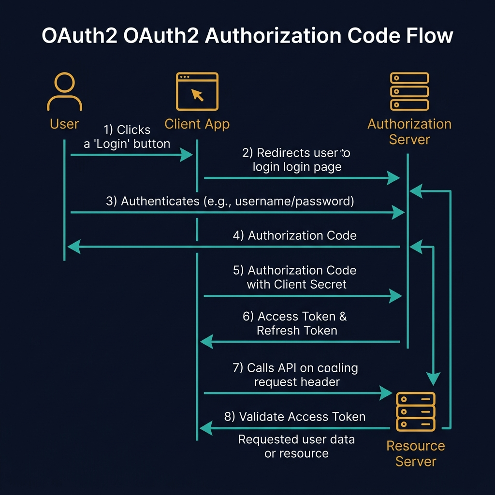
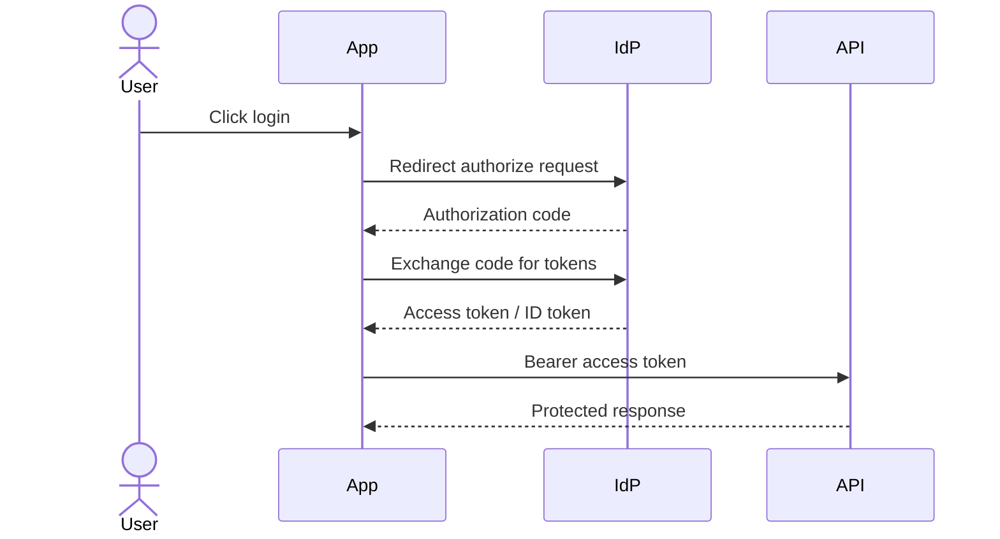
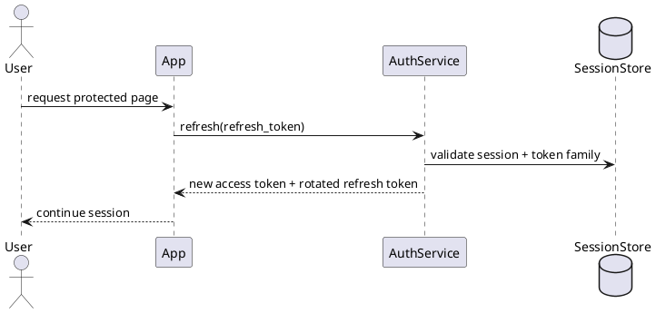
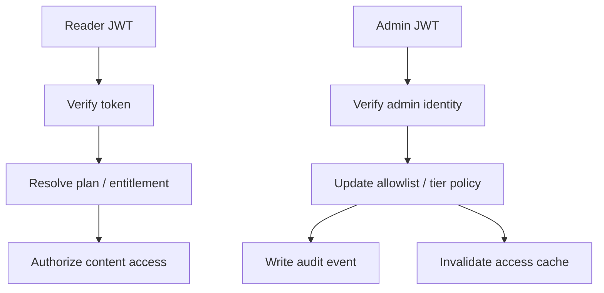

<!-- tags: diagram, patterns -->
# 🔐 Auth Flow Diagram

> Auth flow diagrams are worth the investment because auth is the most easily misunderstood when described only in prose: which token lives where, who verifies, which state needs revocation.

📅 Created: 2026-04-01 · 🔄 Updated: 2026-04-20 · ⏱️ 15 min read

| Aspect | Detail |
| ------ | ------ |
| **Focus** | OAuth2/OIDC/JWT/session/mTLS flows |
| **When to use** | When reviewing login, token refresh, service-to-service auth |
| **Related** | Sequence Diagram, Network Diagram, Use Case Diagram |

---

## 1. DEFINE

Some architectures repeat often enough that reinventing the story from scratch each time is wasteful. Pattern diagrams exist to reuse a familiar narrative frame while remaining specific enough for the current context.

| Flow | Core question |
| ---- | ------------- |
| User login | Who issues the token and where is the token used |
| Token refresh | Who verifies the refresh token and when to rotate |
| Service-to-service | How mTLS/JWT works between internal services |

**Core insight**:
- Auth flow diagrams must clarify **token lifecycle** and **trust boundary**.
- Many auth bugs come not from wrong crypto but from wrong flow: token used in wrong place, revoke not synchronized, refresh left ambiguous.
- A good diagram separates user-facing auth from service-to-service auth.

Those failure modes sound familiar. But there is a trap: an auth flow diagram missing the token refresh path means an incomplete security review. That trap appears in PITFALLS.

## 2. VISUAL

### OAuth2 Authorization Code Flow

The image below shows the complete OAuth2 Authorization Code flow with four participants: User, Client App, Authorization Server, and Resource Server. The numbered steps trace the full round trip from login click to protected resource access.



*Image: The Authorization Code flow exists because the access token must never pass through the browser URL. The code-for-token exchange happens server-to-server, which is why this flow is the only one recommended for production web apps.*

### Preview UI



*Figure: An OAuth authorization code flow — User triggers login, App redirects to IdP, code is exchanged for tokens, API is called with bearer token.*

```text
User -> App -> IdP -> token -> API -> policy / resource check
```

## 3. CODE

### Mermaid Practice Block

````md

````

### Example 1: Basic — OAuth login with code exchange

> **Goal**: Describe the basic login flow using authorization code.
> **Approach**: Keep exactly 4 main roles: user, app, IdP, API/resource server.
> **Example**: `User logs into docs app via identity provider.`


> **Conclusion**: A basic auth flow helps the team lock each actor's role and prevents confusion about "where is the token issued."

### Example 2: Intermediate — Refresh token rotation

> **Goal**: Clarify refresh token verify, rotate, and revoke in a more realistic flow.
> **Approach**: Separate access token and refresh token; only the refresh token interacts with the auth service.
> **Example**: `Access token expires while user is reading a premium article.`



> **Conclusion**: Intermediate auth flow is useful for avoiding refresh token reuse bugs or revocation in the wrong place.

### Example 3: Advanced — Reader auth + admin policy update boundary

> **Goal**: Connect auth flow with authorization and admin policy changes in a single security narrative.
> **Approach**: Separate identity verification, entitlement lookup, and admin policy path into related but role-separated flows.
> **Example**: `Reader accesses premium content, Admin updates runtime allowlist.`



> **Conclusion**: At the advanced level, auth flow diagrams help the team review authentication, authorization, and policy operations simultaneously without blurring the trust boundary.

## 4. PITFALLS

| # | Mistake | Consequence | Fix |
|---|---------|-------------|-----|
| 1 | Merging login, refresh, admin policy into one spaghetti flow | Security review is diluted | Separate flows by core question |
| 2 | Not showing which token lives where | Easy to design wrong storage or revoke logic | Label access / refresh / session clearly |
| 3 | Omitting trust boundary | mTLS/JWT/IdP roles are misunderstood | Draw actor, IdP, API, admin surface clearly |

## 5. REF

| Resource | Link |
| -------- | ---- |
| OAuth 2.0 RFC | https://datatracker.ietf.org/doc/html/rfc6749 |
| OpenID Connect | https://openid.net/connect/ |
| JWT RFC | https://datatracker.ietf.org/doc/html/rfc7519 |

## 6. RECOMMEND

| Next step | When | Reason |
| --------- | ---- | ------ |
| Network Diagram | When auth path ties to mTLS/subnet path | Add network boundary |
| Sequence Diagram | When you need detailed runtime order per step | Go deeper into timing and token exchange |
| Use Case Diagram | When you need to map role/capability before writing policy | Connect auth flow with capability scope |

---

**Links**: [← Previous](./01-microservices-patterns.md) · [→ Next](./03-cicd-pipeline.md)
