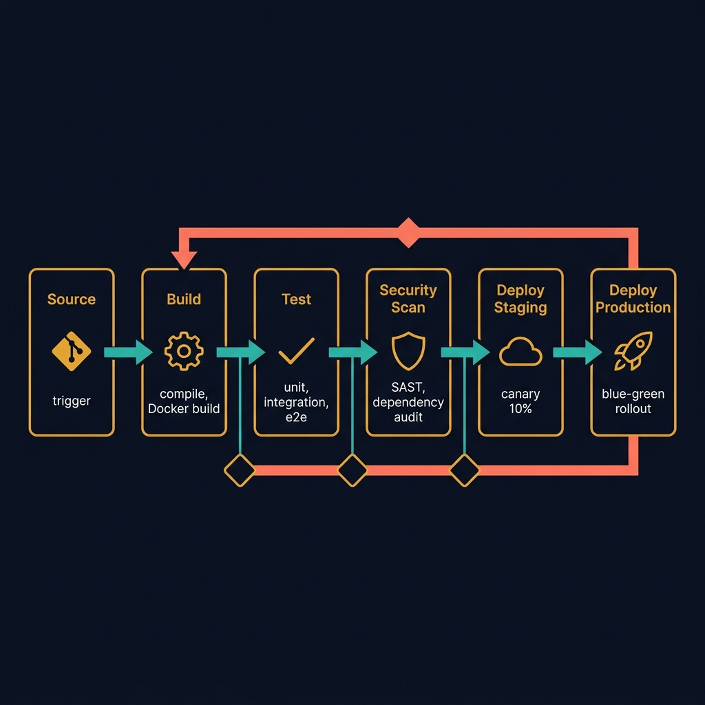
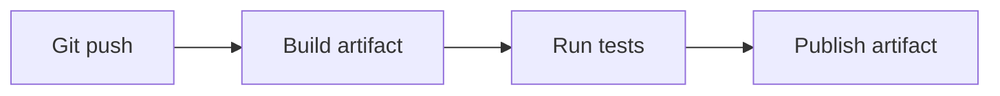
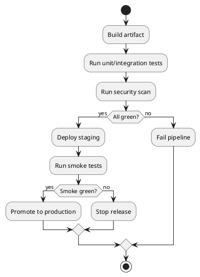
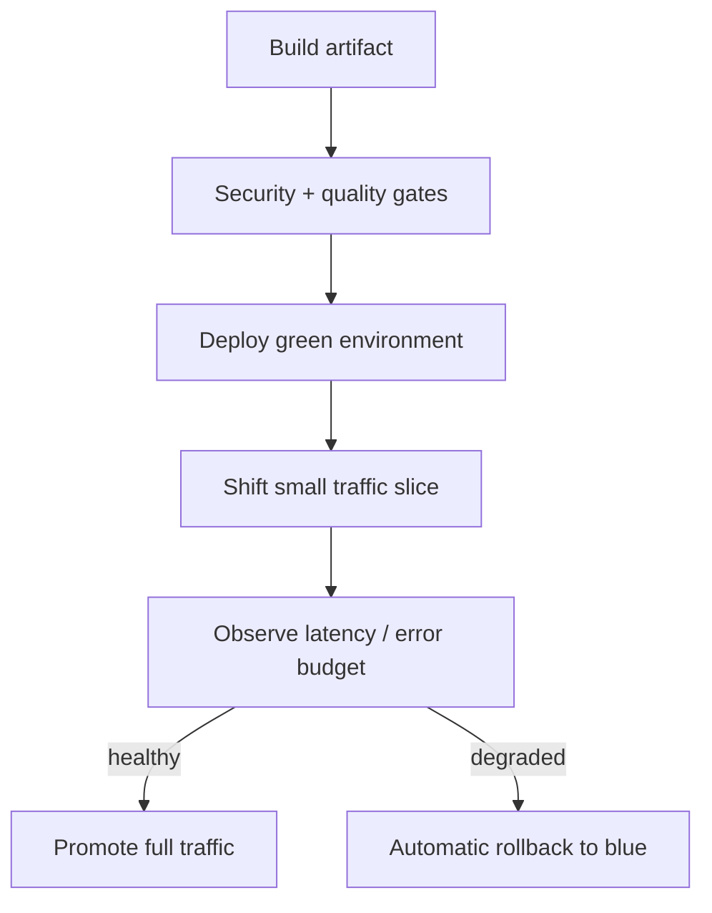

<!-- tags: diagram, patterns -->
# 🚀 CI/CD Pipeline Diagram

> CI/CD pipeline diagrams turn the build/test/scan/deploy chain into a reviewable artifact instead of a pile of implicit steps buried in YAML.

📅 Created: 2026-04-01 · 🔄 Updated: 2026-04-20 · ⏱️ 14 min read

| Aspect | Detail |
| ------ | ------ |
| **Focus** | Build, test, scan, promote, rollback |
| **When to use** | When onboarding team, reviewing release safety, auditing pipeline |
| **Related** | Gantt Chart, Git Graph, Activity Diagram |

---

## 1. DEFINE

Some architectures repeat often enough that reinventing the story from scratch each time is wasteful. Pattern diagrams exist to reuse a familiar narrative frame while remaining specific enough for the current context.

| Stage | Purpose |
| ----- | ------- |
| Build | Create a deployable artifact |
| Validate | Test, lint, security scan |
| Promote | Push artifact through staging/prod |
| Observe | Smoke check, metrics, rollback gate |

**Core insight**:
- A good pipeline diagram must clarify **gates**, not just list stages.
- Very useful for finding which step blocks release and which is merely advisory.
- CI/CD diagrams are also a good way to explain compliance or release safety to non-dev stakeholders.

Those failure modes sound clear. But there is a trap: a pipeline diagram without failure paths only shows the happy path. That trap appears in PITFALLS.

## 2. VISUAL

### CI/CD Pipeline Overview

The image below shows a 6-stage CI/CD pipeline: Source → Build → Test → Security Scan → Deploy Staging → Deploy Production. Quality gates (diamond checkpoints) between stages enforce progression rules. The coral rollback arrow shows the escape path.



*Image: A CI/CD pipeline without quality gates is just a deployment script. The gates — the diamond checkpoints — are what prevent bad code from reaching production. Remove them and you have continuous delivery of bugs.*

### Preview UI



*Figure: A minimal CI pipeline — commit triggers build, build triggers tests, tests produce a published artifact.*

```text
Commit -> Build -> Validate -> Deploy -> Verify -> Promote / Rollback
```

## 3. CODE

### Mermaid Practice Block

````md

````

### Example 1: Basic — Build and test pipeline

> **Goal**: Describe a simple pipeline from commit to verified artifact.
> **Approach**: Keep only build, test, and publish artifact.
> **Example**: `Push code -> run tests -> build docs shell -> publish artifact.`


> **Conclusion**: A basic pipeline diagram is enough for a new team to understand which foundational gates the artifact passes through.

### Example 2: Intermediate — Release gate with security scan

> **Goal**: Add security scan and staging verification to bring the pipeline closer to production reality.
> **Approach**: Separate advisory steps from blocking steps when reviewing release policy.
> **Example**: `Artifact must pass tests, security scan, and smoke test before promotion.`



> **Conclusion**: Intermediate pipeline diagrams help the team see where release policy lives instead of guessing through long CI files.

### Example 3: Advanced — Blue/green deploy with auto rollback

> **Goal**: Use a pipeline diagram to review rollout and automatic rollback strategy.
> **Approach**: Show deploy green, shift traffic, observe metrics, rollback if error budget burns.
> **Example**: `App shell rollout on Vercel or K8s needs a clear rollback gate.`



> **Conclusion**: At the advanced level, pipeline diagrams become a release governance tool, not just a pretty CI chart.

## 4. PITFALLS

| # | Mistake | Consequence | Fix |
|---|---------|-------------|-----|
| 1 | Only drawing happy path | Release risk is hidden | Always draw fail/rollback path |
| 2 | Not distinguishing build from deploy gate | Release policy is hard to understand | Label stage and gate clearly |
| 3 | Stuffing all YAML detail into diagram | Diagram is overloaded | Keep only stage, gate, and important handoffs |

## 5. REF

| Resource | Link |
| -------- | ---- |
| GitHub Actions docs | https://docs.github.com/actions |
| Mermaid flowchart | https://mermaid.js.org/syntax/flowchart.html |

## 6. RECOMMEND

| Next step | When | Reason |
| --------- | ---- | ------ |
| Git Graph | When pipeline depends on branch strategy | Connect SCM with release flow |
| Gantt Chart | When release plan has fixed timeline | Connect deploy path with release schedule |
| Network Diagram | When rollout needs to see real traffic shift | Add runtime infrastructure view |

---

**Links**: [← Previous](./02-auth-flow.md) · [→ Next](./04-database-patterns.md)
