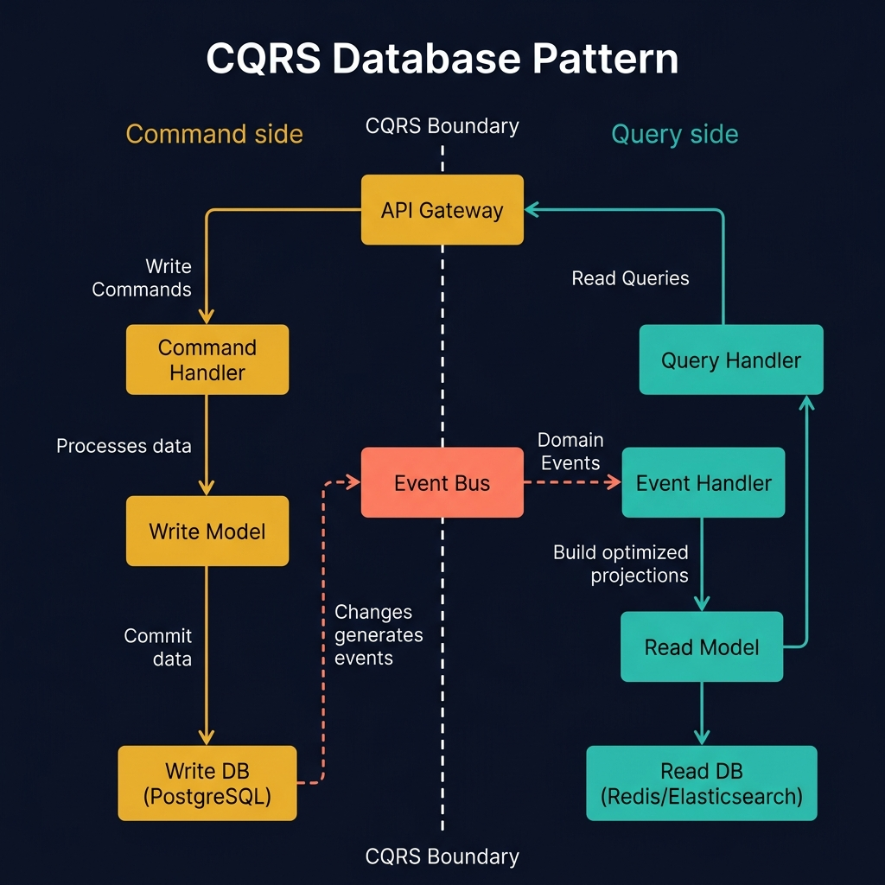
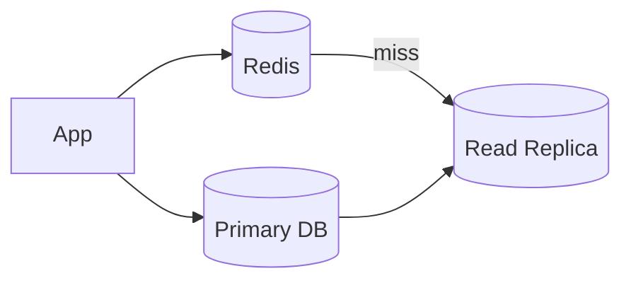
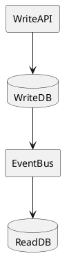
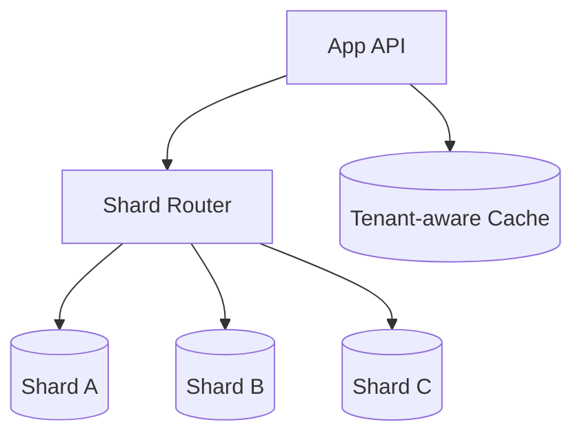

<!-- tags: diagram, patterns -->
# 🗄️ Database Patterns Diagram

> Database pattern diagrams help the team see write path, read path, replication, and cache boundary much faster than reading prose or raw SQL.

📅 Created: 2026-04-01 · 🔄 Updated: 2026-04-20 · ⏱️ 15 min read

| Aspect | Detail |
| ------ | ------ |
| **Focus** | Replication, caching, CQRS, sharding |
| **When to use** | When reviewing persistence topology and consistency trade-offs |
| **Related** | ER Diagram, Data Flow Diagram, Microservices Patterns |

---

## 1. DEFINE

Some architectures repeat often enough that reinventing the story from scratch each time is wasteful. Pattern diagrams exist to reuse a familiar narrative frame while remaining specific enough for the current context.

| Pattern | Core question |
| ------- | ------------- |
| Primary/replica | How read and write split |
| Cache-aside | Where cache sits in the read path |
| CQRS | How read model differs from write model |
| Sharding | Where partition key and router logic live |

**Core insight**:
- Many data bugs come not from wrong schema but from wrong topology and consistency assumptions.
- Database pattern diagrams are ideal for reviewing stale reads, replication lag, and cache invalidation.
- A good diagram must reveal separate read and write paths if they differ.

Those failure modes sound easy to avoid. But there is a trap: a database diagram missing replication topology means failover path cannot be reviewed. That trap appears in PITFALLS.

## 2. VISUAL

### CQRS Pattern Overview

The image below shows the CQRS (Command Query Responsibility Segregation) pattern. The left side handles writes (Command Handler → Write Model → PostgreSQL), the right side handles reads (Query Handler → Read Model → Redis/Elasticsearch), and an Event Bus bridges the two sides.



*Image: CQRS is not about having two databases. It is about having two models — one optimized for writes (normalized, consistent) and one optimized for reads (denormalized, fast). The event bus is what keeps them eventually consistent.*

### Preview UI



*Figure: A cache-aside + replica topology — app checks cache first, misses fall to replica. Writes go to primary, which replicates to replica.*

```text
Write path -> primary DB
Read path -> cache / replica / read model
```

## 3. CODE

### Mermaid Practice Block

````md

````

### Example 1: Basic — Primary, replica, cache-aside

> **Goal**: Lock the basic read/write topology for a web application.
> **Approach**: Separate write path into primary, read path through cache then down to replica.
> **Example**: `Article reads prioritize cache, misses go to replica.`


> **Conclusion**: This basic diagram is enough to start discussing cache-aside and replication lag with the backend/platform team.

### Example 2: Intermediate — CQRS read/write split

> **Goal**: Express read model and write model separated in an event-driven system.
> **Approach**: Draw write store, event bus, and read projection as three distinct blocks.
> **Example**: `Write API updates primary DB; projections update read DB for search/UI.`



> **Conclusion**: Intermediate database pattern diagrams are useful for explaining eventual consistency to product and engineering teams simultaneously.

### Example 3: Advanced — Sharding with tenant-aware routing

> **Goal**: Show that database pattern diagrams are also useful when reviewing complex partitioning and routing.
> **Approach**: Place shard router, shard key, and operational store on the same view without going into individual tables.
> **Example**: `Workspace ID determines the shard for tenant read/write path.`



> **Conclusion**: At the advanced level, this diagram helps the team assess routing complexity, hot shard risk, and cache partitioning before real deployment.

## 4. PITFALLS

| # | Mistake | Consequence | Fix |
|---|---------|-------------|-----|
| 1 | Not separating read and write path | Consistency assumptions are vague | Draw read and write paths clearly |
| 2 | Cache drawn as side box without semantics | Invalidation strategy is forgotten | Attach cache properly into read/write flow |
| 3 | Mentioning sharding without showing shard key | Discussion is meaningless | Clearly note which tenant/key drives routing |

## 5. REF

| Resource | Link |
| -------- | ---- |
| PostgreSQL replication docs | https://www.postgresql.org/docs/current/high-availability.html |
| Redis caching patterns | https://redis.io/learn/howtos/solutions/caching |

## 6. RECOMMEND

| Next step | When | Reason |
| --------- | ---- | ------ |
| Data Flow Diagram | When you need to see data moving beyond DB | Add lineage perspective |
| Microservices Patterns | When DB topology ties to outbox/CQRS | Connect storage with event path |
| ER Diagram | When you need to zoom into schema shape | Add data relationship detail |

---

**Links**: [← Previous](./03-cicd-pipeline.md) · → Next
