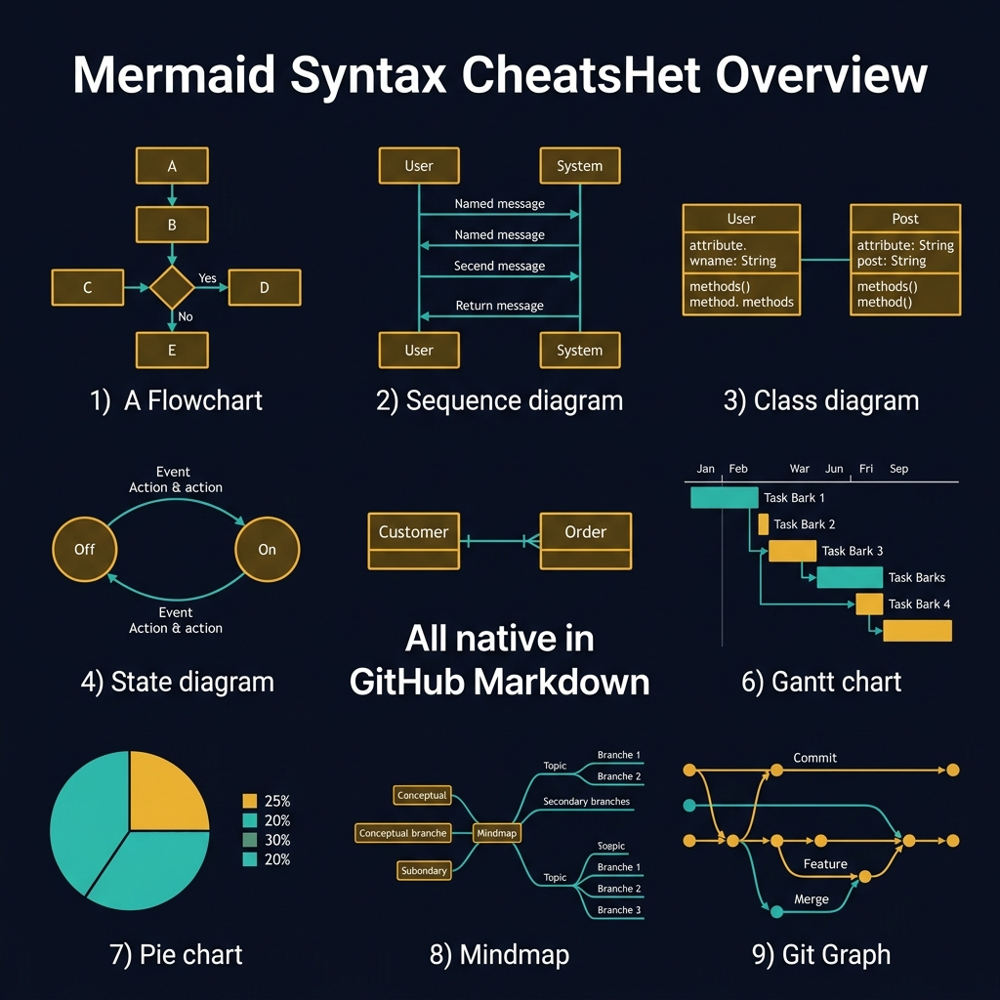
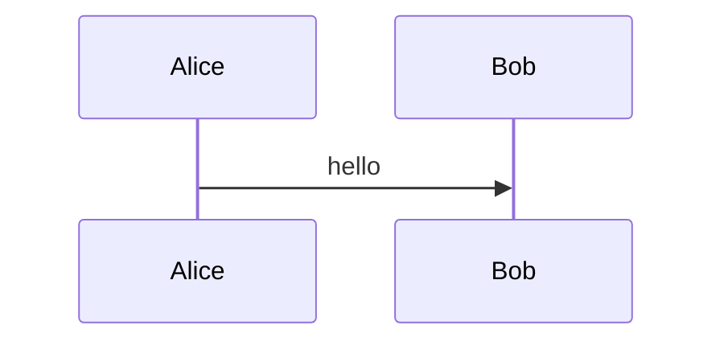
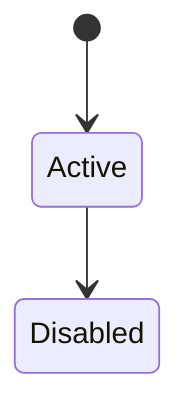

<!-- tags: diagram, reference -->
# 🧾 Mermaid Cheatsheet

> Mermaid cheatsheet is a quick syntax and use case lookup document, not a lengthy theory lesson.

📅 Created: 2026-04-01 · 🔄 Updated: 2026-04-20 · ⏱️ 12 min read

| Aspect | Detail |
| ------ | ------ |
| **Focus** | Quick syntax lookup |
| **When to use** | When writing docs and forgetting Mermaid syntax |
| **Related** | PlantUML Cheatsheet, ASCII Art Guide, Tools Comparison |

---

## 1. DEFINE

At some point, the friction of drawing no longer sits in thinking but in syntax, tools, and repeated mistakes. Reference articles exist to keep that friction short, searchable, and non-disruptive to main thinking.

| Syntax | Use case |
| ------ | -------- |
| `flowchart` | Flow, branch, process |
| `sequenceDiagram` | Runtime interaction |
| `stateDiagram-v2` | Lifecycle and transitions |
| `gantt` / `journey` / `gitGraph` | Planning and UX views |

**Core insight**:
- A cheatsheet only has value if optimized for quick lookup.
- Do not cram the entire Mermaid docs into one file. Keep only the most-used syntax.
- A good cheatsheet helps the reader copy-paste and tweak to get going immediately.

Those failure modes sound basic. But there is a trap: Mermaid syntax errors fail silently in CI, meaning the diagram does not render. That trap appears in PITFALLS.

## 2. VISUAL

### Mermaid Syntax Overview

The image below shows all nine Mermaid diagram types in a 3x3 grid: Flowchart, Sequence, Class, State, ER, Gantt, Pie, Mindmap, and Git Graph. All are native in GitHub Markdown — no plugins, no rendering servers, no setup.



*Image: Mermaid renders natively in GitHub, GitLab, Notion, and Confluence. That zero-setup property is why it is the recommended default — the best diagram tool is the one the team actually uses.*

### Preview UI


*Figure: The simplest Mermaid flowchart — two nodes, one arrow. Every diagram starts from this shape.*

```text
Question -> Syntax
flow -> flowchart
runtime -> sequenceDiagram
state -> stateDiagram-v2
```

## 3. CODE

### Mermaid Practice Block

````md

````

### Example 1: Basic — Core syntax lookup

> **Goal**: Collect the 3 most frequently used syntax blocks.
> **Approach**: Only short snippets that are immediately copy-paste ready.
> **Example**: `flowchart`, `sequenceDiagram`, `stateDiagram-v2`.






> **Conclusion**: A basic cheatsheet should prioritize small, memorable, quick-to-edit snippets.

### Example 2: Intermediate — Less common but high-value blocks

> **Goal**: Add less frequent but very useful syntax for advanced docs writing.
> **Approach**: Group `journey`, `gantt`, `gitGraph` into a planning/product cluster.
> **Example**: `journey for UX, gantt for rollout, gitGraph for branch flow.`

```text
journey      -> product / UX
quadrantChart -> prioritization
gantt        -> release timeline
gitGraph     -> branch strategy
```

> **Conclusion**: Intermediate cheatsheet helps doc writers realize Mermaid goes beyond flowchart and sequence.

### Example 3: Advanced — Writing rules for maintainable Mermaid

> **Goal**: Not just remember syntax but know how to write Mermaid that is durable, reviewable, and less prone to render errors.
> **Approach**: Lock a mini style guide for the repo.
> **Example**: `One diagram = one question; short labels; no paragraph nodes.`

```text
Rules:
- Keep labels short and scannable
- One diagram = one decision scope
- Avoid huge nodes with prose paragraphs
- Prefer multiple smaller diagrams over one poster
```

> **Conclusion**: At the advanced level, a cheatsheet is not just syntax but a writing guide to make diagrams less fragile over time.

## 4. PITFALLS

| # | Mistake | Consequence | Fix |
|---|---------|-------------|-----|
| 1 | Using cheatsheet as full tutorial | File is long but lookup is slow | Keep only frequently-used syntax and short rules |
| 2 | Snippets not copy-paste ready | Reader has to fix too much | Keep snippets small and runnable |
| 3 | Not attaching syntax to use case | Hard to choose the right block | Always note which question each syntax suits |

## 5. REF

| Resource | Link |
| -------- | ---- |
| Mermaid docs | https://mermaid.js.org/ |
| Mermaid syntax index | https://mermaid.js.org/intro/syntax-reference.html |

## 6. RECOMMEND

| Next step | When | Reason |
| --------- | ---- | ------ |
| PlantUML Cheatsheet | When Mermaid starts lacking notation | Get full UML power |
| Diagram Tools Comparison | When you need to choose the right tool | Connect syntax with tool choice |
| Diagram Antipatterns | When syntax is correct but diagram is still bad | Add quality rules |

---

## 7. QUICK REF

| Need | Mermaid block |
| --- | --- |
| Flow / branch | `flowchart TD` |
| Runtime interaction | `sequenceDiagram` |
| Entity lifecycle | `stateDiagram-v2` |
| Data relationships | `erDiagram` |
| Timeline / rollout | `gantt` |
| Branch history | `gitGraph` |

---

**Links**: ← Previous · [→ Next](./02-plantuml-cheatsheet.md)
