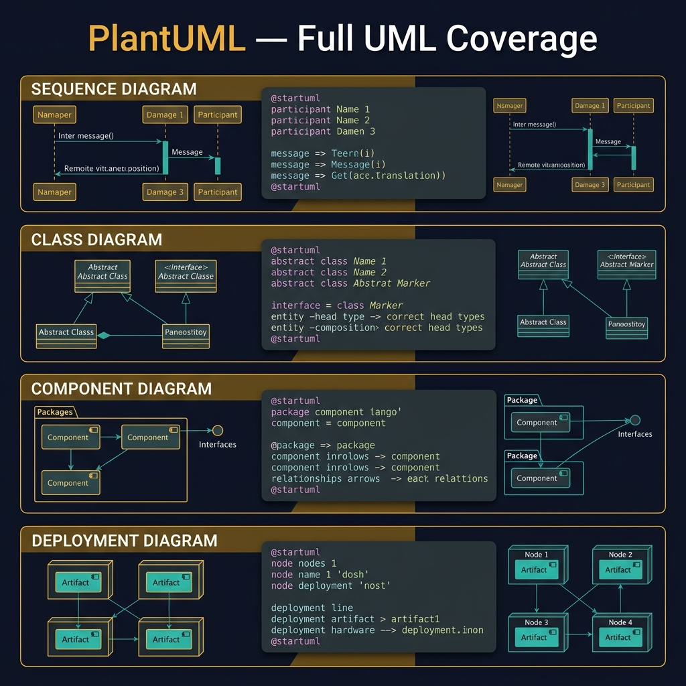
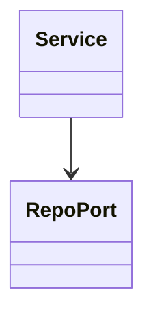
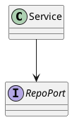
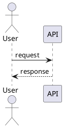
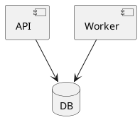

<!-- tags: diagram, reference -->
# 🧾 PlantUML Cheatsheet

> PlantUML cheatsheet should focus on the most valuable UML snippets for engineering review, not attempt to replicate the full official docs.

📅 Created: 2026-04-01 · 🔄 Updated: 2026-04-20 · ⏱️ 12 min read

| Aspect | Detail |
| ------ | ------ |
| **Focus** | UML-heavy syntax lookup |
| **When to use** | When Mermaid is not enough for serious class/sequence/deployment UML |
| **Related** | Mermaid Cheatsheet, Tools Comparison |

---

## 1. DEFINE

At some point, the friction of drawing no longer sits in thinking but in syntax, tools, and repeated mistakes. Reference articles exist to keep that friction short, searchable, and non-disruptive to main thinking.

| Syntax | Use case |
| ------ | -------- |
| Class diagram | Interface, inheritance, composition |
| Sequence diagram | Detailed interaction and alt paths |
| Component / deployment | Architecture review |
| Mindmap / gantt | Supplemental planning views |

**Core insight**:
- PlantUML is strongest when the team needs more serious UML notation than Mermaid provides.
- Cheatsheet should be optimized for "copy then edit," not for covering the entire language.
- Do not use PlantUML just because it is more powerful. Use it when the problem actually needs it.

Those failure modes sound familiar. But there is a trap: PlantUML server timeout with large diagrams means render failure. That trap appears in PITFALLS.

## 2. VISUAL

### PlantUML Capabilities

The image below shows PlantUML coverage across four UML diagram types: Sequence, Class, Component, and Deployment. Each panel shows a code snippet and its rendered output. PlantUML covers the full UML specification, which Mermaid does not.



*Image: PlantUML requires a rendering server (or a local JAR), which is its biggest disadvantage over Mermaid. Use it when you need full UML compliance — for everything else, Mermaid is simpler.*

### Preview UI



*Figure: A minimal class diagram — Service depends on RepoPort. This shape is the foundation of every PlantUML class sketch.*

```text
@startuml
...diagram...
@enduml
```

## 3. CODE

### Mermaid Practice Block

````md

````

### Example 1: Basic — Three high-value snippets

> **Goal**: Collect the most common PlantUML snippets for dev docs.
> **Approach**: Prioritize class, sequence, and component skeleton.
> **Example**: `Class boundary, runtime call, module view.`







> **Conclusion**: A basic PlantUML cheatsheet should start from snippets that devs use daily in reviews.

### Example 2: Intermediate — Reusable notation hints

> **Goal**: Quick reminder of frequently forgotten UML notations.
> **Approach**: Collect the most important relationship keywords.
> **Example**: `..|>` for implementation, `*--` for composition.

```text
..|>  implementation
<|--  inheritance
*--   composition
o--   aggregation
```

> **Conclusion**: Intermediate cheatsheet value comes from concise notation hints rather than lengthy examples.

### Example 3: Advanced — Team writing rules for PlantUML

> **Goal**: Add writing rules so UML diagrams do not turn into IDE dump images.
> **Approach**: Lock a few short rules about scope, naming, and level of detail.
> **Example**: `Do not draw the entire class tree; only draw classes that serve the review decision.`

```text
Rules:
- Use PlantUML when notation matters
- Keep one diagram tied to one review question
- Avoid dumping every class in a package
- Label relationship semantics, not just arrows
```

> **Conclusion**: At the advanced level, the biggest cheatsheet value is helping the team use PlantUML with discipline, not just memorize syntax.

## 4. PITFALLS

| # | Mistake | Consequence | Fix |
|---|---------|-------------|-----|
| 1 | Overusing PlantUML for everything | Diagrams are heavier than needed | Only use when detailed notation truly matters |
| 2 | Cheatsheet too long | Lookup becomes slow | Keep the 80/20 most important snippets |
| 3 | Not explaining notation | Copy works but understanding is missing | Attach each symbol to a short use case |

## 5. REF

| Resource | Link |
| -------- | ---- |
| PlantUML docs | https://plantuml.com/ |
| PlantUML guide | https://plantuml.com/guide |

## 6. RECOMMEND

| Next step | When | Reason |
| --------- | ---- | ------ |
| Mermaid Cheatsheet | When you need markdown-native syntax | Quick tool fit comparison |
| Tools Comparison | When unsure between Mermaid and PlantUML | Connect syntax with decision |
| Class Diagram | When you need more applied examples than cheatsheet | Move from lookup to applied docs |

---

## 7. QUICK REF

| Need | PlantUML starting point |
| --- | --- |
| Class / interface model | `@startuml ... class ... @enduml` |
| Runtime interaction | `@startuml ... participant ... @enduml` |
| Component / deployment | `component`, `node`, `database` |
| State / activity | `state`, `start`, `if/then` |
| When to choose it | When detailed UML notation matters more than markdown-native speed |

---

**Links**: [← Previous](./01-mermaid-cheatsheet.md) · [→ Next](./03-ascii-art-guide.md)
