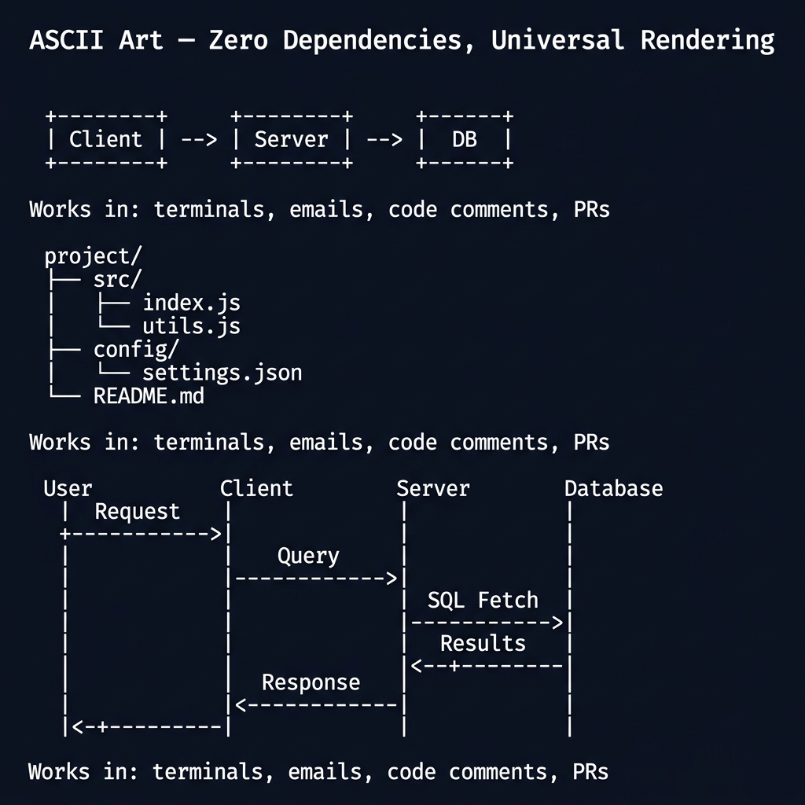

<!-- tags: diagram, reference -->
# 🔤 ASCII Art Guide

> ASCII diagrams are valuable when you need lightweight, diff-friendly artifacts that render in terminal, code comments, or ADRs without depending on tooling.

📅 Created: 2026-04-01 · 🔄 Updated: 2026-04-20 · ⏱️ 12 min read

| Aspect | Detail |
| ------ | ------ |
| **Focus** | Text-only diagrams |
| **When to use** | When there is no renderer or you need diff-friendly docs |
| **Related** | Mermaid Cheatsheet, Diagram Antipatterns |

---

## 1. DEFINE

At some point, the friction of drawing no longer sits in thinking but in syntax, tools, and repeated mistakes. Reference articles exist to keep that friction short, searchable, and non-disruptive to main thinking.

| Use case | Benefit |
| -------- | ------- |
| ADR / RFC | Renders everywhere |
| Code comment | Close to code and quick to read |
| Terminal docs | No browser renderer needed |

**Core insight**:
- ASCII is not as pretty as Mermaid but is very durable in Git diff and code review.
- An excellent format for small topology, short flow, and mental models that need to sit close to code.
- A good ASCII diagram requires disciplined whitespace and alignment.

Those failure modes sound clear. But there is a trap: ASCII art alignment breaks with proportional fonts, causing the diagram to distort. That trap appears in PITFALLS.

## 2. VISUAL

### ASCII Art Diagram Examples

The image below shows three ASCII art diagram examples: a box diagram (Client → Server → DB), a directory tree structure, and a sequence diagram. All render in any monospace font with zero dependencies.



*Image: ASCII art is the only diagram format that works in git diffs, terminal logs, and plain-text emails. When your diagram must survive every rendering context, ASCII is the only reliable option.*

### Preview UI


*Figure: A minimal service topology — Client calls API, API calls DB. The Mermaid mirror shows the same shape that ASCII renders below.*

```text
+--------+    +-----+    +------+
| Client | -> | API | -> |  DB  |
+--------+    +-----+    +------+
```

## 3. CODE

### Mermaid Practice Block

````md

````

### Example 1: Basic — Service topology

> **Goal**: Describe simple topology using text-only diagram.
> **Approach**: Use minimal boxes and arrows.
> **Example**: `Client -> API -> DB.`

```text
+--------+    +-----+    +------+
| Client | -> | API | -> |  DB  |
+--------+    +-----+    +------+
```

> **Conclusion**: A basic ASCII diagram is enough to explain small topology without depending on any render tool.

### Example 2: Intermediate — Queue worker pipeline

> **Goal**: Express sync path and async path in a text-only diagram.
> **Approach**: Clearly separate worker lane and queue lane with spacing.
> **Example**: `API enqueues job, worker consumes and writes to DB.`

```text
Client -> API -> Queue -----> Worker -> DB
               \-> 202 Accepted
```

> **Conclusion**: At the intermediate level, ASCII still has enough expressive power for a moderate pipeline if spacing is kept clean.

### Example 3: Advanced — Trust boundary in plain text

> **Goal**: Use ASCII to express security boundary in environments where Mermaid/PlantUML is not available.
> **Approach**: Clearly draw public zone, private zone, and admin path with text labels.
> **Example**: `Internet -> LB -> App; VPN -> Bastion -> DB.`

```text
[ Internet ] -> [ LB ] -> [ App Subnet ] -> [ Private DB ]
[   VPN   ] -> [ Bastion ] ---------------> [ Private DB ]
```

> **Conclusion**: Advanced ASCII diagrams are useful for ADRs, runbooks, and code comments where portability matters more than aesthetics.

## 4. PITFALLS

| # | Mistake | Consequence | Fix |
|---|---------|-------------|-----|
| 1 | Messy alignment | Diagram is harder to read than prose | Use monospace font and consistent spacing |
| 2 | Drawing overly complex diagrams in ASCII | Reader cannot parse it | Only use for small and moderate diagrams |
| 3 | No labels | Many arrows but meaning is vague | Write role/boundary directly inside boxes |

## 5. REF

| Resource | Link |
| -------- | ---- |
| ASCIIFlow | https://asciiflow.com/ |
| Monodraw | https://monodraw.helftone.com/ |

## 6. RECOMMEND

| Next step | When | Reason |
| --------- | ---- | ------ |
| Mermaid Cheatsheet | When you need to upgrade from text-only to renderable docs | Increase expressiveness |
| Network Diagram | When ASCII starts overloading | Switch to a more powerful tool |
| Diagram Antipatterns | When the team uses ASCII for every case | Choose the right tool |

---

## 7. QUICK REF

- Keep monospace font. Do not mix proportional fonts.
- Prioritize small topology, short flow, simple boundary.
- Keep horizontal width compact so the diagram does not break in diff review.
- When arrows outnumber insights, switch to Mermaid or another tool.

---

**Links**: [← Previous](./02-plantuml-cheatsheet.md) · [→ Next](./04-tools-comparison.md)
