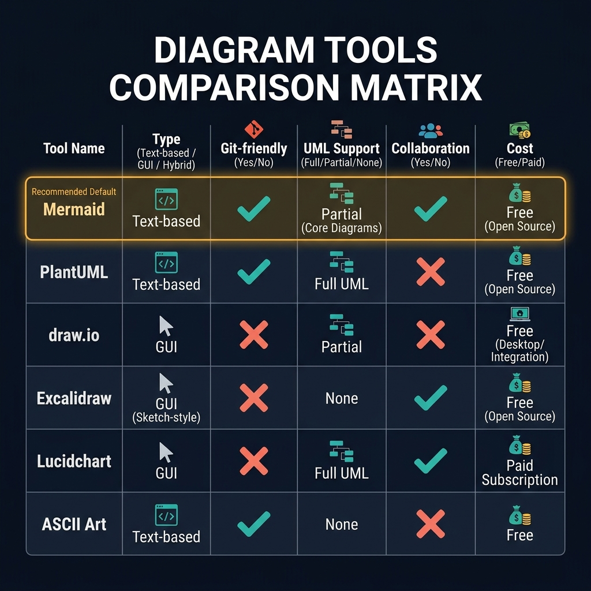
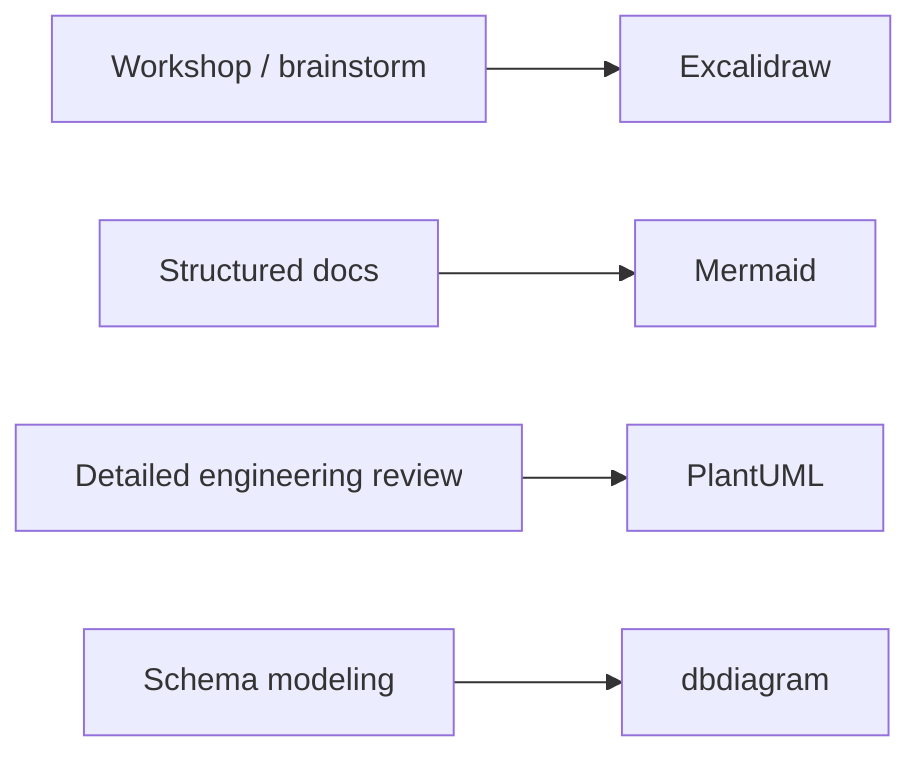

<!-- tags: diagram, reference -->
# 🧰 Diagram Tools Comparison

> Comparing tools is a worthwhile step before forcing the entire team onto a single tool, because each tool excels at a different type of problem.

📅 Created: 2026-04-01 · 🔄 Updated: 2026-04-20 · ⏱️ 13 min read

| Aspect | Detail |
| ------ | ------ |
| **Focus** | Tool selection by use case |
| **When to use** | When choosing between Mermaid, PlantUML, Excalidraw, Draw.io, dbdiagram |
| **Related** | Mermaid Cheatsheet, PlantUML Cheatsheet, Diagram Antipatterns |

---

## 1. DEFINE

At some point, the friction of drawing no longer sits in thinking but in syntax, tools, and repeated mistakes. Reference articles exist to keep that friction short, searchable, and non-disruptive to main thinking.

| Tool | Strongest at |
| ---- | ------------ |
| Mermaid | Markdown-native, docs repo |
| PlantUML | Serious UML, thick notation |
| Excalidraw | Quick sketch, workshop |
| Draw.io | Visual polish, infra diagrams |
| dbdiagram | ERD-centric |

**Core insight**:
- Choose tool by **the question you need to answer** and **work environment**, not by personal preference.
- Markdown-native tools suit repo docs. Whiteboard tools suit workshops. Schema tools suit data modeling.
- A strong team usually has 2-3 tools with clear roles, not one tool forced to do everything.

Those failure modes sound easy to avoid. But there is a trap: choosing tool before identifying the need creates tool lock-in. That trap appears in PITFALLS.

## 2. VISUAL

### Tools Comparison Matrix

The image below shows a comparison matrix of six diagram tools: Mermaid, PlantUML, draw.io, Excalidraw, Lucidchart, and ASCII Art. Columns cover Type, Git-friendliness, UML support, Collaboration, and Cost. Mermaid is highlighted as the recommended default.



*Image: The comparison matrix reveals that no single tool wins on every dimension. Mermaid wins on git-friendliness and zero-setup; PlantUML wins on UML completeness; Excalidraw wins on collaboration. Choose based on your constraint, not your preference.*

### Preview UI



*Figure: Tool selection by workflow phase — exploration uses Excalidraw, docs use Mermaid, heavy UML uses PlantUML, schema uses dbdiagram.*

```text
Docs repo -> Mermaid
UML-heavy review -> PlantUML
Workshop -> Excalidraw
ER modeling -> dbdiagram
```

## 3. CODE

### Mermaid Practice Block

````md

````

### Example 1: Basic — Quick tool matrix

> **Goal**: Quickly compare popular tools by use case.
> **Approach**: Keep only the most important decision columns.
> **Example**: `Repo docs, workshop, UML, ERD.`

```text
Mermaid   | markdown-native | medium notation | docs-friendly
PlantUML  | text-based UML  | high notation   | engineering-heavy
Excalidraw| sketch-first    | low notation    | workshop-friendly
dbdiagram | ERD-first       | schema-focused  | database modeling
```

> **Conclusion**: A basic comparison is enough for the team to avoid using the wrong tool for the wrong type of problem.

### Example 2: Intermediate — Fit tool to workflow

> **Goal**: Connect tool selection with team workflow instead of abstract comparison.
> **Approach**: Map tool to discovery, design, docs, implementation review phases.
> **Example**: `Workshop uses Excalidraw, formal docs use Mermaid, deep UML uses PlantUML.`


> **Conclusion**: At the intermediate level, tool comparison starts being valuable when it ties to team workflow rather than being a generic feature table.

### Example 3: Advanced — Governance rule for multi-tool teams

> **Goal**: Lock governance to prevent the repo from becoming chaotic with too many tools and no shared standard.
> **Approach**: Define the official tool for each artifact type.
> **Example**: `Docs repo -> Mermaid, UML review -> PlantUML, workshops -> Excalidraw snapshots.`

```text
Governance:
- Repo markdown docs: Mermaid first
- UML-heavy architecture review: PlantUML allowed
- Workshop/discovery: Excalidraw snapshots, summarize into docs later
- ER modeling: dbdiagram or Mermaid ER, depending on repo needs
```

> **Conclusion**: Advanced tool comparison is most useful when it becomes a governance rule, not when trying to find the "absolute best tool."

## 4. PITFALLS

| # | Mistake | Consequence | Fix |
|---|---------|-------------|-----|
| 1 | Choosing tool by hype | Team is stuck with a misfit workflow | Evaluate by use case and repo constraints |
| 2 | One repo using too many tools without governance | Docs become fragmented and hard to maintain | Lock canonical tool per artifact type |
| 3 | Comparing tools only by feature list | Misses workflow reality | Always ask where this tool lives in the process |

## 5. REF

| Resource | Link |
| -------- | ---- |
| Mermaid | https://mermaid.js.org/ |
| PlantUML | https://plantuml.com/ |
| Excalidraw | https://excalidraw.com/ |
| dbdiagram | https://dbdiagram.io/ |

## 6. RECOMMEND

| Next step | When | Reason |
| --------- | ---- | ------ |
| Mermaid Cheatsheet | When Mermaid is the primary repo tool | Connect decision with syntax |
| PlantUML Cheatsheet | When UML-heavy reviews appear frequently | Connect decision with notation |
| Diagram Antipatterns | When team still misuses tools despite having a comparison | Need stricter rules |

---

## 7. QUICK REF

| Problem | Default tool |
| --- | --- |
| Docs repo, markdown-first | `Mermaid` |
| UML-heavy engineering review | `PlantUML` |
| Workshop, quick sketch | `Excalidraw` |
| ER-first database modeling | `dbdiagram` |
| No renderer, need diff-friendly | `ASCII` |

---

**Links**: [← Previous](./03-ascii-art-guide.md) · [→ Next](./05-diagram-antipatterns.md)
