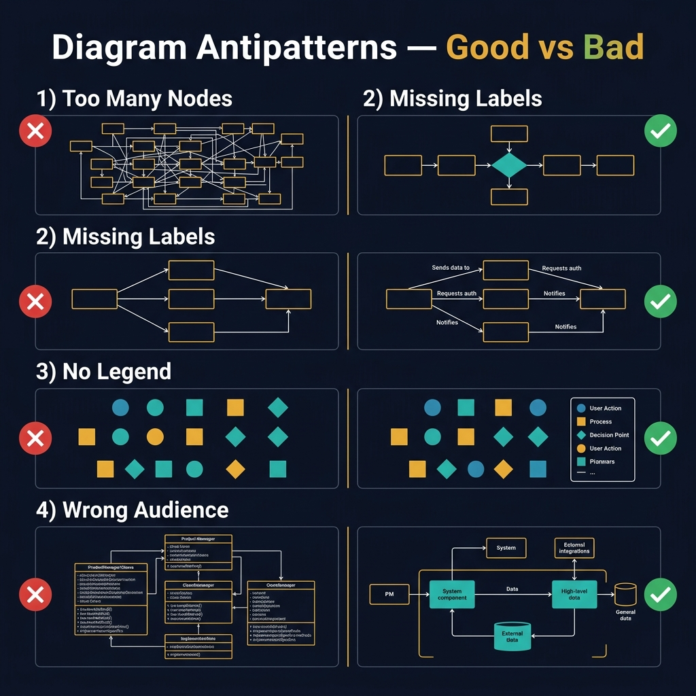
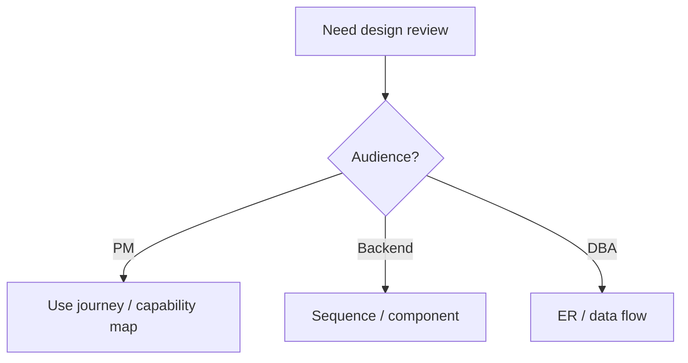

<!-- tags: diagram, reference -->
# 🚫 Diagram Antipatterns

> Diagram antipatterns are as worth learning as diagram types, because most bad diagrams are not wrong in syntax but wrong in purpose, level, or audience.

📅 Created: 2026-04-01 · 🔄 Updated: 2026-04-20 · ⏱️ 13 min read

| Aspect | Detail |
| ------ | ------ |
| **Focus** | Common diagram failure modes |
| **When to use** | When auditing existing docs or reviewing new diagrams |
| **Related** | Tools Comparison, Choosing Diagram, Mermaid Cheatsheet |

---

## 1. DEFINE

At some point, the friction of drawing no longer sits in thinking but in syntax, tools, and repeated mistakes. Reference articles exist to keep that friction short, searchable, and non-disruptive to main thinking.

| Antipattern | Problem |
| ----------- | ------- |
| One-poster diagram | One picture tries to explain everything |
| Wrong-level diagram | Mixes context, component, runtime, data |
| Tool-first drawing | Chooses tool before the question |
| Decoration over decision | Beautiful but does not help decide |

**Core insight**:
- Diagram failure usually is not about ugliness. It is about not answering the right question.
- Antipatterns help the team review quickly using a checklist instead of arguing by instinct.
- This topic is ideal as a "quality gate" for every visual artifact in the repo.

Those failure modes sound basic. But there is a trap: antipattern awareness without alternatives means knowing what is wrong but not how to do it right. That trap appears in PITFALLS.

## 2. VISUAL

### Diagram Antipatterns

The image below shows four common diagram antipatterns side by side with their corrections: Too Many Nodes, Missing Labels, No Legend, and Wrong Audience. Each pair shows a bad example (red X) and a good example (green checkmark).



*Image: The most common antipattern is audience mismatch: showing class-level detail to a PM or context-level abstraction to a developer. A diagram is only useful if the reader can act on it without asking follow-up questions.*

### Preview UI



*Figure: A decision flow for choosing the right artifact by audience. The wrong match is the most common antipattern.*

```text
Bad  -> one giant poster, many arrows, no scope
Good -> one question, one scope, one audience focus
```

## 3. CODE

### Mermaid Practice Block

````md

````

### Example 1: Basic — One diagram explains everything

> **Goal**: Point out the most common antipattern where the writer tries to cram structure, behavior, infra into one picture.
> **Approach**: Compare the bad smell with the one-picture-one-question principle.
> **Example**: `One picture has ER, sequence, and subnet all at once.`

```text
Bad:
  One mega-diagram = actors + services + tables + runtime + infra + release notes

Good:
  Split into context / sequence / ER / deployment
```

> **Conclusion**: Basic antipattern review helps the team realize that splitting diagrams is usually better than trying to fit a "full picture" into one image.

### Example 2: Intermediate — Wrong audience, wrong artifact

> **Goal**: Show that using the right diagram for the wrong audience is also a major antipattern.
> **Approach**: Compare the same problem but deliver the wrong artifact to PM, DBA, and platform engineer.
> **Example**: `Presenting a detailed class diagram to a business stakeholder.`


> **Conclusion**: Intermediate antipatterns are not about syntax but about mismatch between diagram and audience.

### Example 3: Advanced — Beautiful but operationally useless

> **Goal**: Name a more subtle antipattern: diagram is beautiful, tool is fancy, but it does not support decisions, incidents, or onboarding.
> **Approach**: Evaluate diagrams by decision support rather than aesthetics.
> **Example**: `Beautiful topology but does not show SPOF or trust boundary.`

```text
Review checklist:
- Does this diagram answer one decision question?
- Can an on-call / reviewer act on it?
- Are boundaries and ownership visible?
- If removed, would the team lose important clarity?
```

> **Conclusion**: Advanced antipattern review forces the team to evaluate diagrams by utility, not just by aesthetics or shape completeness.

## 4. PITFALLS

| # | Mistake | Consequence | Fix |
|---|---------|-------------|-----|
| 1 | Reviewing diagrams only by aesthetics | Misses failures in scope and decision support | Evaluate by question, audience, utility |
| 2 | No quality rubric | Everyone draws in their own style | Use a shared checklist for the repo |
| 3 | Antipatterns recognized too late | Docs debt accumulates | Audit diagrams periodically and refactor when needed |

## 5. REF

| Resource | Link |
| -------- | ---- |
| C4 model guidance | https://c4model.com/ |
| Mermaid docs | https://mermaid.js.org/ |

## 6. RECOMMEND

| Next step | When | Reason |
| --------- | ---- | ------ |
| Choosing Diagram | When you need to avoid wrong-tool antipattern from the start | Choose the right artifact early |
| Tools Comparison | When misuse comes from wrong tool choice | Connect quality with tool decision |
| Mermaid / PlantUML Cheatsheets | When quality issues come from syntax friction | Reduce barrier to writing correctly |

---

## 7. QUICK REF

| Smell | Quick fix |
| --- | --- |
| One poster explains everything | Split by question and audience |
| Wrong audience | Change artifact before polishing the image |
| Tool-first drawing | Start again from the question that needs answering |
| Beautiful but useless diagram | Make boundary, ownership, and decision point visible |

---

**Links**: [← Previous](./04-tools-comparison.md) · → Next
