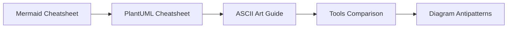

<!-- tags: overview -->
# Diagram Reference

> Reference lane for Mermaid, PlantUML, ASCII, and antipatterns when writing or reviewing diagrams.

| Aspect | Detail |
| --- | --- |
| **Concept** | Navigation hub for `Diagram Reference` |
| **Audience** | Technical writer, engineer, reviewer |
| **Primary style** | Concept-First router |
| **Entry point** | Open when you need syntax, tool, or audit checklist for diagrams. |

📅 Updated: 2026-04-20 · ⏱️ 6 min read

---

## 1. DEFINE

Once you understand the right diagram type, the next friction usually sits in syntax, tools, and repeated mistakes. The reference lane exists to keep that part short, searchable, and non-disruptive to main thinking.

This hub does not replace individual articles. It routes you to the correct lane before you wander into tools, syntax, or a specific diagram type.

### Signals & Boundaries

- Open this hub when you know the problem lives inside `Diagram Reference` but are unsure which article to read first.
- Use the coverage map to route by pain point instead of file order.
- Return to this hub after each article to choose the next step with intention.

### Coverage Map

| Entry | Role |
| --- | --- |
| [Mermaid Cheatsheet](01-mermaid-cheatsheet.md) | Entry point for lane `Mermaid Cheatsheet` |
| [PlantUML Cheatsheet](02-plantuml-cheatsheet.md) | Entry point for lane `PlantUML Cheatsheet` |
| [ASCII Art Guide](03-ascii-art-guide.md) | Entry point for lane `ASCII Art Guide` |
| [Diagram Tools Comparison](04-tools-comparison.md) | Entry point for lane `Diagram Tools Comparison` |
| [Diagram Antipatterns](05-diagram-antipatterns.md) | Entry point for lane `Diagram Antipatterns` |

---

## 2. VISUAL

### Syntax, Tools, and Quality Guards

Five reference articles cover everything needed after you have chosen the right diagram type. The image below shows the reference landscape: two syntax-focused cheatsheets (Mermaid, PlantUML), one lightweight alternative (ASCII), one tool comparison matrix, and one antipattern catalog for quality review.


*Image: Reference articles are not meant to be read front to back. Grab the one that matches your current friction: syntax lookup, tool selection, or quality audit.*

### Preview UI



*Figure: Reference articles progress from syntax (Mermaid, PlantUML) through lightweight (ASCII), tool selection (Tools), to quality guard (Antipatterns).*

---

## 3. CODE

### Mermaid Practice Block

````md

````

### Problem 1: Basic — Route the lane before reading deep

> **Goal**: Prevent study or review from drifting into "open whichever article looks interesting."
> **Approach**: Choose a lane by pain point.
> **Complexity**: Basic

```yaml
router:
  module: Diagram Reference
  rule: "choose by pain point, not by familiar name"
  suggested_path:
  - 01-mermaid-cheatsheet.md
  - 02-plantuml-cheatsheet.md
  - 03-ascii-art-guide.md
  - 04-tools-comparison.md
  - 05-diagram-antipatterns.md
```

---

## 4. PITFALLS

| # | Severity | Mistake | Consequence | Fix |
| --- | --- | --- | --- | --- |
| 1 | 🔴 Fatal | Reading by file order instead of routing by pain point | Accumulates terminology without solving the real problem | Use the coverage map first |
| 2 | 🟡 Common | Treating the README as a pure link catalog | Loses the hub's routing purpose | Always ask "which lane matches my current pain?" |
| 3 | 🔵 Minor | Finishing an article without returning to the hub | Jumps to an adjacent article by instinct | Return to the README to pick the next step |

---

## 5. REF

| Resource | Type | Link | Notes |
| --- | --- | --- | --- |
| Mermaid docs | Official docs | https://mermaid.js.org/ | Syntax and rendering rules |
| PlantUML docs | Official docs | https://plantuml.com/ | UML notation and server/render notes |
| ASCIIFlow | Tool reference | https://asciiflow.com/ | ASCII diagram sketching |

## 6. RECOMMEND

| Next step | When | Reason | File/Link |
| --- | --- | --- | --- |
| Mermaid Cheatsheet | When your pain point matches this lane | Continue into the right cluster | [Mermaid Cheatsheet](01-mermaid-cheatsheet.md) |
| PlantUML Cheatsheet | When your pain point matches this lane | Continue into the right cluster | [PlantUML Cheatsheet](02-plantuml-cheatsheet.md) |
| ASCII Art Guide | When your pain point matches this lane | Continue into the right cluster | [ASCII Art Guide](03-ascii-art-guide.md) |
