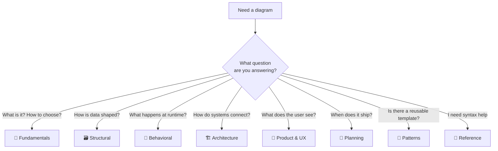
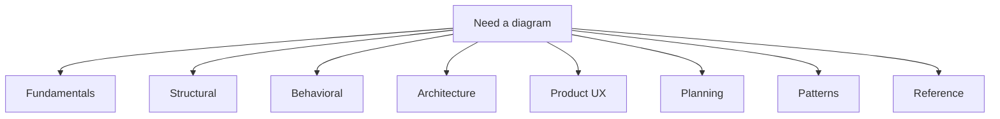

<!-- tags: overview -->
# Diagram & Flow

> Hub taxonomy for diagrams: route by the question you need to answer visually, not by tool preference.

| Aspect | Detail |
| --- | --- |
| **Concept** | Navigation hub for `Diagram & Flow` |
| **Audience** | Backend engineer, architect, product designer, reviewer |
| **Primary style** | Concept-First router |
| **Entry point** | Open when you know you need a diagram but are unsure which type fits. |

📅 Updated: 2026-04-20 · ⏱️ 6 min read

---

## 1. DEFINE

Picture a design review where everyone shares the same feeling: talking for twenty minutes yet still misunderstanding each other, because each person holds a different mental model. The right diagram does not make you smarter. It forces the whole group to look at the same thing at the same time.

This hub does not replace individual articles. It exists to route you to the correct lane before you wander into tools, syntax, or a specific diagram type. Read in order, and you will stop feeling like you "know lots of keywords but still cannot map them to a real problem."

### Signals & Boundaries

- Open this hub when you know the problem lives inside `Diagram & Flow` but are unsure which article to read first.
- Use the coverage map to route by pain point instead of file order.
- Return to this hub after each article to choose the next step with intention.

### Coverage Map

| Entry | Role |
| --- | --- |
| [Diagram Fundamentals](01-fundamentals/README.md) | Entry point for lane `Diagram Fundamentals` |
| [Structural Diagrams](02-structural/README.md) | Entry point for lane `Structural Diagrams` |
| [Behavioral Diagrams](03-behavioral/README.md) | Entry point for lane `Behavioral Diagrams` |
| [Architecture](04-architecture/README.md) | Entry point for lane `Architecture` |
| [Product & UX](05-product-ux/README.md) | Entry point for lane `Product & UX` |
| [Planning](06-planning/README.md) | Entry point for lane `Planning` |
| [Patterns](07-patterns/README.md) | Entry point for lane `Patterns` |
| [Reference](08-reference/README.md) | Entry point for lane `Reference` |

---

## 2. VISUAL

### Diagram Taxonomy Router

Eight lanes, eight questions. The image below answers the first routing decision: which lane matches the question you need a diagram to answer?


*Image: Each lane exists because it answers a different class of question. Picking the wrong lane wastes time on syntax for a diagram type that does not match the problem.*

The Mermaid flowchart below preserves the same decision tree in copyable form for embedding in your own docs.



*Figure: Route by the question you need to answer, not by tool familiarity. Each lane maps to a distinct category of visual thinking.*

### Level 1

```text
start from your current pain point
  -> Diagram Fundamentals   (don't know which type fits)
  -> Structural Diagrams    (need entity/component/deployment shape)
  -> Behavioral Diagrams    (need runtime order or state lifecycle)
  -> Architecture           (need system boundary or data flow)
  -> Product & UX           (need user journey or event storming)
  -> Planning               (need timeline, mindmap, or priority matrix)
```

*Figure: This hub works as a router, not a catalog to scroll through.*

### Level 2

```text
read the right lane  -> terminology connects, progress compounds
read the wrong lane  -> more keywords, less understanding
```

*Figure: The real value of a README router is keeping the reader on the right path from the start.*

---

## 3. CODE

The flowchart above identified the routing rhythm. The artifact below turns this hub into a short worksheet so your team can choose the right entry point.

### Mermaid Practice Block

The block below holds the same shape as the preview, but in raw Mermaid so you can copy it into the Mermaid Live Editor or your own docs and customize.

````md

````

### Problem 1: Basic — Route the lane before reading deep

> **Goal**: Prevent study or review from drifting into "open whichever article looks interesting."
> **Approach**: Choose a lane by pain point, not by name familiarity.
> **Example**: Selecting the right cluster to read inside `Diagram & Flow`.
> **Complexity**: Basic

```yaml
router:
  module: Diagram & Flow
  rule: "choose by pain point, not by familiar name"
  suggested_path:
  - 01-fundamentals/README.md
  - 02-structural/README.md
  - 03-behavioral/README.md
  - 04-architecture/README.md
  - 05-product-ux/README.md
  - 06-planning/README.md
```

This artifact does not solve the problem for the reader. It trims the wrong lanes before time is burned on articles that do not serve the current goal.

---

## 4. PITFALLS

When a hub router is misused, each article still reads fine individually, but the overall learning drifts into fragmented understanding.

| # | Severity | Mistake | Consequence | Fix |
| --- | --- | --- | --- | --- |
| 1 | 🔴 Fatal | Reading by file order instead of routing by pain point | Accumulates terminology without solving the real problem | Use the coverage map before opening a detail article |
| 2 | 🟡 Common | Treating the README as a pure link catalog | Loses the hub's routing purpose | Always ask "which lane matches my current pain?" |
| 3 | 🔵 Minor | Finishing an article without returning to the hub | Jumps to an adjacent article by instinct | Return to the README to pick the next step deliberately |

---

## 5. REF

| Resource | Type | Link | Notes |
| --- | --- | --- | --- |
| Mermaid docs | Official docs | https://mermaid.js.org/ | Diagram-as-code for docs repos |
| PlantUML docs | Official docs | https://plantuml.com/ | UML-heavy notation when Mermaid is insufficient |
| C4 Model | Official guidance | https://c4model.com/ | Zoom-level framework for architecture diagrams |

## 6. RECOMMEND

Once you know which lane you are standing in, the next step is to open that lane's first article rather than wandering into another topic.

| Next step | When | Reason | File/Link |
| --- | --- | --- | --- |
| Diagram Fundamentals | When your pain point matches this lane | Continue into the right cluster instead of reading loosely | [Diagram Fundamentals](01-fundamentals/README.md) |
| Structural Diagrams | When your pain point matches this lane | Continue into the right cluster instead of reading loosely | [Structural Diagrams](02-structural/README.md) |
| Behavioral Diagrams | When your pain point matches this lane | Continue into the right cluster instead of reading loosely | [Behavioral Diagrams](03-behavioral/README.md) |
