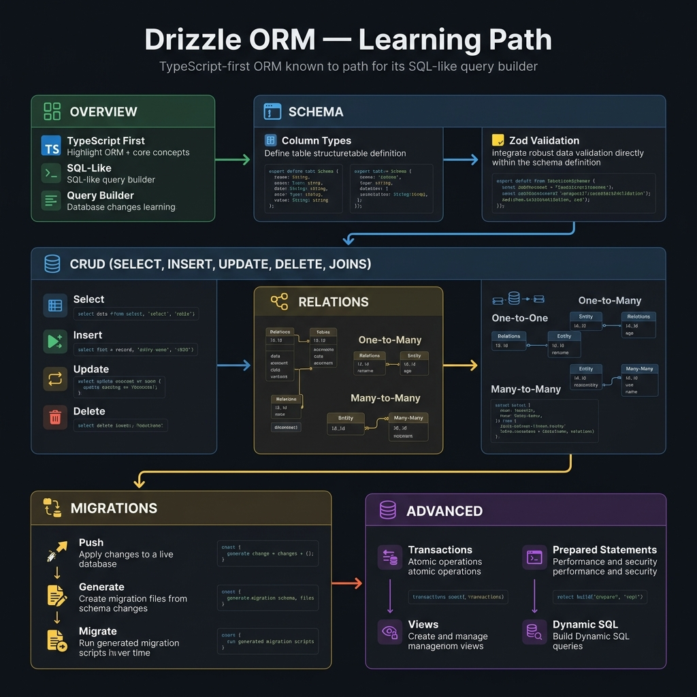

<!-- tags: overview -->
# Drizzle ORM

> Hub cho overview, schema, CRUD, relations, migrations và advanced patterns của Drizzle.

| Aspect | Detail |
| --- | --- |
| **Concept** | Hub điều hướng cho `Drizzle ORM` |
| **Audience** | TypeScript backend engineer, full-stack engineer, platform engineer |
| **Primary style** | Concept-First router |
| **Entry point** | Mở khi bạn đang dùng Drizzle nhưng chưa rõ nên đào vào setup, schema, query, relation hay migration. |

📅 Cập nhật: 2026-04-05 · ⏱️ 6 phút đọc

---

## 1. DEFINE

Hình dung `Drizzle ORM` xuất hiện ngay lúc bạn cần Drizzle không chỉ “type-safe” mà còn phải rõ boundary giữa TypeScript code và database contract.


Drizzle hấp dẫn vì nó bớt “magic”, nhưng chính điều đó cũng khiến mọi quyết định về schema, query shape và migration lộ ra rất rõ trước mặt bạn. Hub này giúp chọn đúng lane thay vì đọc mọi thứ như cùng một khối ORM.

Hub này không thay thế từng bài detail. Nó tồn tại để giúp người đọc mở đúng lane trước khi sa vào tool, syntax hoặc diagram cụ thể. Khi đọc đúng thứ tự, bạn sẽ bớt cảm giác “biết nhiều từ khóa nhưng vẫn không route được bài toán thật”.

### Signals & Boundaries

- Mở hub này khi bạn biết vấn đề nằm trong `Drizzle ORM`, nhưng chưa rõ nên đọc bài nào trước.
- Dùng coverage map để route theo pain point thay vì theo thứ tự file.
- Quay lại hub sau mỗi bài để chọn bước kế tiếp có chủ đích.

### Coverage Map

| Entry | Vai trò |
| --- | --- |
| [Drizzle Advanced — Transactions, Prepared Statements & Raw SQL](advanced/README.md) | Điểm vào cho lane `Drizzle Advanced — Transactions, Prepared Statements & Raw SQL` |
| [Drizzle CRUD — Select, Insert, Update, Delete & Joins](crud/README.md) | Điểm vào cho lane `Drizzle CRUD — Select, Insert, Update, Delete & Joins` |
| [Drizzle Migrations — drizzle-kit CLI](migrations/README.md) | Điểm vào cho lane `Drizzle Migrations — drizzle-kit CLI` |
| [Drizzle Overview — Giới Thiệu & Cài Đặt](overview/README.md) | Điểm vào cho lane `Drizzle Overview — Giới Thiệu & Cài Đặt` |
| [Drizzle Relations & Relational Query Builder](relations/README.md) | Điểm vào cho lane `Drizzle Relations & Relational Query Builder` |
| [Drizzle Schema — Column Types & Constraints](schema/README.md) | Điểm vào cho lane `Drizzle Schema — Column Types & Constraints` |

---

## 2. VISUAL



Định nghĩa đã khóa được phạm vi của hub. Visual dưới đây giúp route nhanh theo lane thay vì lướt một danh sách link khô.

### Level 1

```text
bắt đầu từ pain point hiện tại
  -> Drizzle Advanced — Transactions, Prepared Statements & Raw SQL
  -> Drizzle CRUD — Select, Insert, Update, Delete & Joins
  -> Drizzle Migrations — drizzle-kit CLI
  -> Drizzle Overview — Giới Thiệu & Cài Đặt
  -> Drizzle Relations & Relational Query Builder
  -> Drizzle Schema — Column Types & Constraints
```

*Hình: Hub này hoạt động như router, không phải catalog để lướt cho đủ.*

### Level 2

```text
đọc đúng lane -> giảm nhảy cóc giữa các bài
đọc sai lane  -> càng đọc càng thấy thuật ngữ rời rạc
```

*Hình: Giá trị thật của README dạng router là giữ người đọc đi đúng đường ngay từ đầu.*

---

## 3. CODE

Sơ đồ đã chỉ ra nhịp điều hướng. Artifact dưới đây biến hub thành một worksheet ngắn để team hoặc người học tự chọn đúng cửa vào.

### Problem 1: Basic — Route lane trước khi đọc sâu

> **Mục tiêu**: Không để việc học hoặc review trượt thành “mở bài nào cũng được”.
> **Approach**: Chọn lane theo pain point đang có.
> **Ví dụ**: Chọn đúng cụm cần đọc trong `Drizzle ORM`.
> **Độ phức tạp**: Basic

```yaml
router:
  module: Drizzle ORM
  rule: "chọn lane theo pain point, không theo tên nghe quen"
  suggested_path:
  - advanced/README.md
  - crud/README.md
  - migrations/README.md
  - overview/README.md
  - relations/README.md
  - schema/README.md
```

Artifact này không giải bài toán thay người đọc; nó chỉ cắt bớt những lane sai trước khi thời gian bị đốt vào các bài không phục vụ đúng mục tiêu.

---

## 4. PITFALLS

Khi hub/router bị dùng sai, người đọc vẫn có thể đọc được từng bài nhưng tổng thể sẽ rơi vào trạng thái hiểu rời rạc.

| # | Severity | Lỗi | Hậu quả | Fix |
| --- | --- | --- | --- | --- |
| 1 | 🔴 Fatal | Đọc theo thứ tự file mà không route theo pain point | Tích lũy thuật ngữ nhưng không giải quyết đúng vấn đề | Dùng coverage map trước khi mở bài detail |
| 2 | 🟡 Common | Xem README như catalog thuần link | Mất vai trò điều hướng của hub | Luôn hỏi “mình đang đau ở lane nào?” |
| 3 | 🔵 Minor | Đọc xong không quay lại hub | Bị nhảy sang bài lân cận theo cảm tính | Quay lại README để chọn bước kế tiếp |

---

## 5. REF

| Resource | Loại | Link | Ghi chú |
| --- | --- | --- | --- |
| Drizzle Advanced — Transactions, Prepared Statements & Raw SQL | Internal | [Drizzle Advanced — Transactions, Prepared Statements & Raw SQL](advanced/README.md) | Entry point liên quan trực tiếp |
| Drizzle CRUD — Select, Insert, Update, Delete & Joins | Internal | [Drizzle CRUD — Select, Insert, Update, Delete & Joins](crud/README.md) | Entry point liên quan trực tiếp |
| Drizzle Migrations — drizzle-kit CLI | Internal | [Drizzle Migrations — drizzle-kit CLI](migrations/README.md) | Entry point liên quan trực tiếp |
| Drizzle Overview — Giới Thiệu & Cài Đặt | Internal | [Drizzle Overview — Giới Thiệu & Cài Đặt](overview/README.md) | Entry point liên quan trực tiếp |

---

## 6. RECOMMEND

Khi đã biết mình đang đứng ở lane nào, bước tiếp theo là mở đúng bài đầu của lane đó thay vì học lan man thêm một topic mới.

| Mở rộng | Khi nào | Lý do | File/Link |
| --- | --- | --- | --- |
| Drizzle Advanced — Transactions, Prepared Statements & Raw SQL | Khi pain point khớp lane này | Đi tiếp đúng cụm thay vì đọc rời | [Drizzle Advanced — Transactions, Prepared Statements & Raw SQL](advanced/README.md) |
| Drizzle CRUD — Select, Insert, Update, Delete & Joins | Khi pain point khớp lane này | Đi tiếp đúng cụm thay vì đọc rời | [Drizzle CRUD — Select, Insert, Update, Delete & Joins](crud/README.md) |
| Drizzle Migrations — drizzle-kit CLI | Khi pain point khớp lane này | Đi tiếp đúng cụm thay vì đọc rời | [Drizzle Migrations — drizzle-kit CLI](migrations/README.md) |
