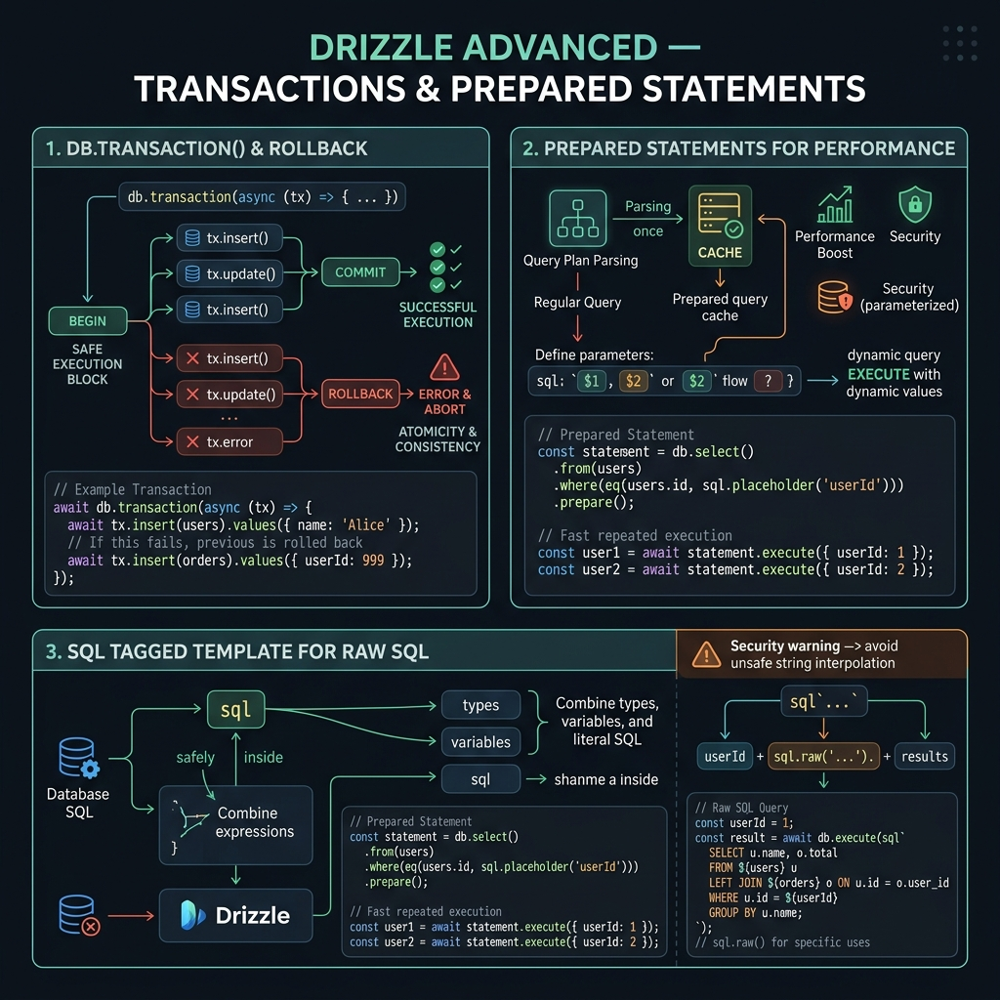

<!-- tags: drizzle, orm, typescript, transactions -->
# ⚡ Drizzle Advanced — Transactions, Prepared Statements & Raw SQL

> Patterns nâng cao: ACID transactions, savepoints, prepared statements, batch queries, raw SQL với type safety.

📅 Ngày tạo: 2026-03-19 · 🔄 Cập nhật: 2026-03-19 · ⏱️ 14 phút đọc

| Aspect                  | Detail                                                            |
| ----------------------- | ----------------------------------------------------------------- |
| **Transactions**        | `db.transaction(async (tx) => { ... })` — tự động commit/rollback |
| **Savepoints**          | Nested `tx.transaction()` → SAVEPOINT                             |
| **Prepared Statements** | `db.select().prepare('name')` — server-side caching               |
| **Batch**               | `db.batch([...])` — PlanetScale/Turso chỉ                         |
| **Raw SQL**             | `sql\`\`` template tag — any SQL expression                       |

---

## 1. DEFINE

Hình dung transaction chỉ có ý nghĩa khi boundary của nó được đặt đúng. Nếu transaction bao quá rộng hoặc quá hẹp, code có thể vẫn chạy nhưng invariants sẽ sớm trả giá ở production.


### Transaction guarantees (ACID)

| Property        | Mô tả                     | Drizzle implementation            |
| --------------- | ------------------------- | --------------------------------- |
| **Atomicity**   | Tất cả hoặc không có gì   | Auto-rollback nếu throw exception |
| **Consistency** | DB luôn ở state hợp lệ    | Constraints được enforce          |
| **Isolation**   | Transactions độc lập nhau | Postgres default: READ COMMITTED  |
| **Durability**  | Committed data persist    | Postgres WAL guarantees           |

### Drizzle Transaction API

| Method                               | Mô tả                                |
| ------------------------------------ | ------------------------------------ |
| `db.transaction(async tx => {...})`  | Transaction với auto-commit/rollback |
| `tx.transaction(async tx2 => {...})` | Nested transaction → SAVEPOINT       |
| `tx.rollback()`                      | Manual rollback (throws error)       |
| `tx.select()`, `tx.insert()`, etc.   | Tất cả operations trong transaction  |
| `tx.query.*`                         | Relational queries trong transaction |

### Prepared Statements

```
Normal:     parse SQL → bind params → execute   (mỗi lần)
Prepared:   parse SQL (1 lần) → bind → execute  (tái sử dụng)

Lợi ích: Giảm parsing overhead, tăng throughput
Giới hạn: Statement-per-connection trên số databases
```

---

Các failure mode trên nghe dễ tránh. Nhưng có trap: transaction không rollback on error = partial writes, và nested transaction thiếu savepoint = rollback scope sai. Trap đó sẽ xuất hiện ở PITFALLS.

## 2. VISUAL



Khái niệm nghe hợp lý, nhưng hình dưới mới cho thấy query, schema và runtime boundary bắt đầu va vào nhau ở đâu.


```
Transaction lifecycle:

BEGIN
  │
  ├── tx.select()...
  ├── tx.update()...
  ├── tx.insert()...
  │
  ├── [Success] → COMMIT  ✅ (tất cả changes persist)
  └── [Exception/tx.rollback()] → ROLLBACK  ❌ (tất cả changes undone)


Nested Transaction (Savepoints):

BEGIN
  │
  ├── tx.update()...
  │
  SAVEPOINT drizzle_sp_1
    │
    ├── tx2.insert()...
    ├── [Success] → RELEASE SAVEPOINT drizzle_sp_1
    └── [Exception] → ROLLBACK TO SAVEPOINT drizzle_sp_1
  │                   (chỉ nested rolled back, outer vẫn tiếp tục)
  │
  COMMIT
```

---

## 3. CODE

Đến đoạn implementation, bạn mới thấy quyết định ở trên đổi thành constraint nào trong code TypeScript và SQL.


### Example 1 — Basic: Transactions

**Mục tiêu**: Transaction cơ bản, auto-rollback, manual rollback.

```typescript
import { db } from './db';
import { accounts, users } from './db/schema';
import { eq, sql } from 'drizzle-orm';

// ─────────────────────────────────────────────
// 1. Basic Transaction — bank transfer
// ─────────────────────────────────────────────
async function transferMoney(fromUserId: number, toUserId: number, amount: number) {
    // ✅ Tất cả operations trong arrow fn → auto-commit nếu thành công
    //                                     → auto-rollback nếu có exception
    await db.transaction(async (tx) => {
        // Kiểm tra balance trước khi trừ
        const [fromAccount] = await tx
            .select({ balance: accounts.balance })
            .from(accounts)
            .where(eq(accounts.userId, fromUserId));

        if (!fromAccount || fromAccount.balance < amount) {
            // ✅ tx.rollback() throw RollbackError → transaction bị rollback
            // ⚠️ Không cần return sau tx.rollback() — nó throw exception
            tx.rollback();
        }

        // Trừ tiền từ account A
        await tx
            .update(accounts)
            .set({ balance: sql`${accounts.balance} - ${amount}` })
            .where(eq(accounts.userId, fromUserId));

        // Cộng tiền vào account B
        await tx
            .update(accounts)
            .set({ balance: sql`${accounts.balance} + ${amount}` })
            .where(eq(accounts.userId, toUserId));

        // Ghi log (cùng transaction)
        await tx.insert(transactionLogs).values({
            fromUserId,
            toUserId,
            amount,
            createdAt: new Date(),
        });
    });
}

// ─────────────────────────────────────────────
// 2. Transaction trả về value
// ─────────────────────────────────────────────
async function createUserWithProfile(
    userData: { name: string; email: string },
    profileData: { bio: string },
) {
    // ✅ Transaction có thể return value
    const result = await db.transaction(async (tx) => {
        const [user] = await tx.insert(users).values(userData).returning();

        const [profile] = await tx
            .insert(profileInfo)
            .values({ userId: user.id, ...profileData })
            .returning();

        return { user, profile }; // ✅ Returned sau commit
    });

    return result; // { user: {...}, profile: {...} }
}
```

---

### Example 2 — Intermediate: Nested Transactions & Isolation Level

**Mục tiêu**: Savepoints (nested tx), set isolation level, transaction với RQB.

```typescript
import { db } from './db';

// ─────────────────────────────────────────────
// 1. Nested Transaction → SAVEPOINT
// ─────────────────────────────────────────────
async function processOrderWithNotification(orderId: number) {
    await db.transaction(async (tx) => {
        // Outer transaction: update order
        await tx.update(orders).set({ status: 'processing' }).where(eq(orders.id, orderId));

        // ✅ Nested transaction → SAVEPOINT
        // Nếu notification fail, chỉ notification rolled back
        // Order update vẫn committed
        try {
            await tx.transaction(async (tx2) => {
                // This is in SAVEPOINT
                await tx2.insert(notifications).values({
                    orderId,
                    type: 'email',
                    message: 'Your order is being processed',
                });

                // Gọi external service (có thể fail)
                await sendEmailNotification(orderId);
            });
        } catch (error) {
            // ✅ SAVEPOINT rolled back, outer transaction tiếp tục
            console.warn('Notification failed, continuing order processing:', error);
        }

        // Order luôn được update dù notification fail
        await tx.update(orders).set({ processedAt: new Date() }).where(eq(orders.id, orderId));
    });
}

// ─────────────────────────────────────────────
// 2. Transaction Isolation Level (PostgreSQL)
// ─────────────────────────────────────────────
async function readRepeatableQuery() {
    await db.transaction(async (tx) => {
        // ✅ Dialect-specific config
        await tx.execute(sql`SET TRANSACTION ISOLATION LEVEL REPEATABLE READ`);
        // hoặc SERIALIZABLE cho strongest isolation

        // Bây giờ reads trong tx này sẽ consistent
        const balance1 = await tx
            .select({ b: accounts.balance })
            .from(accounts)
            .where(eq(accounts.id, 1));
        // ... other operations
        const balance2 = await tx
            .select({ b: accounts.balance })
            .from(accounts)
            .where(eq(accounts.id, 1));
        // balance1 === balance2 dù có transaction khác commit giữa 2 reads
    });
}

// ─────────────────────────────────────────────
// 3. RQB trong Transaction
// ─────────────────────────────────────────────
async function getAndUpdateUserPosts(userId: number) {
    return db.transaction(async (tx) => {
        // ✅ tx.query.* (không phải db.query.*)
        const user = await tx.query.users.findFirst({
            where: (u, { eq }) => eq(u.id, userId),
            with: {
                posts: {
                    where: (p, { eq }) => eq(p.isPublished, false),
                },
            },
        });

        if (!user || user.posts.length === 0) return null;

        // Publish tất cả draft posts
        await tx
            .update(posts)
            .set({ isPublished: true, publishedAt: new Date() })
            .where(
                inArray(
                    posts.id,
                    user.posts.map((p) => p.id),
                ),
            );

        return user;
    });
}
```

---

### Example 3 — Advanced: Prepared Statements & Batch Operations

**Mục tiêu**: Prepared statements cho high-throughput, batch operations, custom sql utility functions.

```typescript
import { db } from './db';
import { users, posts } from './db/schema';
import { eq, placeholder, sql } from 'drizzle-orm';

// ─────────────────────────────────────────────
// PREPARED STATEMENTS
// ─────────────────────────────────────────────

// ✅ Prepare at module level — parse SQL once, reuse
const getUserById = db
    .select()
    .from(users)
    .where(eq(users.id, placeholder('id')))
    .prepare('get_user_by_id'); // ← unique name per connection

const getUserByEmail = db
    .select()
    .from(users)
    .where(eq(users.email, placeholder('email')))
    .limit(1)
    .prepare('get_user_by_email');

const getRecentPosts = db
    .select({
        id: posts.id,
        title: posts.title,
        authorId: posts.authorId,
    })
    .from(posts)
    .where(eq(posts.isPublished, true))
    .orderBy(desc(posts.createdAt))
    .limit(placeholder('limit'))
    .offset(placeholder('offset'))
    .prepare('get_recent_posts');

// ✅ Execute với parameters — no re-parsing
async function handleGetUser(id: number) {
    const [user] = await getUserById.execute({ id });
    return user;
}

async function handleGetPosts(page: number, pageSize: number) {
    return getRecentPosts.execute({
        limit: pageSize,
        offset: (page - 1) * pageSize,
    });
}

// ─────────────────────────────────────────────
// CUSTOM SQL HELPERS
// ─────────────────────────────────────────────

// ✅ Reusable SQL expressions
const currentTimestamp = sql`CURRENT_TIMESTAMP`;
const randomUUID = sql`gen_random_uuid()`;

// ✅ SQL fragment functions
function jsonbSet(column: any, path: string, value: any) {
    return sql`jsonb_set(${column}, '${sql.raw(path)}', ${JSON.stringify(value)}::jsonb)`;
}

// Usage:
await db
    .update(users)
    .set({
        metadata: jsonbSet(users.metadata, '{settings,theme}', 'dark'),
    })
    .where(eq(users.id, 1));

// ─────────────────────────────────────────────
// HIGH-THROUGHPUT PATTERN
// ─────────────────────────────────────────────

// ✅ Bulk insert với batching (tránh query quá lớn)
async function bulkInsertUsers(userData: NewUser[]) {
    const BATCH_SIZE = 1000;
    const results: User[] = [];

    for (let i = 0; i < userData.length; i += BATCH_SIZE) {
        const batch = userData.slice(i, i + BATCH_SIZE);
        const inserted = await db.insert(users).values(batch).returning();
        results.push(...inserted);
    }

    return results;
}

// ✅ Parallel queries (non-transactional, nhưng concurrent)
async function getDashboardData(userId: number) {
    // Chạy all queries simultaneously
    const [userResult, postsResult, statsResult] = await Promise.all([
        db.select().from(users).where(eq(users.id, userId)).limit(1),
        db.select().from(posts).where(eq(posts.authorId, userId)).limit(5),
        db
            .select({
                total: count(),
                published: count(posts.publishedAt),
            })
            .from(posts)
            .where(eq(posts.authorId, userId)),
    ]);

    return {
        user: userResult[0],
        recentPosts: postsResult,
        stats: statsResult[0],
    };
}
```

---

Bạn đã đi qua transaction, savepoints, và saga. Bây giờ đến phần nguy hiểm: missing rollback và wrong scope — trap đã được setup từ đầu bài.

## 4. PITFALLS

Biết API chưa đủ; chỗ nguy hiểm nằm ở assumptions về types, relations và migration flow. Bảng dưới đây gom đúng những assumptions đó.


| #   | Lỗi                                              | Hậu quả                                              | Fix                                                           |
| --- | ------------------------------------------------ | ---------------------------------------------------- | ------------------------------------------------------------- |
| 1   | **Dùng `db.*` thay vì `tx.*` trong transaction** | Changes không thuộc transaction, không rollback được | Luôn dùng `tx` object bên trong transaction                   |
| 2   | **`tx.rollback()` rồi tiếp tục code**            | Unreachable code sau rollback gây confusion          | rollback throw error — không cần `return` sau `tx.rollback()` |
| 3   | **Transaction quá dài**                          | Lock tables → deadlock, timeout                      | Giữ transaction ngắn, chỉ include DB operations               |
| 4   | **Prepared statement name conflict**             | Duplicate statement error trên connection            | Dùng unique descriptive names                                 |
| 5   | **Không handle transaction error**               | Uncaught promise, leak connection                    | `try/catch` wrapper hoặc trust Drizzle auto-rollback          |
| 6   | **Async trong transaction không `await`**        | Non-awaited promise chạy ngoài transaction scope     | Luôn `await` trong transaction `async (tx) => {}`             |
| 7   | **Subquery tham chiếu outer table**              | SQL error hoặc wrong result                          | Dùng `sql` template với proper references                     |

---

Bạn đã đi qua Transactions & Advanced và cạm bẫy. Các resources dưới đây giúp đi sâu hơn.

## 5. REF

| Nguồn               | Link                                       |
| ------------------- | ------------------------------------------ |
| Transactions        | https://orm.drizzle.team/docs/transactions |
| Prepared Statements | https://orm.drizzle.team/docs/perf-queries |
| Batch API (Turso)   | https://orm.drizzle.team/docs/batch-api    |
| sql`` operator      | https://orm.drizzle.team/docs/sql          |
| Performance         | https://orm.drizzle.team/benchmarks        |

---

## 6. RECOMMEND

Các gợi ý dưới đây nối trực tiếp sang những điểm mù thường lộ ra ngay sau khi áp dụng khái niệm này trong project thật.


| Mở rộng                               | Khi nào                   | Lý do                                               |
| ------------------------------------- | ------------------------- | --------------------------------------------------- |
| **Outbox Pattern**                    | Reliable event publishing | Insert event trong cùng transaction với data        |
| **Optimistic locking**                | Concurrent updates        | Check `version` column trong WHERE trước khi UPDATE |
| **Database queues (pg-boss)**         | Background jobs           | Transactional job scheduling                        |
| **`drizzle-orm/pg-core` `execute()`** | DDL trong runtime         | Tạo tables dynamically                              |
| **Connection read/write split**       | Read replicas             | Drizzle-compatible với PgBouncer read routing       |

---

← Previous: [01-migrations.md](../migrations/01-migrations.md) | → Next: [02-views-sequences-dynamic.md](./02-views-sequences-dynamic.md)
