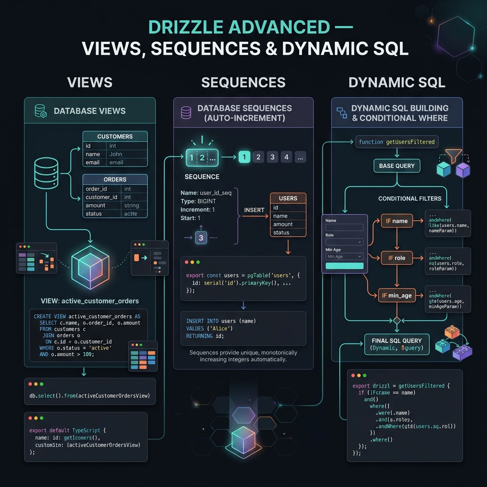

<!-- tags: drizzle, orm, typescript, advanced -->
# 🔮 Drizzle Advanced — Views, Sequences, Dynamic SQL & Patterns

> Kỹ thuật nâng cao: Database Views, Sequences, Dynamic Schema, Logging, Error Handling, và production patterns.

📅 Ngày tạo: 2026-03-19 · 🔄 Cập nhật: 2026-03-19 · ⏱️ 16 phút đọc

| Aspect        | Detail                                                            |
| ------------- | ----------------------------------------------------------------- |
| **Views**     | `pgView()`, `pgMaterializedView()` — read-only query abstractions |
| **Sequences** | `pgSequence()` — custom ID generators                             |
| **Logging**   | `logger: true` hoặc custom logger                                 |
| **$dynamic**  | Runtime query building pattern                                    |
| **sql`` tag** | Raw SQL expressions, fragments, custom operators                  |

---

## 1. DEFINE

Hình dung khi query bắt đầu lặp lại, aggregate logic nằm ở nhiều nơi và dynamic SQL kéo dài, bài toán không còn là CRUD nữa. Views, sequences và query composition là lúc Drizzle buộc bạn nghĩ ở tầng database contract nhiều hơn.


### Database Views

Views là **virtual tables** dựa trên SELECT query. Drizzle hỗ trợ 2 loại:

| Type                  | Mô tả                           | Khi nào dùng                         |
| --------------------- | ------------------------------- | ------------------------------------ |
| **Regular View**      | Query chạy mỗi lần access       | Data luôn mới nhất, read-only        |
| **Materialized View** | Query chạy 1 lần, cache kết quả | Read-heavy, data không cần real-time |

### Sequences

PostgreSQL sequences — custom auto-increment generators:

```text
pgSequence('order_number_seq', {
  startWith: 10000,
  increment: 1,
  cache: 10,  // pre-allocate 10 IDs cho performance
})
```

### Dynamic Query Building ($dynamic)

Pattern để build queries runtime dựa trên conditions:

```text
let query = db.select().from(users).$dynamic();
if (filter.name) query = query.where(like(users.name, `%${filter.name}%`));
if (filter.minAge) query = query.where(gte(users.age, filter.minAge));
// chain thêm conditions tùy ý
const result = await query;
```

### Query Logging

```text
drizzle(client, { logger: true })
→ Console output: Query: SELECT "id", "name" FROM "users" WHERE "id" = $1 -- params: [1]

Custom logger:
drizzle(client, {
  logger: { logQuery(query, params) { myLogger.info(query, params); } }
})
```

---

Các failure mode trên nghe cơ bản. Nhưng có trap: materialized view không refresh = stale data, và dynamic query builder thiếu sanitization = SQL injection. Trap đó sẽ xuất hiện ở PITFALLS.

## 2. VISUAL



Nói bằng chữ mới chỉ đủ để định nghĩa. Visual dưới đây kéo Drizzle về đúng luồng dữ liệu mà code của bạn đang chạy.


```text
Database Views:
┌─────────────────────────────────────────────────┐
│  pgTable('users', {...})                        │
│  pgTable('posts', {...})                        │
│  pgTable('comments', {...})                     │
│           │                                     │
│           ▼                                     │
│  pgView('user_stats').as(                       │  ← Regular View
│    SELECT user.id, user.name,                   │     (computed on access)
│    COUNT(posts.id) as post_count                │
│    FROM users JOIN posts ...                    │
│  )                                              │
│           │                                     │
│           ▼                                     │
│  db.select().from(userStats)                    │  ← Query view like table
│  // { id: 1, name: 'Alice', postCount: 42 }    │
└─────────────────────────────────────────────────┘

Materialized View:
┌──────────────┐     REFRESH      ┌──────────────────┐
│  Base tables  │ ──────────────▶ │ Cached result set │ ← Fast reads
│  (live data)  │                 │ (snapshot)         │
└──────────────┘                  └──────────────────┘
```

---

## 3. CODE

Sơ đồ đã lộ luồng chính. Đến code, Drizzle mới hiện ra như một contract thật giữa schema, query và application layer.


### Example 1 — Basic: Views & Logging

**Mục tiêu**: Tạo regular + materialized views, enable query logging.

```typescript
import {
    pgTable,
    pgView,
    pgMaterializedView,
    serial,
    text,
    integer,
    timestamp,
    boolean,
} from 'drizzle-orm/pg-core';
import { eq, sql, count, avg, desc } from 'drizzle-orm';

// ━━━━━━━━━━━━━━━━━━━━━━━━━━━━━━━━━━━━━━━━━━
// 1. Regular View — computed on every access
// ━━━━━━━━━━━━━━━━━━━━━━━━━━━━━━━━━━━━━━━━━━

export const users = pgTable('users', {
    id: serial('id').primaryKey(),
    name: text('name').notNull(),
    email: text('email').notNull(),
    role: text('role').notNull().default('user'),
    createdAt: timestamp('created_at').defaultNow().notNull(),
});

export const posts = pgTable('posts', {
    id: serial('id').primaryKey(),
    title: text('title').notNull(),
    authorId: integer('author_id').references(() => users.id),
    viewCount: integer('view_count').default(0),
    isPublished: boolean('is_published').default(false),
    createdAt: timestamp('created_at').defaultNow().notNull(),
});

// ✅ Regular View: author stats (always fresh)
export const authorStats = pgView('author_stats').as((qb) =>
    qb
        .select({
            authorId: users.id,
            authorName: users.name,
            postCount: count(posts.id).as('post_count'),
            totalViews: sql<number>`COALESCE(SUM(${posts.viewCount}), 0)`.as('total_views'),
            avgViews: avg(posts.viewCount).as('avg_views'),
        })
        .from(users)
        .leftJoin(posts, eq(posts.authorId, users.id))
        .groupBy(users.id, users.name),
);

// ✅ Materialized View: dashboard data (cached, refreshable)
export const dashboardStats = pgMaterializedView('dashboard_stats').as((qb) =>
    qb
        .select({
            totalUsers: count(users.id).as('total_users'),
            totalPosts: count(posts.id).as('total_posts'),
            publishedPosts:
                sql<number>`COUNT(${posts.id}) FILTER (WHERE ${posts.isPublished} = true)`.as(
                    'published_posts',
                ),
        })
        .from(users)
        .leftJoin(posts, eq(posts.authorId, users.id)),
);

// ━━━━━━━━━━━━━━━━━━━━━━━━━━━━━━━━━━━━━━━━━━
// Query views — same as tables
// ━━━━━━━━━━━━━━━━━━━━━━━━━━━━━━━━━━━━━━━━━━

// Regular view: data luôn mới
const topAuthors = await db
    .select()
    .from(authorStats)
    .orderBy(desc(authorStats.totalViews))
    .limit(10);

// Materialized view: cached data
const dashboard = await db.select().from(dashboardStats);

// ✅ Refresh materialized view (chạy periodic hoặc on-demand)
await db.refreshMaterializedView(dashboardStats);
// → REFRESH MATERIALIZED VIEW "dashboard_stats"

// Concurrent refresh (không block reads)
await db.refreshMaterializedView(dashboardStats).concurrently();
// → REFRESH MATERIALIZED VIEW CONCURRENTLY "dashboard_stats"
```

```typescript
// ━━━━━━━━━━━━━━━━━━━━━━━━━━━━━━━━━━━━━━━━━━
// 2. Query Logging
// ━━━━━━━━━━━━━━━━━━━━━━━━━━━━━━━━━━━━━━━━━━

import { drizzle } from 'drizzle-orm/postgres-js';
import { DefaultLogger, type LogWriter } from 'drizzle-orm';

// Simple: enable console logging
const db = drizzle(client, { logger: true });
// Output: Query: SELECT "id", "name" FROM "users" WHERE "id" = $1 -- params: [1]

// ✅ Custom logger — integrate with your logging system
class CustomLogWriter implements LogWriter {
    write(message: string) {
        // Send to production logging (Pino, Winston, etc.)
        logger.info({ sql: message }, 'Database query');
    }
}

const dbWithCustomLogger = drizzle(client, {
    logger: new DefaultLogger({ writer: new CustomLogWriter() }),
});

// ✅ Fine-grained: conditional logging
const dbConditional = drizzle(client, {
    logger: {
        logQuery(query: string, params: unknown[]) {
            // Chỉ log slow queries hoặc trong development
            if (process.env.NODE_ENV === 'development') {
                console.log('SQL:', query);
                console.log('Params:', params);
            }
        },
    },
});
```

---

### Example 2 — Intermediate: Sequences & Dynamic Queries

**Mục tiêu**: Custom sequences, $dynamic pattern cho flexible filtering.

```typescript
import { pgSequence, pgTable, integer, text, serial } from 'drizzle-orm/pg-core';
import { eq, and, or, gte, lte, like, ilike, inArray, desc, asc, SQL } from 'drizzle-orm';
import { sql } from 'drizzle-orm';

// ━━━━━━━━━━━━━━━━━━━━━━━━━━━━━━━━━━━━━━━━━━
// 1. Custom Sequences
// ━━━━━━━━━━━━━━━━━━━━━━━━━━━━━━━━━━━━━━━━━━

// ✅ Custom order number sequence
export const orderNumberSeq = pgSequence('order_number_seq', {
    startWith: 10000,
    increment: 1,
    minValue: 10000,
    maxValue: 99999999,
    cache: 10, // Pre-allocate 10 numbers for performance
    cycle: false, // Don't restart when max reached
});

export const orders = pgTable('orders', {
    id: serial('id').primaryKey(),
    // ✅ Dùng sequence cho order number (readable, not sequential with id)
    orderNumber: integer('order_number')
        .default(sql`nextval('order_number_seq')`)
        .notNull()
        .unique(),
    customerId: integer('customer_id').notNull(),
    total: integer('total').notNull(),
    status: text('status').default('pending').notNull(),
});

// Usage: INSERT tự động gán orderNumber từ sequence
const [order] = await db.insert(orders).values({ customerId: 1, total: 5000 }).returning();
// → order.orderNumber = 10001 (auto from sequence)

// ━━━━━━━━━━━━━━━━━━━━━━━━━━━━━━━━━━━━━━━━━━
// 2. $dynamic — Runtime query building
// ━━━━━━━━━━━━━━━━━━━━━━━━━━━━━━━━━━━━━━━━━━

// ✅ Flexible search API — build WHERE dynamically
interface SearchFilters {
    name?: string;
    email?: string;
    role?: string;
    minAge?: number;
    maxAge?: number;
    sortBy?: 'name' | 'createdAt' | 'age';
    sortOrder?: 'asc' | 'desc';
    page?: number;
    pageSize?: number;
}

async function searchUsers(filters: SearchFilters) {
    // ✅ $dynamic() cho phép chain WHERE sau khi khởi tạo
    let query = db.select().from(users).$dynamic();

    // Build conditions array
    const conditions: SQL[] = [];

    if (filters.name) {
        conditions.push(ilike(users.name, `%${filters.name}%`));
    }
    if (filters.email) {
        conditions.push(ilike(users.email, `%${filters.email}%`));
    }
    if (filters.role) {
        conditions.push(eq(users.role, filters.role));
    }
    if (filters.minAge !== undefined) {
        conditions.push(gte(users.age, filters.minAge));
    }
    if (filters.maxAge !== undefined) {
        conditions.push(lte(users.age, filters.maxAge));
    }

    // Apply WHERE
    if (conditions.length > 0) {
        query = query.where(and(...conditions));
    }

    // Sorting
    const sortColumn = {
        name: users.name,
        createdAt: users.createdAt,
        age: users.age,
    }[filters.sortBy ?? 'createdAt'];

    const sortFn = filters.sortOrder === 'asc' ? asc : desc;
    query = query.orderBy(sortFn(sortColumn));

    // Pagination
    const page = filters.page ?? 1;
    const pageSize = filters.pageSize ?? 20;
    query = query.limit(pageSize).offset((page - 1) * pageSize);

    return query;
}

// Usage
const results = await searchUsers({
    name: 'alice',
    role: 'admin',
    sortBy: 'createdAt',
    sortOrder: 'desc',
    page: 1,
    pageSize: 10,
});
```

---

### Example 3 — Advanced: SQL Utilities & Production Patterns

**Mục tiêu**: Custom SQL operators, soft delete pattern, audit logging, retry logic.

```typescript
import { sql, eq, and, isNull } from 'drizzle-orm';
import { pgTable, serial, text, integer, timestamp, jsonb } from 'drizzle-orm/pg-core';

// ━━━━━━━━━━━━━━━━━━━━━━━━━━━━━━━━━━━━━━━━━━
// 1. Custom SQL operator utilities
// ━━━━━━━━━━━━━━━━━━━━━━━━━━━━━━━━━━━━━━━━━━

// ✅ JSONB containment (@>)
function jsonbContains(column: any, value: object) {
    return sql`${column} @> ${JSON.stringify(value)}::jsonb`;
}

// ✅ JSONB path extraction (->>)
function jsonbExtract(column: any, path: string) {
    return sql<string>`${column} ->> ${path}`;
}

// ✅ Full-text search
function fullTextSearch(column: any, query: string) {
    return sql`to_tsvector('english', ${column}) @@ plainto_tsquery('english', ${query})`;
}

// ✅ Array contains (ANY)
function arrayContains(column: any, value: string) {
    return sql`${value} = ANY(${column})`;
}

// Usage:
const results = await db
    .select()
    .from(products)
    .where(
        and(
            jsonbContains(products.metadata, { category: 'electronics' }),
            fullTextSearch(products.description, 'wireless bluetooth'),
        ),
    );

// ━━━━━━━━━━━━━━━━━━━━━━━━━━━━━━━━━━━━━━━━━━
// 2. Soft Delete Pattern
// ━━━━━━━━━━━━━━━━━━━━━━━━━━━━━━━━━━━━━━━━━━

export const softDeleteTable = pgTable('entities', {
    id: serial('id').primaryKey(),
    name: text('name').notNull(),
    deletedAt: timestamp('deleted_at'), // NULL = active, value = deleted
    deletedBy: integer('deleted_by'),
});

// ✅ Helper: always filter out deleted records
function notDeleted(table: typeof softDeleteTable) {
    return isNull(table.deletedAt);
}

// Usage:
const activeEntities = await db.select().from(softDeleteTable).where(notDeleted(softDeleteTable));

// Soft delete:
await db
    .update(softDeleteTable)
    .set({ deletedAt: new Date(), deletedBy: currentUserId })
    .where(eq(softDeleteTable.id, entityId));

// ━━━━━━━━━━━━━━━━━━━━━━━━━━━━━━━━━━━━━━━━━━
// 3. Audit Log Pattern — thêm createdBy/updatedBy tự động
// ━━━━━━━━━━━━━━━━━━━━━━━━━━━━━━━━━━━━━━━━━━

// ✅ Wrapper function cho audited mutations
async function auditedInsert<T extends Record<string, unknown>>(
    table: any,
    data: T,
    userId: number,
) {
    return db
        .insert(table)
        .values({
            ...data,
            createdBy: userId,
            createdAt: new Date(),
        })
        .returning();
}

async function auditedUpdate<T extends Record<string, unknown>>(
    table: any,
    data: T,
    where: SQL,
    userId: number,
) {
    return db
        .update(table)
        .set({
            ...data,
            updatedBy: userId,
            updatedAt: new Date(),
        })
        .where(where)
        .returning();
}

// ━━━━━━━━━━━━━━━━━━━━━━━━━━━━━━━━━━━━━━━━━━
// 4. Retry Pattern — handle transient errors
// ━━━━━━━━━━━━━━━━━━━━━━━━━━━━━━━━━━━━━━━━━━

async function withRetry<T>(fn: () => Promise<T>, maxRetries = 3, delay = 100): Promise<T> {
    for (let attempt = 1; attempt <= maxRetries; attempt++) {
        try {
            return await fn();
        } catch (error: any) {
            // Retry on serialization failure or connection issues
            const retryable = ['40001', '40P01', '08006', '08001'].includes(error?.code);
            if (!retryable || attempt === maxRetries) throw error;

            console.warn(`Retry ${attempt}/${maxRetries}: ${error.message}`);
            await new Promise((r) => setTimeout(r, delay * Math.pow(2, attempt - 1)));
        }
    }
    throw new Error('Unreachable');
}

// Usage:
const result = await withRetry(() =>
    db.transaction(async (tx) => {
        // Serializable transaction that might need retry
        await tx.execute(sql`SET TRANSACTION ISOLATION LEVEL SERIALIZABLE`);
        // ... operations
    }),
);

// ━━━━━━━━━━━━━━━━━━━━━━━━━━━━━━━━━━━━━━━━━━
// 5. Query Performance: $count utility
// ━━━━━━━━━━━━━━━━━━━━━━━━━━━━━━━━━━━━━━━━━━

// ✅ Shorthand count
const totalUsers = await db.$count(users);
// → SELECT count(*) FROM "users"

// ✅ Count with condition
const activeUsers = await db.$count(users, isNull(users.deletedAt));
// → SELECT count(*) FROM "users" WHERE "deleted_at" IS NULL

// ✅ Pagination with total count
async function paginatedQuery(page: number, pageSize: number) {
    const [data, totalResult] = await Promise.all([
        db
            .select()
            .from(users)
            .limit(pageSize)
            .offset((page - 1) * pageSize),
        db.$count(users),
    ]);

    return {
        data,
        pagination: {
            page,
            pageSize,
            total: totalResult,
            totalPages: Math.ceil(totalResult / pageSize),
        },
    };
}
```

---

Bạn đã đi qua views, sequences, và dynamic queries. Bây giờ đến phần nguy hiểm: stale views và SQL injection — trap đã được setup từ đầu bài.

## 4. PITFALLS

Drizzle hiếm khi làm bạn đau vì cú pháp; nó làm bạn đau khi boundary schema, query và migration bị đặt hời hợt. Các pitfalls sau là chỗ trả giá nhiều nhất.


| #   | Lỗi                               | Hậu quả                                 | Fix                                                                         |
| --- | --------------------------------- | --------------------------------------- | --------------------------------------------------------------------------- |
| 1   | **Materialized view stale data**  | Dashboard/reports hiển thị data cũ      | Phải gọi `refreshMaterializedView()` periodic (cron job)                    |
| 2   | **View không INSERT/UPDATE được** | Runtime error khi cố mutation           | Views là read-only — dùng underlying tables cho mutations                   |
| 3   | **Sequence gap**                  | ID không liên tục, gây nhầm lẫn         | Sequence có thể skip numbers (normal behavior) — đừng depend vào contiguous |
| 4   | **$dynamic type narrowing**       | TypeScript type inference mất chính xác | TypeScript không track dynamic WHERE — cast kết quả nếu cần                 |
| 5   | **Logger trong production**       | Verbose logs, performance impact        | `logger: true` verbose — dùng custom logger với conditional                 |
| 6   | **SQL injection qua sql.raw()**   | Critical security vulnerability         | `sql.raw()` KHÔNG escape — chỉ dùng cho trusted input                       |
| 7   | **Retry trên non-idempotent ops** | Duplicate data trong DB                 | Retry INSERT có thể duplicate — cần ON CONFLICT hoặc idempotency key        |

---

Bạn đã đi qua Views, Sequences & Dynamic và cạm bẫy. Các resources dưới đây giúp đi sâu hơn.

## 5. REF

| Nguồn           | Link                                                                                                 |
| --------------- | ---------------------------------------------------------------------------------------------------- |
| Views           | [orm.drizzle.team/docs/views](https://orm.drizzle.team/docs/views)                                   |
| Sequences       | [orm.drizzle.team/docs/sequences](https://orm.drizzle.team/docs/sequences)                           |
| sql`` operator  | [orm.drizzle.team/docs/sql](https://orm.drizzle.team/docs/sql)                                       |
| Dynamic queries | [orm.drizzle.team/docs/dynamic-query-building](https://orm.drizzle.team/docs/dynamic-query-building) |
| Logging         | [orm.drizzle.team/docs/goodies#logging](https://orm.drizzle.team/docs/goodies#logging)               |
| Performance     | [orm.drizzle.team/docs/perf-queries](https://orm.drizzle.team/docs/perf-queries)                     |

---

## 6. RECOMMEND

Khi đã thấy bài này nối schema, query hay migration ở đâu, các tài liệu sau giúp mở đúng lane kế cận để tiếp tục giữ boundary sạch.


| Mở rộng                            | Khi nào                       | Lý do                                         |
| ---------------------------------- | ----------------------------- | --------------------------------------------- |
| **Drizzle Studio**                 | Debug + inspect data          | Visual browser cho DB — `drizzle-kit studio`  |
| **pg_cron + materialized views**   | Dashboard/analytics           | Auto-refresh materialized views               |
| **Outbox pattern + transactions**  | Event-driven architecture     | Reliable event publishing                     |
| **Read replicas**                  | High-traffic reads            | Route reads sang replica, writes sang primary |
| **Connection pooling (PgBouncer)** | Serverless + high concurrency | Giữ connection count thấp                     |

---

← Previous: [01-transactions-advanced.md](./01-transactions-advanced.md)
