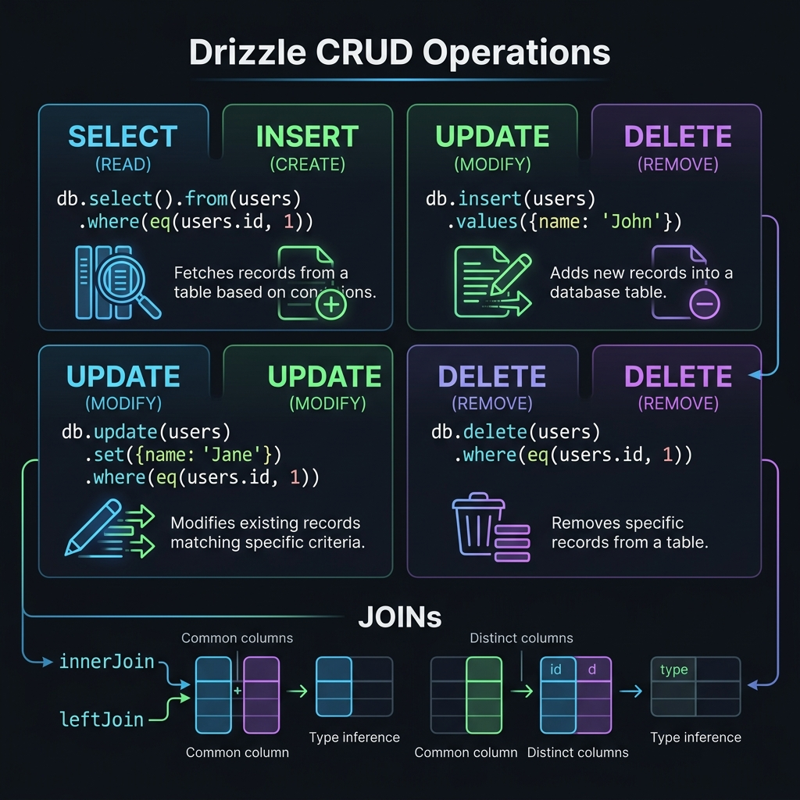

<!-- tags: drizzle, orm, typescript, crud -->
# 🔍 Drizzle CRUD — Select, Insert, Update, Delete & Joins

> Toàn bộ CRUD operations với Drizzle: từ basic select đến complex joins, upserts, CTE và aggregations.

📅 Ngày tạo: 2026-03-19 · 🔄 Cập nhật: 2026-03-19 · ⏱️ 18 phút đọc

| Aspect      | Detail                                                             |
| ----------- | ------------------------------------------------------------------ |
| **Package** | `drizzle-orm` (operators: eq, and, or, gt, lt, like, inArray, ...) |
| **Pattern** | Chainable SQL builder — mỗi method tương đương 1 SQL clause        |
| **Output**  | Luôn đúng 1 SQL query, KHÔNG bao giờ N+1                           |

---

## 1. DEFINE

Hình dung cRUD với Drizzle nghe rất hiền cho đến khi query shape, selected columns và returning data bắt đầu ảnh hưởng trực tiếp đến types bạn mang đi khắp service layer. Đây là bài về chỗ mỗi query thường ngày bắt đầu có giá.


### Operators quan trọng nhất

| Operator                 | SQL            | Ví dụ                                |
| ------------------------ | -------------- | ------------------------------------ |
| `eq(col, val)`           | `= val`        | `where(eq(users.id, 1))`             |
| `ne(col, val)`           | `!= val`       | `where(ne(users.status, 'banned'))`  |
| `gt(col, val)`           | `> val`        | `where(gt(users.age, 18))`           |
| `gte(col, val)`          | `>= val`       | `where(gte(posts.views, 100))`       |
| `lt(col, val)`           | `< val`        | `where(lt(orders.total, 50))`        |
| `lte(col, val)`          | `<= val`       | `where(lte(users.age, 65))`          |
| `and(...conditions)`     | `AND`          | `where(and(eq(...), gt(...)))`       |
| `or(...conditions)`      | `OR`           | `where(or(eq(...), eq(...)))`        |
| `not(condition)`         | `NOT`          | `where(not(eq(...)))`                |
| `isNull(col)`            | `IS NULL`      | `where(isNull(users.deletedAt))`     |
| `isNotNull(col)`         | `IS NOT NULL`  | `where(isNotNull(users.verifiedAt))` |
| `inArray(col, arr)`      | `IN (...)`     | `where(inArray(users.id, [1,2,3]))`  |
| `notInArray(col, arr)`   | `NOT IN (...)` | -                                    |
| `like(col, pattern)`     | `LIKE '%...'`  | `where(like(users.name, '%john%'))`  |
| `ilike(col, pattern)`    | `ILIKE` (PG)   | Case-insensitive                     |
| `between(col, min, max)` | `BETWEEN`      | `where(between(users.age, 18, 65))`  |
| `sql\`...\``             | Raw SQL        | `where(sql\`lower(name) = 'john'\`)` |

### SELECT API flow

```
db.select({ partial select })
  .from(table)
  .leftJoin(other, eq(table.fk, other.id))
  .where(and(...))
  .groupBy(col)
  .having(sql`count(*) > 5`)
  .orderBy(asc(table.col), desc(table.other))
  .limit(20)
  .offset(40);
```

---

Các failure mode trên nghe cơ bản. Nhưng có trap: select * trả quá nhiều columns = bandwidth waste, và update without where = toàn bảng bị sửa. Trap đó sẽ xuất hiện ở PITFALLS.

## 2. VISUAL



Định nghĩa đã khóa boundary giữa TypeScript và database. Visual dưới đây cho thấy dữ liệu và types đi qua boundary đó như thế nào.


```
SQL-like Query Builder Chain:

db.select()           → SELECT *
  .from(users)        → FROM "users"
  .leftJoin(          → LEFT JOIN "posts"
    posts,            →   ON "users"."id" = "posts"."author_id"
    eq(posts.authorId, users.id)
  )
  .where(             → WHERE
    and(              →   (
      isNull(users.deletedAt),      →   "users"."deleted_at" IS NULL
      gte(users.age, 18)            →   AND "users"."age" >= 18
    )                 →   )
  )
  .orderBy(desc(posts.createdAt))   → ORDER BY "posts"."created_at" DESC
  .limit(10)          → LIMIT 10
  .offset(20);        → OFFSET 20

Result type is AUTOMATICALLY inferred from schema + select shape!
```

---

## 3. CODE

Đến đoạn implementation, bạn mới thấy quyết định ở trên đổi thành constraint nào trong code TypeScript và SQL.


### Example 1 — Basic: CRUD đơn giản

**Mục tiêu**: SELECT / INSERT / UPDATE / DELETE cơ bản, partial select, filters.

```typescript
import { db } from './db';
import { users, posts } from './db/schema';
import {
    eq,
    ne,
    gt,
    gte,
    lt,
    and,
    or,
    isNull,
    isNotNull,
    inArray,
    like,
    ilike,
    between,
    desc,
    asc,
    count,
    sum,
    avg,
} from 'drizzle-orm';
import { sql } from 'drizzle-orm';

// ─────────────────────────────────────────────
// SELECT
// ─────────────────────────────────────────────

// 1. Select tất cả
const allUsers = await db.select().from(users);
// → SELECT "id", "name", "email", ... FROM "users"
// Type: { id: number; name: string; email: string; ... }[]

// 2. Partial select (chọn fields cụ thể)
const userNames = await db.select({ id: users.id, name: users.name }).from(users);
// → SELECT "id", "name" FROM "users"
// Type: { id: number; name: string }[]

// 3. Filters
const activeAdults = await db
    .select()
    .from(users)
    .where(
        and(
            eq(users.isVerified, true),
            gte(users.age, 18),
            isNull(users.deletedAt), // soft delete check
        ),
    );

// 4. Search với ILIKE (case-insensitive cho PG)
const searchResult = await db
    .select()
    .from(users)
    .where(ilike(users.name, `%${searchTerm}%`));

// 5. IN array
const specificUsers = await db
    .select()
    .from(users)
    .where(inArray(users.id, [1, 2, 3, 4, 5]));

// 6. Pagination
const page = 2;
const pageSize = 20;
const paginatedUsers = await db
    .select()
    .from(users)
    .orderBy(desc(users.createdAt))
    .limit(pageSize)
    .offset((page - 1) * pageSize);

// ─────────────────────────────────────────────
// INSERT
// ─────────────────────────────────────────────

// 1. Insert 1 row
const [newUser] = await db
    .insert(users)
    .values({
        name: 'Alice',
        email: 'alice@example.com',
        age: 25,
    })
    .returning(); // ✅ Trả về inserted row (PG only)
// Type: { id: number; name: string; email: string; ... }

// 2. Insert nhiều rows
await db.insert(users).values([
    { name: 'Bob', email: 'bob@example.com', age: 30 },
    { name: 'Carol', email: 'carol@example.com', age: 28 },
]);

// 3. Upsert (ON CONFLICT DO UPDATE)
await db
    .insert(users)
    .values({ email: 'alice@example.com', name: 'Alice Updated', age: 26 })
    .onConflictDoUpdate({
        target: users.email, // UNIQUE column để detect conflict
        set: {
            name: sql`EXCLUDED.name`, // ✅ Dùng EXCLUDED để refer inserted value
            age: sql`EXCLUDED.age`,
        },
    });

// 4. Upsert: bỏ qua nếu conflict
await db
    .insert(users)
    .values({ email: 'alice@example.com', name: 'Duplicate' })
    .onConflictDoNothing();

// ─────────────────────────────────────────────
// UPDATE
// ─────────────────────────────────────────────

// 1. Basic update
const [updatedUser] = await db
    .update(users)
    .set({
        name: 'Alice Smith',
        isVerified: true,
        // ⚠️ updatedAt phải set thủ công trong SQL-API
    })
    .where(eq(users.id, 1))
    .returning();

// 2. Update với SQL expression
await db
    .update(users)
    .set({
        viewCount: sql`${users.viewCount} + 1`, // Atomic increment
    })
    .where(eq(users.id, 1));

// ─────────────────────────────────────────────
// DELETE
// ─────────────────────────────────────────────

// 1. Delete với condition
await db.delete(users).where(eq(users.id, 1));

// 2. Soft delete (update deleted_at instead)
await db.update(users).set({ deletedAt: new Date() }).where(eq(users.id, 1));

// 3. Delete và return deleted rows
const [deletedUser] = await db.delete(users).where(eq(users.id, 1)).returning();
```

---

### Example 2 — Intermediate: Joins & Aggregations

**Mục tiêu**: LEFT/INNER JOIN, partial select sau join, aggregation functions (count, sum, avg, groupBy).

```typescript
import { db } from './db';
import { users, posts, comments } from './db/schema';
import { eq, and, isNull, desc, asc, count, sum, avg, max, min, countDistinct } from 'drizzle-orm';
import { sql } from 'drizzle-orm';

// ─────────────────────────────────────────────
// JOINS
// ─────────────────────────────────────────────

// 1. LEFT JOIN — user kèm posts (có thể null)
const usersWithPosts = await db
    .select({
        user: {
            id: users.id,
            name: users.name,
        },
        post: {
            id: posts.id,
            title: posts.title,
        },
    })
    .from(users)
    .leftJoin(posts, eq(posts.authorId, users.id));
// Type: { user: { id: number; name: string; }; post: { id: number; title: string; } | null; }[]

// 2. INNER JOIN — chỉ users có posts
const usersHavingPosts = await db
    .select({
        userName: users.name,
        postTitle: posts.title,
    })
    .from(users)
    .innerJoin(posts, eq(posts.authorId, users.id))
    .where(isNull(posts.deletedAt));

// 3. Multiple JOINs — posts + author + comment count
const postsWithDetails = await db
    .select({
        postId: posts.id,
        title: posts.title,
        authorName: users.name,
        commentCount: count(comments.id),
    })
    .from(posts)
    .innerJoin(users, eq(posts.authorId, users.id))
    .leftJoin(comments, eq(comments.postId, posts.id))
    .groupBy(posts.id, users.name)
    .orderBy(desc(posts.createdAt));

// ─────────────────────────────────────────────
// AGGREGATIONS
// ─────────────────────────────────────────────

// 4. Count, Sum, Avg
const stats = await db
    .select({
        totalUsers: count(),
        verifiedUsers: count(users.verifiedAt), // count non-null
        avgAge: avg(users.age),
        maxAge: max(users.age),
        minAge: min(users.age),
    })
    .from(users)
    .where(isNull(users.deletedAt));

// 5. GROUP BY với HAVING
const activeCategories = await db
    .select({
        authorId: posts.authorId,
        postCount: count(posts.id),
        avgViews: avg(posts.viewCount),
    })
    .from(posts)
    .where(eq(posts.isPublished, true))
    .groupBy(posts.authorId)
    .having(sql`count(${posts.id}) > 5`) // ✅ HAVING cho aggregate condition
    .orderBy(desc(sql`count(${posts.id})`));

// ─────────────────────────────────────────────
// SUBQUERY & WITH (CTE)
// ─────────────────────────────────────────────

// 6. Subquery
const popularAuthors = db
    .select({ authorId: posts.authorId })
    .from(posts)
    .groupBy(posts.authorId)
    .having(sql`count(*) > 10`)
    .as('popular_authors'); // ✅ Alias cho subquery

const topUsers = await db
    .select({ id: users.id, name: users.name })
    .from(users)
    .innerJoin(popularAuthors, eq(users.id, popularAuthors.authorId));

// 7. CTE (WITH clause) — readable complex queries
const { with: withClause } = db
    .$with('active_users')
    .as(db.select().from(users).where(isNull(users.deletedAt)));
// ⚠️ CTE syntax varies — check drizzle docs for current API
```

---

### Example 3 — Advanced: Dynamic Queries & Prepared Statements

**Mục tiêu**: Build queries dynamically (filter object), prepared statements cho performance.

```typescript
import { db } from './db';
import { users, posts } from './db/schema';
import { eq, and, gte, lte, ilike, inArray, desc, asc, SQL } from 'drizzle-orm';
import { sql, placeholder } from 'drizzle-orm';

// ─────────────────────────────────────────────
// DYNAMIC QUERY BUILDING
// ─────────────────────────────────────────────

interface UserSearchParams {
    name?: string;
    minAge?: number;
    maxAge?: number;
    status?: string[];
    page?: number;
    pageSize?: number;
    sortBy?: 'name' | 'age' | 'createdAt';
    sortOrder?: 'asc' | 'desc';
}

async function searchUsers(params: UserSearchParams) {
    const {
        name,
        minAge,
        maxAge,
        status,
        page = 1,
        pageSize = 20,
        sortBy = 'createdAt',
        sortOrder = 'desc',
    } = params;

    // ✅ Tích luỹ WHERE conditions vào array
    const conditions: SQL[] = [];

    if (name) conditions.push(ilike(users.name, `%${name}%`));
    if (minAge !== undefined) conditions.push(gte(users.age, minAge));
    if (maxAge !== undefined) conditions.push(lte(users.age, maxAge));
    if (status && status.length > 0) conditions.push(inArray(users.status, status));

    // ✅ Sort column mapping
    const sortColumn = {
        name: users.name,
        age: users.age,
        createdAt: users.createdAt,
    }[sortBy];

    const orderFn = sortOrder === 'asc' ? asc : desc;

    const query = db
        .select()
        .from(users)
        .where(conditions.length > 0 ? and(...conditions) : undefined)
        .orderBy(orderFn(sortColumn))
        .limit(pageSize)
        .offset((page - 1) * pageSize);

    return query;
}

// Usage:
const results = await searchUsers({
    name: 'alice',
    minAge: 18,
    status: ['active', 'verified'],
    sortBy: 'createdAt',
    sortOrder: 'desc',
});

// ─────────────────────────────────────────────
// PREPARED STATEMENTS — reuse parsing overhead
// ─────────────────────────────────────────────

// ✅ Prepare một lần, execute nhiều lần (server-side caching)
const getUserById = db
    .select()
    .from(users)
    .where(eq(users.id, placeholder('userId'))) // ✅ placeholder parameter
    .prepare('get_user_by_id');

// Execute với different params — no re-parsing
const user1 = await getUserById.execute({ userId: 1 });
const user2 = await getUserById.execute({ userId: 2 });

// Prepared với multiple params
const getUsersByStatus = db
    .select()
    .from(users)
    .where(and(eq(users.status, placeholder('status')), gte(users.age, placeholder('minAge'))))
    .limit(placeholder('limit'))
    .prepare('get_users_by_status');

const activeAdults = await getUsersByStatus.execute({
    status: 'active',
    minAge: 18,
    limit: 50,
});

// ─────────────────────────────────────────────
// RAW SQL với sql`` template tag
// ─────────────────────────────────────────────

// ✅ Khi cần SQL không có trong API
const result = await db.execute(sql`
  SELECT 
    u.id,
    u.name,
    COUNT(p.id) as post_count,
    COALESCE(SUM(p.view_count), 0) as total_views
  FROM users u
  LEFT JOIN posts p ON p.author_id = u.id
  WHERE u.deleted_at IS NULL
  GROUP BY u.id, u.name
  HAVING COUNT(p.id) > ${minPostCount}
  ORDER BY total_views DESC
  LIMIT ${pageSize}
`);
```

---

Bạn đã đi qua CRUD, joins, và batch ops. Bây giờ đến phần nguy hiểm: unbounded select và missing where — trap đã được setup từ đầu bài.

## 4. PITFALLS

Drizzle hiếm khi làm bạn đau vì cú pháp; nó làm bạn đau khi boundary schema, query và migration bị đặt hời hợt. Các pitfalls sau là chỗ trả giá nhiều nhất.


| #   | Lỗi                                                | Hậu quả                               | Fix                                                                  |
| --- | -------------------------------------------------- | ------------------------------------- | -------------------------------------------------------------------- |
| 1   | **WHERE thiếu condition → update/delete ALL rows** | Mất toàn bộ data trong table          | Luôn double-check `.where()` trước khi chạy                          |
| 2   | **leftJoin result không handle null**              | Runtime error khi access null fields  | Type checker báo lỗi — handle `post \| null` trước khi access fields |
| 3   | **count() không phân biệt null/non-null**          | Số đếm sai, báo cáo không chính xác   | `count(col)` chỉ count non-null; `count()` count tất cả              |
| 4   | **sql\`\`` injection risk**                        | Security vulnerability, SQL injection | KHÔNG interpolate user input trực tiếp — dùng parameter placeholders |
| 5   | **Prepared statement và connection pool**          | Unexpected error hoặc wrong result    | Một số drivers prepared statements gắn với connection — test kỹ      |
| 6   | **orderBy dynamic column**                         | TypeScript error hoặc wrong sort      | Không thể truyền string — phải map to actual column reference        |
| 7   | **Upsert thiếu target**                            | Runtime error từ DB                   | `.onConflictDoUpdate({ target })` phải là UNIQUE column/constraint   |

---

Bạn đã đi qua CRUD Operations và cạm bẫy. Các resources dưới đây giúp đi sâu hơn.

## 5. REF

| Nguồn     | Link                                         |
| --------- | -------------------------------------------- |
| SELECT    | https://orm.drizzle.team/docs/select         |
| INSERT    | https://orm.drizzle.team/docs/insert         |
| UPDATE    | https://orm.drizzle.team/docs/update         |
| DELETE    | https://orm.drizzle.team/docs/delete         |
| Joins     | https://orm.drizzle.team/docs/joins          |
| Operators | https://orm.drizzle.team/docs/operators      |
| Filters   | https://orm.drizzle.team/docs/select#filters |

---

## 6. RECOMMEND

Khi đã thấy bài này nối schema, query hay migration ở đâu, các tài liệu sau giúp mở đúng lane kế cận để tiếp tục giữ boundary sạch.


| Mở rộng               | Khi nào                               | Lý do                                     |
| --------------------- | ------------------------------------- | ----------------------------------------- |
| **Relational API**    | Nested data (user + posts + comments) | Tự động handle joins, no N+1              |
| **Cursor pagination** | Large datasets                        | Efficient hơn OFFSET pagination           |
| **$count utility**    | Count queries                         | `await db.$count(users)` — shorthand      |
| **Batch operations**  | Bulk insert performance               | `db.insert().values([...1000 rows...])`   |
| **iterator**          | Streaming large result sets           | `for await (const row of db.select()...)` |

---

← Previous: [01-schema-column-types.md](../schema/01-schema-column-types.md) | → Next: [01-relations.md](../relations/01-relations.md)
