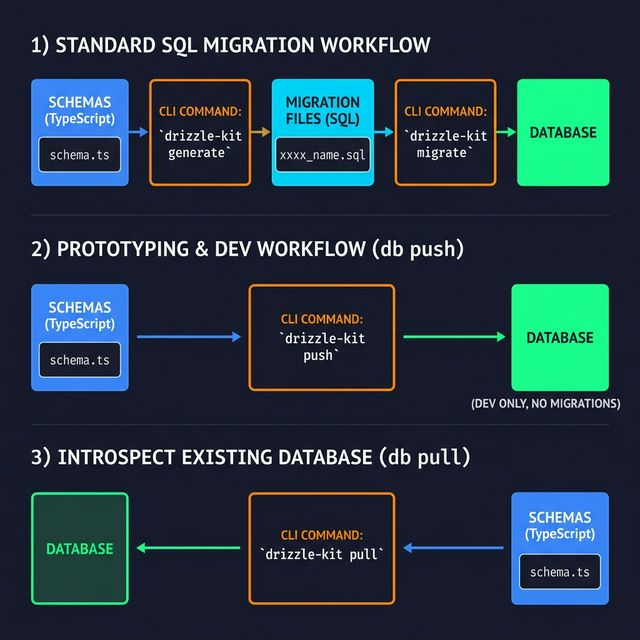

<!-- tags: drizzle, orm, typescript, migrations -->
# 🚀 Drizzle Migrations — drizzle-kit CLI

> Quản lý database migrations với drizzle-kit: generate SQL files, push trực tiếp, pull từ DB, apply migrations — tất cả type-safe.

📅 Ngày tạo: 2026-03-19 · 🔄 Cập nhật: 2026-03-19 · ⏱️ 12 phút đọc

| Aspect          | Detail                                          |
| --------------- | ----------------------------------------------- |
| **Tool**        | `drizzle-kit` (CLI) — install as devDependency  |
| **Config file** | `drizzle.config.ts`                             |
| **Commands**    | `generate`, `migrate`, `push`, `pull`, `studio` |
| **Version**     | drizzle-kit ^0.30+                              |

---

## 1. DEFINE

Hình dung môi trường local rất dễ làm bạn tin migration là chuyện cơ học. Đến staging và production, drift, rollback và compatibility mới là phần khó hơn nhiều so với câu lệnh generate đầu tiên.


### Hai chiến lược migration

| Strategy                                | Mô tả                                                            | Khi nào dùng                                         |
| --------------------------------------- | ---------------------------------------------------------------- | ---------------------------------------------------- |
| **Codebase-first** (generate + migrate) | Schema TS là source of truth → generate SQL files → apply vào DB | **Production**: có lịch sử migration, reviewable     |
| **Codebase-first** (push)               | Schema TS → push trực tiếp vào DB, không có SQL files            | **Development only**: prototype nhanh, local testing |
| **Database-first** (pull)               | DB là source of truth → pull schema → generate TS files          | Legacy DB integration, existing database             |

### drizzle-kit commands

| Command                | Mô tả                                    | Use case                               |
| ---------------------- | ---------------------------------------- | -------------------------------------- |
| `drizzle-kit generate` | Tạo SQL migration file từ schema diff    | Production workflow                    |
| `drizzle-kit migrate`  | Apply SQL migration files vào DB         | CI/CD deployment                       |
| `drizzle-kit push`     | Push schema thẳng vào DB (no SQL files)  | Dev rapid iteration                    |
| `drizzle-kit pull`     | Pull DB schema → generate TS schema file | Database-first approach                |
| `drizzle-kit studio`   | Open visual DB browser                   | Debug/inspect data                     |
| `drizzle-kit check`    | Validate migration files                 | CI validation                          |
| `drizzle-kit up`       | Upgrade snapshot format                  | Migration between drizzle-kit versions |

### Migration file naming

```
Format: {timestamp}_{name}.sql
Example: 0001_initial_schema.sql
         0002_add_user_email_index.sql
         0003_create_orders_table.sql
```

---

Các failure mode trên nghe rõ. Nhưng có trap: migration thiếu down = rollback impossible, và migration order sai = foreign key constraint error. Trap đó sẽ xuất hiện ở PITFALLS.

## 2. VISUAL

Định nghĩa đã khóa boundary giữa TypeScript và database. Visual dưới đây cho thấy dữ liệu và types đi qua boundary đó như thế nào.




```
STANDARD WORKFLOW (Codebase-first):

┌─────────────────────────────────────────────┐
│  1. Sửa schema.ts                           │
│     export const users = pgTable('users',   │
│       { id: serial().pk(), email: text() }) │
└─────────────────────────────────────────────┘
                    │
          drizzle-kit generate
                    │
                    ▼
┌─────────────────────────────────────────────┐
│  2. SQL migration file được tạo             │
│  migrations/0001_create_users.sql           │
│  CREATE TABLE "users" (                     │
│    "id" SERIAL PRIMARY KEY,                 │
│    "email" TEXT                             │
│  );                                         │
└─────────────────────────────────────────────┘
                    │
          drizzle-kit migrate
          (hoặc migrate() trong app)
                    │
                    ▼
┌─────────────────────────────────────────────┐
│  3. Applied vào Database                    │
│  Tracked trong __drizzle_migrations table   │
└─────────────────────────────────────────────┘
```

---

## 3. CODE

Sơ đồ đã lộ luồng chính. Đến code, Drizzle mới hiện ra như một contract thật giữa schema, query và application layer.


### Example 1 — Basic: Setup drizzle.config.ts

**Mục tiêu**: Cấu hình drizzle-kit và workflow generate + migrate cơ bản.

```typescript
// drizzle.config.ts — root của project
import { defineConfig } from 'drizzle-kit';

export default defineConfig({
    // ✅ Schema file(s) — hỗ trợ glob pattern
    schema: './src/db/schema.ts', // hoặc './src/db/schema/**/*.ts'

    // ✅ Nơi lưu migration files
    out: './drizzle',

    // ✅ Database dialect
    dialect: 'postgresql', // 'postgresql' | 'mysql' | 'sqlite' | 'singlestore' | 'mssql'

    // ✅ DB credentials (dùng cho push, pull, migrate)
    dbCredentials: {
        url: process.env.DATABASE_URL!,
    },

    // Optional settings:
    verbose: true, // Log SQL being generated
    strict: true, // Require confirmation for destructive operations
    breakpoints: true, // Add --> statement-breakpoint trong migration files
    tablesFilter: ['users', 'posts', '*_table'], // Chỉ manage specific tables
});
```

```bash
# Package.json scripts
{
  "scripts": {
    "db:generate": "drizzle-kit generate",
    "db:migrate": "drizzle-kit migrate",
    "db:push": "drizzle-kit push",
    "db:pull": "drizzle-kit pull",
    "db:studio": "drizzle-kit studio"
  }
}
```

```bash
# Workflow 1: Generate migration file
npm run db:generate -- --name=create_users_table
# Creates: drizzle/0001_create_users_table.sql
# Creates: drizzle/meta/0001_snapshot.json  ← schema snapshot

# Workflow 2: Apply migration to DB
npm run db:migrate
# Applies pending migration files to DATABASE_URL
# Tracks applied migrations in __drizzle_migrations table
```

---

### Example 2 — Intermediate: Programmatic Migration + CI/CD

**Mục tiêu**: Chạy migrations programmatically trong application startup — pattern phổ biến cho Docker/Kubernetes deployments.

```typescript
// src/db/migrate.ts — standalone migration script
import { drizzle } from 'drizzle-orm/postgres-js';
import { migrate } from 'drizzle-orm/postgres-js/migrator';
import postgres from 'postgres';
import path from 'path';

async function runMigrations() {
    console.log('🔄 Running database migrations...');

    // ✅ Dedicated migration connection (không dùng pool)
    const migrationClient = postgres(process.env.DATABASE_URL!, {
        max: 1, // Single connection cho migrations
    });

    const db = drizzle(migrationClient);

    try {
        await migrate(db, {
            // ✅ Path đến migrations folder (relative hoặc absolute)
            migrationsFolder: path.join(process.cwd(), 'drizzle'),
            // Optional: custom table name để track migrations
            migrationsTable: '__drizzle_migrations',
            migrationsSchema: 'public', // PG schema
        });

        console.log('✅ Migrations applied successfully');
    } catch (error) {
        console.error('❌ Migration failed:', error);
        process.exit(1); // Fail fast trong CI/CD
    } finally {
        await migrationClient.end();
    }
}

runMigrations();
```

```typescript
// src/main.ts — chạy migration trước khi start server
import { runMigrations } from './db/migrate';
import { createApp } from './app';

async function bootstrap() {
    // ✅ Migrate trước, start sau
    await runMigrations();

    const app = createApp();
    app.listen(3000, () => {
        console.log('🚀 Server running on port 3000');
    });
}

bootstrap();
```

```yaml
# Dockerfile — multi-stage với migration step
FROM node:20-alpine AS base
WORKDIR /app
COPY package*.json ./
RUN npm ci --production

FROM base AS migrate
COPY drizzle/ ./drizzle/
COPY src/db/migrate.ts ./src/db/
# drizzle-kit migrate (hoặc custom script)
CMD ["node", "-r", "ts-node/register", "src/db/migrate.ts"]

FROM base AS server
COPY src/ ./src/
CMD ["node", "-r", "ts-node/register", "src/main.ts"]
```

---

### Example 3 — Advanced: Schema Evolution & Rollbacks

**Mục tiêu**: Quản lý schema thay đổi phức tạp, handle destructive changes, custom migration SQL.

```bash
# ✅ Scenario: Thêm cột mới
# 1. Sửa schema.ts: thêm `phone: text('phone')`
# 2. Generate:
npx drizzle-kit generate --name=add_phone_to_users
# → drizzle/0003_add_phone_to_users.sql

# Nội dung file được tạo:
# ALTER TABLE "users" ADD COLUMN "phone" text;
```

```sql
-- drizzle/0003_add_phone_to_users.sql (auto-generated)
ALTER TABLE "users" ADD COLUMN "phone" text;

-- ⚠️ Nếu cần custom SQL (migration logic) — thêm thủ công:
-- UPDATE users SET phone = '+84' || old_phone WHERE old_phone IS NOT NULL;
```

```bash
# ✅ Scenario: Rename column (destructive!)
# Drizzle-kit sẽ hỏi xác nhận hoặc fail với strict: true
# Cần dùng --custom flag để viết migration tay:
npx drizzle-kit generate --custom --name=rename_username_to_display_name
```

```sql
-- drizzle/0004_rename_username_to_display_name.sql (custom)
-- Đây là custom migration — drizzle-kit không auto-generate rename

-- Option 1: Safe rename (add + data migrate + drop old)
ALTER TABLE "users" ADD COLUMN "display_name" text;
UPDATE "users" SET "display_name" = "username";
ALTER TABLE "users" ALTER COLUMN "display_name" SET NOT NULL;
-- Sau khi verify, drop old column trong migration tiếp theo:
-- ALTER TABLE "users" DROP COLUMN "username";

-- Option 2: Direct rename (PostgreSQL)
-- ALTER TABLE "users" RENAME COLUMN "username" TO "display_name";
```

```typescript
// ━━━━━━━━━━━━━━━━━━━━━━━━━━━━━━━━━━━━━━━━━━━━━━━━━
// drizzle-kit push — DEV ONLY (rapid prototyping)
// ━━━━━━━━━━━━━━━━━━━━━━━━━━━━━━━━━━━━━━━━━━━━━━━━━
// Không tạo migration files — push schema thẳng vào DB

// drizzle.config.ts cho dev environment
import { defineConfig } from 'drizzle-kit';

export default defineConfig({
    schema: './src/db/schema.ts',
    dialect: 'postgresql',
    dbCredentials: {
        url: process.env.DATABASE_URL!, // local dev DB
    },
    // ⚠️ Không có 'out' khi chỉ dùng push
});
```

```bash
# Dev workflow: push instantly
npx drizzle-kit push
# → Drizzle computes diff between current schema & DB
# → Applies changes directly (no SQL files)
# → ⚠️ Nguy hiểm cho production: không có rollback history!

# Nếu có breaking change:
# Drizzle sẽ prompt xác nhận hoặc reject với strict mode
```

---

Bạn đã đi qua migration, schema diff, và production strategy. Bây giờ đến phần nguy hiểm: missing rollback và wrong order — trap đã được setup từ đầu bài.

## 4. PITFALLS

Lỗi thường không nằm ở việc code không chạy, mà ở việc chạy được nhưng để lại drift hoặc query shape khó kiểm soát.


| #   | Lỗi                                     | Hậu quả                                         | Fix                                                          |
| --- | --------------------------------------- | ----------------------------------------------- | ------------------------------------------------------------ |
| 1   | **Dùng `push` trong production**        | Không có migration history, không rollback được | Dùng `generate` + `migrate`                                  |
| 2   | **Sửa migration file đã apply**         | Drizzle track bằng hash → drift error           | Tạo migration mới thay vì sửa file cũ                        |
| 3   | **Quên commit migration files vào git** | Team member thiếu migration, DB mismatch        | Luôn commit `drizzle/` folder                                |
| 4   | **Rename column gây mất data**          | Drizzle generate DROP + ADD → mất data          | Dùng custom migration với SQL RENAME                         |
| 5   | **Nhiều environments cùng migrate**     | Race condition, DB ở trạng thái inconsistent    | Dùng DB-level lock hoặc run migration ở init container riêng |
| 6   | **`migrationsFolder` path sai**         | `migrate()` không tìm thấy SQL files, crash     | Dùng absolute path với `path.join(process.cwd(), 'drizzle')` |
| 7   | **Migration connection không đóng**     | Connection leak sau `migrate()`                 | Luôn `await client.end()` trong finally block                |

---

Bạn đã đi qua Migrations và cạm bẫy. Các resources dưới đây giúp đi sâu hơn.

## 5. REF

| Nguồn                | Link                                               |
| -------------------- | -------------------------------------------------- |
| Migrations Overview  | https://orm.drizzle.team/docs/migrations           |
| drizzle-kit Overview | https://orm.drizzle.team/docs/kit-overview         |
| drizzle-kit generate | https://orm.drizzle.team/docs/drizzle-kit-generate |
| drizzle-kit migrate  | https://orm.drizzle.team/docs/drizzle-kit-migrate  |
| drizzle-kit push     | https://orm.drizzle.team/docs/drizzle-kit-push     |
| drizzle-kit pull     | https://orm.drizzle.team/docs/drizzle-kit-pull     |

---

## 6. RECOMMEND

Khi đã thấy bài này nối schema, query hay migration ở đâu, các tài liệu sau giúp mở đúng lane kế cận để tiếp tục giữ boundary sạch.


| Mở rộng                                    | Khi nào                         | Lý do                               |
| ------------------------------------------ | ------------------------------- | ----------------------------------- |
| **Atlas integration**                      | Enterprise migration management | Policy-based migrations, CI checks  |
| **Migration trong k8s Init Container**     | Kubernetes deployments          | Isolate migration từ app container  |
| **Branching databases** (Neon/PlanetScale) | Feature branch development      | Test schema changes trước khi merge |
| **drizzle-kit studio**                     | Data inspection                 | Visual browser cho development      |
| **`tablesFilter`**                         | Multi-tenant single DB          | Chỉ manage tables của module mình   |

---

← Previous: [01-relations-rqb.md](../relations/01-relations-rqb.md) | → Next: [01-transactions-advanced.md](../advanced/01-transactions-advanced.md)
