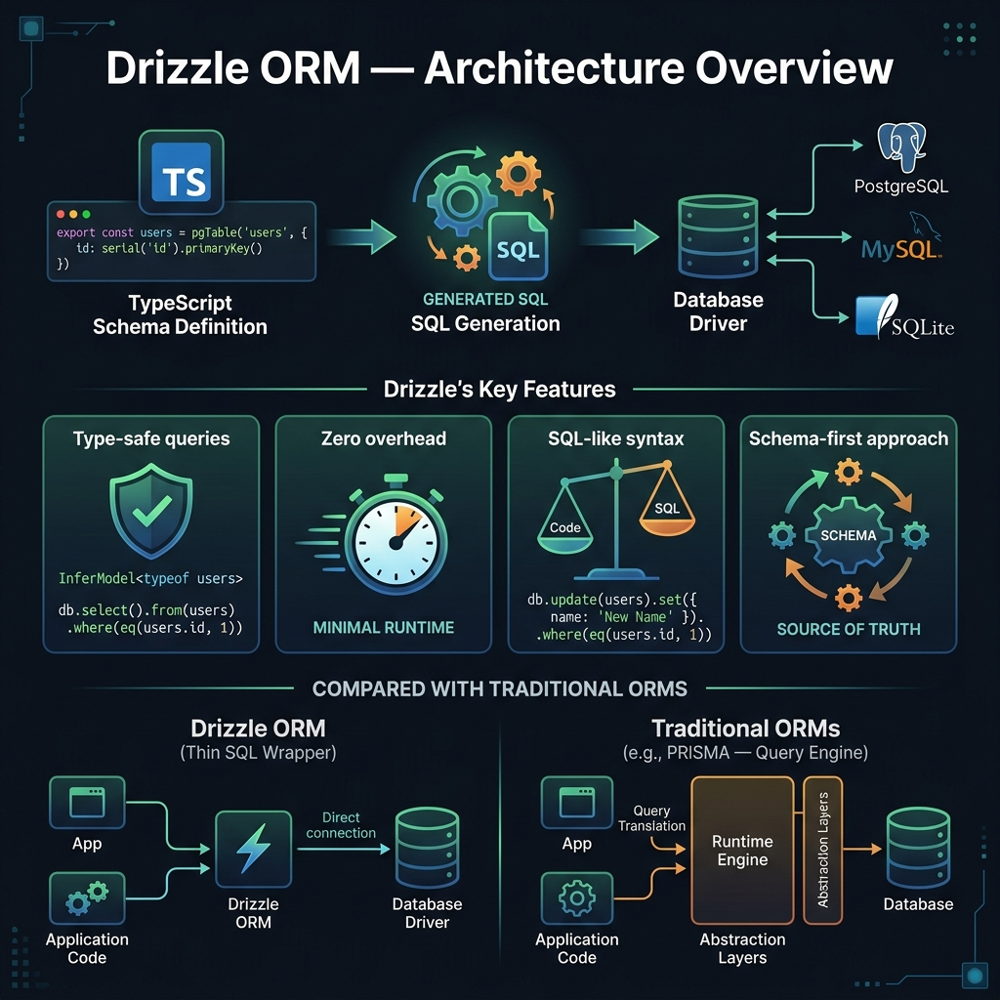
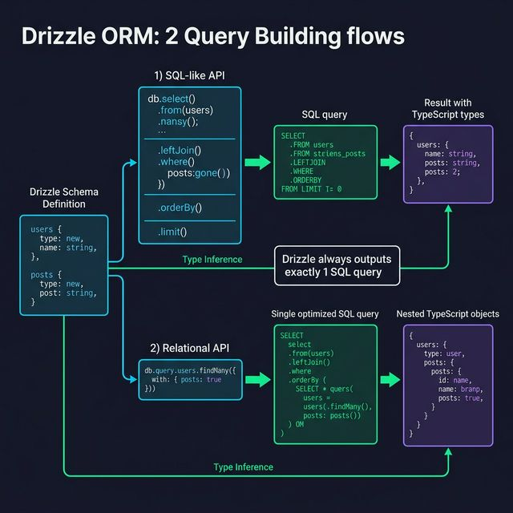

<!-- tags: drizzle, orm, typescript, database -->
# 🌧️ Drizzle ORM — Giới Thiệu & Cài Đặt

> Headless TypeScript ORM: SQL-like, serverless-ready, zero dependencies, type-safe từ schema đến query result.

📅 Ngày tạo: 2026-03-19 · 🔄 Cập nhật: 2026-03-19 · ⏱️ 12 phút đọc

| Aspect          | Detail                                                |
| --------------- | ----------------------------------------------------- |
| **Version**     | drizzle-orm ^0.40+ / drizzle-kit ^0.30+               |
| **Runtime**     | Node.js, Bun, Deno, Edge (Cloudflare Workers, Vercel) |
| **Databases**   | PostgreSQL, MySQL, SQLite, SingleStore, MSSQL         |
| **Bundle size** | ~35KB (0 dependencies!)                               |
| **Type safety** | 100% inferred — không cần code generation             |

---

## 1. DEFINE

Hình dung bạn muốn một ORM đủ type-safe nhưng không muốn đổi hẳn sang một DSL xa lạ với SQL. Drizzle bắt đầu hấp dẫn đúng ở chỗ nó hứa sẽ ít magic hơn, và bài này tồn tại để kiểm tra lời hứa đó bắt đầu từ đâu.


### Drizzle là gì?

**Drizzle ORM** là TypeScript ORM "headless" — nó không áp đặt project structure, không có hidden magic, không generate code phức tạp. Nguyên tắc cốt lõi:

> _"If you know SQL, you know Drizzle."_

### So sánh triết lý

| ORM         | Approach                  | Vấn đề                       |
| ----------- | ------------------------- | ---------------------------- |
| **Prisma**  | Schema.prisma → code gen  | Double learning curve, heavy |
| **TypeORM** | Decorators, Active Record | Verbose, nhiều boilerplate   |
| **Drizzle** | TypeScript as schema      | SQL-like, zero abstraction   |

### Hai API mode

| Mode                 | Syntax                                              | Khi nào dùng                               |
| -------------------- | --------------------------------------------------- | ------------------------------------------ |
| **SQL-like**         | `db.select().from(users).where(eq(...))`            | Cần full SQL control, complex queries      |
| **Relational (RQB)** | `db.query.users.findMany({ with: { posts: true }})` | Nested relational data, đơn giản hóa joins |

### Actors (Thành phần)

| Component            | Vai trò                                                       |
| -------------------- | ------------------------------------------------------------- |
| **Schema file**      | Khai báo tables, columns, relations (`pgTable`, `mysqlTable`) |
| **Drizzle instance** | `db = drizzle(driver)` — entry point cho queries              |
| **drizzle-kit**      | CLI tool: generate/push/pull migrations                       |
| **Database Driver**  | Adapter kết nối DB thực tế (`postgres.js`, `mysql2`, v.v.)    |

### Invariants (Ràng buộc hệ thống)

- Drizzle **luôn** output đúng 1 SQL query (không có N+1 problem)
- Types được infer hoàn toàn từ schema — không generate code
- Schema là TypeScript thuần — không cần DSL riêng
- `drizzle-kit push` chỉ dùng cho **development** — không dùng production

### Failure Modes

| Lỗi                     | Nguyên nhân                        | Cách tránh                       |
| ----------------------- | ---------------------------------- | -------------------------------- |
| Runtime type mismatch   | Dùng `sql<WrongType>`              | Verify kiểu với `.mapWith()`     |
| Missing relation in RQB | Quên pass `schema` vào `drizzle()` | Luôn pass `schema` khi dùng RQB  |
| Migration drift         | `push` rồi dùng `generate`         | Chọn 1 strategy và giữ nhất quán |
| N+1 (nếu code sai)      | Gọi query trong loop               | Dùng `with` trong findMany       |

---

Các failure mode trên nghe quen. Nhưng có trap: connection pool không config = max connections exhausted, và schema type mismatch = silent data truncation. Trap đó sẽ xuất hiện ở PITFALLS.

## 2. VISUAL

Nói bằng chữ mới chỉ đủ để định nghĩa. Visual dưới đây kéo Drizzle về đúng luồng dữ liệu mà code của bạn đang chạy.






### Luồng hoạt động tổng quan

```
TypeScript Schema (schema.ts)
       │
       ▼
drizzle(driver, { schema })   ← khởi tạo db instance
       │
       ├─► db.select().from(users).where(...)   ← SQL-like API
       │         │
       │         ▼
       │   SELECT "id", "name" FROM "users" WHERE ...
       │
       └─► db.query.users.findMany({ with: { posts: true }})  ← Relational API
                 │
                 ▼
           Single optimized SQL với JOINs
```

### Project structure khuyến nghị

```
src/
├── db/
│   ├── index.ts          ← drizzle instance
│   ├── schema.ts         ← tất cả tables + relations
│   └── migrations/       ← SQL migration files (drizzle-kit generate)
│       └── 0001_init.sql
├── drizzle.config.ts     ← drizzle-kit config
└── ...
```

---

## 3. CODE

Đến đoạn implementation, bạn mới thấy quyết định ở trên đổi thành constraint nào trong code TypeScript và SQL.


### Example 1 — Basic: Cài đặt và kết nối PostgreSQL

**Mục tiêu**: Cài đặt Drizzle với PostgreSQL (postgres.js driver), tạo schema cơ bản, chạy query đầu tiên.

**Cần**: `drizzle-orm`, `postgres`, `drizzle-kit` (devDependency)

```bash
npm install drizzle-orm postgres
npm install -D drizzle-kit
```

```typescript
// drizzle.config.ts — cấu hình drizzle-kit CLI
import { defineConfig } from 'drizzle-kit';

export default defineConfig({
    // ✅ Đường dẫn đến schema file(s)
    schema: './src/db/schema.ts',
    // ✅ Nơi lưu SQL migration files
    out: './src/db/migrations',
    // ✅ Dialect: 'postgresql' | 'mysql' | 'sqlite'
    dialect: 'postgresql',
    dbCredentials: {
        url: process.env.DATABASE_URL!,
    },
});
```

```typescript
// src/db/schema.ts — khai báo tables
import { pgTable, serial, text, integer, timestamp, boolean } from 'drizzle-orm/pg-core';

// ━━━━━━━━━━━━━━━━━━━━━━━━━━━━━━━━━━━━━━━━━━━━━━
// pgTable('sql_table_name', { columnName: type })
// TypeScript property name ≠ SQL column name (camelCase vs snake_case)
// ━━━━━━━━━━━━━━━━━━━━━━━━━━━━━━━━━━━━━━━━━━━━━━
export const users = pgTable('users', {
    id: serial('id').primaryKey(), // SERIAL PRIMARY KEY
    name: text('name').notNull(), // TEXT NOT NULL
    email: text('email').notNull().unique(), // TEXT UNIQUE
    age: integer('age'), // INTEGER (nullable)
    isVerified: boolean('is_verified').default(false), // BOOLEAN DEFAULT false
    createdAt: timestamp('created_at').defaultNow().notNull(), // TIMESTAMP DEFAULT NOW()
});

export const posts = pgTable('posts', {
    id: serial('id').primaryKey(),
    title: text('title').notNull(),
    content: text('content'),
    authorId: integer('author_id').references(() => users.id), // FOREIGN KEY
    publishedAt: timestamp('published_at'),
});

// ⚠️ Export types để dùng trong application code
export type User = typeof users.$inferSelect; // { id: number; name: string; ... }
export type NewUser = typeof users.$inferInsert; // { name: string; email: string; ... }
```

```typescript
// src/db/index.ts — khởi tạo drizzle instance
import { drizzle } from 'drizzle-orm/postgres-js';
import postgres from 'postgres';
import * as schema from './schema';

// ✅ Connection pool cho production
const connectionString = process.env.DATABASE_URL!;
const client = postgres(connectionString);

// ✅ Pass schema để enable Relational API (db.query.*)
export const db = drizzle(client, { schema });
```

```typescript
// src/main.ts — query đầu tiên
import { db } from './db';
import { users } from './db/schema';
import { eq } from 'drizzle-orm';

async function main() {
    // ━━━━━━━━━━━━━━━━━━━━━━━━━━━━━━━━━━━━━━━━━━━
    // SELECT "id", "name", "email" FROM "users";
    // ━━━━━━━━━━━━━━━━━━━━━━━━━━━━━━━━━━━━━━━━━━━
    const allUsers = await db.select().from(users);
    // Type: { id: number; name: string; email: string; ... }[]

    // ━━━━━━━━━━━━━━━━━━━━━━━━━━━━━━━━━━━━━━━━━━━
    // SELECT "id", "name" FROM "users" WHERE "id" = 1;
    // ━━━━━━━━━━━━━━━━━━━━━━━━━━━━━━━━━━━━━━━━━━━
    const user = await db
        .select({ id: users.id, name: users.name })
        .from(users)
        .where(eq(users.id, 1));

    console.log(allUsers);
    console.log(user);
}

main();
```

**Kết quả đạt được**:

- Drizzle instance `db` kết nối PostgreSQL qua `postgres.js`
- Schema được định nghĩa type-safe hoàn toàn trong TypeScript
- Query result type được infer tự động từ schema

---

### Example 2 — Intermediate: Serverless với Neon + Next.js

**Mục tiêu**: Kết nối Drizzle với Neon (serverless PostgreSQL) trong Next.js App Router — pattern phổ biến trong production.

**Cần**: `drizzle-orm`, `@neondatabase/serverless`

```bash
npm install drizzle-orm @neondatabase/serverless
```

```typescript
// src/db/index.ts — Neon serverless connection
import { drizzle } from 'drizzle-orm/neon-http';
import { neon } from '@neondatabase/serverless';
import * as schema from './schema';

// ━━━━━━━━━━━━━━━━━━━━━━━━━━━━━━━━━━━━━━━━━━━━━━
// Neon serverless: mỗi request là HTTP connection
// Zero persistent connection — phù hợp Edge/Serverless
// ━━━━━━━━━━━━━━━━━━━━━━━━━━━━━━━━━━━━━━━━━━━━━━
const sql = neon(process.env.DATABASE_URL!);
export const db = drizzle(sql, { schema });

// ✅ Dùng trong Next.js Server Component
// app/users/page.tsx
async function UsersPage() {
  const allUsers = await db.select().from(schema.users);
  return <ul>{allUsers.map(u => <li key={u.id}>{u.name}</li>)}</ul>;
}
```

```typescript
// ✅ Dùng trong Route Handler (Next.js API)
// app/api/users/route.ts
import { db } from '@/db';
import { users } from '@/db/schema';
import { eq } from 'drizzle-orm';

export async function GET(request: Request) {
    const { searchParams } = new URL(request.url);
    const id = searchParams.get('id');

    if (id) {
        const user = await db
            .select()
            .from(users)
            .where(eq(users.id, parseInt(id)))
            .limit(1);

        return Response.json(user[0] ?? null);
    }

    const allUsers = await db.select().from(users);
    return Response.json(allUsers);
}
```

**Kết quả đạt được**:

- Edge-compatible: không cần persistent TCP connection
- Mỗi query là HTTP request → phù hợp Vercel/Cloudflare Workers
- `drizzle()` reusable qua module singleton pattern

---

### Example 3 — Advanced: Multi-tenant với connection pooling

**Mục tiêu**: Tạo `db` factory function cho multi-tenant app — mỗi tenant có schema riêng trong PostgreSQL.

```typescript
// src/db/tenant.ts
import { drizzle, type PostgresJsDatabase } from 'drizzle-orm/postgres-js';
import postgres from 'postgres';
import * as schema from './schema';

// ━━━━━━━━━━━━━━━━━━━━━━━━━━━━━━━━━━━━━━━━━━━━━━
// Connection pool per-tenant (hoặc dùng shared pool với search_path)
// ━━━━━━━━━━━━━━━━━━━━━━━━━━━━━━━━━━━━━━━━━━━━━━
type Schema = typeof schema;
const pools = new Map<string, PostgresJsDatabase<Schema>>();

export function getTenantDb(tenantId: string): PostgresJsDatabase<Schema> {
    if (pools.has(tenantId)) {
        return pools.get(tenantId)!;
    }

    // Option 1: separate connection string per tenant
    const connectionString =
        process.env[`DATABASE_URL_${tenantId.toUpperCase()}`] ?? process.env.DATABASE_URL!;

    const client = postgres(connectionString, {
        max: 10, // ⚠️ Connection pool size
        idle_timeout: 20,
        connect_timeout: 10,
    });

    const db = drizzle(client, {
        schema,
        // ✅ Set search_path để isolate schema per tenant
        // (cần custom query để SET search_path = 'tenant_id')
        logger: process.env.NODE_ENV === 'development',
    });

    pools.set(tenantId, db);
    return db;
}

// Usage trong API handler:
// const db = getTenantDb(req.headers['x-tenant-id']);
// const users = await db.select().from(schema.users);
```

**Kết quả đạt được**:

- Connection pool được cache và reuse theo tenant
- Schema isolation qua separate connections hoặc `search_path`
- Singleton pattern ngăn connection leak

---

Bạn đã đi qua setup, pool config, và multi-database. Bây giờ đến phần nguy hiểm: pool exhaustion và type mismatch — trap đã được setup từ đầu bài.

## 4. PITFALLS

Lỗi thường không nằm ở việc code không chạy, mà ở việc chạy được nhưng để lại drift hoặc query shape khó kiểm soát.


| #   | Lỗi                                | Hậu quả                                           | Fix                                        |
| --- | ---------------------------------- | ------------------------------------------------- | ------------------------------------------ |
| 1   | **Quên pass schema vào drizzle()** | `db.query.*` undefined, runtime error             | `drizzle(client, { schema })`              |
| 2   | **Dùng push trong production**     | Không có migration history, không rollback được   | Chỉ dùng `generate` + `migrate` trong prod |
| 3   | **Không đóng connection**          | Connection leak, max connections bị đạt           | `await client.end()` khi app shutdown      |
| 4   | **Type mismatch với sql\`\`**      | Runtime type sai, bug khó phát hiện               | Dùng đúng type generic hoặc `mapWith()`    |
| 5   | **Missing .notNull()**             | Column optional khi thực ra NOT NULL, bug dữ liệu | Thêm `.notNull()` cho required fields      |
| 6   | **Nhiều drizzle instances**        | Connection leak, pool exhausted                   | Module-level singleton, reuse connection   |

---

Bạn đã đi qua Drizzle Setup và cạm bẫy. Các resources dưới đây giúp đi sâu hơn.

## 5. REF

| Nguồn                    | Link                                                 |
| ------------------------ | ---------------------------------------------------- |
| Drizzle ORM Docs         | https://orm.drizzle.team/docs/overview               |
| drizzle-kit Docs         | https://orm.drizzle.team/docs/kit-overview           |
| GitHub                   | https://github.com/drizzle-team/drizzle-orm          |
| Get Started (PostgreSQL) | https://orm.drizzle.team/docs/get-started-postgresql |
| Get Started (MySQL)      | https://orm.drizzle.team/docs/get-started-mysql      |
| Get Started (SQLite)     | https://orm.drizzle.team/docs/get-started-sqlite     |
| Benchmarks               | https://orm.drizzle.team/benchmarks                  |

---

## 6. RECOMMEND

Các gợi ý dưới đây nối trực tiếp sang những điểm mù thường lộ ra ngay sau khi áp dụng khái niệm này trong project thật.


| Mở rộng                            | Khi nào                 | Lý do                                        |
| ---------------------------------- | ----------------------- | -------------------------------------------- |
| **Neon / Vercel Postgres**         | Serverless/Edge         | Zero cold start, HTTP-based                  |
| **Turso (libSQL)**                 | SQLite + edge           | SQLite trên cloud, replicated globally       |
| **Drizzle Studio**                 | Debug DB visually       | GUI viewer cho Drizzle schema                |
| **Zod + Drizzle**                  | Input validation        | `createInsertSchema(users)` từ `drizzle-zod` |
| **drizzle-valibot**                | Alternative validation  | Lighter than Zod                             |
| **Connection pooling (PgBouncer)** | High-traffic production | Drizzle tương thích tốt với PgBouncer        |

---

→ Next: [02-schema-column-types.md](../schema/01-schema-column-types.md)
