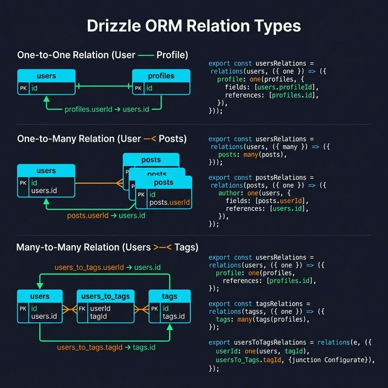

<!-- tags: drizzle, orm, typescript, relations -->
# 🔗 Drizzle Relations & Relational Query Builder (RQB)

> Define relations một lần → query nested data mà không cần viết JOIN thủ công — Drizzle tự optimize thành 1 SQL query.

📅 Ngày tạo: 2026-03-19 · 🔄 Cập nhật: 2026-03-19 · ⏱️ 14 phút đọc

| Aspect          | Detail                                                                        |
| --------------- | ----------------------------------------------------------------------------- |
| **API**         | `relations()` để define + `db.query.table.findMany({ with: {...} })` để query |
| **Output**      | Luôn đúng 1 SQL query — tự động handle JOINs                                  |
| **Requirement** | Cần pass `schema` vào `drizzle(client, { schema })`                           |
| **khác với FK** | Drizzle relations là "soft" — không tạo FOREIGN KEY trong DB                  |

---

## 1. DEFINE

Hình dung quan hệ dữ liệu là nơi nhiều ORM bắt đầu che bớt SQL đi quá nhiều. Drizzle cho bạn kiểm soát nhiều hơn, nhưng cũng đòi bạn hiểu rõ hơn join shape và nested fetch đang thật sự sinh ra câu query nào.


### Drizzle Relations vs Foreign Keys

| Khái niệm                         | Mục đích                               | Tác động vào DB                                |
| --------------------------------- | -------------------------------------- | ---------------------------------------------- |
| **Foreign Key** (`.references()`) | Enforce DB-level referential integrity | Tạo FK constraint trong schema SQL             |
| **Drizzle `relations()`**         | Enable Relational Query API (RQB)      | Không tạo gì trong DB — chỉ dùng trong Drizzle |

> ✅ **Best practice**: Dùng **cả hai** — FK cho data integrity, `relations()` cho RQB API.

### 3 Loại Relations

| Type             | Pattern                                            | Ví dụ                        |
| ---------------- | -------------------------------------------------- | ---------------------------- |
| **One-to-One**   | `one(table, { fields, references })`               | User–Profile, Order–Invoice  |
| **One-to-Many**  | `many(table)` (parent) + `one(table, ...)` (child) | User–Posts                   |
| **Many-to-Many** | Qua junction table, `many(junction)` trên cả 2 bên | Users–Tags, Posts–Categories |

### RQB API options

| Option                                | Mô tả                            |
| ------------------------------------- | -------------------------------- |
| `with: { relation: true }`            | Include related data             |
| `with: { relation: { with: {...} } }` | Nested (deep) relations          |
| `columns: { field: true/false }`      | Include/exclude specific columns |
| `where: condition`                    | Filter on related table          |
| `limit: number`                       | Limit related records            |
| `orderBy: col`                        | Sort related records             |
| `extras: { field: sql\`...\` }`       | Custom computed fields           |

---

Các failure mode trên nghe quen. Nhưng có trap: eager loading sâu = N+1 query, và relation name collision = runtime error. Trap đó sẽ xuất hiện ở PITFALLS.

## 2. VISUAL

Khái niệm nghe hợp lý, nhưng hình dưới mới cho thấy query, schema và runtime boundary bắt đầu va vào nhau ở đâu.




```
Schema với relations:

users ──────────────── profile_info    (One-to-One)
  │
  └──────< posts                       (One-to-Many)
               │
               └──────< comments       (One-to-Many)
                            │
                            └──< commentLikes  (One-to-Many)

users >────────────< groups            (Many-to-Many via users_to_groups)


RQB query vs SQL output:

db.query.users.findMany({
  with: {
    posts: {                    ┐
      with: { comments: true } ─┤ → Single SQL với LEFT JOINs
    }                           ┘
  }
})
```

---

## 3. CODE

Sơ đồ đã lộ luồng chính. Đến code, Drizzle mới hiện ra như một contract thật giữa schema, query và application layer.


### Example 1 — Basic: Define Relations (One-to-One, One-to-Many)

**Mục tiêu**: Hiểu cách define 3 loại relation và query với RQB.

```typescript
// src/db/schema.ts
import { pgTable, serial, text, integer, boolean, timestamp, jsonb } from 'drizzle-orm/pg-core';
import { relations } from 'drizzle-orm';

// ━━━━━━━━━━━━━━━━━━━━━━━━━━━━━━━━━━━━━━━━━━━━━━
// 1. TABLES
// ━━━━━━━━━━━━━━━━━━━━━━━━━━━━━━━━━━━━━━━━━━━━━━
export const users = pgTable('users', {
    id: serial('id').primaryKey(),
    name: text('name').notNull(),
    email: text('email').unique().notNull(),
    invitedBy: integer('invited_by'), // Self-referential FK
});

export const profileInfo = pgTable('profile_info', {
    id: serial('id').primaryKey(),
    userId: integer('user_id').references(() => users.id), // FK → users
    bio: text('bio'),
    avatarUrl: text('avatar_url'),
    metadata: jsonb('metadata'),
});

export const posts = pgTable('posts', {
    id: serial('id').primaryKey(),
    title: text('title').notNull(),
    content: text('content'),
    authorId: integer('author_id').references(() => users.id),
    createdAt: timestamp('created_at').defaultNow(),
});

export const comments = pgTable('comments', {
    id: serial('id').primaryKey(),
    content: text('content').notNull(),
    postId: integer('post_id').references(() => posts.id),
    authorId: integer('author_id').references(() => users.id),
    createdAt: timestamp('created_at').defaultNow(),
});

// ━━━━━━━━━━━━━━━━━━━━━━━━━━━━━━━━━━━━━━━━━━━━━━
// 2. RELATIONS — Define relation graph
// ━━━━━━━━━━━━━━━━━━━━━━━━━━━━━━━━━━━━━━━━━━━━━━

// User: one profile, many posts, self-ref (invitee)
export const usersRelations = relations(users, ({ one, many }) => ({
    // ✅ One-to-One: user HAS ONE profile
    // FK nằm ở profile_info.user_id → user không có fields/references
    profileInfo: one(profileInfo),

    // ✅ One-to-Many: user HAS MANY posts
    posts: many(posts),

    // ✅ One-to-Many: user HAS MANY comments
    comments: many(comments),

    // ✅ Self-referential: who invited this user?
    invitee: one(users, {
        fields: [users.invitedBy],
        references: [users.id],
    }),
}));

// ProfileInfo: belongs to ONE user
export const profileInfoRelations = relations(profileInfo, ({ one }) => ({
    // ✅ One-to-One ngược lại: profile BELONGS TO user
    // FK nằm ở profile_info.user_id → cần fields[] và references[]
    user: one(users, {
        fields: [profileInfo.userId], // column trong profileInfo
        references: [users.id], // column trong users
    }),
}));

// Post: belongs to ONE user, has MANY comments
export const postsRelations = relations(posts, ({ one, many }) => ({
    author: one(users, {
        fields: [posts.authorId],
        references: [users.id],
    }),
    comments: many(comments),
}));

// Comment: belongs to ONE post, belongs to ONE user
export const commentsRelations = relations(comments, ({ one }) => ({
    post: one(posts, {
        fields: [comments.postId],
        references: [posts.id],
    }),
    author: one(users, {
        fields: [comments.authorId],
        references: [users.id],
    }),
}));
```

```typescript
// src/db/index.ts
import { drizzle } from 'drizzle-orm/postgres-js';
import postgres from 'postgres';
import * as schema from './schema';

const client = postgres(process.env.DATABASE_URL!);

// ✅ Pass schema để enable RQB
export const db = drizzle(client, { schema });
```

```typescript
// Querying với RQB
import { db } from './db';

// ━━━━━━━━━━━━━━━━━━━━━━━━━━━━━━━━━━━━━━━━━━━━━━
// findMany — get all records
// ━━━━━━━━━━━━━━━━━━━━━━━━━━━━━━━━━━━━━━━━━━━━━━
const users = await db.query.users.findMany();
// → SELECT * FROM "users"

// ━━━━━━━━━━━━━━━━━━━━━━━━━━━━━━━━━━━━━━━━━━━━━━
// findFirst — get first record (LIMIT 1)
// ━━━━━━━━━━━━━━━━━━━━━━━━━━━━━━━━━━━━━━━━━━━━━━
const user = await db.query.users.findFirst({
    where: (u, { eq }) => eq(u.id, 1),
});
// Type: { id: number; name: string; ... } | undefined

// ━━━━━━━━━━━━━━━━━━━━━━━━━━━━━━━━━━━━━━━━━━━━━━
// with — include related data
// ━━━━━━━━━━━━━━━━━━━━━━━━━━━━━━━━━━━━━━━━━━━━━━
const usersWithProfile = await db.query.users.findMany({
    with: {
        profileInfo: true, // include profile (nullable — One-to-One)
        posts: true, // include all posts array
    },
});
// Type: {
//   id: number;
//   profileInfo: { id: number; bio: string | null; ... } | null;
//   posts: { id: number; title: string; ... }[];
// }[]
```

---

### Example 2 — Intermediate: Many-to-Many & Partial Select

**Mục tiêu**: Many-to-Many qua junction table, partial column selection, filtering relations.

```typescript
// schema.ts thêm Many-to-Many: users ←→ groups
export const groups = pgTable('groups', {
    id: serial('id').primaryKey(),
    name: text('name').notNull(),
    description: text('description'),
});

// ✅ Junction table many-to-many
export const usersToGroups = pgTable(
    'users_to_groups',
    {
        userId: integer('user_id')
            .notNull()
            .references(() => users.id),
        groupId: integer('group_id')
            .notNull()
            .references(() => groups.id),
    },
    (t) => [primaryKey({ columns: [t.userId, t.groupId] })],
);

// Relations cho nhiều-nhiều
export const usersRelations = relations(users, ({ one, many }) => ({
    // ... existing relations
    usersToGroups: many(usersToGroups), // user thuộc nhiều groups
}));

export const groupsRelations = relations(groups, ({ many }) => ({
    usersToGroups: many(usersToGroups), // group có nhiều users
}));

export const usersToGroupsRelations = relations(usersToGroups, ({ one }) => ({
    user: one(users, { fields: [usersToGroups.userId], references: [users.id] }),
    group: one(groups, { fields: [usersToGroups.groupId], references: [groups.id] }),
}));
```

```typescript
// Querying với partial select & nested with
const usersInGroups = await db.query.users.findMany({
    // ✅ Partial columns — chỉ lấy fields cần thiết
    columns: {
        id: true,
        name: true,
        // email: false, // hoặc loại trừ explicit
    },

    // ✅ Include nested relations
    with: {
        usersToGroups: {
            columns: {}, // Bỏ junction table fields (thường không cần)
            with: {
                group: {
                    columns: {
                        id: true,
                        name: true,
                    },
                },
            },
        },

        // Include posts với filter + limit
        posts: {
            where: (post, { eq }) => eq(post.isPublished, true),
            orderBy: (post, { desc }) => desc(post.createdAt),
            limit: 5,
        },
    },
});
// Type inferred: chỉ id, name + nested groups + 5 posts

// ━━━━━━━━━━━━━━━━━━━━━━━━━━━━━━━━━━━━━━━━━━━━━━
// Extras — computed fields trong RQB
// ━━━━━━━━━━━━━━━━━━━━━━━━━━━━━━━━━━━━━━━━━━━━━━
import { sql } from 'drizzle-orm';

const usersWithStats = await db.query.users.findMany({
    extras: {
        // ✅ Thêm computed field (không phải column thật)
        fullNameUpper: sql<string>`upper(${users.name})`.as('full_name_upper'),
        postCount: sql<number>`(
      SELECT count(*)::int FROM posts WHERE author_id = ${users.id}
    )`.as('post_count'),
    },
});
// Type includes: { fullNameUpper: string; postCount: number; ... }
```

---

### Example 3 — Advanced: Disambiguating Relations & Transactions với RQB

**Mục tiêu**: Multiple relations đến cùng 1 table (disambiguate), dùng RQB trong transactions.

```typescript
// ━━━━━━━━━━━━━━━━━━━━━━━━━━━━━━━━━━━━━━━━━━━━━━
// Disambiguating: 2 FK đến cùng 1 table cần relationName
// ━━━━━━━━━━━━━━━━━━━━━━━━━━━━━━━━━━━━━━━━━━━━━━
export const messages = pgTable('messages', {
    id: serial('id').primaryKey(),
    content: text('content').notNull(),
    senderId: integer('sender_id').references(() => users.id),
    recipientId: integer('recipient_id').references(() => users.id),
});

export const messagesRelations = relations(messages, ({ one }) => ({
    // ✅ Đặt relationName để phân biệt 2 FK đến cùng table
    sender: one(users, {
        fields: [messages.senderId],
        references: [users.id],
        relationName: 'sender', // ← phân biệt
    }),
    recipient: one(users, {
        fields: [messages.recipientId],
        references: [users.id],
        relationName: 'recipient', // ← phân biệt
    }),
}));

// Users relations phải khai báo matching relationName
export const usersRelations = relations(users, ({ many }) => ({
    sentMessages: many(messages, { relationName: 'sender' }),
    receivedMessages: many(messages, { relationName: 'recipient' }),
}));

// ━━━━━━━━━━━━━━━━━━━━━━━━━━━━━━━━━━━━━━━━━━━━━━
// RQB trong Transaction
// ━━━━━━━━━━━━━━━━━━━━━━━━━━━━━━━━━━━━━━━━━━━━━━
const result = await db.transaction(async (tx) => {
    // ✅ Dùng tx.query.* (không phải db.query.*)
    const user = await tx.query.users.findFirst({
        where: (u, { eq }) => eq(u.id, userId),
        with: { posts: true },
    });

    if (!user) throw new Error('User not found');

    // Insert mới trong cùng transaction
    const [newPost] = await tx
        .insert(posts)
        .values({ title: 'New Post', authorId: user.id })
        .returning();

    return { user, newPost };
});
```

---

Bạn đã đi qua relations, junction table, và RQB. Bây giờ đến phần nguy hiểm: N+1 query và name collision — trap đã được setup từ đầu bài.

## 4. PITFALLS

Biết API chưa đủ; chỗ nguy hiểm nằm ở assumptions về types, relations và migration flow. Bảng dưới đây gom đúng những assumptions đó.


| #   | Lỗi                                                  | Hậu quả                                              | Fix                                                            |
| --- | ---------------------------------------------------- | ---------------------------------------------------- | -------------------------------------------------------------- |
| 1   | **Quên pass `schema` vào `drizzle()`**               | `db.query.*` undefined, runtime error                | Luôn `drizzle(client, { schema })`                             |
| 2   | **Nhầm `one()` chiều**                               | TypeScript error hoặc query sai chiều                | FK side cần `fields[]` + `references[]`, non-FK side không cần |
| 3   | **Circular import giữa schema files**                | Build error hoặc undefined at runtime                | Import tables theo một chiều, dùng `lazy()` hoặc merge imports |
| 4   | **Nhiều FK đến 1 table, không disambiguate**         | Drizzle báo error, không build được                  | Thêm `relationName` cho từng relation                          |
| 5   | **many-to-many query deep**                          | Junction table selects dữ liệu thừa, performance kém | Dùng `columns: {}` để skip junction fields                     |
| 6   | **Dùng `db.query.*` trong tx**                       | Phải dùng `tx.query.*` để query trong transaction    | Query chạy ngoài transaction scope, không rollback             |
| 7   | **`relations()` khác schema file nhưng không merge** | RQB không thấy relations                             | Import tất cả `* from` các schema files khi pass vào drizzle   |

---

Bạn đã đi qua Relations & RQB và cạm bẫy. Các resources dưới đây giúp đi sâu hơn.

## 5. REF

| Nguồn                    | Link                                                             |
| ------------------------ | ---------------------------------------------------------------- |
| Drizzle Relations        | https://orm.drizzle.team/docs/relations                          |
| Relational Queries (RQB) | https://orm.drizzle.team/docs/rqb                                |
| Ambiguous FK             | https://orm.drizzle.team/docs/relations#disambiguating-relations |

---

## 6. RECOMMEND

Khi đã thấy bài này nối schema, query hay migration ở đâu, các tài liệu sau giúp mở đúng lane kế cận để tiếp tục giữ boundary sạch.


| Mở rộng                             | Khi nào                        | Lý do                                   |
| ----------------------------------- | ------------------------------ | --------------------------------------- |
| **Soft relations (no FK)**          | Cross-database querying        | Drizzle relations không require DB FK   |
| **SQL-like joins**                  | Complex query cần full control | Kết hợp `.innerJoin()` với RQB khi cần  |
| **Cursor pagination với relations** | Feed/timeline features         | Efficient hơn offset với large datasets |
| **Batch loading**                   | GraphQL DataLoader pattern     | Giảm query count với batching           |

---

← Previous: [01-crud-select-insert-update-delete.md](../crud/01-crud-select-insert-update-delete.md) | → Next: [01-migrations.md](../migrations/01-migrations.md)
