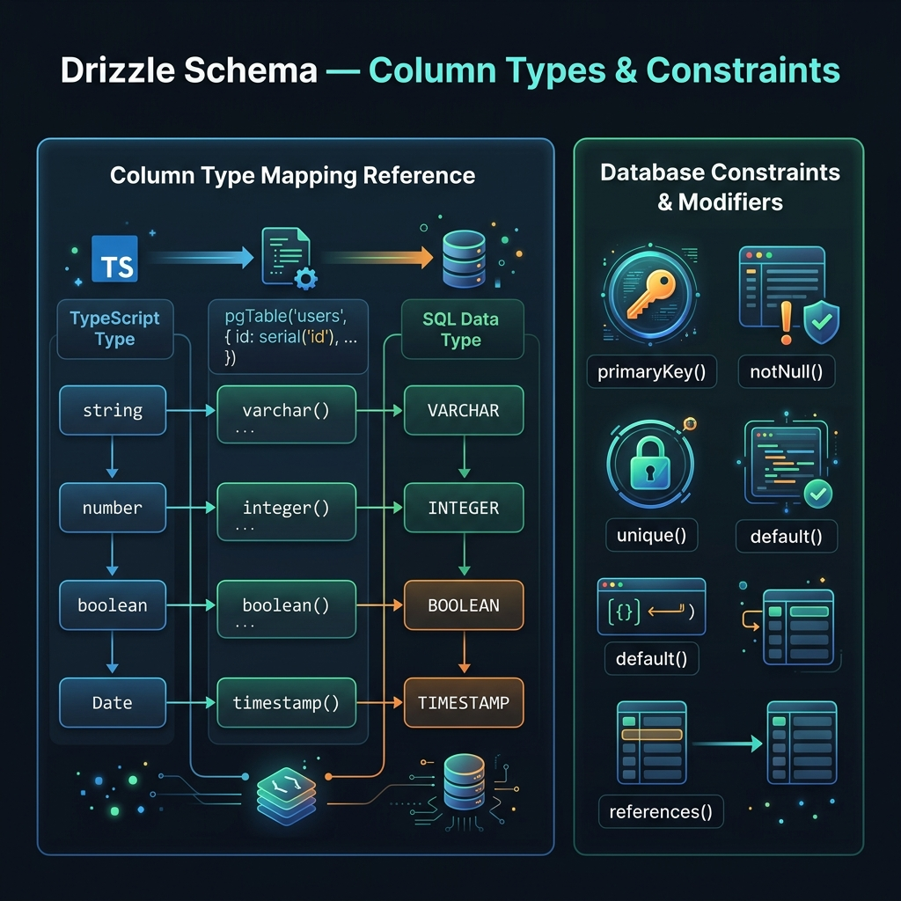

<!-- tags: drizzle, orm, typescript, schema -->
# 📐 Drizzle Schema — Column Types & Constraints

> Khai báo database schema bằng TypeScript thuần: column types, constraints, indexes, relations — tất cả đều type-safe.

📅 Ngày tạo: 2026-03-19 · 🔄 Cập nhật: 2026-03-19 · ⏱️ 15 phút đọc

| Aspect            | Detail                                                              |
| ----------------- | ------------------------------------------------------------------- |
| **Package**       | `drizzle-orm/pg-core` / `mysql-core` / `sqlite-core`                |
| **Convention**    | camelCase trong TS → snake_case trong SQL (automatic hoặc explicit) |
| **Casing config** | `casing: 'snake_case'` trong `drizzle()` để auto-convert            |

---

## 1. DEFINE

Hình dung schema trong Drizzle không phải phần phụ. Nó là nơi type inference, migration và query contract chạm vào nhau trực tiếp. Chỉ cần model schema mờ một chút, mọi tầng sau đó đều phải trả giá.


### Schema là gì trong Drizzle?

Schema Drizzle là **TypeScript objects** đại diện cho SQL tables. Khi bạn viết:

```typescript
export const users = pgTable('users', {
    id: serial('id').primaryKey(),
    name: text('name').notNull(),
});
```

Drizzle sẽ:

1. Dùng schema này để **build queries** (type-safe)
2. Dùng schema này để **generate SQL migrations** (drizzle-kit)
3. Infer **TypeScript types** cho query results

### Column Types — PostgreSQL

| TypeScript | SQL                       | Drizzle                                    |
| ---------- | ------------------------- | ------------------------------------------ |
| `number`   | `INTEGER`                 | `integer()`                                |
| `number`   | `SERIAL` (auto-increment) | `serial()`                                 |
| `bigint`   | `BIGINT`                  | `bigint()`                                 |
| `string`   | `TEXT`                    | `text()`                                   |
| `string`   | `VARCHAR(n)`              | `varchar({ length: n })`                   |
| `string`   | `CHAR(n)`                 | `char({ length: n })`                      |
| `boolean`  | `BOOLEAN`                 | `boolean()`                                |
| `number`   | `NUMERIC(p,s)`            | `numeric({ precision, scale })`            |
| `number`   | `REAL`                    | `real()`                                   |
| `number`   | `DOUBLE PRECISION`        | `doublePrecision()`                        |
| `string`   | `UUID`                    | `uuid()`                                   |
| `Date`     | `TIMESTAMP`               | `timestamp()`                              |
| `Date`     | `DATE`                    | `date()`                                   |
| `string`   | `TIME`                    | `time()`                                   |
| `object`   | `JSON`                    | `json()`                                   |
| `object`   | `JSONB`                   | `jsonb()`                                  |
| `string[]` | `TEXT[]`                  | `text().array()`                           |
| `string`   | `ENUM`                    | `pgEnum('status', ['active', 'inactive'])` |

### Constraints phổ biến

| Constraint       | Drizzle                              | SQL                    |
| ---------------- | ------------------------------------ | ---------------------- |
| Primary key      | `.primaryKey()`                      | `PRIMARY KEY`          |
| Not null         | `.notNull()`                         | `NOT NULL`             |
| Unique           | `.unique()`                          | `UNIQUE`               |
| Default value    | `.default(value)`                    | `DEFAULT value`        |
| Default (SQL fn) | `.defaultNow()`, `.default(sql\`\`)` | `DEFAULT NOW()`        |
| Foreign key      | `.references(() => other.id)`        | `REFERENCES other(id)` |
| Check constraint | `check('name', sql\`\`)`             | `CHECK(...)`           |

### Tổ chức schema files

```
Option 1: Single file (small projects)
└── schema.ts         ← tất cả trong 1 file

Option 2: Multi-file (medium projects)
└── schema/
    ├── index.ts      ← re-export tất cả
    ├── users.ts
    ├── posts.ts
    └── comments.ts

Option 3: Feature-based (large projects)
└── modules/
    ├── auth/schema.ts
    ├── posts/schema.ts
    └── payments/schema.ts
```

---

Các failure mode trên nghe rõ. Nhưng có trap: column type JS không khớp DB type = runtime error, và default value thiếu = null constraint vỡ. Trap đó sẽ xuất hiện ở PITFALLS.

## 2. VISUAL



Định nghĩa đã khóa boundary giữa TypeScript và database. Visual dưới đây cho thấy dữ liệu và types đi qua boundary đó như thế nào.


```
pgTable('users', {...})
       │
       ├── Column types: serial, text, integer, boolean, timestamp, jsonb, uuid...
       │
       ├── Column modifiers: .primaryKey(), .notNull(), .unique(), .default(), .references()
       │
       └── Table-level: primaryKey({...}), uniqueIndex({...}), index({...}), foreignKey({...})

TypeScript Type → Drizzle Column → SQL Column
   number      →   serial()     → SERIAL PRIMARY KEY
   string      →   text()       → TEXT NOT NULL
   Date        →   timestamp()  → TIMESTAMP WITH TIME ZONE
   object      →   jsonb()      → JSONB
```

### Camel → Snake casing

```
TypeScript (camelCase)    →     SQL (snake_case)
  userId                  →     user_id      (explicit: integer('user_id'))
  createdAt               →     created_at   (explicit: timestamp('created_at'))
  isActive                →     is_active    (với casing: 'snake_case' option)
```

---

## 3. CODE

Đến đoạn implementation, bạn mới thấy quyết định ở trên đổi thành constraint nào trong code TypeScript và SQL.


### Example 1 — Basic: Column Types đầy đủ

**Mục tiêu**: Làm quen với tất cả column types PostgreSQL thường dùng.

```typescript
import {
    pgTable,
    pgEnum,
    serial,
    integer,
    bigint,
    smallint,
    text,
    varchar,
    char,
    boolean,
    numeric,
    real,
    doublePrecision,
    uuid,
    timestamp,
    date,
    time,
    json,
    jsonb,
} from 'drizzle-orm/pg-core';
import { sql } from 'drizzle-orm';

// ━━━━━━━━━━━━━━━━━━━━━━━━━━━━━━━━━━━
// 1. ENUM — phải khai báo trước table
// ━━━━━━━━━━━━━━━━━━━━━━━━━━━━━━━━━━━
export const userStatusEnum = pgEnum('user_status', ['active', 'inactive', 'banned', 'pending']);

export const orderStatusEnum = pgEnum('order_status', [
    'draft',
    'pending',
    'processing',
    'shipped',
    'delivered',
    'cancelled',
]);

// ━━━━━━━━━━━━━━━━━━━━━━━━━━━━━━━━━━━
// 2. Table với đầy đủ column types
// ━━━━━━━━━━━━━━━━━━━━━━━━━━━━━━━━━━━
export const products = pgTable('products', {
    // INTEGER types
    id: serial('id').primaryKey(), // SERIAL: auto-increment int
    stockCount: integer('stock_count').default(0).notNull(),
    viewCount: bigint('view_count', { mode: 'number' }).default(0),

    // STRING types
    sku: varchar('sku', { length: 50 }).unique().notNull(), // VARCHAR(50) UNIQUE
    name: text('name').notNull(), // TEXT
    code: char('code', { length: 8 }), // CHAR(8) — fixed length

    // NUMERIC types
    price: numeric('price', { precision: 10, scale: 2 }).notNull(), // DECIMAL(10,2)
    weight: real('weight'), // FLOAT4
    rating: doublePrecision('rating'), // FLOAT8

    // BOOLEAN
    isPublished: boolean('is_published').default(false).notNull(),
    isFeatured: boolean('is_featured').default(false),

    // UUID
    externalId: uuid('external_id').defaultRandom(), // RANDOM UUID auto-generated

    // TIMESTAMP
    createdAt: timestamp('created_at', {
        withTimezone: true, // ✅ Nên dùng withTimezone cho production
        mode: 'date', // 'date' | 'string'
    })
        .defaultNow()
        .notNull(),
    updatedAt: timestamp('updated_at', { withTimezone: true }),
    publishedAt: timestamp('published_at'),

    // DATE & TIME
    availableDate: date('available_date'), // DATE only
    saleEndTime: time('sale_end_time'), // TIME only

    // ENUM
    status: orderStatusEnum('status').default('draft').notNull(),

    // JSON/JSONB
    metadata: jsonb('metadata'), // JSONB — binary, indexable
    rawConfig: json('raw_config'), // JSON — text storage

    // ✅ SQL expression làm default
    slug: text('slug').default(sql`gen_random_uuid()::text`),
});

// Type inference
export type Product = typeof products.$inferSelect;
export type NewProduct = typeof products.$inferInsert;
```

**Kết quả**: SQL migration tạo table `products` với đầy đủ constraints và types.

---

### Example 2 — Intermediate: Constraints & Indexes

**Mục tiêu**: Table-level constraints, composite primary keys, foreign keys với cascade, GIN index cho JSONB.

```typescript
import {
    pgTable,
    serial,
    text,
    integer,
    boolean,
    timestamp,
    jsonb,
    uuid,
} from 'drizzle-orm/pg-core';
import { primaryKey, foreignKey, uniqueIndex, index, check } from 'drizzle-orm/pg-core';
import { sql } from 'drizzle-orm';

export const users = pgTable(
    'users',
    {
        id: serial('id').primaryKey(),
        email: text('email').notNull(),
        name: text('name').notNull(),
    },
    (table) => [
        // ✅ Table-level UNIQUE constraint (có thể đặt tên)
        uniqueIndex('users_email_unique').on(table.email),
        // ✅ Regular index để tăng tốc queries theo name
        index('users_name_idx').on(table.name),
    ],
);

export const posts = pgTable(
    'posts',
    {
        id: serial('id').primaryKey(),
        title: text('title').notNull(),
        content: text('content'),
        authorId: integer('author_id').notNull(),
        categoryId: integer('category_id'),
        tags: text('tags').array(), // TEXT[] — array column
        metadata: jsonb('metadata'),
        isPublished: boolean('is_published').default(false),
        publishedAt: timestamp('published_at'),
        createdAt: timestamp('created_at').defaultNow().notNull(),
    },
    (table) => [
        // ✅ Foreign key với cascade options
        foreignKey({
            columns: [table.authorId],
            foreignColumns: [users.id],
            name: 'posts_author_fk',
        })
            .onDelete('cascade')
            .onUpdate('no action'),

        // ✅ Partial index — chỉ index published posts
        index('posts_published_idx')
            .on(table.publishedAt)
            .where(sql`${table.isPublished} = true`),

        // ✅ GIN index cho JSONB queries (full-text, @>, ?, etc.)
        index('posts_metadata_gin').using('gin', table.metadata),

        // ✅ Check constraint
        check('posts_title_length', sql`length(${table.title}) > 3`),
    ],
);

// ━━━━━━━━━━━━━━━━━━━━━━━━━━━━━━━━━━━━━━━━━━━━━━
// Many-to-Many với COMPOSITE PRIMARY KEY
// ━━━━━━━━━━━━━━━━━━━━━━━━━━━━━━━━━━━━━━━━━━━━━━
export const postsTags = pgTable(
    'posts_tags',
    {
        postId: integer('post_id')
            .notNull()
            .references(() => posts.id, { onDelete: 'cascade' }),
        tagId: integer('tag_id').notNull(),
        addedAt: timestamp('added_at').defaultNow(),
    },
    (table) => [
        // ✅ Composite primary key thay cho auto-increment id
        primaryKey({ columns: [table.postId, table.tagId] }),
    ],
);
```

**Kết quả**: SQL migration bao gồm foreign keys với cascade, GIN index cho JSONB, partial index, composite PK.

---

### Example 3 — Advanced: Custom Types & Identity Columns

**Mục tiêu**: Custom column types, Postgres IDENTITY columns, casing convention tự động.

```typescript
import { pgTable, text, integer, timestamp, customType } from 'drizzle-orm/pg-core';
import { drizzle } from 'drizzle-orm/postgres-js';
import postgres from 'postgres';
import * as schema from './schema';

// ━━━━━━━━━━━━━━━━━━━━━━━━━━━━━━━━━━━━━━━━━━━━━━
// Custom type: LTree (PostgreSQL hierarchical labels)
// ━━━━━━━━━━━━━━━━━━━━━━━━━━━━━━━━━━━━━━━━━━━━━━
const ltree = customType<{ data: string }>({
    dataType() {
        return 'ltree';
    },
});

export const categories = pgTable('categories', {
    // ✅ GENERATED ALWAYS AS IDENTITY (không phải SERIAL)
    id: integer('id').generatedAlwaysAsIdentity({ startWith: 1000 }),
    name: text('name').notNull(),
    path: ltree('path'), // Custom type cho hierarchical paths (e.g. "tech.backend.typescript")
    createdAt: timestamp('created_at').defaultNow(),
});

// ━━━━━━━━━━━━━━━━━━━━━━━━━━━━━━━━━━━━━━━━━━━━━━
// Auto camelCase → snake_case conversion
// Không cần explicit 'column_name' string!
// ━━━━━━━━━━━━━━━━━━━━━━━━━━━━━━━━━━━━━━━━━━━━━━
export const ordersV2 = pgTable('orders', {
    orderId: integer().primaryKey(), // → order_id (auto snake_case)
    customerId: integer().notNull(), // → customer_id
    totalAmount: integer().notNull(), // → total_amount
    createdAt: timestamp().defaultNow(), // → created_at
});

// Khi khởi tạo db với casing: 'snake_case'
const client = postgres(process.env.DATABASE_URL!);
export const db = drizzle(client, {
    schema,
    casing: 'snake_case', // ✅ Auto-convert camelCase TS props → snake_case SQL columns
});
```

**Kết quả**: Không cần viết 'column_name' string thủ công — Drizzle tự convert.

---

Bạn đã đi qua schema, custom columns, và enums. Bây giờ đến phần nguy hiểm: type mismatch và missing defaults — trap đã được setup từ đầu bài.

## 4. PITFALLS

Biết API chưa đủ; chỗ nguy hiểm nằm ở assumptions về types, relations và migration flow. Bảng dưới đây gom đúng những assumptions đó.


| #   | Lỗi                                  | Hậu quả                                       | Fix                                                                   |
| --- | ------------------------------------ | --------------------------------------------- | --------------------------------------------------------------------- |
| 1   | **Quên `withTimezone`**              | Mất timezone info, data lệch múi giờ          | `timestamp('created_at', { withTimezone: true })`                     |
| 2   | **Nhầm `json` vs `jsonb`**           | Không index được JSON data                    | Dùng `jsonb()` cho production — fast, indexable                       |
| 3   | **Numeric không precision**          | Precision mặc định thấp, lỗi làm tròn tiền tệ | `numeric('price', { precision: 10, scale: 2 })`                       |
| 4   | **SERIAL vs IDENTITY**               | SERIAL tạo SEQUENCE riêng, khó quản lý        | `integer().generatedAlwaysAsIdentity()` là chuẩn hơn cho Postgres 13+ |
| 5   | **Circular reference trong FK**      | Import error hoặc runtime crash               | Dùng `() =>` arrow fn (lazy evaluation)                               |
| 6   | **Thiếu index cho FK columns**       | Slow JOIN/lookup, query timeout               | Luôn `index().on(table.foreignKeyCol)`                                |
| 7   | **pgEnum phải khai báo trước table** | Runtime error hoặc migration fail             | Khai báo `pgEnum` ở scope cao hơn table                               |

---

Bạn đã đi qua Schema & Column Types và cạm bẫy. Các resources dưới đây giúp đi sâu hơn.

## 5. REF

| Nguồn                 | Link                                                 |
| --------------------- | ---------------------------------------------------- |
| Column types (PG)     | https://orm.drizzle.team/docs/column-types/pg        |
| Column types (MySQL)  | https://orm.drizzle.team/docs/column-types/mysql     |
| Column types (SQLite) | https://orm.drizzle.team/docs/column-types/sqlite    |
| Indexes & Constraints | https://orm.drizzle.team/docs/indexes-constraints    |
| Schema Declaration    | https://orm.drizzle.team/docs/sql-schema-declaration |
| Custom Types          | https://orm.drizzle.team/docs/custom-types           |

---

## 6. RECOMMEND

Các gợi ý dưới đây nối trực tiếp sang những điểm mù thường lộ ra ngay sau khi áp dụng khái niệm này trong project thật.


| Mở rộng                               | Khi nào                         | Lý do                                             |
| ------------------------------------- | ------------------------------- | ------------------------------------------------- |
| **drizzle-zod**                       | Validate input trước khi insert | `createInsertSchema(users)` → Zod schema tự động  |
| **drizzle-valibot**                   | Alternative Zod                 | Lighter weight, Valibot-compatible                |
| **`.$inferSelect` / `.$inferInsert`** | Typing API responses            | Dùng Drizzle types thay vì define thủ công        |
| **Multi-file schema**                 | Project lớn                     | Tách theo feature, re-export từ `schema/index.ts` |
| **Vector type (pgvector)**            | AI/ML applications              | Custom type cho `vector(1536)` embeddings         |

---

← Previous: [01-introduction-setup.md](../overview/01-introduction-setup.md) | → Next: [02-validation-drizzle-zod.md](./02-validation-drizzle-zod.md)
