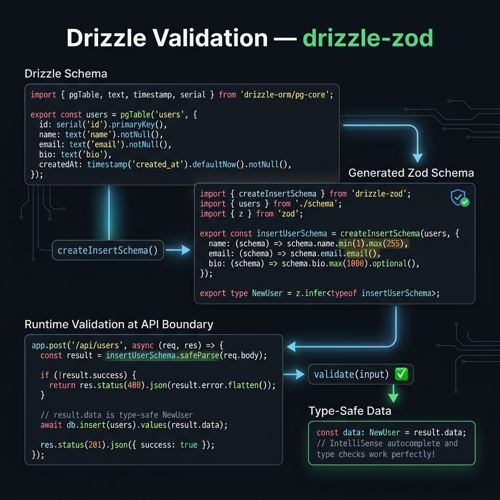

<!-- tags: drizzle, orm, typescript, validation, zod -->
# ✅ Drizzle Schema Validation — drizzle-zod & drizzle-valibot

> Tự động generate validation schemas từ Drizzle table definitions. Insert/Update data luôn validated trước khi chạm DB.

📅 Ngày tạo: 2026-03-19 · 🔄 Cập nhật: 2026-03-19 · ⏱️ 14 phút đọc

| Aspect         | Detail                                                                        |
| -------------- | ----------------------------------------------------------------------------- |
| **Package**    | `drizzle-zod` (Zod), `drizzle-valibot` (Valibot), `drizzle-typebox` (TypeBox) |
| **Pattern**    | Schema-first validation — DRY, single source of truth                         |
| **Benefit**    | Không cần viết validation schema thủ công — derive từ DB schema               |
| **Go version** | `drizzle-zod@^0.7+`, `drizzle-valibot@^0.4+`                                  |

---

## 1. DEFINE

Hình dung khi dữ liệu đi từ API vào database, type safety ở compile-time vẫn chưa đủ để bảo vệ boundary runtime. Validation lane này tồn tại đúng ở khoảng trống đó.


### Vấn đề: DRY Violation

Khi dùng ORM + validation library (Zod), bạn thường khai báo schema **2 lần**:

```text
❌ Trước drizzle-zod:

1. Drizzle schema: pgTable('users', { name: text().notNull(), email: text().unique() })
2. Zod schema:     z.object({ name: z.string().min(1), email: z.string().email() })

→ 2 nguồn sự thật → dễ bị out-of-sync!
```

### Solution: drizzle-zod

```text
✅ Với drizzle-zod:

1. Drizzle schema (source of truth)
2. createInsertSchema(users) → auto-generate Zod schema
3. createSelectSchema(users) → auto-generate cho output
4. createUpdateSchema(users) → auto-generate cho partial updates

→ 1 nguồn sự thật → luôn in-sync!
```

### Các hàm chính

| Function                       | Mô tả                                 | Columns behavior                                                   |
| ------------------------------ | ------------------------------------- | ------------------------------------------------------------------ |
| `createInsertSchema(table)`    | Schema cho INSERT data                | Required = notNull() + no default; Optional = nullable/has default |
| `createSelectSchema(table)`    | Schema cho SELECT output              | Tất cả fields required (DB luôn trả)                               |
| `createUpdateSchema(table)`    | Schema cho UPDATE partial data        | Tất cả fields optional (chỉ update fields gửi lên)                 |
| `createSchemaFactory(options)` | Custom factory với shared refinements | Reusable across tables                                             |

### Refinement — Custom validation rules

drizzle-zod generate **base schema** từ DB types. Bạn thêm **refinements** cho business rules:

```text
Base (auto):     { name: z.string(), email: z.string(), age: z.number().nullable() }
Refined (thêm): { name: z.string().min(2).max(100), email: z.string().email(), age: z.number().min(0).max(150) }
```

---

Các failure mode trên nghe dễ tránh. Nhưng có trap: validation chỉ ở application = invalid data vẫn vào DB, và Zod schema drift từ Drizzle schema = type unsafe. Trap đó sẽ xuất hiện ở PITFALLS.

## 2. VISUAL



Khái niệm nghe hợp lý, nhưng hình dưới mới cho thấy query, schema và runtime boundary bắt đầu va vào nhau ở đâu.


```text
Drizzle Schema (pgTable)
       │
       ├── createInsertSchema(table, { refinements })
       │         │
       │         ▼
       │   Zod Schema cho INSERT
       │   { name: z.string().min(1), email: z.string().email() }
       │         │
       │         ▼
       │   schema.parse(req.body) → validated data hoặc ZodError
       │
       ├── createSelectSchema(table)
       │         │
       │         ▼
       │   Zod Schema cho API response (output validation)
       │
       └── createUpdateSchema(table, { refinements })
                 │
                 ▼
           Zod Schema cho PATCH/PUT (all fields optional)
```

---

## 3. CODE

Sơ đồ đã lộ luồng chính. Đến code, Drizzle mới hiện ra như một contract thật giữa schema, query và application layer.


### Example 1 — Basic: Validation với Zod

**Mục tiêu**: Generate validation schemas, validate API input, handle errors.

```bash
npm install drizzle-zod zod
```

```typescript
// src/db/schema.ts
import { pgTable, serial, text, integer, boolean, timestamp } from 'drizzle-orm/pg-core';
import { pgEnum } from 'drizzle-orm/pg-core';

export const userRoleEnum = pgEnum('user_role', ['admin', 'user', 'moderator']);

export const users = pgTable('users', {
    id: serial('id').primaryKey(),
    name: text('name').notNull(),
    email: text('email').notNull().unique(),
    age: integer('age'),
    role: userRoleEnum('role').default('user').notNull(),
    isVerified: boolean('is_verified').default(false).notNull(),
    bio: text('bio'),
    createdAt: timestamp('created_at').defaultNow().notNull(),
    updatedAt: timestamp('updated_at'),
});
```

```typescript
// src/validation/users.ts
import { createInsertSchema, createSelectSchema, createUpdateSchema } from 'drizzle-zod';
import { users } from '../db/schema';
import { z } from 'zod';

// ━━━━━━━━━━━━━━━━━━━━━━━━━━━━━━━━━━━━━━━━━━
// 1. Auto-generated schemas
// ━━━━━━━━━━━━━━━━━━━━━━━━━━━━━━━━━━━━━━━━━━

// ✅ Insert schema — chỉ fields cần cho INSERT
// id, createdAt, isVerified có default → optional
// name, email → required (notNull, no default)
const baseInsertSchema = createInsertSchema(users);
// Type: z.ZodObject<{
//   name: z.ZodString,              ← required
//   email: z.ZodString,             ← required
//   age: z.ZodNullable<z.ZodNumber>.optional(),
//   role: z.ZodEnum<['admin','user','moderator']>.optional(),
//   bio: z.ZodNullable<z.ZodString>.optional(),
//   ...
// }>

// ✅ Select schema — output validation
const selectSchema = createSelectSchema(users);

// ✅ Update schema — all optional (partial)
const baseUpdateSchema = createUpdateSchema(users);

// ━━━━━━━━━━━━━━━━━━━━━━━━━━━━━━━━━━━━━━━━━━
// 2. Refined schemas — thêm business rules
// ━━━━━━━━━━━━━━━━━━━━━━━━━━━━━━━━━━━━━━━━━━

// ✅ Approach 1: Refinement object trong createInsertSchema
export const insertUserSchema = createInsertSchema(users, {
    // Override specific columns với custom Zod schema
    name: z.string().min(2, 'Name phải ít nhất 2 ký tự').max(100),
    email: z.string().email('Email không hợp lệ'),
    age: z.number().int().min(0).max(150).nullable().optional(),
    bio: z.string().max(500, 'Bio tối đa 500 ký tự').nullable().optional(),
});

// ✅ Approach 2: Chain .pick() / .omit() / .extend()
export const createUserApiSchema = insertUserSchema
    .omit({ id: true, createdAt: true, updatedAt: true, isVerified: true })
    .extend({
        // Thêm field không có trong DB (e.g., password confirmation)
        password: z.string().min(8, 'Password ít nhất 8 ký tự'),
        passwordConfirm: z.string(),
    })
    .refine((data) => data.password === data.passwordConfirm, {
        message: 'Passwords không khớp',
        path: ['passwordConfirm'],
    });

export const updateUserSchema = createUpdateSchema(users, {
    name: z.string().min(2).max(100).optional(),
    email: z.string().email().optional(),
    age: z.number().int().min(0).max(150).nullable().optional(),
}).omit({ id: true, createdAt: true });

// ✅ Type inference từ schema
export type CreateUserInput = z.infer<typeof createUserApiSchema>;
export type UpdateUserInput = z.infer<typeof updateUserSchema>;
```

```typescript
// src/api/users.ts — dùng trong API handler
import { db } from '../db';
import { users } from '../db/schema';
import { createUserApiSchema, updateUserSchema } from '../validation/users';
import { eq } from 'drizzle-orm';

// ✅ POST /api/users — create user
export async function createUser(req: Request) {
    // Parse + validate body
    const parseResult = createUserApiSchema.safeParse(await req.json());

    if (!parseResult.success) {
        // ✅ Structured error response
        return Response.json(
            {
                error: 'Validation failed',
                details: parseResult.error.flatten().fieldErrors,
                // { name: ['Name phải ít nhất 2 ký tự'], email: ['Email không hợp lệ'] }
            },
            { status: 400 },
        );
    }

    const { password, passwordConfirm, ...userData } = parseResult.data;

    // ✅ userData đã validated — safe to insert
    const [newUser] = await db.insert(users).values(userData).returning();

    return Response.json(newUser, { status: 201 });
}

// ✅ PATCH /api/users/:id — partial update
export async function updateUser(req: Request, id: number) {
    const parseResult = updateUserSchema.safeParse(await req.json());

    if (!parseResult.success) {
        return Response.json(
            {
                error: 'Validation failed',
                details: parseResult.error.flatten().fieldErrors,
            },
            { status: 400 },
        );
    }

    const [updated] = await db
        .update(users)
        .set(parseResult.data)
        .where(eq(users.id, id))
        .returning();

    if (!updated) {
        return Response.json({ error: 'User not found' }, { status: 404 });
    }

    return Response.json(updated);
}
```

---

### Example 2 — Intermediate: Schema Factory & Shared Refinements

**Mục tiêu**: Tạo reusable validation patterns cho nhiều tables.

```typescript
import { createSchemaFactory } from 'drizzle-zod';
import { z } from 'zod';

// ━━━━━━━━━━━━━━━━━━━━━━━━━━━━━━━━━━━━━━━━━━
// Custom schema factory — shared type overrides
// ━━━━━━━━━━━━━━━━━━━━━━━━━━━━━━━━━━━━━━━━━━

const { createInsertSchema, createSelectSchema, createUpdateSchema } = createSchemaFactory({
    // ✅ Coerce types tự động
    // DB trả timestamp as string → coerce sang Date
    coerce: {
        date: true, // z.coerce.date() cho tất cả date columns
        // number: true,   // z.coerce.number() cho numeric columns
    },
});

// ━━━━━━━━━━━━━━━━━━━━━━━━━━━━━━━━━━━━━━━━━━
// Shared validation patterns
// ━━━━━━━━━━━━━━━━━━━━━━━━━━━━━━━━━━━━━━━━━━

// Reusable refinements
const emailField = z.string().email().toLowerCase().trim();
const nameField = z.string().min(1).max(255).trim();
const slugField = z.string().regex(/^[a-z0-9]+(?:-[a-z0-9]+)*$/, 'Invalid slug format');

// Apply to multiple schemas
export const insertProductSchema = createInsertSchema(products, {
    name: nameField,
    slug: slugField,
    price: z.string().regex(/^\d+(\.\d{1,2})?$/, 'Price must be valid decimal'),
});

export const insertCategorySchema = createInsertSchema(categories, {
    name: nameField,
    slug: slugField,
});
```

---

### Example 3 — Advanced: drizzle-valibot & Custom Pipe

**Mục tiêu**: Alternative lightweight validation với Valibot (smaller bundle).

```bash
npm install drizzle-valibot valibot
```

```typescript
import { createInsertSchema, createSelectSchema } from 'drizzle-valibot';
import * as v from 'valibot';
import { users } from '../db/schema';

// ━━━━━━━━━━━━━━━━━━━━━━━━━━━━━━━━━━━━━━━━━━
// drizzle-valibot — same API, lighter bundle
// Valibot: ~1KB vs Zod: ~13KB (minified)
// ━━━━━━━━━━━━━━━━━━━━━━━━━━━━━━━━━━━━━━━━━━

const insertUserSchema = createInsertSchema(users, {
    name: v.pipe(v.string(), v.minLength(2), v.maxLength(100)),
    email: v.pipe(v.string(), v.email()),
    age: v.pipe(v.number(), v.integer(), v.minValue(0), v.maxValue(150)),
});

// Usage — same pattern as Zod
async function createUser(body: unknown) {
    const result = v.safeParse(insertUserSchema, body);

    if (!result.success) {
        return { error: result.issues };
    }

    const [newUser] = await db.insert(users).values(result.output).returning();

    return newUser;
}
```

```typescript
// ━━━━━━━━━━━━━━━━━━━━━━━━━━━━━━━━━━━━━━━━━━
// Drizzle + Zod + tRPC — Full type-safe stack
// ━━━━━━━━━━━━━━━━━━━━━━━━━━━━━━━━━━━━━━━━━━

import { initTRPC } from '@trpc/server';
import { createInsertSchema } from 'drizzle-zod';
import { z } from 'zod';

const t = initTRPC.create();

const insertUserInput = createInsertSchema(users, {
    name: z.string().min(2),
    email: z.string().email(),
}).omit({ id: true, createdAt: true });

export const userRouter = t.router({
    create: t.procedure
        .input(insertUserInput) // ✅ Drizzle schema → Zod → tRPC input validation
        .mutation(async ({ input }) => {
            const [user] = await db.insert(users).values(input).returning();
            return user;
        }),

    list: t.procedure.query(async () => {
        return db.select().from(users);
    }),
});
```

---

Bạn đã đi qua validation, type inference, và refinements. Bây giờ đến phần nguy hiểm: DB-only validation gap và schema drift — trap đã được setup từ đầu bài.

## 4. PITFALLS

Biết API chưa đủ; chỗ nguy hiểm nằm ở assumptions về types, relations và migration flow. Bảng dưới đây gom đúng những assumptions đó.


| #   | Lỗi                                       | Hậu quả                                             | Fix                                                                                       |
| --- | ----------------------------------------- | --------------------------------------------------- | ----------------------------------------------------------------------------------------- |
| 1   | **Quên install `zod` cùng `drizzle-zod`** | Runtime import error                                | `drizzle-zod` là peer dep của `zod` — cần cả hai                                          |
| 2   | **Refinement override toàn bộ type**      | TypeScript type error, incompatible schema          | Refinement phải compatible với DB type — `text()` → `z.string()`, không phải `z.number()` |
| 3   | **createInsertSchema include `id`**       | Client có thể gửi `id` tùy ý, security risk         | `.omit({ id: true })` nếu id là auto-increment                                            |
| 4   | **Not handling `nullable` columns**       | TypeScript error hoặc validation pass sai           | DB nullable → Zod `z.nullable()` — thêm `.nullable()` vào refinement                      |
| 5   | **Timestamp mode mismatch**               | Runtime type mismatch, parse error                  | DB mode `'string'` → Zod `z.string()`, mode `'date'` → `z.date()`                         |
| 6   | **JSON/JSONB column typing**              | `z.unknown()` — không validate được JSONB structure | drizzle-zod generate `z.unknown()` — cần explicit refinement                              |
| 7   | **Enum values out of sync**               | Zod schema stale, validate sai giá trị              | Sửa pgEnum nhưng quên re-export → Re-import schema                                        |

---

Bạn đã đi qua Validation & Drizzle-Zod và cạm bẫy. Các resources dưới đây giúp đi sâu hơn.

## 5. REF

| Nguồn           | Link                                                                   |
| --------------- | ---------------------------------------------------------------------- |
| drizzle-zod     | [orm.drizzle.team/docs/zod](https://orm.drizzle.team/docs/zod)         |
| drizzle-valibot | [orm.drizzle.team/docs/valibot](https://orm.drizzle.team/docs/valibot) |
| drizzle-typebox | [orm.drizzle.team/docs/typebox](https://orm.drizzle.team/docs/typebox) |
| Zod docs        | [zod.dev](https://zod.dev)                                             |
| Valibot docs    | [valibot.dev](https://valibot.dev)                                     |

---

## 6. RECOMMEND

Các gợi ý dưới đây nối trực tiếp sang những điểm mù thường lộ ra ngay sau khi áp dụng khái niệm này trong project thật.


| Mở rộng                | Khi nào                                  | Lý do                             |
| ---------------------- | ---------------------------------------- | --------------------------------- |
| **tRPC + drizzle-zod** | Full-stack TypeScript                    | End-to-end type safety            |
| **Valibot thay Zod**   | Bundle size quan trọng (Edge/Serverless) | ~1KB vs ~13KB                     |
| **Schema Factory**     | Nhiều tables cùng patterns               | DRY validation rules              |
| **createSelectSchema** | API output validation                    | Đảm bảo response shape consistent |
| **JSON Schema export** | OpenAPI / Swagger docs                   | `zodToJsonSchema()` từ Zod schema |

---

← Previous: [01-schema-column-types.md](./01-schema-column-types.md) | → Next: [01-crud-select-insert-update-delete.md](../crud/01-crud-select-insert-update-delete.md)
